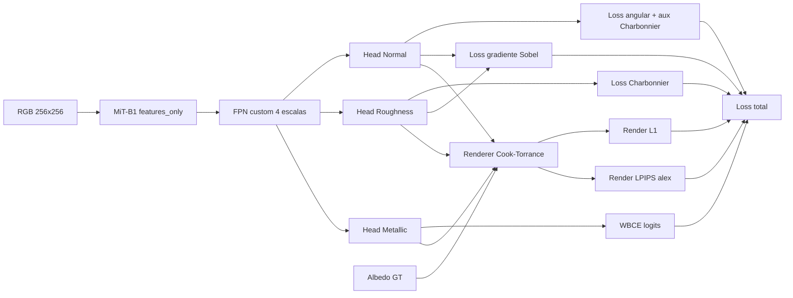
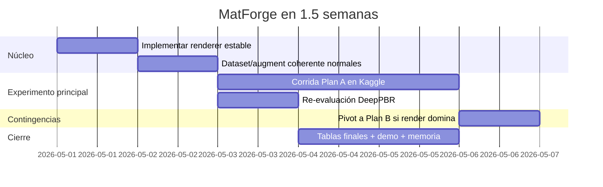

# MatForge bajo restricciones reales

## Resumen ejecutivo

No he podido reabrir los adjuntos subidos previamente porque ya no estaban disponibles en el entorno de esta sesión; por tanto, esta investigación toma como fuente operativa lo que has fijado explícitamente en tus mensajes y marca como **requiere validación** cualquier punto que dependa de detalles no visibles del `.md` original.

La conclusión principal es clara: **MatForge sí puede superar de forma medible a DeepPBR dentro de 1,5 semanas**, pero solo si reduces el riesgo técnico en cuatro frentes muy concretos. Primero, el *render loss* debe implementarse como un **renderer analítico plano en PyTorch puro**, no sobre una pila pesada tipo rasterizador 3D generalista. Segundo, **MiT-B1 debe usarse como extractor jerárquico real** con sus cuatro salidas nativas y sin alterar su normalización esperada. Tercero, la cabeza **Metallic no debería entrenarse con Charbonnier puro** bajo un desbalance 238/3007; necesita al menos `BCEWithLogitsLoss` ponderada y un muestreo por lote mucho más agresivo que `x1.3`. Cuarto, la mezcla Hann en inferencia debe hacerse **antes** de la renormalización L2 final de normales, no después ni por parche ya renormalizado. citeturn20search0turn21view0turn10search4turn11view0turn33search1turn40search5turn40search9

Frente a DeepPBR, la ventaja competitiva de MatForge no vendrá solo del encoder. Vendrá de combinar: mejor cobertura semántica del dataset limpiado, representación multi-escala más fuerte que un ResNet50 puro, tres cabezas separadas para evitar interferencia entre mapas, pérdidas de borde y re-render físicamente consistentes, y una evaluación cuantitativa defendible sobre el mismo hardware objetivo. La línea más rentable no es “más SOTA”, sino **más estable, más medible y más reproducible** que tu baseline anterior. UMat y SuperMat son especialmente útiles como referencias de robustez: ambos confirman que el detalle fino mejora cuando se fuerza coherencia estructural y/o perceptual, pero también dejan claro que las rutas con GAN o difusión introducen coste e inestabilidad adicionales que, bajo Kaggle/Colab, hay que tratar con mucha cautela. citeturn38view0turn17view1turn24view0turn13search0turn13search8

Las comprobaciones en entity["company","Kaggle","ml platform"], entity["company","Hugging Face","ai model hub"], entity["organization","OpenAlex","bibliographic index"], entity["company","GitHub","code hosting"], y la documentación técnica ligada a entity["company","NVIDIA","gpu vendor"], entity["company","Google","filament engine"], entity["company","Meta Platforms","pytorch3d"] y entity["company","Epic Games","unreal engine maker"] convergen en la misma recomendación práctica: **primera corrida sin GAN, sin difusión entrenable, con renderer analítico propio, `timm` reciente, pérdidas calibradas por gradiente y protocolo de evaluación dual MatForge-vs-DeepPBR**. citeturn13search0turn40search4turn14search0turn21view0turn21view2turn40search10

## Descarte de métodos inviables y comparación con DeepPBR

### Métodos que descartaría desde el principio

| Método | Estado | Motivo técnico | Encaje temporal |
|---|---|---:|---:|
| Fine-tuning completo de difusión latente tipo Stable Diffusion / ControlNet para descomposición PBR | 🔴 **Inválido** | Demasiado coste de VRAM, dependencias y tiempo; SuperMat funciona porque llega con una pila muy específica y checkpoints/base model externos | Malo |
| Usar `nvdiffrast` o `PyTorch3D` como backend central del loss de re-render para una textura plana 2D | 🟠 **No recomendado** | Son útiles, pero no traen Cook–Torrance listo; añaden complejidad e instalación sin resolver tu caso plano mejor que PyTorch puro | Malo |
| Reintroducir GAN en la primera corrida principal | 🟠 **No recomendado** | UMat muestra que GAN puede dar nitidez, pero a costa de más inestabilidad; con 1,5 semanas penaliza la iteración | Malo |
| CutMix / MixUp genéricos entre materiales PBR | 🔴 **Inválido** | Mezclan apariencias y mapas de forma físicamente incoherente; MatSynth usa mezclas semánticas guiadas por altura, no MixUp genérico | Malo |
| Cambiar a normalización propia del dataset antes de la primera corrida | 🟡 **Baja rentabilidad** | Rompe la compatibilidad directa con el preentrenamiento del encoder y no hay evidencia fuerte de ventaja rápida aquí | Dudoso |

La razón de este descarte no es doctrinal; es puramente de coste-beneficio. `nvdiffrast` se define como biblioteca de primitivas de rasterización diferenciable **sin** cámaras ni modelos de iluminación/materiales incorporados, y `PyTorch3D` organiza su renderer alrededor de rasterizador + *shader* personalizable, pero su ruta por defecto es de sombreado tipo Phong, no Cook–Torrance PBR. SuperMat, aunque muy valioso como referencia conceptual, depende de una base `stable-diffusion-2-1`, checkpoints externos y resolución de 512/1024, lo que para tu ventana temporal es mala apuesta como entrenamiento principal. citeturn14search0turn40search3turn14search1turn40search6turn40search10turn24view0turn17view1

### Qué cambia respecto a DeepPBR

DeepPBR era razonable para su momento, pero estaba más expuesto a tres problemas que ahora sí puedes cerrar: pérdida de microdetalle por diseño de pérdida, sesgo de dominio hacia materiales pétreos y detección tardía de limitaciones arquitectónicas. MatForge corrige eso no porque “MiT-B1 sea mágico”, sino porque el conjunto encoder jerárquico + FPN + tres cabezas separadas **reduce interferencia entre tareas**, y porque ahora el dataset es más amplio y ha sido reagrupado funcionalmente. Además, abandonar el GAN inicial elimina una fuente fuerte de varianza y hace que cada decisión sea más aislable experimentalmente. Esto es, en términos de proyecto, una mejora muy superior a “cambiar un backbone por otro”. citeturn17view0turn39view4turn38view0turn17view1

Mi lectura práctica es esta: **DeepPBR era un baseline de capacidad local; MatForge puede ser un baseline de robustez de sistema**. Si se calibra bien, debería ganar a DeepPBR al menos en error angular de normales, MAE de roughness y LPIPS sobre re-render, incluso sin entrar todavía en ventajas de metallic. La mejora de metallic sobre DeepPBR, en cambio, debe reportarse como valor añadido secundario, porque tu baseline no fue concebido alrededor de metalness y la comparación directa ahí no será perfectamente simétrica. **Esto requiere validación cuantitativa**, no solo visual.

## Bloque uno renderer Cook–Torrance diferenciable

### Formulación matemática y aproximaciones modernas

La formulación moderna estándar para *specular BRDF* microfacet de Cook–Torrance en tiempo real usa:

\[
f_s(\mathbf l,\mathbf v)=\frac{D(\mathbf n,\mathbf h)\,F(\mathbf v,\mathbf h)\,G(\mathbf n,\mathbf l,\mathbf v)}{4\,(\mathbf n\cdot \mathbf l)\,(\mathbf n\cdot \mathbf v)}
\]

con \(\mathbf h=\frac{\mathbf l+\mathbf v}{\|\mathbf l+\mathbf v\|}\), y el término difuso lambertiano:

\[
f_d=\frac{k_D \, \text{albedo}}{\pi}
\]

donde en flujo *metallic/roughness* estándar:

\[
F_0 = 0.04(1-M) + \text{albedo}\cdot M
\]

\[
k_D=(1-F)(1-M)
\]

La NDF GGX/Trowbridge–Reitz adoptada por UE4 y motores modernos es:

\[
D_{\text{GGX}} = \frac{\alpha^2}{\pi \left((n\cdot h)^2(\alpha^2-1)+1\right)^2}
\]

con \(\alpha = \text{roughness}^2\). Para geometría se usa normalmente Smith aproximado con Schlick-GGX, en iluminación analítica:

\[
G = G_1(n\cdot v)\,G_1(n\cdot l), \quad
G_1(x)=\frac{x}{x(1-k)+k}
\]

\[
k=\frac{(r+1)^2}{8}
\]

y Fresnel por Schlick:

\[
F = F_0 + (1-F_0)(1-v\cdot h)^5
\]

Estas no son exactamente las mismas elecciones del Cook–Torrance original de 1982. Son las aproximaciones estándar modernas porque GGX modela mejor las colas especulares, Schlick aproxima Fresnel con coste muy bajo, y Schlick-GGX aproxima bien a Smith para uso práctico en motores. La convención *metallic workflow* mediante `baseColor + metallic + roughness` también es posterior al artículo original y está consolidada hoy en motores y materiales PBR interoperables. citeturn22search11turn20search5turn20search0turn21view0turn21view1turn21view2

### Implementación PyTorch pura, diferenciable y compatible con AMP

**Respaldo en literatura/documentación:** Cook–Torrance, GGX, Schlick-GGX y workflow metálico. **Recomendación práctica propia:** usar un renderer analítico plano en PyTorch puro para el loss, no un framework 3D generalista, porque tu caso no necesita rasterización de malla. citeturn22search11turn20search5turn20search0turn21view0

```python
import math
import torch
import torch.nn.functional as F

def safe_normalize(x: torch.Tensor, dim: int = 1, eps: float = 1e-6) -> torch.Tensor:
    return x / torch.clamp(torch.linalg.norm(x, dim=dim, keepdim=True), min=eps)

def sample_random_light_dirs(
    batch_size: int,
    num_lights: int,
    device: torch.device,
    dtype: torch.dtype,
    min_cos: float = 0.25,   # evita luces rasantes extremas
    max_cos: float = 0.92    # evita frontal puro demasiado saturante
) -> torch.Tensor:
    """
    Returns: (B, K, 3), unit vectors in the upper hemisphere.
    """
    azimuth = 2.0 * math.pi * torch.rand(batch_size, num_lights, device=device, dtype=dtype)
    cos_theta = min_cos + (max_cos - min_cos) * torch.rand(batch_size, num_lights, device=device, dtype=dtype)
    sin_theta = torch.sqrt(torch.clamp(1.0 - cos_theta * cos_theta, min=1e-6))

    lx = torch.cos(azimuth) * sin_theta
    ly = torch.sin(azimuth) * sin_theta
    lz = cos_theta

    L = torch.stack([lx, ly, lz], dim=-1)  # (B, K, 3)
    return F.normalize(L, dim=-1, eps=1e-6)

def cook_torrance_render_loss_input(
    albedo_gt: torch.Tensor,  # (B, 3, H, W), assumed linear RGB
    N_pred: torch.Tensor,     # (B, 3, H, W), any range -> renormalized
    R_pred: torch.Tensor,     # (B, 1, H, W), expected [0,1]
    M_pred: torch.Tensor,     # (B, 1, H, W), expected [0,1]
    light_dirs: torch.Tensor, # (B, K, 3), unit hemisphere directions
    light_rgb: torch.Tensor | None = None,   # (B, K, 3) or None
    view_dir=(0.0, 0.0, 1.0),
    eps_dot: float = 1e-4,
    eps_norm: float = 1e-6,
    eps_denom: float = 1e-6,
) -> torch.Tensor:
    """
    Fully differentiable flat-surface PBR renderer.
    Returns: (B, 3, H, W)
    """
    B, _, H, W = albedo_gt.shape
    device, dtype = albedo_gt.device, albedo_gt.dtype
    K = light_dirs.shape[1]

    # Sanitize ranges
    N = safe_normalize(N_pred, dim=1, eps=eps_norm)
    rough = R_pred.clamp(0.0, 1.0)
    metal = M_pred.clamp(0.0, 1.0)

    # View direction
    V = torch.tensor(view_dir, device=device, dtype=dtype).view(1, 3, 1, 1).expand(B, 3, H, W)
    V = safe_normalize(V, dim=1, eps=eps_norm)

    # Default white lights with mild intensity if not provided
    if light_rgb is None:
        light_rgb = torch.ones(B, K, 3, device=device, dtype=dtype)

    # UE4-style analytic-light geometry remap
    k_geom = ((rough + 1.0) * (rough + 1.0)) / 8.0

    # GGX parameterization
    alpha = rough * rough
    alpha2 = alpha * alpha

    # Metallic workflow
    F0 = 0.04 * (1.0 - metal) + albedo_gt * metal

    out = torch.zeros_like(albedo_gt)

    for k in range(K):
        L = light_dirs[:, k, :].view(B, 3, 1, 1).expand(B, 3, H, W)
        L = safe_normalize(L, dim=1, eps=eps_norm)

        Hvec = safe_normalize(L + V, dim=1, eps=eps_norm)

        NoL = torch.sum(N * L, dim=1, keepdim=True).clamp(min=eps_dot, max=1.0)
        NoV = torch.sum(N * V, dim=1, keepdim=True).clamp(min=eps_dot, max=1.0)
        NoH = torch.sum(N * Hvec, dim=1, keepdim=True).clamp(min=eps_dot, max=1.0)
        VoH = torch.sum(V * Hvec, dim=1, keepdim=True).clamp(min=eps_dot, max=1.0)

        # GGX / Trowbridge-Reitz NDF
        denom_D = (NoH * NoH) * (alpha2 - 1.0) + 1.0
        D = alpha2 / torch.clamp(math.pi * denom_D * denom_D, min=eps_denom)

        # Smith-Schlick / UE4 analytic lights
        Gv = NoV / torch.clamp(NoV * (1.0 - k_geom) + k_geom, min=1e-4)
        Gl = NoL / torch.clamp(NoL * (1.0 - k_geom) + k_geom, min=1e-4)
        G = Gv * Gl

        # Schlick Fresnel
        Fspec = F0 + (1.0 - F0) * torch.pow(1.0 - VoH, 5.0)

        spec = ((D * G) / torch.clamp(4.0 * NoL * NoV, min=1e-4)).expand_as(Fspec) * Fspec

        # Energy-conserving diffuse under metallic workflow
        kD = (1.0 - Fspec) * (1.0 - metal)
        diff = (kD * albedo_gt) / math.pi

        radiance = light_rgb[:, k, :].view(B, 3, 1, 1)
        out = out + (diff + spec) * radiance * NoL

    return out / float(K)
```

### Puntos exactos donde fallan los gradientes

**Punto uno: renormalización de normales.** Si `N_pred` sale casi nulo en algunos píxeles, `N / ||N||` puede producir `NaN` o gradientes explosivos. La protección correcta es `safe_normalize(..., eps=1e-6)`. Más bajo que `1e-8` en AMP suele ser innecesariamente frágil; `1e-6` es la zona razonable. **Recomendación práctica propia.**

**Punto dos: normalización del half-vector** `H = normalize(L + V)`. Cuando `L ≈ -V`, la norma puede colapsar. En tu caso, si muestreas solo en hemisferio superior y `V=(0,0,1)`, esto es raro, pero no imposible numéricamente. La misma protección `eps=1e-6` evita nulos. **Recomendación práctica propia.**

**Punto tres: denominador de la NDF GGX.** El término \(((n\cdot h)^2(\alpha^2-1)+1)^2\) se hace muy pequeño con roughness casi cero y `NoH≈1`. La corrección estable es: `clamp(min=1e-6)` sobre el denominador final. Si además observas picos especulares absurdos, recorta solo en el renderer de pérdida, no en la salida de la red, usando `roughness_floor` muy pequeño o una compresión suave posterior del render. **Recomendación práctica propia apoyada por el hecho de que GGX con α bajo concentra mucha energía.** citeturn20search5turn20search0

**Punto cuatro: denominador del specular** `4*NoL*NoV`. Cerca de ángulos de rasancia, este término colapsa y dispara el specular. La protección correcta es `clamp(min=1e-4)`. Para un loss de entrenamiento esto es preferible a permitir singularidades físicas idealizadas que no añaden señal útil y sí introducen ruido de gradiente. **Recomendación práctica propia.**

### Muestreo de luces por batch

La señal del *render loss* debe ser informativa pero estable. Si fuerzas luces casi ortogonales al plano, el loss se vuelve muy sensible a specular y puede saturarse; si vas a rasancia extrema, aparecen renders casi negros. Para Kaggle/Colab, el mejor compromiso es **muestrear 3 luces por batch**, hemisferio superior, con `cos(theta)` uniforme en `[0.25, 0.92]`, azimut uniforme y color/intensidad blanca suave con jitter pequeño `[0.9, 1.1]`. Esto mantiene varianza suficiente y evita modos degenerados. Deschaintre ya mostró que comparar renderizados bajo varias luces/vistas añade la señal desambiguadora clave; tu adaptación debe ser más ligera, no más compleja. citeturn23view1turn23view2turn17view1

```python
def sample_light_pack(batch_size, num_lights, device, dtype):
    dirs = sample_random_light_dirs(
        batch_size=batch_size,
        num_lights=num_lights,
        device=device,
        dtype=dtype,
        min_cos=0.25,
        max_cos=0.92,
    )
    intens = 0.9 + 0.2 * torch.rand(batch_size, num_lights, 1, device=device, dtype=dtype)
    rgb = intens.expand(-1, -1, 3)  # white lights, mild random intensity
    return dirs, rgb
```

### Repositorios de referencia y gotchas de integración

La referencia más útil para **instalación y alcance** es `nvdiffrast`, pero hay que leerlo correctamente: es de bajo nivel y no trae BRDF ni iluminación listas. `PyTorch3D` es más alto nivel, pero su camino estándar usa *shaders* genéricos y requiere construir tú mismo el Cook–Torrance. Para un plano 2D tileable, ambas rutas son más costosas que un renderer analítico propio. El repositorio de Deschaintre confirma el uso exitoso de *rendering-aware loss*, y `torch_pbr` es una referencia ligera interesante, aunque menos consolidada como estándar de benchmark. Mi recomendación es usar esos repos como referencia conceptual, **no** como dependencia central del primer experimento. citeturn14search0turn14search3turn14search1turn40search6turn17view3turn15search10

## Bloques dos y tres: extracción de MiT-B1 y augmentación PBR coherente

### API exacta de `timm` y shapes reales

**Respaldo:** documentación oficial de extracción de *features* en `timm` y definición del backbone MiT/SegFormer. **Conclusión:** tu estimación de shapes para entrada `256×256` es correcta. citeturn10search4turn10search7turn11view0turn10search3

```python
import torch
import timm

encoder = timm.create_model(
    "mit_b1",
    pretrained=True,
    features_only=True,
    out_indices=(0, 1, 2, 3),
)

x = torch.randn(1, 3, 256, 256)
feats = encoder(x)

for i, f in enumerate(feats):
    print(i, tuple(f.shape))

print("channels:", encoder.feature_info.channels())
print("reduction:", encoder.feature_info.reduction())
```

Para entrada `256×256`, los cuatro *feature maps* son:

- `f1`: `(B, 64, 64, 64)`
- `f2`: `(B, 128, 32, 32)`
- `f3`: `(B, 320, 16, 16)`
- `f4`: `(B, 512, 8, 8)`

Eso coincide con la implementación oficial de MixVisionTransformer, que usa `OverlapPatchEmbed` con `stride=4` en el primer stage y `stride=2` en los tres siguientes. citeturn11view0

### Gotchas reales al conectarlo a tu FPN

No aparece evidencia pública de que MiT-B1 requiera un padding especial más allá de respetar tamaños cómodamente divisibles por 32. A `256×256` no hay problema. El *gotcha* real está en el decoder: usa siempre `interpolate(..., size=...)` hacia el shape del nivel lateral, no `scale_factor` ciego, porque el encoder jerárquico con *overlap patch embedding* no conviene asumirlo solo por potencias. Tampoco debes tocar las `LayerNorm` del encoder; si las reemplazas o mezclas con una ruta que espere `BatchNorm`, introduces un desajuste innecesario. **Esto es recomendación práctica; no he encontrado una ablación formal específica para “MiT-B1 + FPN custom + AMP” en tu caso exacto.** citeturn11view0turn10search4

En AMP, el backbone en sí no es el riesgo principal. Los puntos más delicados son **LPIPS** y el **renderer**. La práctica más segura es dejar el backbone y decoder bajo `autocast`, pero ejecutar el cálculo del render loss y LPIPS en `float32` si observas inestabilidad, especialmente en T4. **Requiere validación**, porque aquí no hay una fuente directa que pruebe el mejor modo exacto para este pipeline.

### Descongelamiento gradual del encoder

La evidencia fuerte pública está del lado de **fine-tuning end-to-end** y de usar **learning rates más bajos en capas preentrenadas**, no del lado de “congela 5 épocas y luego descongela” como receta óptima universal. Los trabajos y recetas de transformadores visuales usan con frecuencia *layer-wise learning rate decay* o LRs diferenciados; no he encontrado una ablación oficial de SegFormer que valide exactamente “stages 1–2 congelados 5 épocas” como óptimo para tareas densas pequeñas. Por eso, mi recomendación es más corta y menos rígida: **congela stages 1–2 solo durante 2–3 épocas**, mantén encoder LR bajo y luego descongela todo. Si quieres una variante algo mejor sin complicar mucho, aplica un mini-LLRD por grupos de stage en vez de un freeze largo. **La pauta de 5 épocas no está confirmada.** citeturn34search8turn35search7turn35search0

### Transformaciones correctas del normal map

Aquí no hace falta especular: esto es una consecuencia geométrica directa de trabajar en espacio tangente OpenGL con `+Z` saliendo de la superficie.

Si \(N=(X,Y,Z)\):

| Transformación de imagen | Transformación correcta del normal |
|---|---|
| Flip horizontal | \((-X,\;Y,\;Z)\) |
| Flip vertical | \((X,\;-Y,\;Z)\) |
| Rotación 90° CCW | \((-Y,\;X,\;Z)\) |
| Rotación 180° | \((-X,\;-Y,\;Z)\) |
| Rotación 270° CCW | \((Y,\;-X,\;Z)\) |

Esto es exactamente lo que debes aplicar **además** del flip/rotation espacial del tensor. Si haces solo la transformación geométrica del mapa normal como si fuera una imagen RGB, rompes la coherencia física de la orientación local. **Derivación geométrica propia; no depende de una decisión empírica.**

```python
def transform_normal_map_quarter_turns(normal: torch.Tensor, k: int) -> torch.Tensor:
    """
    normal: (B, 3, H, W), tangent-space OpenGL normals in [-1, 1]
    k: number of CCW quarter turns in {0,1,2,3}
    """
    x = normal[:, 0:1]
    y = normal[:, 1:2]
    z = normal[:, 2:3]

    k = k % 4
    if k == 0:
        out = torch.cat([x, y, z], dim=1)
    elif k == 1:
        out = torch.cat([-y, x, z], dim=1)
    elif k == 2:
        out = torch.cat([-x, -y, z], dim=1)
    else:  # k == 3
        out = torch.cat([y, -x, z], dim=1)

    return out

def hflip_normal_map(normal: torch.Tensor) -> torch.Tensor:
    x = normal[:, 0:1]
    y = normal[:, 1:2]
    z = normal[:, 2:3]
    return torch.cat([-x, y, z], dim=1)

def vflip_normal_map(normal: torch.Tensor) -> torch.Tensor:
    x = normal[:, 0:1]
    y = normal[:, 1:2]
    z = normal[:, 2:3]
    return torch.cat([x, -y, z], dim=1)
```

### Rotaciones arbitrarias y anisotropía

**No confirmado en literatura como beneficio neto para tu caso exacto.** Matemáticamente, una rotación arbitraria \(\theta\) es válida si rotas también el vector \((X,Y)\) por la misma matriz 2D y resampleas todos los mapas de forma consistente. El problema no es la validez matemática; el problema es el coste de implementación y la degradación por interpolación sobre texturas finas y mapas de detalle. Además, tu mezcla de categorías sí incluye materiales con estructura direccional clara o potencialmente anisotrópica en apariencia —madera, algunos metales, algunas cerámicas o yesos estriados—, y ahí las rotaciones continuas no ofrecen un beneficio evidente frente a rotaciones de 90°. **Regla práctica aplicable a tu dataset:** en la corrida principal usa solo `0/90/180/270`, y reserva rotaciones arbitrarias para una ablación posterior solo si implementas correctamente la rotación vectorial de normales y compruebas que no destruye microdetalle. citeturn17view0turn38view0

### Color augmentation físicamente válida

UMat aplica cambios de intensidad en HSV, ruido, blur y *random erasing* sobre la entrada para robustez. MatSynth, por su parte, diversifica mediante escalado, *crops*, rotación, renderizados bajo iluminaciones distintas y mezclas semánticas guiadas por geometría/altura. La lectura correcta para MatForge es: **sí** a pequeñas perturbaciones fotométricas de la **imagen de entrada**, **no** a jitter agresivo ni a tocar los GT PBR. citeturn38view0turn17view0

Hay además una cautela importante: albedo y roughness están correlacionados en algunos materiales reales, pero **no de forma determinista**. Si aplicas un jitter fuerte de brillo/saturación al RGB y mantienes roughness/metallic intactos, introduces muestras físicamente menos consistentes. Por eso recomiendo solo perturbaciones muy suaves en la entrada: brillo/exposición ±8%, contraste ±8%, saturación ±5%, hue ±2° como máximo, y ruido/blur muy leves. Esto mejora robustez de captura sin enseñar al modelo correlaciones falsas dominantes. **Recomendación práctica; no hay un paper que cierre el valor exacto óptimo para tu conjunto.**

### CutMix / MixUp

No he encontrado evidencia convincente de que **CutMix** o **MixUp** genéricos sean una buena idea para mapas PBR en datasets pequeños de texturas. Lo que sí aparece documentado es que MatSynth enriquece el espacio de datos con **material blending físicamente más sensato**, guiado por compatibilidad semántica y alturas, no con mezclas lineales arbitrarias. Mi recomendación es simple: **no uses CutMix/MixUp genéricos** en la corrida principal. Si alguna vez quieres mezclar, hazlo al estilo MatSynth —máscara espacial físicamente motivada—, pero no te compensa implementarlo ahora. citeturn17view0turn39view2

### Pipeline base recomendado de augmentación

La configuración base que lanzaría es:

- `RandomCrop(256)`
- flips H/V con transformación coherente del normal
- rotaciones `k*90°` con transformación coherente del normal
- jitter fotométrico **solo** en RGB de entrada, muy suave
- blur gaussiano ligero con baja probabilidad, solo entrada
- ruido gaussiano ligero con baja probabilidad, solo entrada
- **sin** rotaciones arbitrarias
- **sin** CutMix/MixUp
- **sin** operaciones que alteren el GT normal/roughness/metallic salvo la geometría coherente

Eso ya es más sólido que una receta genérica de augmentación CV y, lo más importante, es implementable esta semana.

## Bloques cuatro y cinco: cabeza Metallic y calibración de la loss compuesta

### Metallic con 238 positivos frente a 3007 negativos

La formulación actual `0.5 * Charbonnier(M_pred, M_gt)` **no es la mejor elección como loss principal** para una señal binaria fuertemente desbalanceada. Charbonnier es útil para regresión robusta, pero aquí no resuelve el problema central: miles de negativos fáciles pueden dominar el entrenamiento y empujar a la cabeza a predecir cero. `BCEWithLogitsLoss` sí tiene un mecanismo explícito para compensar el desbalance mediante `pos_weight`, y Focal Loss existe precisamente para problemas densos donde los negativos fáciles abruman a los positivos. citeturn33search1turn33search0turn33search3turn33search2

Mi recomendación concreta es:

\[
L_{\text{metallic}} = 0.5 \cdot \text{BCEWithLogitsLoss}(\text{pos\_weight}=w_p)
\]

con `w_p` inicial entre `8.0` y `10.0`, no ciegamente `12.6`, porque tu ratio exacto a nivel píxel puede no coincidir con el ratio a nivel textura y un peso demasiado alto dispara falsos positivos. Si en las primeras 3–5 épocas la cabeza sigue colapsando a cero, entonces sí activaría una versión focal como respaldo, por ejemplo `gamma=2`. **Veredicto:** `WBCE` primero; `Focal` solo como plan de contingencia; `Charbonnier` como única loss para Metallic, evitarla. citeturn33search1turn33search0turn33search6

### ¿Es suficiente el sampler x1.3?

No. Aproximadamente, pasar de peso `1.0` a `1.3` sobre 238 metales frente a 3007 no-metales mueve la frecuencia efectiva de positivos de alrededor del **7,3%** a solo cerca del **9,3%**. Eso es demasiado poco para una cabeza cuyo principal riesgo es colapso a cero. Por pura aritmética de muestreo, `x1.3` es una corrección cosmética, no estructural. **Cálculo propio sobre tus cifras.**

Lo que sí recomiendo es una de estas dos opciones, preferiblemente la primera:

1. **Batch sampler garantizado**: por ejemplo, en batch `8`, fuerza `2` texturas metal + `6` no-metal.
2. Si no quieres sampler estructurado, sube el peso efectivo del grupo metal a algo del orden de `x3–x4`.

La primera es mejor porque estabiliza la señal por iteración. Con 238 texturas positivas, todavía es viable. Esto es bastante más importante que ajustar el coeficiente global `0.5` del término en la loss. **Recomendación práctica propia.**

### ¿Introducen sesgo los ceros generados on-the-fly?

Generar `metallic=0` en tiempo de ejecución para no-metales no es en sí un problema, siempre que esa semántica sea la correcta en *metallic workflow*. La propia documentación PBR moderna insiste en que las superficies puras suelen estar cerca de `0` o `1`, y que oxidaciones como el óxido no son conductoras. El riesgo real no es “crear el archivo sobre la marcha”, sino **la falta de ejemplos ambiguos o parcialmente metálicos**. Eso puede limitar la generalización a metales pintados, envejecidos o materiales híbridos, pero no invalida la estrategia para tu dataset actual. citeturn21view1turn21view2

### Diagnóstico de dominancia de `L_render`

Aquí sí conviene ser muy instrumental. La señal correcta no es solo mirar curvas de pérdida, sino **magnitud de gradiente por componente** sobre parámetros compartidos del encoder/FPN. GradNorm es una referencia útil porque formaliza precisamente el problema de desbalance entre pérdidas en modelos multitarea. Tú no necesitas implementar GradNorm completo en la primera corrida, pero sí su intuición básica: si el gradiente del re-render domina, el encoder empezará a moverse para optimizar apariencia relit en detrimento del error geométrico de las normales. citeturn42search0turn42search2turn42search8

```python
def grad_l2_norm(loss: torch.Tensor, params) -> torch.Tensor:
    grads = torch.autograd.grad(
        loss,
        params,
        retain_graph=True,
        allow_unused=True,
        create_graph=False,
    )
    sq = []
    for g in grads:
        if g is not None:
            sq.append((g.detach().float().norm(2) ** 2))
    if not sq:
        return torch.tensor(0.0, device=loss.device)
    return torch.sqrt(torch.stack(sq).sum())

# Uso recomendado cada ~200 steps, no en todos:
shared_params = list(model.encoder.parameters())[-20:] + list(model.fpn.parameters())
g_normal = grad_l2_norm(loss_normal, shared_params)
g_render = grad_l2_norm(loss_render_l1 + loss_render_lpips, shared_params)
ratio = (g_render / g_normal.clamp_min(1e-8)).item()
```

Regla práctica defendible:

- **Alerta temprana** si `g_render / g_normal > 0.5` de forma sostenida en épocas 1–5.
- **Alerta dura** si `g_render / g_normal > 1.0` durante más del 10% de los puntos medidos.
- Si el render loss baja, pero el MAE angular de normal no mejora o empeora durante varias validaciones, el render está dominando.

Por eso recomiendo una **activación progresiva** del render loss en vez de meter `0.20 + 0.05` desde el primer minuto.

### Charbonnier epsilon

La literatura y el código de restauración no fijan un único `ε`. En la práctica pública se ve desde `1e-12` en implementaciones genéricas tipo BasicSR hasta `1e-6` y `1e-3` en repositorios de restauración usados de forma operativa. Eso significa que el valor no es una constante “correcta”, sino una decisión de suavizado numérico. Bajo AMP y para tensores en rangos `[-1,1]` y `[0,1]`, **tu `ε=0.001` es razonable** y, de hecho, más seguro que un `1e-12` casi invisible numéricamente. Yo no lo bajaría en la primera corrida. Si luego ves que la loss auxiliar en normal se vuelve demasiado blanda alrededor de cero, prueba `5e-4`, pero no empezaría por ahí. citeturn26search7turn26search8turn26search9turn26search11

### `L_grad` multiescala

Para `256×256`, **dos escalas** son el mejor equilibrio práctico: resolución nativa y `1/2`. Una tercera escala empieza a penalizar más estructura gruesa que microdetalle y añade coste sin mucha señal adicional en tu régimen de entrenamiento. Para el operador, prefiero **Sobel** frente a diferencias finitas puras porque incorpora una pequeña agregación local y suele ser menos nervioso; prefiero también Sobel frente a Laplaciano para esta pérdida concreta porque el Laplaciano es más sensible al ruido de alta frecuencia. Kornia documenta ambas opciones y MONAI/TTA confirman el patrón general de dar menos peso a bordes/costuras. **La recomendación de “Sobel a dos escalas” es práctica; no he encontrado una ablación PBR universal que cierre el caso.** citeturn32search3turn32search6turn32search14turn32search12

### LPIPS sobre renderizados

La implementación oficial de LPIPS ofrece tres *backbones*: `alex`, `vgg` y `squeeze`; el repositorio indica que **`alex` es el predeterminado** y el más rentable en coste-rendimiento. Para Kaggle, eso es exactamente lo que usaría. `vgg` puede dar una señal perceptual más pesada, pero el coste adicional no te compensa en esta fase. `squeeze` no te da una ventaja clara aquí. Mi recomendación concreta es `LPIPS(net='alex')` sobre renderizados, con entrada normalizada a lo que espere la implementación y, si hace falta, calculado en imágenes renderizadas reescaladas a 224–256 para controlar tiempo. citeturn25search1turn25search3turn25search14turn25search7turn25search9

### `cosine + 0.25·Charbonnier` para normales

No he encontrado evidencia fuerte de que **el coeficiente exacto `0.25`** sea superior de forma general. Lo que sí está bien justificado conceptualmente es que una loss angular o coseno es la medida geométricamente correcta para normales, y que una componente auxiliar tipo L1/Charbonnier puede estabilizar el aprendizaje del tensor canal a canal. Por tanto:

- **solo cosine**: correcto geométricamente, pero algo más frágil al principio;
- **solo L1/Charbonnier**: evita parte del problema angular, pero no alinea de forma natural sobre la esfera unitaria;
- **cosine + pequeño término auxiliar**: buena decisión práctica.

Mi recomendación es conservar la estructura, pero tratar `0.25` como **heurística**, no como dogma. Si quieres ser conservador en la primera corrida, usaría `0.10–0.25` y no gastaría más de una ablación en esto. **No confirmado** que `0.25` sea el mejor valor universal. citeturn19search8turn19search10turn39view2

## Bloques seis y siete: estrategia de entrenamiento y evaluación cuantitativa del baseline

### LR diferenciados, EMA y warmup

El ratio `LR encoder = 1e-4` y `LR decoder+heads = 3e-4` es **razonable**, pero no está respaldado por una ablación pública específica de MiT-B1 para este problema. Lo que sí está bien respaldado en fine-tuning de transformadores es usar LR más baja en capas preentrenadas y, cuando se quiere afinar más, aplicar algún tipo de decay por profundidad. Por eso, tu `1:3` me parece un buen punto de salida, pero como **heurística sólida**, no como óptimo demostrado. citeturn34search8turn35search7turn35search0

Con `EMA=0.999`, la ventana efectiva es del orden de `1/(1-0.999)=1000` actualizaciones y la media vida ronda `693` pasos. Con ~2758 imágenes de entrenamiento y batch `8–10`, eso equivale a unas **2–3 épocas para empezar a diferenciarse de los pesos instantáneos** y varias épocas más para estabilizarse de verdad. Por eso, activarlo desde la época 1 no es incorrecto, pero tampoco es lo más limpio si el encoder está congelado y solo se está moviendo el decoder. Mi recomendación: **activar EMA justo al empezar el fine-tuning completo**, por ejemplo en época 4 si congelas 3 épocas. Si mantienes 5 épocas de freeze, entonces EMA desde época 6. citeturn36search3turn36search9turn36search18

El warmup y el freeze pueden solaparse, pero la mejor versión práctica es esta: **warmup de 5 épocas totales, con las primeras 3 de encoder parcialmente congelado y las 2 siguientes ya con todo entrenable**. Así, el encoder sí vive parte del warmup. Hacer los 5 warmup completamente con encoder congelado es válido, pero subóptimo para la transición.

### Técnicas tardías

En épocas 60–90, no metería más complejidad salvo una de estas dos:

- **EMA** si no la estabas usando ya.
- **SWA** solo si **no** usas EMA y el entrenamiento ya es estable.

Combinar EMA y SWA en la primera corrida no aporta suficiente retorno. TTA en validación/inferencia puede ayudar, pero no lo usaría para seleccionar el modelo principal al principio porque maquilla problemas de entrenamiento y multiplica el coste de validación. Si lo usas, que sea solo en el informe final o en la demo. citeturn36search0turn36search3turn36search15turn36search4turn36search7

### Criterio de parada defendible para el TFM

El criterio visual “si a época 20 no mejora, pivoto” es comprensible, pero poco defendible. Yo propondría uno cuantitativo y simple:

- valida cada época;
- define una métrica compuesta:

\[
S = \text{MAE}_{normal}^{deg} + 0.6\cdot \text{MAE}_{rough} + 0.2\cdot \text{LPIPS}_{render}
\]

- guarda mejor checkpoint por `S`;
- aplica paciencia `8` con umbral mínimo de mejora:
  - `0.25°` en MAE angular de normal **o**
  - `0.005` en LPIPS render **o**
  - `2%` relativo en MAE roughness.

Si ninguna de esas tres mejora durante 8 validaciones consecutivas, la corrida se da por agotada. Eso es bastante más defendible en un TFM que “mejoró visualmente/no mejoró visualmente”. **Recomendación práctica propia.**

### Métricas estándar y cálculo correcto del Mean Angular Error

MatSynth evalúa materiales con **cosine distance en normales**, RMSE/errores sobre mapas y métricas perceptuales sobre renderizados (`SSIM`, `LPIPS`) bajo varias iluminaciones. SuperMat usa `PSNR`, `SSIM` y `LPIPS` en albedo/metallic/roughness y también evaluación bajo relighting. El campo, por tanto, ya acepta claramente que la comparación de mapas y la comparación de renderizados deben coexistir. Para normales, además, el error angular en grados sigue siendo una métrica estándar y muy interpretable. citeturn39view2turn39view4turn18view0turn18view3turn19search8turn19search10

La fórmula correcta para MAE angular es:

\[
\theta = \arccos\left(\text{clamp}\left(\hat n \cdot n,\,-1,\,1\right)\right)
\]

y el promedio en grados:

\[
\text{MAE}_{ang} = \frac{180}{\pi}\cdot \text{mean}(\theta)
\]

La implementación correcta en PyTorch, renormalizando primero tanto predicción como GT, es:

```python
import math
import torch
import torch.nn.functional as F

def mean_angular_error_deg(
    pred: torch.Tensor,   # (B, 3, H, W)
    target: torch.Tensor, # (B, 3, H, W)
    eps_norm: float = 1e-6,
    eps_acos: float = 1e-7,
    valid_mask: torch.Tensor | None = None,
) -> torch.Tensor:
    pred_n = F.normalize(pred, dim=1, eps=eps_norm)
    tgt_n = F.normalize(target, dim=1, eps=eps_norm)

    dot = (pred_n * tgt_n).sum(dim=1).clamp(min=-1.0 + eps_acos, max=1.0 - eps_acos)
    ang = torch.acos(dot) * (180.0 / math.pi)

    if valid_mask is not None:
        ang = ang[valid_mask.bool()]
    return ang.mean()
```

### Protocolo mínimo de evaluación MatForge vs DeepPBR

Para que la comparación sea justa y fuerte en el TFM, recomiendo dos tablas:

**Tabla A — dominio actual del proyecto**  
Evaluar **MatForge y DeepPBR** sobre el `15%` de validación de MatForge, con el mismo preprocesado e inferencia. Aquí comparas lo que importa para tu proyecto actual.

**Tabla B — compatibilidad hacia atrás**  
Evaluar ambos sobre el conjunto de validación/test original de DeepPBR, si está limpio y disponible. Aquí demuestras que MatForge no solo mejora en tu nuevo dominio, sino que no pierde la referencia anterior.

Si por tiempo solo puedes hacer una, la mínima defendible es **Tabla A sobre validación MatForge**. Pero para una comparación más sólida frente a objeciones de “cambiaste el dominio y entonces el baseline sale perjudicado”, la Tabla B es muy valiosa. **Mi recomendación fuerte es hacer ambas.**

Además, para que el render comparativo sea honesto entre modelos, haría dos evaluaciones:

1. **Shared-output eval**: usar `GT albedo` y `GT metallic` para ambos modelos, y comparar solo cómo afectan sus `Normal/Roughness` al render.  
2. **Full MatForge eval**: evaluar además Metallic de MatForge en una tabla separada.

Eso evita castigar artificialmente a DeepPBR por no haber sido diseñado alrededor de metalness.

### Plantilla de tabla cuantitativa

| Modelo | Dataset eval | Normal MAE ↓ | Normal mediana ↓ | Cos dist ↓ | Roughness MAE ↓ | Roughness RMSE ↓ | Render LPIPS ↓ | Render SSIM ↑ | Metallic BCE ↓ | Metallic recall (metal) ↑ |
|---|---:|---:|---:|---:|---:|---:|---:|---:|---:|---:|
| DeepPBR | MatForge-val |  |  |  |  |  |  |  | N/A | N/A |
| MatForge | MatForge-val |  |  |  |  |  |  |  |  |  |
| DeepPBR | DeepPBR-val |  |  |  |  |  |  |  | N/A | N/A |
| MatForge | DeepPBR-val |  |  |  |  |  |  |  |  |  |

## Bloque ocho: normalización de entrada e inferencia con Hann blending

### Normalización de entrada

Con encoder MiT-B1 preentrenado, la regla operativa correcta es **usar la normalización esperada por el propio modelo**, no inventar una distinta en la primera corrida. En `timm`, eso se resuelve con `resolve_model_data_config(model)` y, en el ecosistema SegFormer/Hugging Face, el flujo de preprocesado asume una preparación consistente con el preentrenamiento. Por tanto, para MatForge la recomendación es:

- **primera corrida**: usa la normalización resuelta por `timm`, que en la práctica será del régimen ImageNet esperado por el backbone;
- **no** cambies a media/std del dataset propio salvo como ablación posterior.

No he encontrado una evidencia pública fuerte de que recalcular media/std del dataset mejore este tipo de fine-tuning de MiT-B1 bajo un dataset pequeño y una ventana temporal tan corta. Aquí, la estabilidad del preentrenamiento vale más que una posible ganancia marginal no confirmada. citeturn40search4turn41view2

```python
import timm

encoder = timm.create_model("mit_b1", pretrained=True, features_only=True, out_indices=(0,1,2,3))
data_cfg = timm.data.resolve_model_data_config(encoder)
# data_cfg contiene mean/std/interpolation/input_size correctos para ese backbone
```

### Hann blending y renormalización de normales

En inferencia con parches `256×256` y `stride=128`, la fusión ponderada tipo Hann o gaussiana es correcta porque reduce el peso de bordes, que suelen ser la zona menos fiable de cada parche. La literatura y la documentación de inferencia deslizante en MONAI lo respaldan claramente para salidas densas. citeturn40search5turn40search9turn40search13

Para mapas de normales, el orden correcto es:

1. predecir el parche;
2. **acumular los vectores normales con pesos Hann**;
3. dividir por la suma de pesos;
4. **renormalizar L2 por píxel al final**.

No debes renormalizar cada parche y luego promediar como si siguiera siendo un campo unitario correcto tras la mezcla, porque el promedio ponderado de dos vectores unitarios no es unitario en general. En escalares (`roughness`, `metallic`), en cambio, sí mezclas directamente y luego clipeas a `[0,1]`. **Esta recomendación es geométrica y práctica; no he encontrado una referencia específica que la formule exactamente para mapas normales PBR, así que la marco como recomendación propia.**

```python
import torch
import torch.nn.functional as F

def hann2d(h: int, w: int, device, dtype, eps: float = 1e-3) -> torch.Tensor:
    wy = torch.hann_window(h, periodic=False, device=device, dtype=dtype)
    wx = torch.hann_window(w, periodic=False, device=device, dtype=dtype)
    win = (wy[:, None] * wx[None, :]).clamp_min(eps)
    return win / win.max()

def blend_normal_patches(accum_n, accum_w, patch_n, y0, x0, window):
    # patch_n: (1, 3, H, W), window: (H, W)
    w = window.view(1, 1, *window.shape)
    accum_n[:, :, y0:y0+patch_n.shape[-2], x0:x0+patch_n.shape[-1]] += patch_n * w
    accum_w[:, :, y0:y0+patch_n.shape[-2], x0:x0+patch_n.shape[-1]] += w

def finalize_normal_blend(accum_n, accum_w):
    blended = accum_n / accum_w.clamp_min(1e-6)
    return F.normalize(blended, dim=1, eps=1e-6)
```

El único *gotcha* adicional es que la ventana Hann exacta tiene ceros en borde. Si cubres el borde de la imagen con un solo parche, usa `clamp_min(1e-3)` en la ventana o un padding externo para que la suma de pesos no se acerque a cero en esquinas.

## Tabla de decisión final, Plan A/B/C y primer experimento en Kaggle

### Tabla de decisión

| Plan | Núcleo técnico | Coste GPU | Riesgo | Reproducibilidad | Tiempo hasta resultado útil | Comparación con DeepPBR |
|---|---|---:|---:|---:|---:|---|
| **Plan A** | MatForge completo con renderer analítico, `WBCE` metallic, render loss progresivo, EMA | Medio | Medio | Alto | 3–4 días | Debería mejorar detalle y métricas sin GAN |
| **Plan B** | Igual arquitectura, pero entrenamiento por fases: primero N/R, luego Metallic y render completo | Medio-bajo | Bajo-medio | Muy alto | 2–3 días | Mejora más segura sobre DeepPBR, quizá menos elegantemente integrada |
| **Plan C** | Igual arquitectura, sin render loss en training principal; solo losses de mapas + gradiente | Bajo | Bajo | Muy alto | 1–2 días | Menor techo, pero mejor opción si el renderer bloquea el proyecto |

### Plan A

**Qué haría:**  
MatForge completo, heads Normal/Roughness/Metallic activas, `WBCE` para metallic, `cosine + Charbonnier` para normal, Charbonnier para roughness, Sobel 2 escalas, `render_L1` progresivo y `LPIPS(alex)` activado tarde.

**Mayor riesgo:**  
Que el renderer diferenciable domine demasiado pronto y lleve las normales hacia una solución “que renderiza bien” antes de aprender orientación correcta.

**Si falla a mitad del proyecto:**  
No cambias arquitectura. Haces **curriculum de pérdidas** inmediatamente: `render_L1=0` hasta época 5, `LPIPS=0` hasta época 10, y bajas pesos de render a `0.10/0.03`. Si la dominancia persiste, pasas a Plan B sin reescribir el modelo.

### Plan B

**Qué haría:**  
Misma arquitectura, pero **entrenamiento secuencial**: primeras épocas centradas en Normal/Roughness con GT metallic en el renderer o incluso sin metallic renderizado; metallic se optimiza plenamente después, con batches balanceados.

**Mayor riesgo:**  
Que la integración tardía de metallic deje una cabeza funcional pero poco calibrada, sobre todo en recall.

**Si falla a mitad del proyecto:**  
Reducir el alcance declarado del TFM a “mejora robusta en Normal/Roughness con metallic experimental”, y convertir metallic en resultado adicional cuantificado, no en eje central. Eso sigue siendo defendible si las métricas compartidas baten a DeepPBR.

### Plan C

**Qué haría:**  
Prescindir del renderer como pérdida de entrenamiento, mantenerlo solo para evaluación. Entrenar con losses de mapas y bordes, priorizando estabilidad y velocidad.

**Mayor riesgo:**  
Que la mejora sobre DeepPBR sea menor en plausibilidad bajo relighting, aunque siga mejorando métricas de mapas.

**Si falla a mitad del proyecto:**  
Cerrar el proyecto sobre el argumento fuerte de **robustez, reproducibilidad y mejora cuantitativa en N/R bajo restricciones reales**, y dejar el renderer como extensión validada parcialmente.

### Qué no merece la pena hacer

No merece la pena, en este proyecto y en esta ventana temporal:

- reabrir una vía GAN en la primera corrida;
- convertir el renderer en una dependencia pesada de `nvdiffrast` o `PyTorch3D`;
- pelearte con difusión entrenable;
- usar MixUp/CutMix genéricos;
- hacer una búsqueda amplia de `ε` de Charbonnier o de `0.25` vs `0.20`;
- cambiar la normalización del encoder antes de tener una línea base fuerte.

### Diagrama de entrenamiento recomendado



### Línea temporal propuesta



### Primer experimento concreto para lanzar esta semana en Kaggle

Este es el experimento que sí lanzaría ya:

```python
# Hiperparámetros del EXP-01
exp = {
    "input_size": 256,
    "batch_size": 8,              # subir a 10 si P100 lo permite sin OOM
    "epochs": 70,
    "optimizer": "AdamW",
    "lr_encoder": 1e-4,
    "lr_decoder_heads": 3e-4,
    "weight_decay": 0.05,
    "freeze_stages12_epochs": 3,
    "warmup_epochs": 5,
    "ema_decay": 0.999,           # activar desde epoch 4
    "num_lights": 3,
    "light_cos_range": (0.25, 0.92),
    "metal_pos_weight": 8.0,
    "batch_sampler": "2 metal + 6 non-metal",
    "loss_schedule": {
        "epoch_1_5": {
            "normal": "cosine + 0.15*charbonnier(eps=1e-3)",
            "roughness": "charbonnier(eps=1e-3)",
            "metallic": "BCEWithLogits(pos_weight=8.0)",
            "grad": 0.15,
            "render_l1": 0.00,
            "render_lpips_alex": 0.00,
        },
        "epoch_6_15": {
            "grad": 0.15,
            "render_l1": 0.10,
            "render_lpips_alex": 0.00,
        },
        "epoch_16_70": {
            "grad": 0.15,
            "render_l1": 0.15,
            "render_lpips_alex": 0.03,
        }
    }
}
```

El motivo de esta configuración es muy concreto. Mantiene el corazón de MatForge, protege las primeras épocas de la dominancia del renderer, arregla el mayor punto ciego que no estaba bien resuelto en la investigación anterior —la cabeza Metallic— y sigue siendo suficientemente ligera para encajar en Kaggle/Colab. Con AMP y LPIPS retardado, una corrida así debería entrar, **como estimación práctica**, en un rango aproximado de **13–18 horas** según GPU y eficiencia del *data loader*. **Requiere validación empírica**, pero está dentro de la ventana que has fijado. citeturn13search0turn13search8turn25search1turn33search1

### Open questions y limitaciones

Hay cuatro puntos que siguen siendo **no confirmados** y que yo dejaría así en el texto del TFM en lugar de venderlos como cerrados:

- que `freeze 5 epochs` sea mejor que `freeze 3 epochs` para MiT-B1;
- que `cosine + 0.25·Charbonnier` supere de forma consistente a `cosine + 0.10·Charbonnier`;
- que Metallic necesite `Focal` y no solo `WBCE`;
- la ganancia real de TTA sobre tu pipeline final.

Son buenas ablaciones secundarias, pero no son el lugar donde se gana o se pierde este proyecto.

### Referencias IEEE

[1] R. L. Cook and K. E. Torrance, “A Reflectance Model for Computer Graphics,” *ACM Transactions on Graphics*, vol. 1, no. 1, pp. 7–24, 1982.  
[2] B. Walter, S. R. Marschner, H. Li, and K. E. Torrance, “Microfacet Models for Refraction through Rough Surfaces,” in *EGSR*, 2007.  
[3] B. Karis, “Real Shading in Unreal Engine 4,” in *SIGGRAPH Course Notes*, 2013.  
[4] G. Xie *et al.*, “SegFormer: Simple and Efficient Design for Semantic Segmentation with Transformers,” 2021.  
[5] G. Vecchio and V. Deschaintre, “MatSynth: A Modern PBR Materials Dataset,” in *CVPR*, 2024.  
[6] V. Deschaintre, M. Aittala, F. Durand, G. Drettakis, and A. Bousseau, “Single-Image SVBRDF Capture with a Rendering-Aware Deep Network,” *ACM Transactions on Graphics*, vol. 37, no. 4, 2018.  
[7] C. Rodriguez-Pardo, H. Dominguez-Elvira, D. Pascual-Hernandez, and E. Garces, “UMat: Uncertainty-Aware Single Image High Resolution Material Capture,” in *CVPR*, 2023.  
[8] P. Kocsis *et al.*, “Intrinsic Image Diffusion for Indoor Single-view Material Estimation,” in *CVPR*, 2024.  
[9] Y. Hong *et al.*, “SuperMat: Physically Consistent PBR Material Estimation at Interactive Rates,” in *ICCV*, 2025.  
[10] S. Laine *et al.*, “Modular Primitives for High-Performance Differentiable Rendering,” *ACM Transactions on Graphics*, vol. 39, no. 6, 2020.  
[11] R. Ravi *et al.*, “Accelerating 3D Deep Learning with PyTorch3D,” 2020.  
[12] R. Zhang *et al.*, “The Unreasonable Effectiveness of Deep Features as a Perceptual Metric,” in *CVPR*, 2018.  
[13] T.-Y. Lin, P. Goyal, R. Girshick, K. He, and P. Dollár, “Focal Loss for Dense Object Detection,” in *ICCV*, 2017.  
[14] Z. Chen, V. Badrinarayanan, C.-Y. Lee, and A. Rabinovich, “GradNorm: Gradient Normalization for Adaptive Loss Balancing in Deep Multitask Networks,” in *ICML*, 2018.  
[15] PyTorch Contributors, “`BCEWithLogitsLoss` Documentation,” PyTorch Docs.  
[16] R. Wightman and Hugging Face, “timm Feature Extraction Documentation,” 2025.  
[17] Google, “Physically Based Rendering in Filament,” Filament documentation.  
[18] MONAI Consortium, “Sliding Window Inference Documentation,” MONAI documentation.