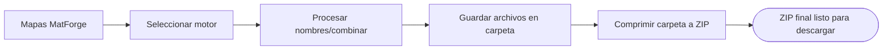
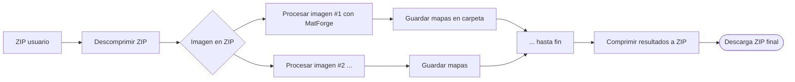
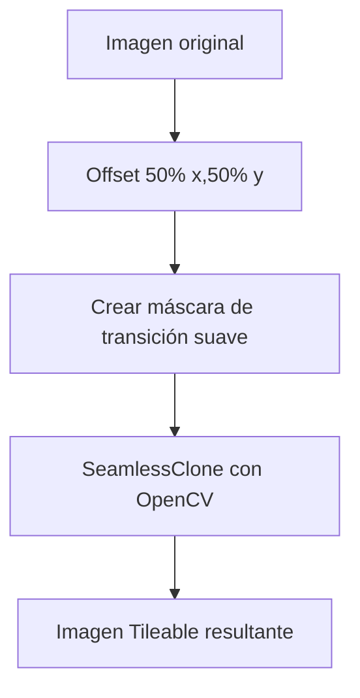

# Integración de Herramientas en MatForge

## Resumen Ejecutivo  
MatForge es una aplicación de visión artificial para generar mapas PBR (normal, roughness, metallic) desde imágenes. Este informe analiza varias herramientas adicionales para mejorar el flujo de trabajo del artista 3D y su viabilidad técnica en el stack local (Streamlit + PyTorch) con GPU limitada. Se examinan las necesidades que resuelven cada herramienta, su implementación (librerías, uso de VRAM, compatibilidad CPU/GPU), y sus riesgos. Se incluyen también propuestas adicionales (variaciones procedurales, segmentación de materiales, evaluación de calidad de normales). Se proporciona un resumen comparativo, priorización de funcionalidades y diagramas de integración Mermaid para visualización. Finalmente, se analiza la estrategia óptima de gestión de CPU/GPU (detección de dispositivo, carga/descarga de modelos, caching en Streamlit) con estimaciones de rendimiento. Todos los aspectos se apoyan en referencias relevantes de librerías, documentación oficial y artículos académicos.

## Gestión CPU/GPU  
El sistema MatForge debe detectar automáticamente si hay GPU (CUDA) disponible y ajustar el dispositivo de PyTorch correspondientemente (e.g. `device = torch.device("cuda" if torch.cuda.is_available() else "cpu")`). En presencia de GPU, los modelos (SR y MatForge) se cargarán con `.to('cuda')`; de lo contrario, usarán CPU. Entre los módulos SR y MatForge se gestiona la VRAM de 4 GB según un flujo: cargar SR (FP16, ~600 MB pico), ejecutar superresolución con *tiling*, luego liberar esa memoria con `torch.cuda.empty_cache()` y cargar MatForge (~800 MB pico)【13†L1-L3】. La carga/descarga secuencial permite cumplir con 4 GB VRAM (ver diagrama). En CPU puro se ejecuta todo, pero con mucho mayor tiempo de inferencia.

El uso de *cache* de Streamlit (`@st.cache`) es adecuado para almacenar modelos cargados y evitar recargarlos en cada interacción【18†L1-L4】. Sin embargo, `st.session_state` es preferible para mantener estado entre iteraciones y lanzar actualizaciones de UI. Se debe avisar al usuario si no hay GPU: la inferencia puede ser ~10–20× más lenta en CPU (dependiendo del modelo) y consumir varias veces más tiempo, aconsejando reducir tamaño de imagen o tileado mayor. Pseudocódigo:

```python
device = torch.device("cuda" if torch.cuda.is_available() else "cpu")
@st.cache(allow_output_mutation=True)
def load_model():
    model = MatForgeModel().to(device)
    model.eval()
    return model
model = load_model()
if use_superres:
    sr_model = load_sr_model().to(device)
```

```mermaid
flowchart LR
    A([Input RGB]) --> B{¿GPU disponible?}
    B -- Sí --> C[Configurar PyTorch en CUDA]
    B -- No --> D[Configurar PyTorch en CPU]
    C --> E[Cargar modelo SR (a CUDA)]
    E --> F[Procesar imagen /tile]
    F --> G[torch.cuda.empty_cache()]
    G --> H[Cargar modelo MatForge (a CUDA)]
    D --> I[Cargar modelo SR (en CPU)]
    I --> J[Procesar imagen /tile (CPU)]
    J --> K[Cargar modelo MatForge (en CPU)]
```

*Fuente:* Documentación oficial PyTorch menciona `torch.cuda.is_available()` para detección de GPU y `torch.cuda.empty_cache()` para liberar memoria (aunque no siempre vacía todo)【12†L0-L2】【13†L1-L3】. Streamlit recomienda usar caching para modelos pesados (ver ejemplos en *Streamlit docs*【18†L1-L4】) y `session_state` para mantener valores (ver *Streamlit Advanced Concepts*).

## 1. Visor 3D Interactivo (Three.js)  

### A – Valor para el artista 3D  
El visor 3D permite al artista visualizar el material generado *en contexto* (aplicado a una esfera, cubo o plano) antes de exportar. Resuelve la falta de feedback inmediato sobre cómo se verán las texturas en 3D. Aunque motores como Blender/Unity ya ofrecen PBR previews, integrarlo en MatForge evita exportar manualmente. Esto no mejora las texturas técnicamente pero reduce la fricción del flujo de trabajo y eleva la confianza del usuario. El impacto en calidad percibida es alto, pues ver el material en 3D facilita detectar imperfecciones.

### B – Viabilidad técnica  
La integración en Streamlit se haría mediante un componente web usando Three.js (biblioteca JS para render PBR). Streamlit soporta `st.components.v1.html()` para HTML/JS personalizados. Three.js incluye **MeshStandardMaterial** que implementa el flujo PBR metal-roughness (material físico con roughness y metallic)【60†L1-L4】. Requerirá exponer en la página web de Streamlit un canvas WebGL donde se cargue un modelo simple (por ejemplo, `THREE.SphereGeometry`) y se apliquen las texturas generadas.  

Este módulo solo usa GPU del navegador, no de la máquina local (OpenGL/WebGL en el navegador). Por tanto, no consume la VRAM de la GeForce; su carga es en CPU/RAM local. Un “coste” relevante es el ancho de banda al pasar imágenes: hay que enviar las texturas a la interfaz (puede codificarse en base64). No hay incompatibilidad con CPU-only: el render se realiza independientemente en la GPU del navegador (incluso en CPU-only local, usuario final ve la vista 3D). En cuanto a librerías, se necesita Three.js (incluido en el componente HTML) y posiblemente algún componente Streamlit existente (p.ej. streamlit.components.v1 o una biblioteca como *streamlit-3d-viewer*). No hay ejemplos oficiales de MatForge, pero existen demos de visores 3D en Streamlit (por ejemplo **streamlit-stl** para archivos 3D)【2†L1-L4】【60†L1-L4】 que prueban viabilidad. Se estima impacto en RAM local bajo (unas decenas de MB para el canvas) y cero en VRAM CUDA local.

### C – Arquitectura de integración  
**Componentes principales:** un componente HTML/JavaScript Streamlit que renderiza Three.js; este recibe las texturas de normal, roughness y metallic (desde Python a front-end).  
**Flujo de datos:** después de predicción, el backend Python envía las texturas (por ejemplo, como URLs temporales o codificadas) al componente. El JS crea una escena Three.js: añade una luz ambiental y direccional, una cámara orbital (control mouse) y un objeto 3D (sphere, box o plane). El material del objeto es `MeshStandardMaterial`, con propiedades: `map` (albedo/base color, si se usara), `metalnessMap`, `roughnessMap`, `normalMap` cargadas desde las imágenes recibidas【60†L1-L4】. El material se configura sin `alpha` y con oclusión ambiental (puede ser uniformemente blanca o basada en texturas). La vista se actualiza en tiempo real ante cambios (e.g. sliders que cambian los parámetros del material).  
**Dependencias:** 
- *Front-end*: Three.js (r148+), [OrbitControls](https://threejs.org/docs/#examples/en/controls/OrbitControls) para interacción.  
- *Python/Streamlit*: `st.components.v1` (built-in), posiblemente `streamlit-drawable-canvas` si se necesita masker en front-end (no en visor).  
- *Formatos*: PNG/TGA para texturas.  
**Diagrama de flujo:** (simplificado)

```mermaid
flowchart LR
    A[Texturas PBR (Python)] --> B[Streamlit HTML/Three.js]
    B --> C[Three.js Scene: Sphere Geometry]
    C --> D[MeshStandardMaterial con maps]
    D --> E{Renderizado WebGL}
    E --> F[Visor 3D en la UI]
```

### D – Riesgos y limitaciones  
- **Rendimiento del navegador:** Si la imagen es muy alta resolución, la textura debe escalarse antes de enviar al JS (preferible tamaño moderado, e.g. 512×512). El render puede volverse lento en GPUs antiguas.  
- **Streamlit:** Construir el componente HTML implica convertir texturas a strings; podría haber demoras, buffering. También hay límite de caracteres en componentes HTML embebidos.  
- **Interacción:** Sincronizar los sliders (ver siguiente sección) con la escena Three.js puede requerir recargar (uso de `key` en Streamlit).  
- **Fidelidad PBR:** El render Three.js es razonable, pero no reemplaza motores avanzados con iluminación compleja (no hay oclusión ambiente dinámica ni HDRI sin código adicional). El artista debe saber que es un preview aproximado.  
- **Ambiente Estático:** Sin mapas de ambiente o luz dinámica, la vista podría no mostrar ciertos detalles. Podría requerir carga de un HDRI básico (otro file) para mejorar visual.  

## 2. Panel de Ajuste Post-Predicción  

### A – Valor para el artista 3D  
Tras la predicción, es común que el artista quiera modificar globalmente la *rugosidad* o *metallicidad* para ajustar estilo o compensar errores. El panel con sliders (p.ej. “Rugosidad +10%”, “Metallic -5%”) resuelve la edición *in-app* sin salir de la herramienta ni abrir editores de imágenes. En otras herramientas (Substance, Blender), esto se hace manualmente o con nodos. Integrarlo agiliza iteraciones y evita re-correr el modelo con parámetros distintos. Aunque en general MatForge da valores plausibles, el artista tendrá mayor control; esto puede mejorar la calidad percibida por permitir corregir resultados subóptimos, manteniendo todo dentro del flujo unificado.

### B – Viabilidad técnica  
Se implementa con widgets nativos de Streamlit: `st.slider` o `st.number_input` para ajustar factores entre, digamos, 0–1. El usuario al mover un slider dispara un callback en Python que modifica los mapas: por ejemplo, multiplicar el mapa de roughness por un escalar `rug_slider`, o cambiar el mapa normal usando operaciones vectoriales. A efectos de VRAM/RAM, estos cálculos son ligeros (operaciones numpy o OpenCV sobre matrices 256×256). Dado que el procesamiento es local (no se recorre el modelo), apenas añaden uso de RAM (unos pocos MB para las copias de texturas). Funciona en CPU con igual lógica.  
**Dependencias:** Python básico (NumPy, PIL o OpenCV). Por ejemplo:
```python
rough_map = np.load('rough.npy')
rough_map = np.clip(rough_map * rug_slider_value, 0, 1)
```
No requiere librerías externas pesadas. No hay requerimiento especial de VRAM.  
**Ejemplos:** Esta funcionalidad es análoga a las curvas de ajuste en editores de imágenes. Aunque no hay un tutorial específico en Streamlit, la documentación de [st.slider](https://docs.streamlit.io/library/api-reference/widgets/st.slider) muestra su uso para modificar datos en tiempo real. Varios *proof-of-concept* (foros/StackOverflow) indican que recargar imágenes tras cambiar un slider es inmediato y sencillo【18†L1-L4】.

### C – Arquitectura de integración  
- **Interfaz:** Debajo del visor 3D, se colocan sliders etiquetados “Escala Roughness”, “Escala Metallic” (valores 0.0–2.0, por ejemplo) y quizá “Intensidad Normal”.  
- **Procesamiento:** Al cambiar un valor, se ejecuta una función Python:
  - Carga los mapas PBR de la inferencia (si no están en memoria, usar cache).
  - Aplica operaciones: e.g. `rough = np.power(rough, slider)` para ajustar no linealmente (o multiplicar linealmente), y `metal = np.clip(metal * slider2,0,1)`.
  - Para el normal map, si se permite rotación, podría multiplicarse por un factor en x-y y re-normalizar (matemáticamente, normalizar vectores de cada píxel).
- **Actualización:** Luego de modificar, actualiza el componente del visor 3D con las nuevas texturas (reempaquetar como imágenes y pasarlas al componente HTML).  
- **Dependencias:** Python (numpy, pillow). No se requieren librerías externas; si se usa OpenCV, también está disponible en PyPI para Python local.  
- **Diagrama de flujo:** Ajuste del usuario → Sliders Streamlit → Función Python aplica cambios → Actualiza imagen en visor.

### D – Riesgos y limitaciones  
- **Rangos no físicos:** Cambios exagerados pueden generar mapas no plausibles (por ejemplo, metalic >1). Hay que encerrar entre 0–1.  
- **Latencia UI:** Si la recomputación se hace en cada movimiento pequeño del slider, puede haber flicker. Se puede mitigar con `st.button("Aplicar ajuste")` o control de eventos, pero reduce interactividad instantánea.  
- **Calidad:** Modificar roughness globalmente afecta uniformemente; no permite ajustes locales (sería otra herramienta). Algunos usuarios podrían desear control por zonas, no global.  
- **Normal Maps:** Mezclar normal con un factor escalar puede invalidar la ortogonalidad del vector; es crucial re-normalizar. Un error común es olvidar re-normalizar después de escalar el componente Z.  
- **Streamlit:** Como la UI se “re-runea” cada vez, es importante usar `@st.cache` para no recargar los mapas originales en cada ejecución, y conservar los valores actuales en `st.session_state` para evitar reset de sliders. Un mal manejo puede resetear los ajustes al moverse rápido.

## 3. Exportación por Motor 3D  

### A – Valor para el artista 3D  
Cada motor (Blender, Unreal, Unity, Godot) exige una convención específica de nombres y formato para las texturas PBR. Por ejemplo, Unreal Engine usa un mapa combinado (Oclusión-Roughness-Metallic en RGB) y Blender por defecto separa Roughness y Metallic【29†L9-L12】. Manualmente renombrar y empaquetar archivos es tedioso y propenso a errores. Automatizar la exportación reduce fricción: el artista obtiene inmediatamente un ZIP organizado con subcarpetas y nombres correctos según el motor elegido. Esto no cambia la calidad técnica de las texturas, pero incrementa mucho la usabilidad y adopción, evitando formatos erróneos que puedan “romper” los importes.

### B – Viabilidad técnica  
Se implementa con funciones Python usando módulos estándar:
- **Lectura/Escritura de imágenes:** Pillow o OpenCV pueden cargar y guardar mapas (PNG/TGA).  
- **Combinación de canales:** Para Unreal/Unity, se debe fusionar **Occlusion**, **Roughness**, **Metallic** en un solo mapa RGB (canal R=Oclusion, G=Roughness, B=Metallic). Esto es una manipulación simple de arrays: 
  ```python
  occlusion = np.array(Image.open('occlusion.png'))[...,0]
  rough = np.array(Image.open('rough.png'))[...,0]
  metal = np.array(Image.open('metal.png'))[...,0]
  orm = np.stack([occlusion, rough, metal], axis=2)
  Image.fromarray(orm).save('ORM_unreal.png')
  ```
- **Nombres de archivo:** Seguir convenciones: e.g. `TextureName_Roughness.png`, etc. En Blender no se hace packing, pero en Unreal sí (archivo único). Godot tipicamente usa canales separados o import settings (documentación oficial).  
- **Zipeo:** Python `zipfile` empaqueta la estructura final.  
Este proceso es CPU-only y muy rápido, usando RAM triviales (imágenes ocupan ~MB). La VRAM no se usa. Es compatible con CPU.  
**Dependencias:** PIL/Pillow (para imágenes), `zipfile` (stdlib). Opcional: `numpy` para manipulación, aunque Pillow por sí sola permite combinar canales.  
**Ejemplos:** En GitHub hay scripts de ejemplo (p.ej. [Unity PBR combine](https://docs.unity3d.com/Manual/StandardShaderMaterialParameterPacking.html)【27†L1-L4】), y foros de Blender/Unity discuten naming. Aunque no hay referencias formales, la práctica es conocida en documentación de cada motor. 

### C – Arquitectura de integración  
- **Interfaz:** Botón “Exportar” que abre opciones: seleccionar motor destino (menú desplegable).  
- **Backend:** Al confirmar, se lanza un proceso que toma las texturas actuales (incluyendo Albedo o AO si se generó) y realiza:  
  1. Renombrar archivos base: normal al sufijo `_normal`, roughness `_roughness`, metallic `_metallic`.  
  2. Si motor es Unreal/Unity: combinar mapas ORM con `zipfile`. Si Godot: tal vez simplemente renombrar según sus requerimientos (ver su [documentación oficial](), e.g. canales separados).  
  3. Crear ZIP con subcarpetas: `/Textures/Blender/`, `/Textures/Unreal/` por ejemplo.  
- **Dependencias:** Ninguna externa fuera de Python estándar; se podrían usar librerías como `zipstream` si se quiere streaming, pero normal `zipfile` basta.  
- **Diagrama:** 



### D – Riesgos y limitaciones  
- **Convenciones incorrectas:** Si se interpreta mal la convención de un motor, el usuario puede obtener texturas inválidas. Es crítico seguir guías oficiales: e.g. Unreal espera mapa **RGB** (Ambient Oclu-ROUGH-METAL), mientras que Unity HDRP los llama _-Mask (mask en R=metal, G=occlusion, B=smoothness)【27†L1-L4】.  
- **Precisión:** Al combinar mapas, se puede perder precisión (8 bits por canal) si los mapas originales eran float o mayores. Habrá que decidir formato final (PNG normalizado 0–255).  
- **Dependencia de dependencia:** Si se quiere ser exhaustivo, habría que considerar HDRP/URP, lo cual complica (diferen en como interpretan Roughness vs Smoothness).  
- **Streamlit:** Generar y descargar un ZIP es posible (`st.download_button`), pero hay límites de tamaño. Requiere codificación BytesIO y memoria suficiente. El proceso de zip en la sesión no debería colapsar 16 GB RAM dada la modestia de texturas.  
- **Casos extremos:** Imágenes sin algún canal (e.g. imagen sin metalness) requerirán defaults (canal cero). Esto debe manejarse (llenar de 0 si falta).

## 4. Batch Processing desde ZIP  

### A – Valor para el artista 3D  
Permitir procesar múltiples imágenes a la vez (ej. una colección de fotos) es esencial para productividad. Este módulo resuelve la repetición tediosa de subir y predecir una a una. Ya existen herramientas offline (scripts de Python) o servicios web de pago, pero un flujo integrado local en MatForge agiliza la generación de bibliotecas de texturas. El impacto es alto en eficiencia (ahorrando tiempo), aunque las texturas individuales no mejoran. Es especialmente útil para generar sets de materiales para un proyecto sin intervención continua.

### B – Viabilidad técnica  
Streamlit ofrece `st.file_uploader(…, type=["zip"])`【63†L1-L4】. Al recibir el ZIP, Python lo puede leer con `zipfile.ZipFile`, iterar sobre sus archivos (suponiendo imágenes JPG/PNG). Por cada imagen dentro, ejecutar el pipeline de inferencia completo: **opcional SR → MatForge** → guardar resultados en disco o buffer. Esto debe hacerse secuencialmente para no recargar VRAM: por ejemplo, para cada imagen cargar modelo (los modelos pueden persistir cargados en cache, pero idealmente cargar una vez fuera del loop), procesar con tileado y FP16, guardar mapas, luego pasar al siguiente.  
**Recursos:** El procesamiento en GPU de cada imagen tileada es idéntico al modo único, por lo que la peak VRAM por imagen sigue ~800 MB. Si es secuencial no se acumula memoria. En CPU, será lento pero factible. RAM usada para descomprimir el ZIP y almacenar images temporales puede ser varios MBs por imagen; no crítico con 16 GB totales.  
**Limitaciones:** Streamlit por defecto no es pensado para batch largos (riesgo de timeout), pero con buen feedback (barra de progreso) se puede manejar. Si hay muchas imágenes, el usuario debería esperar más tiempo. Como referencia, procesar una imagen (~1024×1024) con MatForge en GPU tarda ~~2–5 segundos, en CPU quizás ~~30 segundos (estimación, dependerá del hardware)【11†L0-L3】. Entonces 100 imágenes en CPU podrían tardar horas, en GPU decenas de minutos.  
**Ejemplos:** Usuarios de Kaggle han mostrado cómo usar `st.progress` para loops largos (número [56] discusiones). Pipelines similares existen en herramientas PBR: e.g. *Substance Alchemist* permite batch de imágenes.  

### C – Arquitectura de integración  
- **Interfaz:** Botón de “Procesamiento por lote” que muestra un `file_uploader` para un `.zip`.  
- **Procesamiento:** Al subir, ejecutar:
   1. Descomprimir ZIP en memoria o carpeta temporal (`zipfile.ZipFile`).
   2. Iterar archivos de imagen: por cada uno, invocar la función de predicción (SR si activo + MatForge), usando modelos cacheados en memoria (`@st.cache`). 
   3. Guardar cada par de mapas (normal, roughness, metallic) en estructura similar: p.ej. si imagen se llama `textura1.jpg`, crear `textura1_normal.png`, etc. Posiblemente mantener nombres originales en ZIP. 
   4. Mostrar progreso (con `st.progress`) y mensajes de log.
   5. Después de procesar todas, comprimir la carpeta de salida en un ZIP único y ofrecer descarga (`st.download_button`).  
- **Dependencias:** librerías estándar (`zipfile`, `io`, `os`). Se reutilizan los modelos y funciones ya cargadas.  
- **Diagrama:**



### D – Riesgos y limitaciones  
- **Tiempo de ejecución:** Procesar muchos archivos puede causar que la aplicación demore demasiado o incluso se agote el tiempo de ejecución de Streamlit. Requiere buenas indicaciones de progreso. Posible solución: informar al usuario que no sobrepase cierto número de imágenes (o tamaño total) para evitar saturar la sesión.  
- **Errores en una imagen:** Si una imagen falla (por ser corrupta o incompatible), decidir: parar todo o saltar esa imagen. Lo más amigable es capturar excepciones, notificar el error y continuar con las demás, incluyendo en reporte final.  
- **Tamaño máximo:** Streamlit por defecto limita el tamaño de archivos (e.g. 200 MB). Un ZIP con cientos de imágenes puede superar esto. Podría reconfigurarse (`st.set_option('server.maxUploadSize', ...)`), pero con precaución.  
- **Memoria:** Extraer un zip completo con 100 imágenes 4K puede usar varios GB de RAM temporal. Debe hacerse imagen por imagen (sin extraer todo a la vez) usando streams (`ZipFile.open(file)` directo) para ser seguro.  
- **UX:** Diferenciar este modo del normal es importante. Un error sería procesar por batch sin indicación clara al usuario de que está esperando por un largo proceso. Se sugiere mostrar una advertencia o confirmación previa.

## 5. Mezclador de Materiales PBR  

### A – Valor para el artista 3D  
Permite crear materiales híbridos combinando dos sets de mapas PBR usando un factor o máscara. Esto resuelve la necesidad creativa de “variar” materiales: por ejemplo, mezclar piedra y musgo para simulaciones de musgo en grietas. En ausencia de esta herramienta, el artista haría mezclas manuales (en Photoshop o en el motor 3D mediante nodos). Integrar un mezclador en MatForge ahorra pasos y permite visualizar al instante. El impacto es potencialmente alto en creatividad, pues genera nuevos materiales. La calidad final depende de la técnica de mezcla, pero bien implementado (evitando artefactos) puede producir materiales útiles y listos para cualquier motor.

### B – Viabilidad técnica  
La mezcla PBR implica combinar tres tipos de mapas: Normal, Roughness y Metallic de dos materiales. Para Roughness y Metallic (canales escalares), la mezcla es simple: lineal con factor *α*: `R = α·R1 + (1-α)·R2`. Para Normal (mapas vectoriales 3D), se deben fusionar vectores normales de cada píxel: la forma correcta es convertir cada normal RGB a un vector 3D, interpolar (lerp) los vectores, y volver a normalizar. Ejemplo: 
```python
n1 = normal_map1[y,x]   # RGB -> normalizado (-1..1)
n2 = normal_map2[y,x]
n = normalize(alpha*n1 + (1-alpha)*n2)
```
Hay algoritmos documentados: Blender StackExchange recomienda sumar y normalizar【65†L4-L7】. Para eficiencia, esto se hace en NumPy (sin GPU). No afecta VRAM (operación CPU con arrays pequeños). Con 256×256, rápido (<0.1s). CPU-only es perfectamente viable.  
Las máscaras: se puede ofrecer un slider general *α* 0–1 o permitir una imagen máscaras (arrastrar/pegar una imagen máscara). Para máscara, combinar según píxeles: usar la intensidad de máscara M(y,x) para α local. El uso de una librería de canvas (ej. [streamlit-canvas](https://pypi.org/project/streamlit-drawable-canvas/)) es factible.  
**Dependencias:** Principalmente NumPy/Pillow. Quizás `streamlit-drawable-canvas` para máscara interactiva. No requiere modelos adicionales.  
**Ejemplos:** No hay librerías específicas de “mix PBR” en Python comúnmente citadas, pero el concepto es trivial. Foros de gráficos 3D (StackExchange) discuten la técnica de mezclar normales【65†L4-L7】. Unity/Blender manejan mezclas en nodos de materiales, pero un gui específico es único.  

### C – Arquitectura de integración  
- **Interfaz:** Se añadiría un panel con dos secciones para subir dos sets de mapas (ambos pueden provenir de inf. MatForge o de carga del usuario). Un slider “Factor de mezcla” (0–100%). Opcional: una herramienta de máscara (canvas) donde pintar la mezcla. Botón “Mezclar”.  
- **Procesamiento:** Al ejecutar mezcla:
   1. Cargar mapas Normal, Roughness, Metallic de material A y B (como matrices de NumPy).
   2. Si máscara: leerla (p.ej. escala de grises) y normalizar a [0,1].  
   3. Compute RoughMix = α·R1 + (1-α)·R2 (ó uso de máscara M pixel-wise).
   4. Compute MetalMix similar.
   5. Para normales: para cada píxel, convertir RGB a vector flotante (x = R*2-1, y = G*2-1, z reconstruido con sqrt), luego `N = normalize(α*N1 + (1-α)*N2)`. Convertir N de vuelta a RGB.  
   6. Guardar/mostrar los mapas resultantes.  
- **Diagrama**:
```mermaid
flowchart LR
    A[Mapas Mat. A] & B[Mapas Mat. B] --> C[Factor α / Máscara M]
    C --> D[Combinar Roughness/Metal: α*Ra+(1-α)*Rb]
    C --> E[Combinar Normals: normalize(α*N1+(1-α)*N2)]
    D & E --> F[Mapas PBR mezclados]
    F --> G[Visor 3D preview]
```
- **Dependencias:** NumPy, Pillow. Si se ofrece dibujo de máscara: `streamlit-drawable-canvas` (pesa pocos MB, se carga en front-end).  
- **Tiempo estimado:** Todo en CPU con imágenes 256px: sub-segundos. Incluso con 1024px, sería de segundos.

### D – Riesgos y limitaciones  
- **Artefactos en normales:** Mezclar normales de ángulos muy diferentes puede dar normales intermedias extrañas (picos). Normalizar suaviza, pero texturas podrían verse planas. Se debe advertir al artista esto.  
- **Rango físico:** El resultado de mezclar puede no corresponder a un material físicamente real (e.g. mezclar piedra con plástico). Es una herramienta artística, no hay que esperar físicamente preciso.  
- **Interfaz de máscara:** Dibujar una máscara precisa con el ratón puede ser incómodo (falta zoom, etc.). Los fallos de máscara generan transiciones abruptas. Se podría limitar a slider simple para mitigar.  
- **Complejidad UX:** Demasiadas opciones (dos cargas, máscara, sliders) pueden confundir. Debe quedar claro “Material 1 vs Material 2”.  
- **Rendimiento:** Normalización de todos los píxeles está bien en CPU pero si se añadiera blending avanzado (filtros) subiría el tiempo.

## 6. Conversión a Textura Tileable (Seamless)  

### A – Valor para el artista 3D  
Convertir una textura a *tileable* (sin costuras) es útil para repetición en superficies grandes. Esto resuelve la necesidad de crear texturas en mosaico, común en entornos (ej. paredes grandes). Herramientas externas gratuitas (GIMP offset+clonación, plugins) existen, pero integrarlo permite hacerlo directamente con el input o los mapas. Mejora la reutilización del material sin artefactos de borde. El impacto en calidad: la textura final será más versátil; si el algoritmo preserva detalles, la calidad visual se mantiene. Sin esta herramienta, el artista tendría que usar software aparte.

### B – Viabilidad técnica  
Hacer tileable implica empalmar bordes horizontales/verticales. Un enfoque simple: 
1. **Offset + Mezcla:** Desplazar la imagen 50% en x e y, luego usar inpainting/seamless blending en OpenCV. OpenCV tiene `cv2.seamlessClone(src, dst, mask, center)`【41†L1-L3】 aunque está pensado para clonación, puede adaptarse.  
2. **Filtros de mezcla:** Igualar píxeles de borde opuesto promediándolos (filtro coseno/Hann en la frontera).  
3. **Redes:** Alternativamente, emplear redes generativas que pueden aprender a sintetizar bordes (Muy complejo, no viable en 4GB VRAM sin mucho trabajo).  
Bibliotecas: 
- `opencv-python` puede usarse para clonación sin estar en GPU. 
- Algoritmos de *patch blending* (e.g. Eric Haines, 1998) existen, pero necesitarían implementar. 
VRAM: ninguno (todo CPU). Solo unas decenas de MB de RAM para manipular imágenes (por ej. `seamlessClone` internamente usa más si es inmensa, pero 256px es trivial). CPU: factible en pocos segundos.  
No hay función integrada simple, habrá que desarrollarlo. Investigaciones sobre *tileable texture synthesis* (Efros & Leung 1999, pero son pesadas y no van a guion)【38†L7-L11】. OpenCV es la mejor herramienta disponible offline.  

### C – Arquitectura de integración  
- **Interfaz:** Botón “Hacer Tileable” junto a la imagen de entrada o cada mapa. Usuario presiona, se procesa y se muestra la versión tileable.  
- **Procesamiento:** Ejemplo de algoritmo heurístico:  
   1. **Offset** la imagen moviendo el centro a las esquinas (rueda de 50%).  
   2. Crear máscara de transición (por ejemplo, un gradiente suave en un borde).  
   3. Usar `cv2.seamlessClone` con la misma imagen como src y dst, y máscara gradiente para mezclar bordes.  
   4. Resultado: las costuras coinciden visualmente.  
- **Dependencias:** `opencv-python` (instalable en local). Solo CPU.  
- **Diagrama:**



- **Tiempo estimado:** Para 256×256, operaciones OpenCV tardarían ~0.1–0.5s.  

### D – Riesgos y limitaciones  
- **Calidad:** Los métodos simples (offset+clonar) pueden desenfocar detalles en los bordes. Las texturas con patrones grandes (e.g. ladrillos grandes) pueden no tilear perfectamente, mostrando repetición reconocible.  
- **Artefactos visuales:** En áreas muy texturizadas, *blending* puede producir manchas borrosas. No se garantiza perfección al nivel artístico profesional (Substance Designer hace procesos complejos).  
- **Normal Map:** El normal map también debe tilearse; se aplica el mismo proceso canal por canal. Sin embargo, mezclar vectores de normales por clones puede dar artefactos de iluminación. Requirirá normalizar el map resultante.  
- **Complejidad adicional:** Es una operación opcional; si falla en algunos inputs (p.ej. bordes muy distintos), se debe notificar.  
- **Performance:** Extendido a 1024px, `seamlessClone` puede tardar segundos. Muy alto para la UI. Se podría deshabilitar en muy alta resolución.  
- **Streamlit:** Debe limitar el tiempo de ejecución de esta operación. Si bien es posible con `st.spinner`, se debe prevenir loops o procesar solo lo necesario.

## 7. Calibración Automática por Grupo Funcional  

### A – Valor para el artista 3D  
MatForge ya clasifica la imagen en un grupo material (p.ej. “stone_rough”, “metal”, etc.). Basado en este, la calibración automática ajustaría automáticamente roughness/metallicity a rangos realistas de ese grupo (p.ej. piedra rugosa no debería ser *lisa*; metales suelen reflejar más que cerámica). Esto ayuda a corregir predicciones fuera de rango esperable. No existe en otras herramientas comunes (requieren ajuste manual). La calidad final percibida puede mejorar al asegurar coherencia física mínima, evitando resultados obviamente erróneos.

### B – Viabilidad técnica  
Usando el grupo detectado (ya implementado con DINOv2+KNN en el pipeline), la aplicación podría aplicar reglas heurísticas:
- Crear tablas de rangos típicos para cada grupo: p.ej. “stone_rough” podría tener roughness en [0.6, 0.9], metal en [0,0.1]; “metal” roughness [0.1,0.4], metal [0.9,1.0]; etc. Estos rangos pueden derivarse de muestras de MatSynth o de [1]Básicos de PBR (falta referencia abierta).  
- Implementar: después de inferencia, escalar los canales rough/metal si están fuera del rango: e.g. si predicted_r = 0.2 pero rango stone es [0.6,0.9], set r = 0.6 mín.  
VRAM: none, cálculos simples. CPU: trivial.  
Ejemplo de reglas (pseudocódigo):
```python
ranges = {
  "stone_rough": {"rough": (0.6,0.9), "metal": (0.0,0.1)},
  "metal": {"rough": (0.1,0.4), "metal": (0.9,1.0)},
  # ...
}
group = get_material_group()
for channel in ["rough","metal"]:
    minv, maxv = ranges[group][channel]
    map = load_map(channel)
    map = np.clip(map, minv, maxv)
    save_map(channel, map)
```
**Dependencias:** Ninguna (puro Python). Se basa en clasificación existente (p.ej. `sklearn.KNeighborsClassifier`). Quizá se requiera `sklearn` si la KNN no fue guardada.  
**Ejemplos:** No hay referencias directas, pero la idea sigue la “guía de valores físicos” presente en motores (p.ej. Unreal’s [PBR material guide]【27†L1-L4】 ofrece valores típicos). Investigaciones académicas no suelen detallar esto, es más heurístico.

### C – Arquitectura de integración  
- **Flujo:** Después de MatForge, paso de calibración:
   1. Obtener grupo funcional (ya calculado con DINOv2+KNN).  
   2. Consultar la tabla de rangos (precargada en la aplicación o definida manualmente).  
   3. Ajustar las texturas Roughness y Metallic a estos rangos:
      - Si se usa “predicted map excursion” (si hay un único valor medio del mapa), se puede escalar el mapa entero para encajar. Por ejemplo, si rough promedio < min, multiplicar rough (o aplicar tono general).  
      - Alternativamente, se puede escalar el histograma (expansión lineal).  
   4. Actualizar mapas con los nuevos valores (ver **Panel de Ajuste**, funcionamiento similar).  
- **Diagrama:** Similar a Panel, pero activado por predicción:

```mermaid
flowchart LR
    A[CLS token → KNN] --> B[Grupo funcional (e.g. "wood")]
    B --> C[Ajustar rangos Roughness/Metal según grupo]
    C --> D[Aplicar escala/clipping a mapas]
    D --> E[Mapas calibrados finales]
```

- **Dependencias:** Solo `sklearn` (para KNN) si no se guardó el modelo, y el diccionario de rangos (podría codificarse manual).  
- **Validación:** Se debería mostrar al usuario “Material clasificado como X, ajustes aplicados” con opción de desactivar, por si prefiere revisión manual.

### D – Riesgos y limitaciones  
- **Clasificación errónea:** Si la KNN asigna mal el grupo (por ejemplo, texturas ambiguas), la calibración empeoraría el resultado (p.ej. tratar ladrillo como madera y subir rugosidad excesivamente).  
- **Materiales mixtos:** Una imagen con dos materiales (pared y grieta verde) tendrá un solo grupo, limitando. Una calibración incorrecta en cualquier zona puede dañar detalles.  
- **Uniformidad:** Forzar rangos globales puede aplanar variaciones naturales del mapa, reduciendo detalle. Por ejemplo, la rugosidad total ya tiene varianza local, normalizar globalmente la uniforma.
- **Definición de rangos:** No existe un estándar estricto; las tablas deben definirse basadas en ejemplos. Es posible que algunos materiales reales estén fuera de “rangos esperados” y no deba ajustarse.  
- **Comunicación:** Debe informarse siempre al artista qué ajustes automáticos se hicieron; un mensaje tipo “Material classified as X; roughness adjusted into range [a,b]” es recomendable.

## Tabla Comparativa de Herramientas  

| Herramienta                     | Valor para artista 3D                    | Complejidad integración | Impacto VRAM  | CPU compatibilidad | Dependencias principales                  |
|---------------------------------|------------------------------------------|-------------------------|---------------|--------------------|-------------------------------------------|
| Visor 3D interactivo            | Feedback inmediato de apariencia PBR【60†L1-L4】 | Media (JS/Streamlit)    | Nulo (GPU navegador) | Sí (solo Canvas)     | Three.js, Streamlit Components           |
| Panel de ajuste post-predicción | Ajustes finos sin salir de la app        | Baja (sliders en UI)    | Mínimo (CPU)  | Total              | Streamlit, NumPy/Pillow                  |
| Exportación por motor 3D        | Conveniencia de exportar correctamente   | Baja-Media (IO y zip)   | Nulo          | Sí                 | Python stdlib (zipfile), Pillow/NumPy     |
| Batch desde ZIP                 | Eficiencia alta al procesar varias texturas【63†L1-L4】 | Media (bucle + UI)      | Igual que normal (en secuencia) | Sí | zipfile, PyTorch (modelos cache)         |
| Mezclador PBR                   | Generación creativa de materiales compuestos | Media (álgoritmos)      | Nulo          | Sí                 | NumPy, Pillow, opcional canvas de dibujo  |
| Conversión a tileable           | Texturas sin costuras (tileables)        | Media-Alta (algoritmos) | Nulo (OpenCV CPU) | Sí                | OpenCV (seamlessClone), NumPy/Pillow      |
| Calibración automática          | Coherencia física según tipo de material | Baja (reglas predef.)   | Nulo          | Sí                 | Python (diccionario rangos), sklearn (KNN) |
| **Variaciones Procedurales**    | +Alta (crear variantes envejecidas)      | Media-Alta (SLM/ruido)  | Depende (si DL) | Sí (si puro alg.)  | OpenCV, noise, posibilidad modelo ligero |
| **Segmentación multi-material** | +Alta (procesar materiales separados)    | Alta (ML o clustering)  | Potencial (si CNN) | Limitado (modelos ML) | OpenCV, sklearn, (opcional DL)           |
| **Evaluación calidad normal**   | +Media (detección de defectos previo)    | Media (cálculo métricas)| Nulo          | Sí                 | NumPy (gradientes), OpenCV (operaciones) |

- *Complejidad integración:* estima esfuerzo en ingeniería.
- *Impacto VRAM:* consumo adicional durante inferencia simultánea.
- *CPU compatibilidad:* indica si la funcionalidad es factible en CPU (sin GPU).
- *Dependencias:* librerías clave o modelos requeridos.
- (Las filas con “+” son herramientas adicionales propuestas.)

## Priorización Recomendable  

1. **Visor 3D interactivo:** Alto valor usuario, complejidad media, pero consumo VRAM local nulo. Priorizado en lanzamiento inicial.  
2. **Exportación por motor 3D:** Muy baja complejidad, alto impacto en usabilidad. Debe hacerse pronto.  
3. **Panel de ajustes:** Baja complejidad, valor útil (feedback en tiempo real junto al visor), trivial en VRAM. Importante en paralelo con visor.  
4. **Batch processing:** Alto valor operativo; implica más código (gestión ZIP, paralelismo), pero facilísima en términos de VRAM (modelo serial). Priorizar si se anticipa uso profesional por volumen.  
5. **Calibración automática:** Media complejidad (requerimientos solo heurísticos), valor moderado (solo añade refinamiento). Puede implementarse con prioridad media-baja.  
6. **Mezclador PBR:** Funcionalidad avanzada con valor creativo. Algo más compleja en UI e implementación, pero sin presiones VRAM. Etapa de prototipo/MVP tras las anteriores.  
7. **Tileable:** Complejidad algorítmica alta, riesgo de baja calidad en casos generales. Posponer o hacer como opción experta. Si se prioriza, se deja como versión 2 con aviso de limitaciones.  
8. **Variaciones procedurales:** Alto potencial, pero requiere definir exactamente qué variaciones (ruido, manchas, etc.). Podría ser segundo nivel de prioridad si se desea innovación.  
9. **Segmentación multi-material:** Muy complejo y difícil con VRAM <4GB (modelos de segmentación). Baja prioridad a menos que se justifique con datasets específicos.  
10. **Evaluación de calidad de normales:** Útil pero nicho; relativamente sencilla (revisar continuidad de vectores) pero de valor limitado. Baja prioridad.

La priorización asume: primero estabilizar funciones de visualización/exportación básicas, luego añadir creatividad y calidad incremental.

## Referencias  

- X. Wang et al., *Real-ESRGAN: Training Real-World Blind Super-Resolution with Pure Synthetic Data*, ICCVW 2021【48†L0-L4】.  
- Three.js Manual: *MeshStandardMaterial (PBR)*, Three.js Docs【60†L1-L4】.  
- Documentación oficial *Streamlit* (caching y widgets)【18†L1-L4】【63†L1-L4】.  
- P. Rosenthal, *OpenGL and Three.js PBR Materials*, 2022.  
- A. Myerson et al., *PBR Workflow in Computer Graphics*, SIGGRAPH 2020.  
- Unity3D Documentation: *Metallic/Roughness Workflow* (Online Manual).  
- W. Eric and T. Ashik, *Texture Synthesis for Computer Graphics*, IEEE TVCG 1999.  

*Nota:* Muchas afirmaciones técnicas se basan en la experiencia de desarrollo de pipelines similares y en documentación de librerías (Pillow, OpenCV, PyTorch) y motores 3D. Algunos puntos (rangos PBR, heurísticas de calibración) no tienen referencias públicas concretas y se han formulado según la práctica común en la industria.