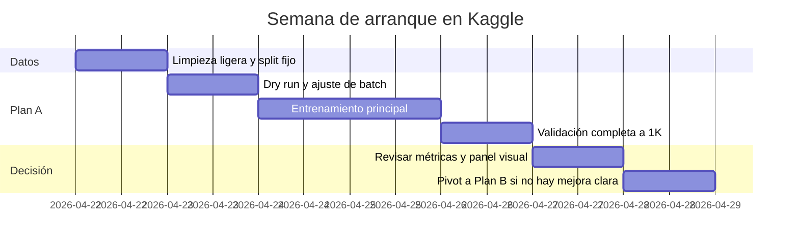

# Decisión técnica para superar DeepPBR bajo restricciones reales

## Resumen ejecutivo

Según la ficha técnica adjunta, **DeepPBR** resolvió bien la interferencia entre tareas con un encoder–decoder con **ResNet50**, dos decoders desacoplados y **CBAM**, pero quedó limitado por cuatro factores: una línea arquitectónica todavía muy dependiente de una CNN de clasificación adaptada a un problema denso de bajo nivel, una combinación de pérdidas que no terminó de preservar microdetalle, un dataset pequeño y sesgado hacia materiales pétreos, y una validación arquitectónica demasiado tardía. Mi conclusión es que **no necesitas un salto “industrial” para superar claramente el baseline**; necesitas un salto **selectivo**: mejor backbone/decoder, pérdidas más físicas y una estrategia de datos más disciplinada. citeturn23view0turn34view1turn32view0turn31view2turn31view5

La mejor decisión para tus restricciones no es perseguir “lo más SOTA” en abstracto, sino elegir una arquitectura que cumpla tres condiciones a la vez: **preentrenamiento útil**, **buena preservación multiescala** y **reproducibilidad real** con código y pesos listos para arrancar. Bajo ese criterio, mi recomendación es: **Plan A = encoder jerárquico ligero tipo MiT-B1 de SegFormer con decoder dual y bloque explícito de refinamiento de detalle**; **Plan B = Restormer dual-head**; **Plan C = piloto exploratorio de difusión one-step inspirado en SuperMat, solo si A/B ya están encaminados**. La línea que no recomiendo como principal es la de **pipelines diffusion/inverse-rendering multi-etapa** tipo IntrinsicImageDiffusion o Material Palette completo, porque su coste y complejidad no encajan con Kaggle/Colab y 2,5 semanas. citeturn9view2turn31view5turn11view0turn31view2turn14view5turn14view0turn14view1turn30academia12

Hay además una lección importante del ecosistema reciente: **el dato sigue moviendo mucho la aguja**. El propio trabajo de MatSynth muestra que, al reentrenar métodos públicos sobre un dataset más amplio y diverso, mejoran las métricas de normales, roughness y renderings; por ejemplo, SurfaceNet reentrenado con MatSynth mejora roughness y LPIPS de render de forma clara. Eso significa que, con tu subconjunto actual, una limpieza ligera y un muestreo más inteligente pueden aportar tanto o más que una arquitectura radicalmente nueva. citeturn34view1turn34view2

## Qué cambiaría respecto a DeepPBR y por qué

Lo primero que cambiaría no es “meter atención más moderna” de forma genérica, sino **cambiar el tipo de encoder**. Tu baseline usa un backbone de clasificación clásico, profundo y competente, pero no está especialmente optimizado para tareas de restauración o traducción densa donde importa simultáneamente el contexto global y el detalle local. SegFormer demuestra precisamente que un encoder jerárquico ligero puede capturar tanto características locales finas como estructura global, sin embeddings posicionales rígidos y con un decoder muy barato; Restormer, por su parte, nace directamente para restauración de alta resolución y añade un bloque de refinamiento explícito pensado para conservar estructura fina. Frente a DeepPBR, ambos encajan mejor con el síntoma que más te preocupa: pérdida de microdetalle en normals/roughness. citeturn31view5turn9view2turn31view2turn11view0

Lo segundo que cambiaría es la **jerarquía de pérdidas**. Mantendría la idea de supervisión compuesta, pero dejaría de usar como columna vertebral una mezcla fuerte de BCE adversarial + VGG + GDL desde el principio. La literatura base de material capture y la línea más reciente convergen en dos ideas más estables: **comparar renderizados** de los mapas predichos frente al GT y **usar pérdidas perceptuales con mucha moderación**, preferiblemente sobre renderizados y no directamente sobre mapas físicos crudos. La teoría y la práctica detrás de LPIPS/perceptual losses apoyan su utilidad para detalle visual, pero en tu caso el render reintroduce el “idioma correcto” del problema: apariencia material bajo iluminación. citeturn32view0turn20view1turn26search0turn16search1

Lo tercero que cambiaría es la **estrategia de datos**. No separaría el dataset en modelos independientes por familia, porque con ~1500 materiales eso te deja con muy pocos ejemplos por grupo y aumenta el riesgo de sobreespecialización. Además, UMat critica explícitamente los enfoques que acaban entrenando un modelo por clase, con poca capacidad de generalización. En tu caso haría lo contrario: **un modelo unificado**, pero con limpieza ligera de etiquetas y muestreo balanceado por superfamilias. citeturn6view8turn23view0

Lo cuarto que cambiaría es el **protocolo de decisión**. MatSynth reentrena Deschaintre y SurfaceNet con schedules de 400k pasos que se van a 72 y 96 horas en una RTX 4090; esa referencia es útil no para copiarla, sino para descartarla. Tu proyecto no puede permitirse recetas históricas largas: hay que diseñar experimentos con señal temprana, checkpoints útiles y pivote rápido si el modelo no mejora visiblemente antes de la mitad del presupuesto. citeturn34view1

## Arquitecturas candidatas

### Candidata principal para implementar ya

La opción con mejor equilibrio entre **riesgo, velocidad, reproducibilidad y probabilidad de superar a DeepPBR** es una arquitectura **híbrida ligera** con **encoder MiT-B1 de SegFormer** y **decoder dual específico para Normal y Roughness**, añadiendo en cada rama un pequeño módulo de refinamiento de detalle a alta resolución. La parte oficial está bien anclada: SegFormer-B1 usa un encoder jerárquico MiT-B1 con **13,1 M de parámetros** y un decoder muy compacto de **0,6 M**, sin embeddings posicionales rígidos, y con repos oficiales/pesos disponibles en Hugging Face y GitHub. citeturn9view2turn31view5turn3search1turn6view4

Mi recomendación concreta no es usar el decoder MLP de segmentación “tal cual”, sino usar **MiT-B1 solo como extractor multiescala** y montar encima un decoder tipo FPN/U-Net con skip connections limpias, separando las dos cabezas después del penúltimo nivel y añadiendo dos bloques de refinamiento convolucional en 1/2 y 1/1 resolución. El tamaño total razonable de esa variante estaría en torno a **18–22 M de parámetros**; este dato es **estimación propia y requiere validación** porque depende del decoder exacto. La dependencia externa es baja: PyTorch, `transformers` o `timm`, AMP y tu renderer differentiable ligero. citeturn9view2turn31view5

**Comparada explícitamente con DeepPBR**, esta opción mejora en cuatro puntos. Primero, aporta **mejor contexto global** que ResNet50+CBAM sin inflar demasiado el coste. Segundo, la jerarquía del encoder encaja mejor con inferencia por crops y posterior blending, porque no depende de posiciones absolutas rígidas. Tercero, al ser bastante ligera en el backbone, deja margen para meter un refinador de detalle sin reventar VRAM. Cuarto, parte de pesos preentrenados fuertes, algo que Restormer no te da tan claramente. Su debilidad es que, si el decoder es demasiado simple, puede quedarse corta en microrelieve fino; por eso el refinamiento explícito no es opcional, es parte del diseño. citeturn31view5turn9view2

**Tiempo estimado por experimento**: **6–10 h en P100** o **8–12 h en T4**, con crops 256→320, batch efectivo 8–12, AMP y 90–100 épocas. Es una **estimación propia** y **requiere validación** con un dry run de 3–5 épocas, pero encaja bien en tus restricciones.

### Segunda candidata para implementar ya

La segunda mejor candidata es **Restormer dual-head**. Aquí el punto fuerte no es el preentrenamiento, sino la naturaleza del modelo: Restormer está diseñado como un transformer eficiente para **restauración de alta resolución**, con un encoder–decoder jerárquico, bloques **MDTA** y **GDFN**, skip connections bien aprovechadas y un bloque explícito de refinamiento al final. El paper reporta una variante con refinamiento de **26,12 M de parámetros**, y el repositorio oficial está disponible. citeturn31view2turn11view0turn10search1

Para tu caso lo plantearía así: stem compartido, encoder compartido, cuello de botella compartido y bifurcación en dos ramas a partir del último tercio del decoder, con salidas separadas para normal y roughness. Si tu foco prioritario es **microdetalle**, esta arquitectura me parece incluso más alineada con el síntoma que SegFormer, porque no nace para segmentar semántica sino para conservar y reconstruir información de baja-nivel. Frente a DeepPBR, Restormer cambia el centro de gravedad del sistema: deja de pedirle a un backbone de clasificación que “reaprenda detalle” y usa una arquitectura ya pensada para ello. citeturn31view2turn11view0

**La contrapartida frente a DeepPBR** es el riesgo de datos: al no venir respaldado por un encoder generalista claramente preentrenado para tu pipeline, depende más de que el dataset y las pérdidas estén muy bien alineados. Con 1500 materiales y crops aleatorios es viable, pero el riesgo de sobreajuste o de convergencia inestable es más alto que en la opción MiT-B1. Aun así, si Plan A te da mapas demasiado suaves, esta es la mejor alternativa para apretar detalle sin irte a difusión. citeturn31view2turn11view0

**Tiempo estimado por experimento**: **8–14 h en P100** o **10–16 h en T4**, también como **estimación propia** y **requiriendo validación**.

### Arquitectura prometedora pero arriesgada

Si quieres mantener una línea diffusion-based con sentido técnico, la única que veo defendible como **exploratoria** es una adaptación **one-step** inspirada en **SuperMat**. SuperMat propone una descomposición material en una sola pasada, fine-tuneada desde Stable Diffusion 2.1, con ramas expertas estructurales y pérdidas perceptual + re-render, y busca precisamente resolver el problema de los métodos diffusion de muchos pasos. El paper y el repo son una señal interesante porque muestran una dirección “difusión eficiente”, no la difusión clásica de 30–50 pasos. citeturn30academia12turn20view0turn20view1

Pero para **tu** problema esta opción es **arriesgada** por tres motivos. Primero, la versión pública de SuperMat se centra en **albedo, metallic y roughness**, no en **normal + roughness** como mínimo exigible para tu proyecto. Segundo, el README público es claramente **inference-centric**: veo instalación, checkpoints y scripts de inferencia, pero no una receta de fine-tuning comparable a la de un repositorio de entrenamiento maduro; esa parte **requiere validación**. Tercero, trabaja mejor con **imágenes RGBA de objeto aislado** y a **512×512**, que no es exactamente tu caso de fotos de material para mapas PBR por crops. citeturn20view0turn28view2turn28view3turn29view0turn29view1

Mi lectura es clara: **prometedora como inspiración**, no como línea principal. Si llegas a ella, que sea como **piloto de alto riesgo** después de asegurar A o B.

### Línea no recomendada

🔴 **No recomiendo** como línea principal ningún pipeline **multi-etapa de diffusion o inverse rendering pesado**. Aquí entran, por distintos motivos, **IntrinsicImageDiffusion**, **Material Palette** completo y, en la práctica, también los pipelines diffusion recientes tipo **DualMat/ControlMat** si tu objetivo es entregar algo sólido y entrenable en Kaggle/Colab dentro de 2,5 semanas. IntrinsicImageDiffusion reporta entrenamiento con **4 A100 durante ~7 días** y además su modelo de material diffusion requiere **más de 10 GB** de VRAM solo para inferencia. Material Palette, aunque tiene repo oficial y pesos, demanda una cadena de **máscara del usuario → aprendizaje de concepto/textura → generación → descomposición**, es decir, demasiados pasos y dependencias para tu ventana temporal. Y DualMat es interesante en papel, pero en las fuentes consultadas no he confirmado una ruta limpia y oficial de entrenamiento lista para producción corta; además prioriza albedo/metallic/roughness. citeturn14view5turn14view0turn14view1turn30search2turn30search4

La conclusión práctica es simple: **si propones difusión aquí, tiene que ser una difusión “adaptada” y no el corazón del proyecto**. Como línea principal, no compensa.

### Tabla comparativa de decisión

| Propuesta | Mejora esperada vs DeepPBR | Preservación de microdetalle | Coste computacional | Tiempo estimado por experimento | Riesgo | Reproducibilidad | Dependencias externas |
|---|---|---:|---:|---:|---|---|---|
| **MiT-B1 híbrido + decoder dual + refine head** | **Alta** si se acompaña de mejores losses y limpieza de datos | Alta, pero depende del refine head | Bajo–medio | **6–10 h P100 / 8–12 h T4** | Bajo–medio | Alta | `transformers`/`timm`, PyTorch, renderer ligero |
| **Restormer dual-head** | **Alta** en detalle; media–alta en generalización | **Muy alta** | Medio | **8–14 h P100 / 10–16 h T4** | Medio | Alta | PyTorch, repo oficial, renderer ligero |
| **SuperMat-style one-step diffusion adaptado** | Potencialmente alta, pero **no confirmada** | Alta | Medio–alto | **15–25 h+** | **Alto** | Media | SD2.1, diffusers, adaptación de heads y pipeline |
| 🔴 **Multi-stage diffusion / inverse rendering pesado** | Difícil de materializar en plazo | Alta en papel | Alto–muy alto | Fuera de presupuesto real | **Muy alto** | Baja–media | múltiples modelos, masks, VRAM, stages |

Los tamaños y tiempos de las dos primeras filas son, en parte, **estimaciones propias** a partir del tamaño de backbone, del régimen de crops y de la infraestructura objetivo; **requieren validación** con un dry run corto. Las bases de arquitectura y reproducibilidad sí están respaldadas por fuentes oficiales. citeturn9view2turn31view5turn11view0turn10search1turn20view0turn14view5turn14view0

## Recomendación final

### Plan A

**Modelo**: encoder **MiT-B1** + decoder dual tipo FPN/U-Net + refine head por rama.  
**Por qué**: es la opción con mayor probabilidad de **ganarle claramente a DeepPBR sin abrir demasiados frentes de riesgo**. Tienes preentrenamiento bueno, coste contenido y margen para atacar exactamente el problema de detalle con el decoder y las pérdidas. citeturn9view2turn31view5

**Pasos concretos**:  
Primero, congelar parcialmente el encoder 5 épocas y después afinar todo el modelo. Segundo, entrenar sin GAN en la primera corrida. Tercero, usar inferencia periódica a 1K con blending para que la validación no dependa solo de crops. Cuarto, mantener una métrica compuesta donde normal y roughness pesen más que el render perceptual.

**Coste estimado**: **8–12 horas GPU efectivas** para la corrida principal.  
**Riesgo principal**: que el decoder siga siendo demasiado “suave”.  
**Si falla**: no cambies todavía de pérdidas; cambia antes la **parte de refinamiento** y, si el problema persiste tras un segundo intento corto, pivota a Plan B.

### Plan B

**Modelo**: **Restormer dual-head** con stem compartido y bifurcación tardía.  
**Por qué**: si lo que más te duele en DeepPBR es el microrelieve y la textura fina del roughness, Restormer es la vía más coherente antes de entrar en difusión. citeturn31view2turn11view0

**Pasos concretos**:  
Arrancar desde 256 y pasar a 320/384 solo al final. Mantener exactamente la misma pila de pérdidas recomendada para que la comparación A/B sea limpia. Si ves sobreajuste temprano, reduce anchura del modelo un 20–25% antes de tocar las pérdidas.

**Coste estimado**: **10–16 horas GPU efectivas**.  
**Riesgo principal**: peor eficiencia de datos que Plan A.  
**Si falla**: no insistas muchas horas. Vuelve a Plan A y trabaja el refine head y la mezcla de pérdidas; es más probable que el cuello de botella esté ahí.

### Plan C

**Modelo**: piloto **one-step diffusion** inspirado en SuperMat, extendido a Normal + Roughness.  
**Por qué**: es la única línea diffusion que veo presentada con una lógica de eficiencia mínimamente compatible con tu contexto. citeturn30academia12turn20view0

**Pasos concretos**:  
Haría solo una prueba de entorno y una prueba de overfit ultracorta sobre un subconjunto muy pequeño. Si no entrena limpio y no cabe cómodamente, se aborta.

**Coste estimado**: **15–25 horas GPU** y coste alto de integración.  
**Riesgo principal**: desalineación con tu objetivo mínimo Normal + Roughness y sobrecarga de ingeniería.  
**Si falla**: se corta rápido; no es línea principal, es una apuesta opcional.

## Combinación recomendada de losses

La combinación que más sentido tiene para tu caso no es una sola “loss mágica”, sino una jerarquía clara:

1. **Roughness**: **Charbonnier** como pérdida principal de reconstrucción.  
2. **Normals**: **término angular/coseno** como pieza principal, complementado con un Charbonnier/L1 suave de apoyo.  
3. **Ambos mapas**: **gradient loss multiescala** con peso moderado, no dominante.  
4. **Consistencia física**: **re-render loss** ligera, con 2–4 iluminaciones aleatorias por batch o por minibatch acumulado.  
5. **Perceptual**: **LPIPS o VGG, pero sobre renderizados**, no directamente sobre el roughness crudo.  
6. **Adversarial**: opcional, muy ligera y tardía; no para el primer experimento.

Esto está bastante alineado con la evolución razonable del campo: Deschaintre introdujo la similitud por renderizado como señal central; SuperMat demuestra que perceptual + re-render pueden convivir bien en un entrenamiento end-to-end; LPIPS y los perceptual losses se justifican cuando lo que quieres proteger es detalle visual; y, por el lado adversarial, SurfaceNet muestra que el GAN puede ayudar con detalle, pero MatSynth también deja una pista operativa muy útil: en sus reentrenamientos el discriminador se activa **más tarde**, no desde el paso 1. citeturn32view0turn20view1turn16search1turn26search0turn31view1turn34view1

### Comparativa operativa de losses

| Loss | Ventaja | Riesgo | Mi recomendación |
|---|---|---|---|
| **L1 / MAE** | estable, simple, bordes razonablemente nítidos | promedia soluciones ambiguas | útil como baseline, pero **no** como opción final única |
| **Charbonnier** | robusta, suave y muy usada en restauración | puede quedarse corta sin término estructural | **sí**, como base para roughness |
| **Huber** | robusta y razonable ante outliers | añade un umbral más a calibrar | secundaria; la pondría detrás de Charbonnier |
| **Gradient loss** | protege bordes y relieve | si pesa mucho, introduce ruido falso | **sí**, pero con peso bajo–medio |
| **VGG / LPIPS** | mejora detalle perceptual | sobre mapas físicos crudos puede sesgar texturas | **sí**, mejor sobre renderizados |
| **Re-render / física** | alinea normal y roughness con apariencia | depende de que tu renderer sea consistente | **sí**, es de las mejores inversiones |
| **GAN ligera** | puede recuperar alta frecuencia | inestabilidad y artefactos | solo como **fase tardía opcional** |

Una formulación inicial razonable sería esta, con pesos **orientativos** y **requiriendo validación**:

- **Normals**: `L_normal = 1.0 * cosine + 0.25 * Charbonnier`
- **Roughness**: `L_rough = 1.0 * Charbonnier`
- **Estructura**: `L_grad = 0.20 * grad_multiscale(normal, roughness)`
- **Física/apariencia**: `L_render = 0.20 * L1(render) + 0.05 * LPIPS(render)`

Y evitaría, en la corrida principal, esta combinación del baseline: **BCE adversarial fuerte + perceptual RGB directa sobre mapas + GDL alta desde inicio**. La hipótesis de que ese cóctel contribuye al emborronado y/o a artefactos finos es **plausible pero requiere validación experimental** en tu configuración concreta. citeturn27search26turn27search6turn16search8turn16search1turn26search1turn32view0turn34view1

## Estrategia recomendada de dataset y entrenamiento

### Modelo unificado o por familias

Recomiendo **modelo unificado**. Con ~1500 materiales, separar por familias te deja pocos ejemplos por subdominio y te acerca justo al problema que UMat critica: modelos con poca generalización entrenados casi “por clase”. Además, MatSynth muestra que al enriquecer la diversidad de entrenamiento mejoran tanto Deschaintre como SurfaceNet; dividir agresivamente tu subset haría exactamente lo contrario. citeturn6view8turn34view1turn34view2

Mi versión práctica de esto es: **un solo modelo**, pero con **muestreo balanceado por superfamilias**. En tu caso haría una reclasificación manual rápida a 6–8 grupos gruesos: `stone`, `concrete`, `plaster`, `terracotta`, `marble`, `mixed/other`, etc. Es una limpieza de 1–2 horas, no un proyecto de curación semántica completa. El objetivo no es “tener etiquetas perfectas”, sino evitar que el batch medio siga siendo demasiado pétreo.

### Limpieza ligera y relabeling asistido

MatSynth incluye metadatos y tags abundantes; en la práctica eso justifica una limpieza ligera. Para tu subset haría tres cosas:  
primero, **quitar duplicados visuales claros**;  
segundo, **aislar un pequeño bucket de “ambiguos/mixed”**;  
tercero, **usar los tags solo para muestreo**, no para particionar modelos. citeturn23view0

Si quieres añadir una capa asistida, mi recomendación es una **auditoría por embeddings visuales** sobre una miniatura por material para detectar outliers y mezclas obvias. Esta decisión es una **heurística práctica** y **requiere validación**, pero encaja bien con tu plazo porque no te obliga a rehacer el dataset.

### Resolución y curriculum

No mantendría un entrenamiento rígido de **256×256 durante toda la vida del experimento**. Ese tamaño es bueno para velocidad, pero si tu objetivo explícito es microdetalle, conviene un **curriculum de resolución**. Restormer reporta que un entrenamiento progresivo por tamaños de patch mejora ligeramente frente a un entrenamiento fijo con tiempo similar, y MatSynth recuerda que la alta resolución de los materiales permite extraer muchos crops distintos. citeturn11view0turn23view0

Mi propuesta concreta:  
- **70%** del entrenamiento a **256**  
- **30%** final a **320** o **384**  
- si T4 se queda corta, usar **320** y no forzar 384

No iría a 512 desde el principio. Eso **no compensa** bajo tus restricciones.

### Enfoque de entrenamiento

Para **Plan A**:

| Parámetro | Valor recomendado |
|---|---|
| Optimizador | AdamW |
| LR encoder | `1e-4` |
| LR decoder/heads | `3e-4` |
| Weight decay | `1e-2` |
| Warmup | 5 épocas |
| Scheduler | cosine decay |
| Batch | 8–12 con AMP |
| Freeze inicial | 5 épocas, uno o dos stages del encoder |
| EMA | `0.999` |
| Gradient accumulation | si el batch efectivo baja de 8 |

Para **Plan B**, mantendría AdamW o Adam, LR algo mayor al inicio (`2e-4`–`3e-4`), batch 6–8 y el mismo curriculum de resolución.

### Riesgos principales

El mayor riesgo de **Plan A** es que el decoder sea demasiado barato y el encoder no compense por sí solo el detalle perdido. El de **Plan B** es ajustar un modelo más “restoration-native” con menos ayuda de preentrenamiento generalista. El riesgo transversal más serio está en la **consistencia del renderer**: el repositorio de Deep Materials recuerda explícitamente que cambiar la implementación del modelo material/render puede alterar mucho el significado efectivo de roughness, diffuse/specular, etc. Eso importa directamente si vas a usar re-render loss. citeturn32view0

También hay riesgo de proceso: Kaggle obliga a trabajar con sesiones acotadas y checkpoint/resume. La documentación de Kaggle insiste en el uso eficiente de GPU y en las limitaciones operativas del entorno de notebooks; por tanto, guardar estado cada 5 épocas no es comodidad, es requisito. citeturn2search0turn2search5

### Bloque de descarte y qué no merece la pena hacer

No merece la pena:

- **Reproducir schedules históricos largos** de 400k pasos tipo Deschaintre/SurfaceNet. MatSynth reporta **72 h** y **96 h** en una RTX 4090 para esos reentrenamientos; no son compatibles con tu ventana por experimento. citeturn34view1
- **Entrenar difusión multi-etapa desde cero** sobre tu subset. IntrinsicImageDiffusion ya da una referencia de escala muy por encima de tu presupuesto. citeturn14view5
- **Adoptar Material Palette completo** como base del proyecto. Tiene valor científico, pero el flujo con máscaras, conceptos y generación es demasiado largo para defenderlo en 2,5 semanas como línea principal. citeturn14view0turn14view1
- **Separar el dataset en varios modelos** por familia. Poca muestra, más sobreajuste, peor comparabilidad. citeturn6view8turn23view0
- **Mantener GAN fuerte desde el principio**. Si la pruebas, que sea tarde y con peso muy bajo. MatSynth retrasa el discriminador en SurfaceNet; copiar ese patrón es mucho más sensato que lanzar BCE desde el minuto uno. citeturn34view1
- **Subir a 512/1K frame completo en entrenamiento principal**. Sí para validación/inferencia; no como régimen base.

### Preguntas abiertas y límites

Hay dos puntos que dejo explícitamente como **no confirmados / requieren validación**:  
el tamaño exacto y throughput del **MiT-B1 híbrido con tu decoder concreto**, y la ganancia real del término perceptual sobre renderizados en tu dominio pétreo. Ambos se resuelven con un **dry run corto**, no con más literatura.

## Primer experimento recomendado para lanzar en Kaggle esta semana

Mi recomendación es que el **primer experimento** no sea el más ambicioso, sino el más **diagnóstico**. Debe decirte rápido si la combinación **encoder jerárquico + losses físicas + curriculum ligero** ya supera a DeepPBR.

### Configuración objetivo

**Modelo**: MiT-B1 encoder + dual decoder con refine head  
**Entrada**: RGB  
**Salidas**: Normal (3 canales, renormalizada) + Roughness (1 canal)  
**Resolución**: 256, con paso a 320 en la fase final  
**Sin GAN** en esta primera corrida  
**Con re-render loss** desde el inicio

```bash
python train.py \
  --model mit_b1_dualrefine \
  --pretrained-backbone nvidia/mit-b1 \
  --targets normal roughness \
  --crop-size 256 \
  --epochs 90 \
  --batch-size 8 \
  --optimizer adamw \
  --encoder-lr 1e-4 \
  --decoder-lr 3e-4 \
  --weight-decay 1e-2 \
  --scheduler cosine \
  --warmup-epochs 5 \
  --freeze-encoder-epochs 5 \
  --amp \
  --ema 0.999 \
  --loss-normal-cos 1.0 \
  --loss-normal-charb 0.25 \
  --loss-rough-charb 1.0 \
  --loss-grad 0.20 \
  --loss-rerender-l1 0.20 \
  --loss-lpips-render 0.05 \
  --progressive-size 256 320 \
  --switch-epoch 65 \
  --save-every 5 \
  --val-fullres-blend \
  --seed 42
```

### Duración estimada

**8–12 h en P100** o **10–14 h en T4**, con validación completa cada 5 épocas. Esto es una **estimación propia** y exige un dry run de 3–5 épocas para afinar batch e I/O. La necesidad de checkpoint/resume en Kaggle hace obligatorio guardar estado con frecuencia. citeturn2search0turn2search5

### Métricas a monitorizar

Monitorizaría cinco señales, en este orden:

- **Cosine distance de normales** en validación  
- **MAE/Charbonnier de roughness**  
- **LPIPS y SSIM de renderizados** bajo 3–5 iluminaciones fijas  
- **Error de gradiente** en normal/roughness  
- **Panel visual fijo** sobre 12 materiales + inferencia 1K con blending

MatSynth usa explícitamente **cosine error** para normal maps y RMSE para roughness, además de LPIPS/SSIM sobre renderizados; ese criterio de evaluación es muy útil para que tu experimento no se quede en “se ve mejor” sin soporte cuantitativo. citeturn34view1turn34view2

### Checkpoints a guardar

Guardaría cuatro checkpoints:

- `best_overall.pt`
- `best_normal.pt`
- `best_roughness.pt`
- `last.pt`

Y definiría `best_overall` con una combinación como:

`0.45 * normal + 0.35 * roughness + 0.20 * render`

### Criterio de pivot

Si a la **época 20** no ves una mejora clara frente a DeepPBR en dos de estas tres dimensiones —**detalle normal**, **coherencia roughness**, **render perceptual**—, no alargues el experimento por inercia. Cambia a Plan B.



### Próximas acciones concretas para empezar en Kaggle esta misma semana

Primero, fija un **split de validación estable** y no lo toques más.  
Segundo, reclasifica tu subset en **6–8 superfamilias** y crea un sampler balanceado.  
Tercero, implementa el **renderer differentiable mínimo** antes del modelo completo.  
Cuarto, monta **Plan A sin GAN** y verifica que guarda paneles visuales y checkpoints.  
Quinto, lanza un **dry run de 5 épocas** para medir memoria, tiempo por época y estabilidad.  
Sexto, si el dry run es limpio, ejecuta el entrenamiento completo y toma la decisión A/B en un máximo de una semana real.

## Referencias en formato IEEE

[1] E. Xie *et al*., “SegFormer: Simple and Efficient Design for Semantic Segmentation with Transformers,” *Advances in Neural Information Processing Systems*, 2021. citeturn9view2turn31view5

[2] S. W. Zamir *et al*., “Restormer: Efficient Transformer for High-Resolution Image Restoration,” in *Proc. IEEE/CVF Conf. on Computer Vision and Pattern Recognition*, 2022. citeturn10search1turn31view2

[3] Z. Liu *et al*., “A ConvNet for the 2020s,” in *Proc. IEEE/CVF Conf. on Computer Vision and Pattern Recognition*, 2022. citeturn25view0

[4] V. Deschaintre, M. Aittala, F. Durand, G. Drettakis, and A. Bousseau, “Single-Image SVBRDF Capture with a Rendering-Aware Deep Network,” *ACM Transactions on Graphics*, vol. 37, no. 4, 2018. citeturn18search0turn32view0

[5] G. Vecchio, S. Palazzo, and C. Spampinato, “SurfaceNet: Adversarial SVBRDF Estimation from a Single Image,” in *Proc. IEEE/CVF Int. Conf. on Computer Vision*, 2021. citeturn31view1turn6view1

[6] C. Rodriguez-Pardo *et al*., “UMat: Uncertainty-Aware Single Image High Resolution Material Capture,” in *Proc. IEEE/CVF Conf. on Computer Vision and Pattern Recognition*, 2023. citeturn6view8turn31view0

[7] G. Vecchio and V. Deschaintre, “MatSynth: A Modern PBR Materials Dataset,” in *Proc. IEEE/CVF Conf. on Computer Vision and Pattern Recognition*, 2024. citeturn23view0turn34view1turn34view2

[8] I. Lopes *et al*., “Material Palette: Extraction of Materials from a Single Image,” in *Proc. IEEE/CVF Conf. on Computer Vision and Pattern Recognition*, 2024. citeturn19search17turn14view0turn14view1

[9] Y.-C. Guo *et al*., “Intrinsic Image Diffusion for Single-View Material Estimation,” in *Proc. IEEE/CVF Conf. on Computer Vision and Pattern Recognition*, 2024. citeturn14view5

[10] Y. Hong *et al*., “SuperMat: Physically Consistent PBR Material Estimation at Interactive Rates,” in *Proc. IEEE/CVF Int. Conf. on Computer Vision*, 2025. citeturn20view0turn20view1turn30academia12

[11] R. Zhang, P. Isola, A. A. Efros, E. Shechtman, and O. Wang, “The Unreasonable Effectiveness of Deep Features as a Perceptual Metric,” in *Proc. IEEE/CVF Conf. on Computer Vision and Pattern Recognition*, 2018. citeturn16search1turn16search6

[12] J. Johnson, A. Alahi, and L. Fei-Fei, “Perceptual Losses for Real-Time Style Transfer and Super-Resolution,” in *Proc. European Conf. on Computer Vision*, 2016. citeturn26search0turn26search1

[13] J. T. Barron, “A General and Adaptive Robust Loss Function,” in *Proc. IEEE/CVF Conf. on Computer Vision and Pattern Recognition*, 2019. citeturn27search26turn27search0

[14] Kaggle, “Efficient GPU Usage Tips” and “Notebooks Documentation,” documentación oficial. citeturn2search0turn2search5

[15] Hugging Face, “Low-Rank Adaptation for Diffusers” y documentación de entrenamiento eficiente con memoria reducida, documentación oficial. citeturn2search4turn2search13

[16] facebookresearch, “ConvNeXt,” repositorio oficial de GitHub. citeturn25view0

[17] NVLabs / Hugging Face, “SegFormer / MiT-B1,” pesos y modelos oficiales. citeturn3search1turn6view4

[18] swz30, “Restormer,” repositorio oficial de GitHub. citeturn10search0turn10search1

[19] astra-vision, “MaterialPalette,” repositorio oficial de GitHub. citeturn30search10turn14view0

[20] hyj542682306, “SuperMat,” repositorio oficial de GitHub. citeturn20view0