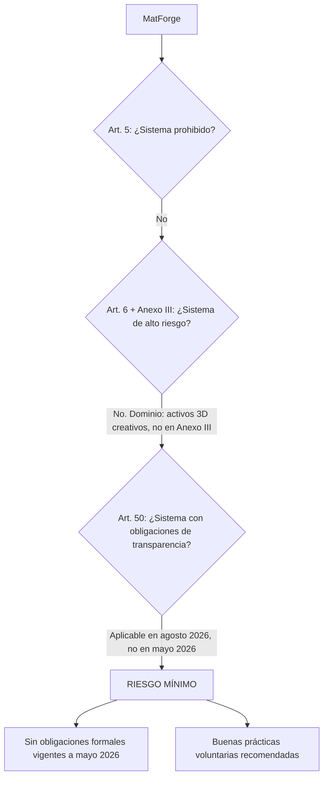

# INFORME TÉCNICO-LEGAL — MatForge
## Análisis de implicaciones legales en el contexto del Reglamento UE 2024/1689 y del régimen de propiedad intelectual europeo

**Proyecto**: MatForge — Sistema de predicción de mapas PBR mediante deep learning
**Contexto**: Proyecto de Investigación universitario (PI), aplicación Streamlit local, usuario único
**Fecha del análisis**: mayo de 2026
**Nota preliminar**: El presente informe tiene carácter informativo y académico. No constituye asesoramiento jurídico profesional. Las cuestiones que requieren opinión legal vinculante se señalan explícitamente a lo largo del texto.

---

## 1. Resumen ejecutivo

MatForge es un sistema de predicción de mapas de materiales PBR (Normal, Roughness, Metallic) que combina cuatro componentes de modelos de aprendizaje profundo —PVT-v2-B1, DINOv2-small, Real-ESRGAN y un clasificador KNN— entrenado sobre el dataset MatSynth. La aplicación se ejecuta localmente, sin despliegue en la nube, en un contexto de Proyecto de Investigación universitario.

El análisis legal identifica las siguientes conclusiones principales:

**Licencias**: todos los componentes de código y pesos preentrenados operan bajo licencias permisivas (Apache 2.0 y BSD-3-Clause) sin restricciones de uso no comercial. MatSynth opera bajo CC0 y CC-BY, ambas permisivas, sin cláusulas NC ni SA. El único punto de atención es la advertencia explícita del autor de timm sobre la licencia no comercial de ImageNet-1K, que afecta a los pesos preentrenados de PVT-v2-B1 en escenarios de distribución pública o uso comercial.

**AI Act**: MatForge se clasifica como sistema de riesgo mínimo bajo el Reglamento UE 2024/1689. En su configuración actual (entrega académica, uso local, sin puesta en el mercado), activa la exención del Art. 2(6) para investigación científica, que excluye el sistema del ámbito de aplicación del Reglamento. Si el sistema fuera distribuido públicamente en el futuro, seguiría siendo de riesgo mínimo y estaría sujeto únicamente a buenas prácticas voluntarias, con la excepción del Art. 50 (transparencia de contenido generado por IA), cuya aplicabilidad comienza en agosto de 2026.

**Derechos sobre outputs**: conforme al marco europeo de derecho de autor, los mapas PBR generados de forma autónoma por MatForge no son susceptibles de protección por derechos de autor en ausencia de elecciones creativas humanas suficientes. Los outputs se sitúan en el dominio público efectivo desde el momento de su generación.

**Acción prioritaria**: incluir metadatos XMP de procedencia en los archivos PNG/EXR generados, identificar explícitamente el origen de IA en el README y la interfaz, y garantizar la atribución completa de todos los componentes licenciados.

### Tabla de acciones requeridas (ordenadas por prioridad)

| Prioridad | Acción | Módulo afectado | Base legal |
|---|---|---|---|
| 1 | Incluir aviso de licencia BSD-3-Clause de Real-ESRGAN en README y docs | `src/sr.py`, README | BSD-3-Clause, cláusula 1 y 2 |
| 2 | Incluir aviso de licencia Apache 2.0 de timm/PVT-v2-B1 en README | `src/models.py`, README | Apache 2.0, §4 |
| 3 | Incluir aviso de licencia Apache 2.0 de DINOv2 en README | `src/classifier.py`, README | Apache 2.0, §4 |
| 4 | Incluir atribución a MatSynth (CC-BY) en la memoria del PI y README | Memoria, README | CC BY 4.0, §3(a) |
| 5 | Documentar la exención académica (Art. 2(6) AI Act) en la memoria del PI | Memoria del PI | Reg. UE 2024/1689, Art. 2(6) |
| 6 | Añadir metadatos XMP de procedencia en archivos PNG/EXR generados | `src/export.py` | Buena práctica; Art. 50 AI Act (vigente agosto 2026) |
| 7 | Advertir al usuario en la UI que los outputs son generados por IA | `src/ui_components.py` | Buena práctica; Art. 50 AI Act (vigente agosto 2026) |
| 8 | Verificar con asesor legal la compatibilidad de pesos PVT-v2-B1 para uso comercial | `checkpoints/matforge/` | Advertencia ImageNet de timm |
| 9 | No distribuir el checkpoint `best_gan.pt` en releases públicos sin revisión legal previa | `checkpoints/matforge/` | Advertencia ImageNet de timm |

---

## 2. Licencias de componentes y modelos

### 2.1 PVT-v2-B1 — Encoder jerárquico (via timm 1.0.25)

**Licencia del código timm**: Apache 2.0. El repositorio oficial `huggingface/pytorch-image-models` declara explícitamente que todo el código está bajo Apache 2.0, con esfuerzo activo del autor por evitar conflictos GPL/LGPL. El archivo `timm/models/pvt_v2.py` incluye en los metadatos de configuración del modelo el campo `'license': 'apache-2.0'` para todas las variantes de PVT-v2, incluyendo `pvt_v2_b1.in1k` [fuente: github.com/huggingface/pytorch-image-models, archivo pvt_v2.py verificado].

**Licencia de los pesos preentrenados**: este es el punto de mayor complejidad del análisis. El autor original de timm (Ross Wightman) advierte explícitamente en el README del repositorio: *"So far all of the pretrained weights available here are pretrained on ImageNet with a select few that have some additional pretraining. ImageNet was released for non-commercial research purposes only. It's not clear what the implications of that are for the use of pretrained weights from that dataset. Any models I have trained with ImageNet are done for research purposes and one should assume that the original dataset license applies to the weights"* [fuente verificada: github.com/rwightman/timm]. Esta advertencia es explícita y reconoce incertidumbre jurídica no resuelta.

Los pesos de PVT-v2-B1 disponibles en timm 1.0.25 fueron entrenados en ImageNet-1K. La licencia de ImageNet-1K (image-net.org) restringe el uso a propósitos de investigación no comercial. Sin embargo, existe un debate académico y jurídico no resuelto sobre si los pesos de un modelo entrenado sobre un dataset con restricciones no comerciales heredan esas restricciones, dado que los pesos no contienen datos del dataset en formato reproducible sino parámetros estadísticos derivados.

**Compatibilidad con uso académico**: sí, sin restricción. El uso de estos pesos en el marco de un PI universitario es coherente con el propósito de investigación no comercial que ImageNet-1K permite.

**Compatibilidad con distribución pública o uso comercial de outputs**: incierta. Requiere consulta con un abogado especializado en propiedad intelectual antes de cualquier distribución pública del checkpoint `best_gan.pt` (que contiene pesos derivados de los pesos preentrenados de PVT-v2-B1) o de aplicaciones comerciales.

**Obligaciones de atribución**: Apache 2.0 requiere conservar los avisos de copyright en todas las redistribuciones. En la práctica: citar timm y PVT-v2 en README y en la memoria del PI.

### 2.2 DINOv2-small de Meta AI (ViT-S/14)

**Licencia actual**: Apache License 2.0, aplicable tanto al código como a los pesos del modelo. El repositorio oficial `facebookresearch/dinov2` declara explícitamente: *"DINOv2 code and model weights are released under the Apache License 2.0"* [fuente: github.com/facebookresearch/dinov2, README y LICENSE verificados]. El MODEL_CARD.md del repositorio confirma: *"License: Apache License 2.0"* [fuente verificada].

**Historial relevante**: el modelo fue publicado inicialmente bajo CC-BY-NC 4.0 en junio de 2023, lo que generó peticiones de la comunidad para migrar a una licencia más permisiva. Meta cambió posteriormente la licencia a Apache 2.0 [confirmado mediante issue #128 y commit 81b2b64 del repositorio]. El paper original (arXiv:2304.07193v2) también confirma: *"The code and pretrained models are made available under Apache 2.0 license"* [fuente: arxiv.org/html/2304.07193v2, verificado].

**Compatibilidad con uso académico**: total. Apache 2.0 no impone restricciones de uso.

**Compatibilidad con distribución pública y uso comercial**: total. Apache 2.0 permite uso comercial, modificación, distribución y sublicencia con conservación de avisos de copyright.

**Obligaciones de atribución**: conservar el aviso de copyright de Meta AI en toda redistribución del código. Citar el paper de DINOv2 en la memoria del PI (se recomienda como buena práctica académica, no como obligación de licencia).

### 2.3 Real-ESRGAN — Módulo de super-resolución

**Licencia del código**: BSD 3-Clause License, Copyright (c) 2021, Xintao Wang. El texto completo del archivo LICENSE del repositorio `xinntao/Real-ESRGAN` ha sido verificado directamente: incluye las tres cláusulas estándar BSD [fuente: github.com/xinntao/Real-ESRGAN/blob/master/LICENSE]. El paquete PyPI `realesrgan` v0.3.0 también declara `License: BSD-3-Clause License` en su metadata [fuente verificada].

**Licencia de los checkpoints**: los checkpoints oficiales (`RealESRGAN_x4plus.pth`, distribuido en las releases del repositorio) están cubiertos por la misma licencia BSD-3-Clause del repositorio. No se ha identificado ninguna licencia adicional o separada para los pesos. El repositorio HuggingFace `nateraw/real-esrgan` que aloja los mismos checkpoints los etiqueta también como `license: bsd-3-clause` [fuente verificada].

**Checkpoint `sr_ft_phase1_best_lpips.pt`**: este checkpoint es un derivado de `RealESRGAN_x4plus.pth`, producido mediante fine-tuning sobre MatSynth. Como obra derivada, hereda la licencia BSD-3-Clause del checkpoint base. BSD-3-Clause permite la creación y redistribución de obras derivadas con conservación del aviso de copyright original.

**Compatibilidad con uso académico**: total. BSD-3-Clause no impone restricciones de uso.

**Compatibilidad con distribución pública y uso comercial**: total, con la obligación de incluir el aviso de copyright de Xintao Wang en la documentación.

**Obligaciones de atribución**: (1) conservar el aviso de copyright de Xintao Wang en cualquier redistribución; (2) reproducir el texto de la licencia BSD-3-Clause en la documentación del software distribuido; (3) no utilizar el nombre "Real-ESRGAN" ni el de sus contribuidores para avalar productos derivados sin permiso previo escrito.

### 2.4 Dataset MatSynth

**Licencias de los datos**: MatSynth es una colección curada de materiales procedentes de múltiples fuentes en línea, todas operando bajo el marco CC0 (dominio público) y CC-BY (Creative Commons Attribution). Fuentes CC0: AmbientCG, CGBookCase, PolyHaven, ShareTextures, TextureCan. Fuentes CC-BY: materiales del artista Julio Sillet [fuente: HuggingFace gvecchio/MatSynth, README verificado directamente].

**Lo que estas licencias permiten**:
- **CC0**: renuncia total de derechos. Uso sin restricciones, incluyendo comercial, sin obligación de atribución (aunque se recomienda por buena práctica científica).
- **CC-BY**: uso libre incluyendo comercial, con obligación de atribución al autor original. No hay cláusulas NC (no comercial), SA (share-alike), o ND (no derivadas).

**Compatibilidad con entrenamiento de modelos**: completa. CC0 y CC-BY permiten explícitamente el uso del dataset para entrenar modelos de aprendizaje automático, incluyendo usos derivados.

**Efecto sobre la distribución de los pesos del modelo**: las licencias CC0 y CC-BY no imponen ningún requisito de share-alike sobre obras derivadas. El modelo entrenado sobre MatSynth puede distribuirse bajo cualquier licencia elegida por el desarrollador, con la única obligación de atribuir el dataset en la documentación cuando los materiales CC-BY estén involucrados. Esto difiere radicalmente de una hipotética licencia CC-BY-SA o CC-BY-NC, que podría restringir la distribución o el uso comercial.

**Obligaciones de atribución en la memoria del PI**: incluir la cita del paper de MatSynth [G. Vecchio y V. Deschaintre, CVPR 2024] y la mención al dataset en la sección de datos o metodología.

**Restricciones sobre el uso comercial de los outputs**: ninguna, derivadas de MatSynth. Los outputs del modelo (mapas PBR) no están sujetos a las licencias CC de los datos de entrenamiento.

### 2.5 timm como librería

**Licencia**: Apache 2.0 (código). Verificado en el repositorio oficial y en múltiples fuentes secundarias.

**Obligaciones de atribución al distribuir código**: conservar el aviso de copyright en redistribuciones. En la práctica, incluir la mención de timm en el README del proyecto y en la memoria del PI.

**Advertencia sobre pesos de ImageNet**: reproducida en §2.1. Se aplica exclusivamente a los pesos de PVT-v2-B1 descargados automáticamente por timm, no a la librería en sí.

---

## 3. Reglamento de Inteligencia Artificial de la UE (AI Act)

### 3.1 Marco normativo y estado de aplicabilidad a mayo de 2026

El Reglamento (UE) 2024/1689, denominado AI Act, fue publicado en el Diario Oficial de la UE el 12 de julio de 2024 y entró en vigor el 1 de agosto de 2024. Su aplicabilidad es escalonada [fuente verificada: digital-strategy.ec.europa.eu]:

| Fecha | Disposiciones que entran en aplicación |
|---|---|
| 2 de febrero de 2025 | Prohibiciones (Art. 5) y obligaciones de alfabetización en IA |
| 2 de agosto de 2025 | Reglas de gobernanza y obligaciones para modelos GPAI (Arts. 51-56) |
| 2 de agosto de 2026 | Obligaciones para sistemas de alto riesgo; obligaciones de transparencia (Art. 50) |
| 2 de agosto de 2027 | Sistemas de alto riesgo integrados en productos regulados (Anexo I) |

A mayo de 2026, fecha del proyecto MatForge, están en vigor las prohibiciones del Art. 5 y las reglas de gobernanza GPAI. Las obligaciones del Art. 50 (transparencia de contenido generado por IA) entrarán en vigor en agosto de 2026, tres meses después de la entrega del PI.

### 3.2 Clasificación de riesgo de MatForge

El AI Act establece cuatro niveles de riesgo: inaceptable (Art. 5), alto (Art. 6 + Anexo III), limitado (Art. 50) y mínimo.

**Análisis por niveles**:

**Riesgo inaceptable (Art. 5)**: no aplicable. MatForge no realiza ninguna de las prácticas prohibidas: no manipula el comportamiento humano de forma subliminal, no explota vulnerabilidades de grupos vulnerables, no constituye un sistema de puntuación social (social scoring), no es un sistema de identificación biométrica en tiempo real, no lleva a cabo predicciones de criminalidad, ni implica emoción o scraping de reconocimiento facial.

**Riesgo alto (Art. 6 + Anexo III)**: no aplicable. El Anexo III enumera taxativamente los dominios de aplicación de sistemas de alto riesgo: infraestructura crítica, educación, empleo, servicios esenciales, aplicación de ley, migración, administración de justicia, procesos democráticos, y componentes de seguridad de productos bajo la legislación de la Unión. MatForge predice mapas de materiales para uso en motores de renderizado 3D. Su dominio de aplicación es la producción de activos creativos digitales, que no está incluido en ninguna categoría del Anexo III.

**Riesgo limitado (Art. 50)**: parcialmente aplicable en el futuro. El Art. 50 afecta, entre otros, a sistemas de IA que generan contenido de imagen. Sin embargo, a mayo de 2026, este artículo no está aún en vigor. Se analiza en detalle en §5.

**Riesgo mínimo**: esta es la clasificación correcta para MatForge. Los sistemas de riesgo mínimo son aquellos que no caen en ninguna de las categorías anteriores y no tienen impacto significativo sobre los derechos, la seguridad o los intereses de las personas. Spam filters, videojuegos con IA, y —por extensión directa— herramientas creativas de asistencia técnica como MatForge, se sitúan en esta categoría [fuente: osha.europa.eu/en/legislation/directive/regulation-20241689eu; euaiact.eu/high-level-summary/].



### 3.3 Exención académica — Art. 2(6)

El Art. 2(6) del AI Act establece: *"This Regulation does not apply to AI systems or AI models, including their output, specifically developed and put into service for the sole purpose of scientific research and development"* [fuente: ai-act-service-desk.ec.europa.eu/en/ai-act/article-2; artificialintelligenceact.com/article-2-scope/].

MatForge cumple los criterios para activar esta exención en su configuración actual:
- Fue desarrollado específicamente para un Proyecto de Investigación universitario (PI).
- Su puesta en servicio es local y única (un único usuario, sin acceso externo).
- No ha sido colocado en el mercado ni distribuido públicamente.
- Su propósito es la investigación académica en el dominio de la predicción de materiales PBR.

La literatura jurídica especializada advierte que esta exención tiene un alcance estricto y depende críticamente de la interpretación del término *"for the sole purpose"* [fuente: academic.oup.com/grurint, "In Search of the Lost Research Exemption", GRUR International 2025; nature.com/articles/s41746-025-02263-0, npj Digital Medicine 2026]. La exención se pierde si el sistema se "pone en servicio" para finalidades distintas de la investigación científica exclusiva. Esto implica que **si MatForge se distribuyera públicamente o se utilizara en producción comercial, la exención dejaría de aplicarse** y el sistema quedaría sujeto al Reglamento, aunque seguiría siendo de riesgo mínimo.

### 3.4 MatForge como sistema GPAI — análisis de exclusión

Los modelos de propósito general (GPAI, Arts. 51-56) están sujetos a obligaciones adicionales (documentación, transparencia de datos de entrenamiento, política de derechos de autor). MatForge no es un modelo GPAI: está diseñado específicamente para una tarea única y delimitada (predicción de mapas PBR a partir de imágenes de materiales de superficie). No es un modelo de uso general ni está diseñado para realizar una amplia gama de tareas distintas. Las reglas GPAI no se aplican a MatForge.

### 3.5 Obligaciones vigentes a mayo de 2026

Dado que MatForge se clasifica como sistema de riesgo mínimo y activa la exención del Art. 2(6):

- **Obligaciones formales vigentes**: ninguna derivada del AI Act.
- **Prohibiciones del Art. 5 (vigentes desde febrero 2025)**: no aplicables a MatForge.
- **Buenas prácticas voluntarias recomendadas**: transparencia sobre el origen de IA de los outputs, documentación técnica del sistema, atribución de componentes de terceros.

---

## 4. Derechos sobre los outputs generados

### 4.1 Marco europeo de derecho de autor en relación con contenido generado por IA

El marco europeo de derecho de autor no establece reglas específicas sobre la autoría de contenido generado de forma autónoma por IA. Las directivas armonizadoras relevantes —Directiva 2001/29/CE (InfoSoc), Directiva 2019/790/UE (DSM), Directiva 96/9/CE (bases de datos)— no contemplan la IA como sujeto de derechos ni definen el tratamiento de obras generadas sin intervención creativa humana directa.

La jurisprudencia del Tribunal de Justicia de la Unión Europea (TJUE) ha desarrollado, a través de una serie de sentencias (Infopaq, Painer, Football Dataco, Cofemel), el criterio de la "elección creativa libre" como requisito de originalidad para la protección por derechos de autor. En *Cofemel* (C-683/17), el TJUE estableció que para que una obra sea original, basta con que refleje *"la personalidad de su autor, como expresión de sus elecciones libres y creativas"*. En *Painer* (C-145/10), confirmó que el autor imprime su *"toque personal"* mediante elecciones creativas en el proceso de creación. Este enfoque es radicalmente antropocéntrico: la originalidad se predica de las elecciones de un ser humano, no de un proceso computacional [fuente: link.springer.com, "Copyright and Artificial Creation", IIC 2021].

El Parlamento Europeo reafirmó en su informe de 2026 sobre derechos de autor e IA generativa que *"el contenido generado por IA no debe ser elegible para protección por derechos de autor"* [fuente: europarl.europa.eu/doceo/document/A-10-2026-0019_EN.html, informe A10-0019/2026, verificado]. El estudio del EUIPO de mayo de 2025 (*"The Development of Generative Artificial Intelligence from a Copyright Perspective"*) confirma que la ausencia de un marco armonizado europeo específico deja el análisis sujeto a la doctrina del TJUE sobre originalidad, que requiere intervención creativa humana [fuente: ecta.org/euipo-releases-study].

### 4.2 Titularidad de los mapas PBR producidos por MatForge

Los mapas Normal, Roughness y Metallic generados por MatForge son producidos de forma autónoma por el modelo a partir de una imagen de entrada del usuario. El proceso de generación es enteramente computacional: el usuario no realiza elecciones creativas sobre la estructura, composición, valores o distribución de los mapas resultantes. El usuario aporta únicamente la imagen de entrada y, en su caso, parámetros de ajuste (gain/offset).

Aplicando el criterio jurídico europeo de "elección creativa libre", los mapas PBR generados por MatForge no son susceptibles de protección por derechos de autor en su forma estándar de uso. No existe una elección creativa humana directa en el resultado; el modelo transforma de forma determinista (o estocástica, pero no creativa en sentido jurídico) la imagen de entrada en los mapas de salida.

Las tres posiciones jurídicas posibles se analizan a continuación:

**Posición 1 — Dominio público efectivo**: los outputs no son protegibles por derechos de autor. En ausencia de protección, el contenido puede ser usado libremente por cualquier persona, incluido el propio usuario. Esta es la posición más coherente con el marco europeo actual y con el informe del Parlamento Europeo de 2026. Es la posición más segura para el proyecto.

**Posición 2 — Derechos del usuario**: si se argumentara que el usuario ejerció elecciones creativas suficientes al seleccionar la imagen de entrada, al ajustar los parámetros de la herramienta o al integrar los outputs en un contexto más amplio, podría sostenerse que el usuario ostenta derechos sobre el conjunto. Esta posición es más sólida cuanto mayor sea la contribución creativa del usuario en el proceso global. En el caso estándar de MatForge (imagen de entrada, inferencia automática), esta contribución es mínima o inexistente para los mapas en sí.

**Posición 3 — Derechos del desarrollador**: no tiene fundamento en el derecho europeo. El desarrollador del sistema no ejerce elecciones creativas sobre cada output generado. El TJUE ha confirmado que el desarrollador de una herramienta no ostenta derechos sobre los productos que esa herramienta genera para terceros.

**Recomendación del informe**: adoptar la Posición 1 en la documentación del proyecto. Los outputs de MatForge se sitúan en el dominio público efectivo. Informar explícitamente al usuario de esta circunstancia en la interfaz y en el README.

### 4.3 Implicaciones para el artista 3D usuario de la herramienta

El artista 3D que utiliza MatForge puede usar los outputs (mapas PBR) libremente, incluyendo en proyectos comerciales, dado que:

1. Las licencias de todos los componentes del sistema (Apache 2.0, BSD-3-Clause) no restringen el uso comercial de los outputs producidos con el software.
2. Las licencias del dataset MatSynth (CC0 y CC-BY) no imponen restricciones de uso no comercial sobre los modelos entrenados ni sobre los outputs de esos modelos.
3. Los outputs en sí no son objeto de derechos de autor conforme al marco europeo (Posición 1), por lo que no existe un titular de esos derechos que pueda imponer restricciones.

La única excepción relevante es la advertencia sobre los pesos PVT-v2-B1 e ImageNet-1K (§2.1). Si se interpretara que esa restricción se extiende a los outputs del modelo, el uso comercial de los mapas generados por MatForge estaría condicionado. Esta interpretación es controvertida y requiere asesoramiento jurídico especializado antes de cualquier uso comercial a escala.

### 4.4 Diferencia entre uso académico y uso comercial

| Aspecto | Uso académico (PI) | Uso comercial potencial |
|---|---|---|
| Componentes de software | Sin restricción | Sin restricción (Apache 2.0, BSD-3-Clause) |
| Dataset MatSynth | Sin restricción | Sin restricción (CC0 + CC-BY) |
| Pesos PVT-v2-B1 | Coherente con propósito ImageNet | Incertidumbre jurídica — consulta legal recomendada |
| Outputs generados | Dominio público efectivo | Dominio público efectivo |
| AI Act | Exención Art. 2(6) activa | Sin exención; riesgo mínimo; Art. 50 aplicable desde agosto 2026 |

---

## 5. Obligaciones de transparencia y etiquetado

### 5.1 Estado de aplicabilidad del Art. 50 AI Act a mayo de 2026

El Artículo 50 del Reglamento (UE) 2024/1689 establece obligaciones de transparencia para proveedores y desplegadores de determinados sistemas de IA, incluyendo sistemas que generan contenido de imagen. Estas obligaciones entran en vigor el **2 de agosto de 2026** —24 meses después de la entrada en vigor del Reglamento— y no están en vigor en mayo de 2026, fecha de entrega del PI [fuentes verificadas: digital-strategy.ec.europa.eu; ccianet.org/transparency-obligations-art50; jonesday.com; twobirds.com].

En paralelo, la Comisión Europea inició en noviembre de 2025 el proceso de elaboración del Código de Práctica sobre Transparencia del Contenido Generado por IA, cuyo segundo borrador fue publicado el 3 de marzo de 2026 y cuya versión final se espera para junio de 2026 [fuente: hsfkramer.com, marzo 2026]. Este Código es voluntario para sus signatarios, pero establece el estándar de referencia que los reguladores utilizarán para evaluar el cumplimiento del Art. 50.

**Conclusión para MatForge**: el Art. 50 no es formalmente aplicable al proyecto en su estado actual (mayo 2026, entrega académica). Su implementación es, sin embargo, una buena práctica recomendada y una obligación futura si el sistema se distribuyera públicamente después de agosto de 2026.

### 5.2 Obligaciones del Art. 50 relevantes para MatForge (aplicables desde agosto 2026)

El Art. 50(2) establece que los proveedores de sistemas de IA que generan contenido sintético de imagen deben garantizar que sus outputs estén marcados en formato legible por máquina e identificables como artificialmente generados. La obligación recae sobre el **proveedor** (el desarrollador de MatForge), no sobre el usuario final [fuente: ai-act-service-desk.ec.europa.eu/en/ai-act/article-50].

MatForge genera mapas de imagen (PNG/EXR). La cuestión de si estos mapas —que no son imágenes fotorrealistas de escenas ni contenido informativo dirigido al público— están dentro del ámbito de aplicación del Art. 50(2) es debatible. El Art. 50(4) y (5) se aplican específicamente a deepfakes y a textos de IA dirigidos al público para informar sobre asuntos de interés público; ninguno de estos supuestos se corresponde con los outputs de MatForge. Sin embargo, el Art. 50(2) tiene un alcance más amplio al referirse genéricamente a contenido de imagen generado por IA. La prudencia recomienda adoptar la interpretación más conservadora e implementar metadatos de procedencia como medida preventiva.

### 5.3 Estándares técnicos: C2PA, XMP e IPTC 2025.1

**C2PA (Coalition for Content Provenance and Authenticity)**: estándar técnico abierto mantenido bajo la Linux Foundation, actualmente en versión 2.2 (mayo 2025) con versión 2.4 en desarrollo activo. La especificación C2PA define un manifiesto de procedencia criptográficamente firmado que puede incrustarse en archivos PNG, JPEG, TIFF y otros formatos. El manifiesto contiene assertions estructuradas: quién creó el contenido, con qué herramienta, cuándo, y si fue generado por IA. El Código de Práctica de la Comisión Europea sobre transparencia de contenido generado por IA señala C2PA como el mecanismo técnico de referencia para la implementación de metadatos legibles por máquina [fuente: spec.c2pa.org v2.2; hsfkramer.com, marzo 2026; c2paviewer.com].

**Limitación práctica de C2PA para MatForge**: C2PA requiere firma criptográfica con certificados X.509 y acceso a una autoridad de timestamping. Esta infraestructura está diseñada para flujos de producción a escala. Su implementación en una aplicación Streamlit local de un solo usuario, sin servidor de firma, está fuera del alcance práctico del proyecto actual. C2PA es la solución recomendada para una distribución pública futura.

**XMP (Extensible Metadata Platform)**: estándar de metadatos basado en XML/RDF, desarrollado por Adobe y ampliamente soportado por todos los formatos de imagen incluyendo PNG. Permite incrustar metadatos estructurados sin requisito de firma criptográfica. Es la solución técnicamente viable para MatForge en su estado actual.

**IPTC 2025.1**: extensión del estándar IPTC Photo Metadata que introduce cuatro campos XMP específicos para contenido generado por IA, alojados en el namespace `Iptc4xmpExt` [fuente: numonic.ai, febrero 2026]:
- `AISystemUsed`: nombre del sistema de IA utilizado.
- `AISystemVersionUsed`: versión del sistema.
- `AICreatedContent` (y variantes): indica si el contenido fue generado o asistido por IA.
- `AIDataSource`: fuente de los datos de entrenamiento.

### 5.4 Recomendación técnica: metadatos a incluir en los archivos PNG/EXR de MatForge

La implementación recomendada para `src/export.py` es la incrustación de un bloque XMP en cada archivo PNG generado, utilizando los campos estándar de los namespaces `xmp`, `dc` e `Iptc4xmpExt`. Los archivos EXR tienen soporte limitado de metadatos estándar; se recomienda incrustar los metadatos en un campo de atributo de texto personalizado dentro del archivo EXR, siguiendo la convención de OpenEXR.

**Campos XMP recomendados para archivos PNG**:

```xml
<?xpacket begin='' id='W5M0MpCehiHzreSzNTczkc9d'?>
<x:xmpmeta xmlns:x='adobe:ns:meta/'>
  <rdf:RDF xmlns:rdf='http://www.w3.org/1999/02/22-rdf-syntax-ns#'>
    <rdf:Description rdf:about=''
      xmlns:xmp='http://ns.adobe.com/xap/1.0/'
      xmlns:dc='http://purl.org/dc/elements/1.1/'
      xmlns:Iptc4xmpExt='http://iptc.org/std/Iptc4xmpExt/2008-02-29/'>
      <!-- Herramienta de creación -->
      <xmp:CreatorTool>MatForge v1.0 (PVT-v2-B1 + FPN + Real-ESRGAN)</xmp:CreatorTool>
      <!-- Fecha de creación -->
      <xmp:CreateDate>2026-05-09T...</xmp:CreateDate>
      <!-- Descripción del contenido -->
      <dc:description>
        <rdf:Alt><rdf:li xml:lang='x-default'>
          PBR material map (Normal/Roughness/Metallic) generated by MatForge AI system
          from a single RGB surface image. Academic research project.
        </rdf:li></rdf:Alt>
      </dc:description>
      <!-- Derechos -->
      <dc:rights>
        <rdf:Alt><rdf:li xml:lang='x-default'>
          AI-generated content. No copyright claimed. Public domain.
        </rdf:li></rdf:Alt>
      </dc:rights>
      <!-- IPTC 2025.1: sistema de IA -->
      <Iptc4xmpExt:AISystemUsed>MatForge 1.0</Iptc4xmpExt:AISystemUsed>
    </rdf:Description>
  </rdf:RDF>
</x:xmpmeta>
<?xpacket end='w'?>
```

**Implementación en Python** (compatible con Pillow y la pila de dependencias de MatForge):

```python
import io
from PIL import Image

def add_xmp_metadata(img: Image.Image, map_type: str, asset_name: str) -> Image.Image:
    """Embed XMP provenance metadata into a PNG image."""
    xmp_data = f"""<?xpacket begin='\ufeff' id='W5M0MpCehiHzreSzNTczkc9d'?>
<x:xmpmeta xmlns:x='adobe:ns:meta/'>
  <rdf:RDF xmlns:rdf='http://www.w3.org/1999/02/22-rdf-syntax-ns#'>
    <rdf:Description rdf:about=''
      xmlns:xmp='http://ns.adobe.com/xap/1.0/'
      xmlns:dc='http://purl.org/dc/elements/1.1/'
      xmlns:Iptc4xmpExt='http://iptc.org/std/Iptc4xmpExt/2008-02-29/'>
      <xmp:CreatorTool>MatForge 1.0</xmp:CreatorTool>
      <dc:description><rdf:Alt><rdf:li xml:lang='x-default'>
        PBR {map_type} map for asset '{asset_name}'.
        Generated by MatForge AI system (PVT-v2-B1 encoder, FPN decoder).
        Academic research project. AI-generated content.
      </rdf:li></rdf:Alt></dc:description>
      <dc:rights><rdf:Alt><rdf:li xml:lang='x-default'>
        AI-generated. No copyright claimed.
      </rdf:li></rdf:Alt></dc:rights>
      <Iptc4xmpExt:AISystemUsed>MatForge 1.0</Iptc4xmpExt:AISystemUsed>
    </rdf:Description>
  </rdf:RDF>
</x:xmpmeta>
<?xpacket end='w'?>""".encode('utf-8')
    img_copy = img.copy()
    img_copy.info['XML:com.adobe.xmp'] = xmp_data
    return img_copy
```

El campo `'XML:com.adobe.xmp'` es el chunk PNG estándar para metadatos XMP y es interpretado correctamente por ExifTool, Pillow, Adobe Bridge y la mayoría de lectores XMP. Esta implementación no requiere dependencias externas adicionales más allá de Pillow, que ya forma parte de las dependencias del proyecto.

---

## 6. Uso del dataset MatSynth

### 6.1 Condiciones exactas de la licencia CC aplicable

MatSynth combina materiales bajo dos variantes de licencias CC [fuente verificada: huggingface.co/datasets/gvecchio/MatSynth]:

- **CC0 1.0 Universal (Public Domain Dedication)**: aplicable a los materiales procedentes de AmbientCG, CGBookCase, PolyHaven, ShareTextures y TextureCan. CC0 supone una renuncia total a todos los derechos de copyright y derechos conexos en la máxima medida permitida por la ley. No impone ninguna obligación al usuario, ni siquiera de atribución.

- **CC BY 4.0 (Creative Commons Attribution 4.0 International)**: aplicable a los materiales del artista Julio Sillet. Esta licencia permite el uso libre del material, incluyendo para fines comerciales, con la única condición de atribución adecuada [fuente: creativecommons.org/licenses/by/4.0/deed.en; creativecommons.org/licenses/by/4.0/legalcode.en].

No existen en MatSynth licencias CC-BY-NC, CC-BY-SA, CC-BY-NC-SA, CC-BY-ND ni CC-BY-NC-ND. Esta es una distinción crítica: la ausencia de cláusulas NC y SA elimina las dos restricciones más habituales en datasets de este tipo.

### 6.2 Compatibilidad del uso académico de MatSynth

El uso de MatSynth para entrenar MatForge en el contexto de un PI universitario es plenamente compatible con CC0 y CC-BY 4.0. Ambas licencias permiten explícitamente el uso del material con fines de investigación, incluyendo el entrenamiento de modelos de aprendizaje automático.

Creative Commons publicó en mayo de 2025 un documento específico sobre el uso de obras con licencias CC para entrenamiento de IA que clarifica este punto: la obligación de atribución (BY) en el contexto del entrenamiento de modelos puede cumplirse mediante una referencia al dataset fuente, sin necesidad de atribuir cada obra individualmente [fuente: creativecommons.org/using-cc-licensed-works-for-ai-training-2/].

### 6.3 Efecto de CC-BY sobre el modelo entrenado y sus outputs

La posición de Creative Commons sobre el efecto viral de las licencias en el contexto del entrenamiento de IA es la siguiente [fuente verificada: creativecommons.org/wp-content/uploads/2025/05/Using-CC-licensed-Works-for-AI-Training.pdf]:

- Las licencias CC BY y CC0 **no imponen obligaciones ShareAlike** sobre obras derivadas. El modelo entrenado puede distribuirse bajo cualquier licencia.
- Las obligaciones de atribución BY se activan únicamente cuando el modelo o sus outputs se comparten públicamente **y** cuando el output contiene expresiones sustancialmente similares a obras CC-BY del dataset (es decir, cuando el modelo ha "memorizado" contenido). En el caso de MatForge —que aprende representaciones estadísticas de materiales de superficie, no copia texturas específicas— la probabilidad de memorización de materiales individuales es baja, aunque no eliminable en abstracto.
- Los outputs del modelo (mapas PBR) no heredan automáticamente la licencia CC-BY de los datos de entrenamiento. Un output que no sea copia ni adaptación de una obra protegida específica no está sujeto a las condiciones BY [fuente: shujisado.org, febrero 2026; creativecommons.org].

### 6.4 Obligaciones de atribución en la memoria del PI

La licencia CC-BY 4.0 requiere que, al compartir el material o obras derivadas, se proporcione atribución adecuada al licenciante. En el contexto de un trabajo académico, esto se satisface mediante la cita bibliográfica del dataset en la memoria del PI.

**Texto de atribución recomendado para la memoria del PI**:

> El modelo MatForge fue entrenado sobre el dataset MatSynth [1], distribuido bajo licencias CC0 y CC-BY 4.0. Los materiales bajo licencia CC-BY proceden del artista Julio Sillet. Los materiales bajo licencia CC0 proceden de AmbientCG, CGBookCase, PolyHaven, ShareTextures y TextureCan.

**Cita IEEE recomendada**:
> G. Vecchio y V. Deschaintre, "MatSynth: A Modern PBR Materials Dataset," en *Proc. IEEE/CVF Conf. Comput. Vis. Pattern Recog. (CVPR)*, 2024.

### 6.5 Restricciones sobre distribución del checkpoint `best_gan.pt`

Desde la perspectiva exclusiva de MatSynth: ninguna. CC0 y CC-BY 4.0 no imponen restricciones SA sobre modelos derivados; el checkpoint puede distribuirse bajo cualquier licencia elegida por el desarrollador.

La restricción relevante sobre la distribución del checkpoint procede de la advertencia sobre los pesos preentrenados de PVT-v2-B1 e ImageNet-1K, analizada en §2.1, no de MatSynth.

---

## 7. Consideraciones sobre distribución y despliegue

### 7.1 Situación actual: entrega académica

En su estado actual, MatForge es un sistema académico de usuario único que no ha sido colocado en el mercado ni puesto en servicio públicamente. La distribución del código fuente a un tribunal académico para evaluación del PI no constituye "puesta en el mercado" en el sentido del AI Act ni activa las obligaciones de los licencias de software más allá de lo estrictamente requerido para uso interno. La exención del Art. 2(6) del AI Act es plenamente aplicable.

### 7.2 Distribución del código fuente en GitHub (repositorio privado)

El repositorio GitHub actual es privado. La distribución de código fuente a un repositorio privado de acceso restringido no activa ninguna obligación adicional de las licencias de componentes más allá de conservar los avisos de copyright en los archivos correspondientes.

**Obligaciones mínimas en el repositorio privado**:
- Incluir un archivo `NOTICES` o sección del README que liste todos los componentes de terceros con sus respectivas licencias.
- No eliminar los headers de copyright de los archivos de código fuente copiados o modificados.

### 7.3 Distribución pública (release en GitHub, PyInstaller)

Si MatForge fuera distribuido públicamente —como release de GitHub, ejecutable compilado con PyInstaller, o paquete Python— se activarían las siguientes obligaciones:

**Obligaciones de atribución por componente**:

| Componente | Licencia | Obligación en distribución pública |
|---|---|---|
| timm (código) | Apache 2.0 | Incluir aviso de copyright y texto de la licencia Apache 2.0 |
| PVT-v2-B1 (pesos) | Apache 2.0 + ⚠️ ImageNet | Incluir aviso de copyright; revisar restricción ImageNet |
| DINOv2-small | Apache 2.0 | Incluir aviso de copyright y texto de la licencia Apache 2.0 |
| Real-ESRGAN (código) | BSD-3-Clause | Incluir aviso de copyright Xintao Wang + texto BSD-3 en docs |
| `RealESRGAN_x4plus.pth` | BSD-3-Clause | Incluir aviso de copyright en docs del ejecutable |
| `sr_ft_phase1_best_lpips.pt` | BSD-3-Clause (derivado) | Ídem; atribuir checkpoint base |
| MatSynth (entrenamiento) | CC0 + CC-BY | Citar dataset en README y docs del sistema |

**Implicación del Art. 50 AI Act para distribución pública post-agosto 2026**: si el sistema se distribuye después del 2 de agosto de 2026, será necesario implementar marcado legible por máquina en los outputs generados y, potencialmente, informar al usuario de que el contenido es generado por IA. Los metadatos XMP descritos en §5.4 constituyen la solución técnica más accesible.

### 7.4 Diferencia entre distribución académica y distribución pública

| Aspecto | Distribución académica (entrega PI) | Distribución pública (GitHub release) |
|---|---|---|
| AI Act aplicable | No (Art. 2(6) exención) | Sí, si post-agosto 2026; riesgo mínimo |
| Atribución de componentes | Recomendada en memoria | Obligatoria en README y NOTICES |
| Art. 50 (transparencia outputs) | No aplicable (mayo 2026) | Aplicable si post-agosto 2026 |
| Checkpoint `best_gan.pt` | Sin restricción (uso académico) | Verificar restricción ImageNet |
| Metadatos XMP en outputs | Buena práctica | Buena práctica; preparatorio para Art. 50 |
| Licencia del proyecto propio | A criterio del desarrollador | A criterio del desarrollador |

### 7.5 Distribución del checkpoint `best_gan.pt` como derivado de PVT-v2-B1

El checkpoint `best_gan.pt` contiene pesos resultantes del fine-tuning de una arquitectura cuyo encoder (PVT-v2-B1) fue preentrenado en ImageNet-1K. La distribución pública de este checkpoint es el punto de mayor incertidumbre jurídica del proyecto. La advertencia del autor de timm sobre la licencia no comercial de ImageNet se refiere a los pesos del encoder base; los pesos del FPN decoder, las refine heads y el discriminador GAN son originales y no están afectados por esta restricción.

La pregunta jurídica no resuelta es si el fine-tuning transforma suficientemente los pesos del encoder como para romper la cadena de derivación que conecta `best_gan.pt` con los pesos de ImageNet. Esta es una cuestión técnico-jurídica que no tiene respuesta consolidada en la doctrina ni en la jurisprudencia europea, y que **requiere consulta con un abogado especializado antes de cualquier distribución pública del checkpoint**.

---

## 8. Tabla de decisiones de implementación

La siguiente tabla recoge las acciones concretas que deben aplicarse en el código y la documentación de la aplicación MatForge, ordenadas por prioridad y ancladas en su base legal específica.

| Prioridad | Acción | Módulo afectado | Base legal | Plazo |
|---|---|---|---|---|
| **1** | Añadir sección `NOTICES` o equivalente en README con avisos de copyright de Real-ESRGAN (BSD-3-Clause, Xintao Wang), timm/PVT-v2-B1 (Apache 2.0), DINOv2 (Apache 2.0, Meta AI) | README.md | BSD-3-Clause cláusulas 1-2; Apache 2.0 §4 | Antes de entrega del PI |
| **2** | Incluir atribución a MatSynth (cita CVPR 2024) y mención de licencias CC0/CC-BY en la memoria del PI y en el README | README.md, Memoria | CC BY 4.0 §3(a) | Antes de entrega del PI |
| **3** | Añadir comentarios de licencia en cabecera de `src/sr.py` indicando dependencia de Real-ESRGAN bajo BSD-3-Clause | `src/sr.py` | BSD-3-Clause cláusula 1 | Antes de entrega del PI |
| **4** | Añadir comentarios de licencia en cabecera de `src/classifier.py` indicando uso de DINOv2 bajo Apache 2.0 | `src/classifier.py` | Apache 2.0 §4 | Antes de entrega del PI |
| **5** | Añadir comentarios de licencia en cabecera de `src/models.py` indicando uso de timm/PVT-v2-B1 bajo Apache 2.0 y advertencia sobre pesos ImageNet | `src/models.py` | Apache 2.0 §4; advertencia timm README | Antes de entrega del PI |
| **6** | Documentar en la memoria del PI que MatForge se clasifica como sistema de riesgo mínimo bajo el AI Act y activa la exención académica del Art. 2(6) del Reg. UE 2024/1689 | Memoria del PI | Reg. UE 2024/1689 Art. 2(6), 6 | Antes de entrega del PI |
| **7** | Implementar función `add_xmp_metadata()` en `src/export.py` para incrustar metadatos XMP de procedencia (campos `xmp:CreatorTool`, `dc:description`, `dc:rights`, `Iptc4xmpExt:AISystemUsed`) en todos los archivos PNG generados | `src/export.py` | Buena práctica; preparatorio Art. 50 Reg. UE 2024/1689 (vigente agosto 2026) | Recomendado antes de entrega; obligatorio si distribución pública post-agosto 2026 |
| **8** | Añadir aviso visible en la interfaz Streamlit (banner o tooltip en los resultados) indicando que los mapas PBR son generados por IA y que no se reclaman derechos de autor sobre los outputs | `src/ui_components.py` | Buena práctica; Art. 50(2) Reg. UE 2024/1689 (vigente agosto 2026); doctrina TJUE sobre autoría |  Recomendado antes de entrega |
| **9** | Incluir en el README una sección explicando que los outputs (mapas PBR) son generados por IA, que no están sujetos a derechos de autor bajo el marco europeo, y que pueden usarse libremente incluyendo para fines comerciales (con la salvedad de la incertidumbre sobre pesos PVT-v2-B1) | README.md | Marco europeo DdA; TJUE Cofemel; EP A10-2026-0019 | Recomendado antes de entrega |
| **10** | Consultar con asesor jurídico especializado en PI antes de cualquier distribución pública del checkpoint `best_gan.pt` o de releases públicas de la aplicación | `checkpoints/matforge/` | Advertencia ImageNet en timm README; incertidumbre jurídica no resuelta | Antes de cualquier distribución pública |

---

## 9. Referencias

Las siguientes referencias han sido verificadas mediante búsqueda web activa durante la elaboración de este informe. Se presentan en formato IEEE numerado.

[1] G. Vecchio y V. Deschaintre, "MatSynth: A Modern PBR Materials Dataset," en *Proc. IEEE/CVF Conf. Comput. Vis. Pattern Recog. (CVPR)*, 2024. arXiv: 2401.06056. [Online]. Disponible: https://huggingface.co/datasets/gvecchio/MatSynth

[2] M. Oquab *et al.*, "DINOv2: Learning Robust Visual Features without Supervision," *arXiv:2304.07193*, 2023. Disponible en: https://arxiv.org/abs/2304.07193

[3] W. Wang *et al.*, "PVT v2: Improved Baselines with Pyramid Vision Transformer," *Comput. Vis. Media*, vol. 8, no. 3, pp. 415–424, 2022. arXiv: 2106.13797.

[4] X. Wang, L. Xie, C. Dong y Y. Shan, "Real-ESRGAN: Training Real-World Blind Super-Resolution with Pure Synthetic Data," en *Proc. IEEE/CVF Int. Conf. Comput. Vis. Workshops (ICCVW)*, oct. 2021, pp. 1905–1914. doi: 10.1109/ICCVW54120.2021.00217.

[5] R. Wightman, "PyTorch Image Models (timm)," repositorio GitHub, Hugging Face, 2019–2026. [Online]. Disponible: https://github.com/huggingface/pytorch-image-models. Licencia: Apache 2.0.

[6] Parlamento Europeo y Consejo de la Unión Europea, "Reglamento (UE) 2024/1689 del Parlamento Europeo y del Consejo, de 13 de junio de 2024, por el que se establecen normas armonizadas en materia de inteligencia artificial," *Diario Oficial de la Unión Europea*, L, 2024/1689, 12 jul. 2024. [Online]. Disponible: https://eur-lex.europa.eu/eli/reg/2024/1689/oj

[7] Comisión Europea, "AI Act Service Desk — Article 2: Scope," Servicio de información oficial, 2024. [Online]. Disponible: https://ai-act-service-desk.ec.europa.eu/en/ai-act/article-2

[8] Comisión Europea, "AI Act Service Desk — Article 50: Transparency obligations for providers and deployers of certain AI systems," 2024. [Online]. Disponible: https://ai-act-service-desk.ec.europa.eu/en/ai-act/article-50

[9] Comisión Europea, "Code of Practice on marking and labelling of AI-generated content," Oficina Europea de IA, nov. 2025. [Online]. Disponible: https://digital-strategy.ec.europa.eu/en/policies/code-practice-ai-generated-content

[10] J. Barata Mir, "Transparency Obligations for All AI Systems: Article 50 of the AI Act," en *EU Artificial Intelligence (AI) Act: A Commentary*, Kluwer Law International, 2025, pp. 776–823. [Online]. Disponible: https://ccianet.org/wp-content/uploads/2025/12/Transparency-Obligations-for-All-AI-Systems-Article-50-of-the-AI-Act-Written-by-Dr.-Joan-Barata-Mir.pdf

[11] Herbert Smith Freehills Kramer, "Transparency obligations for AI-generated content under the EU AI Act: From principle to practice," análisis jurídico, mar. 2026. [Online]. Disponible: https://www.hsfkramer.com/notes/ip/2026-03/transparency-obligations-for-ai-generated-content-under-the-eu-ai-act-from-principle-to-practice

[12] I. Veale, S. Borgesius y J. Zuiderveen, "Challenges in applying the EU AI Act research exemptions to contemporary AI research," *npj Digital Medicine*, ene. 2026. doi: 10.1038/s41746-025-02263-0. [Online]. Disponible: https://www.nature.com/articles/s41746-025-02263-0

[13] A. Geiß y A. Peukert, "In Search of the Lost Research Exemption: Reflections on the AI Act," *GRUR International*, vol. 74, no. 10, pp. 903–, oct. 2025. [Online]. Disponible: https://academic.oup.com/grurint/article/74/10/903/8238058

[14] P. Mezei y M. Lamprea-Bermúdez, "Copyright and Artificial Creation: Does EU Copyright Law Protect AI-Assisted Output?" *IIC — Int. Rev. Intellect. Prop. Compet. Law*, vol. 52, pp. 1253–1287, 2021. doi: 10.1007/s40319-021-01115-0.

[15] Parlamento Europeo, "Copyright and AI-generated works: Approaches in the EU and beyond," Servicio de Investigación del Parlamento Europeo (EPRS), Briefing PE 782585, feb. 2025. [Online]. Disponible: https://www.europarl.europa.eu/thinktank/en/document/EPRS_BRI(2025)782585

[16] Parlamento Europeo, "Report on copyright and generative artificial intelligence — opportunities and challenges," A10-0019/2026, feb. 2026. [Online]. Disponible: https://www.europarl.europa.eu/doceo/document/A-10-2026-0019_EN.html

[17] Oficina de Propiedad Intelectual de la Unión Europea (EUIPO), "The Development of Generative Artificial Intelligence from a Copyright Perspective," informe, mayo 2025. [Online]. Disponible: https://euipo.europa.eu

[18] Creative Commons, "Using CC-licensed Works for AI Training," documento de política, mayo 2025. [Online]. Disponible: https://creativecommons.org/using-cc-licensed-works-for-ai-training-2/

[19] Creative Commons, "Attribution 4.0 International (CC BY 4.0) — Legal Code," 2013. [Online]. Disponible: https://creativecommons.org/licenses/by/4.0/legalcode.en

[20] Coalition for Content Provenance and Authenticity (C2PA), "C2PA Technical Specification, Version 2.2," mayo 2025. [Online]. Disponible: https://spec.c2pa.org/specifications/specifications/2.2/specs/C2PA_Specification.pdf

[21] Numonic, "IPTC 2025.1 and C2PA: The Technical Standards Behind AI Content Provenance," análisis técnico, feb. 2026. [Online]. Disponible: https://www.numonic.ai/blog/iptc-2025-c2pa-ai-provenance-metadata

[22] Comisión Europea, "Regulation (EU) 2024/1689 — Recital 25 and Article 2(6): Scientific Research Exemption," en AI Act Explorer, artificialintelligenceact.eu, 2024. [Online]. Disponible: https://artificialintelligenceact.eu/article/2/

[23] GitHub — facebookresearch/dinov2, "MODEL_CARD.md," Meta AI, 2023–2026. [Online]. Disponible: https://github.com/facebookresearch/dinov2/blob/main/MODEL_CARD.md. Licencia: Apache 2.0.

[24] GitHub — xinntao/Real-ESRGAN, "LICENSE," Xintao Wang, 2021. [Online]. Disponible: https://github.com/xinntao/Real-ESRGAN/blob/master/LICENSE. Licencia: BSD 3-Clause.

[25] GitHub — huggingface/pytorch-image-models, "timm/models/pvt_v2.py," Hugging Face / Ross Wightman, 2019–2026. [Online]. Disponible: https://github.com/huggingface/pytorch-image-models/blob/main/timm/models/pvt_v2.py. Licencia: Apache 2.0.

[26] R. Wightman, "pytorch-image-models — README: License," repositorio GitHub (rwightman/timm), 2019–2024. [Online]. Disponible: https://github.com/rwightman/timm. Nota: contiene advertencia explícita sobre la licencia no comercial de ImageNet-1K aplicada a los pesos preentrenados.

[27] Comisión Europea, "The AI Act entered into force on 1 August 2024 — Implementation Timeline," digital-strategy.ec.europa.eu, 2024. [Online]. Disponible: https://digital-strategy.ec.europa.eu/en/policies/regulatory-framework-ai

[28] Jones Day, "European Commission Publishes Draft Code of Practice on AI Labelling and Transparency," análisis jurídico, ene. 2026. [Online]. Disponible: https://www.jonesday.com/en/insights/2026/01/european-commission-publishes-draft-code-of-practice-on-ai-labelling-and-transparency

---

> **Nota sobre el alcance del informe**: Este documento ha sido elaborado con base en fuentes primarias verificadas mediante búsqueda web activa (repositorios oficiales de GitHub, EUR-Lex, HuggingFace, creativecommons.org, y documentos institucionales de la Comisión Europea y el Parlamento Europeo). No constituye asesoramiento jurídico profesional. Las cuestiones que requieren opinión legal vinculante —en particular la distribución pública del checkpoint `best_gan.pt` y la interpretación de la restricción ImageNet sobre los pesos preentrenados de PVT-v2-B1— deben ser objeto de consulta con un abogado especializado en propiedad intelectual y derecho de la tecnología antes de cualquier actuación con consecuencias jurídicas.