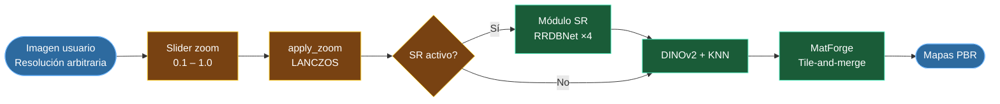
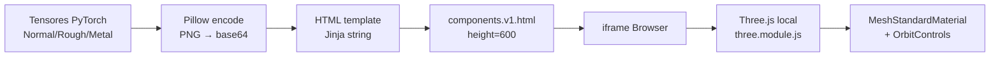
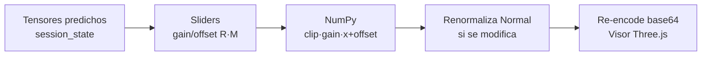
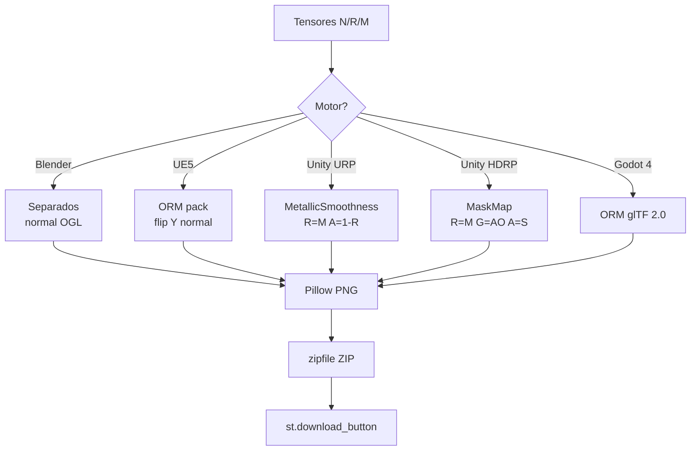
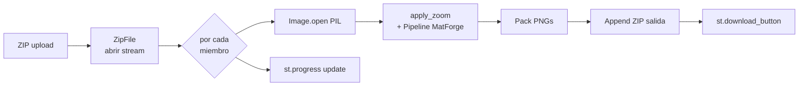
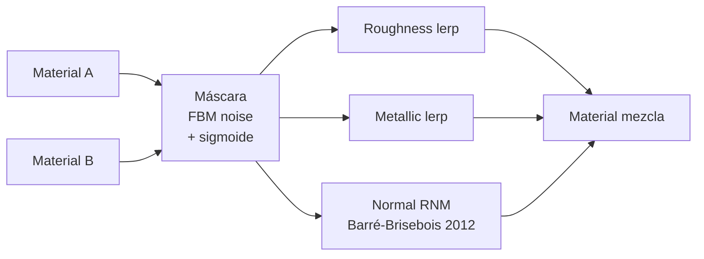
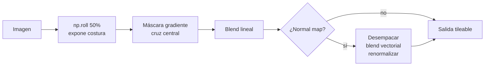
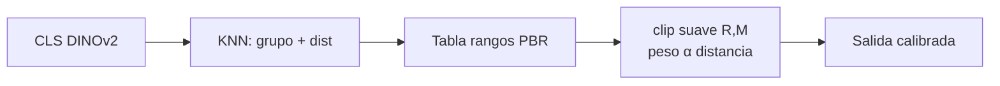
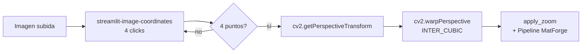
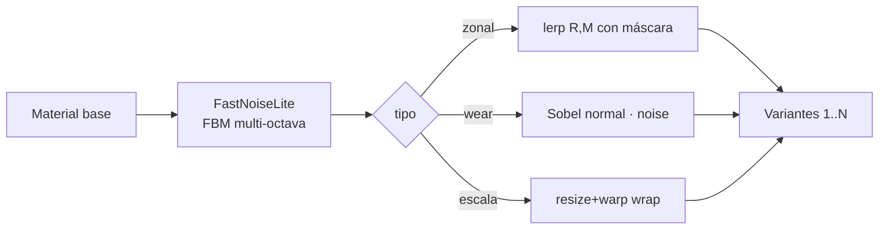

# Informe Técnico — Integración de Herramientas en la Aplicación MatForge

*Investigación técnica profunda para el diseño e implementación de funcionalidades adicionales sobre la plataforma Streamlit local.*

---

## 1. Versión de Python y dependencias

### 1.1 Selección de la versión de Python

Se evalúan tres candidatas sobre Windows 10/11 x86-64 contra los requisitos de MatForge (PyTorch CUDA 12.1, `timm` 1.0.x, Streamlit moderno, OpenCV, `streamlit-image-coordinates`, Pillow ≥ 10):

| Versión | Wheels PyTorch CUDA 12.1 (Windows) | Streamlit ≥ 1.39 | timm 1.0.x | Veredicto |
|---|---|---|---|---|
| **3.10** | Sí (cp310) | Sí | Sí | Aceptable, pero algunas librerías marcan 3.10 como soporte mínimo a punto de retirar. |
| **3.11** | Sí (cp311) — publicado en `download.pytorch.org/whl/cu121` | Sí | Sí | **Recomendada**. Mejor rendimiento que 3.10, máxima cobertura de wheels precompilados. |
| **3.12** | Sí (cp312) en torch ≥ 2.2 | Sí | Sí | Viable, pero `noise` (Perlin clásica) carece de wheels Windows cp312. |
| 3.13 | Soporte parcial; PyTorch recomienda ≤ 3.12 | — | — | No recomendada. |

**Decisión**: **Python 3.11.9 (64-bit)**. Es la versión más probada en wheels `cu121` para `torch==2.5.1` y mantiene compatibilidad nativa con todas las dependencias identificadas.

### 1.2 Tabla de dependencias verificadas

| Paquete | Versión | Notas |
|---|---|---|
| `python` | 3.11.9 | python.org oficial |
| `torch` | 2.5.1+cu121 | `https://download.pytorch.org/whl/cu121` |
| `torchvision` | 0.20.1+cu121 | idem |
| `numpy` | 1.26.x | numpy 2.x aún sin soporte universal en OpenCV-Python clásico |
| `timm` | 1.0.25 | Sin pins restrictivos de torch (GH discussion #2276) |
| `pillow` | 10.4.x | Wheel cp311-win_amd64 |
| `opencv-python` | 4.10.x | Wheel cp311 |
| `scipy` | 1.13.x | Para `scipy.ndimage` en métricas de calidad |
| `scikit-learn` | 1.5.x | PCA + KNN del pipeline |
| `streamlit` | ≥ 1.50 | `st.components.v1.html` vigente; `st.html` disponible desde 1.56 |
| `streamlit-image-coordinates` | 0.4.0 | Wheel win-64 confirmado en Anaconda |
| `noise` | 1.2.2 | Perlin/Simplex C-binding; requiere cp311 |
| `opensimplex` | 0.4.x | Pure-Python; fallback si `noise` no compila |
| `pyfastnoiselite` | 0.0.4 | Wrapper Cython de FastNoise Lite |

---

## 2. Gestión CPU/GPU en Streamlit

### 2.1 `@st.cache_resource` — patrón canónico

`@st.cache` quedó deprecado en Streamlit 1.18 (2023). El reemplazo correcto para modelos PyTorch es `@st.cache_resource`, que devuelve la misma referencia entre reruns sin serializar el objeto — comportamiento imprescindible para tensores en GPU [1].

```python
@st.cache_resource
def load_matforge():
    model = build_matforge_model()
    state = torch.load("matforge.pth", map_location="cpu")
    model.load_state_dict(state)
    return model.eval().half()
```

Características clave: el objeto vive en memoria del proceso hasta `st.cache_resource.clear()`, reinicio del proceso, o alcance de `max_entries`/`ttl`. Se comparte entre sesiones (ventajoso en despliegue local mono-usuario). Para argumentos no hasheables como tensores GPU: prefijo `_arg`.

### 2.2 Ciclo de vida y *swap* SR ↔ MatForge

Con 4 GB de VRAM y picos de ≈584 MB (SR) y ≈800 MB (MatForge), ambos caben técnicamente, pero el contexto CUDA de PyTorch en Windows (≈300–500 MB) y el driver Optimus hacen **obligatorio el modelo secuencial**. El protocolo de liberación exige cuatro pasos estrictos en este orden [2]:

```python
def release_gpu_model(name: str):
    if name in st.session_state:
        st.session_state[name].to('cpu')   # 1. mover fuera del allocator CUDA
        del st.session_state[name]         # 2. eliminar última referencia
        gc.collect()                       # 3. forzar recolección de Python
        torch.cuda.empty_cache()           # 4. devolver bloques al driver
```

**Diferencia real entre `del` y `torch.cuda.empty_cache()`**: `del` reduce el refcount; solo si llega a cero el GC libera los tensores, pero los bloques quedan en el *caching allocator*. `empty_cache()` libera bloques no asignados hacia el driver — no libera memoria con referencias vivas. Sin `model.to('cpu')` previo, queda memoria residual aunque se ejecuten los otros tres pasos.

### 2.3 Patrón secuencial completo SR → MatForge

```python
@st.cache_resource(max_entries=1)
def _load_sr():   return build_sr_model().eval().half().to('cuda')

@st.cache_resource(max_entries=1)
def _load_mat():  return build_matforge().eval().half().to('cuda')

def run_pipeline(img):
    if st.session_state.use_sr:
        sr = _load_sr()
        hr = tile_and_merge(sr, img)
        sr.to('cpu'); _load_sr.clear(); gc.collect(); torch.cuda.empty_cache()
    else:
        hr = img
    mat = _load_mat()
    return mat(hr)
```

### 2.4 Detección automática de dispositivo

```python
DEVICE = "cuda" if torch.cuda.is_available() else "cpu"
DTYPE  = torch.float16 if DEVICE == "cuda" else torch.float32
```

FP16 sobre CPU es contraproducente (ejecutado emulado, más lento que FP32). `DTYPE` debe adaptarse al dispositivo.

### 2.5 Estimaciones de latencia

> **Hipótesis**: cifras inferidas desde benchmarks publicados de hardware comparable. No se han encontrado mediciones directas de PVT-v2-B1 ni RRDBNet 23 bloques sobre GTX 1650 Max-Q.

| Componente | GTX 1650 Max-Q (FP16) | i7-9750H (FP32) | Ratio CPU/GPU |
|---|---|---|---|
| RRDBNet SR ×4, 512×512 tiles | 5–10 s | 60–120 s | ≈10–15× |
| DINOv2-small CLS | 0.05–0.10 s | 0.4–0.8 s | ≈5–8× |
| PCA-50 + KNN | <1 ms | <1 ms | ≈1× |
| MatForge PVT-v2-B1, 512×512 | 0.8–1.5 s | 6–15 s | ≈8–10× |
| **Pipeline completo con SR** | **≈8–12 s** | **≈70–135 s** | **≈10×** |
| **Pipeline sin SR** | **≈1.5–2.5 s** | **≈8–18 s** | **≈6–8×** |

### 2.6 Comunicación proactiva al usuario

```python
with st.status("Cargando MatForge…", expanded=False) as s:
    st.write(f"Dispositivo: {DEVICE.upper()}")
    if DEVICE == "cpu":
        st.warning("Ejecutando en CPU. El pipeline puede tardar entre 8–18 s por imagen.")
    model = _load_mat()
    s.update(label="Listo", state="complete")
```

Usar `st.spinner` en operaciones <3 s y `st.status` con escritura incremental para procesos más largos.

---

## 3. Preprocesado de entrada — Zoom y escala de imagen

Esta sección documenta el componente de escala de entrada, que no es una funcionalidad opcional sino un **requisito estructural del modelo** derivado de cómo fue entrenado MatForge.

### 3.1 Motivación técnica

MatForge fue entrenado sobre parches de 256×256 píxeles recortados de texturas a resolución 1K (1024×1024). En inferencia, cada tile de 256×256 debe contener **estructura de material reconocible**: bordes de ladrillo completos, poros visibles, juntas de mortero, vetas de madera. Si el usuario sube una imagen 4K donde esos elementos tienen un tamaño físico mucho mayor en píxeles, cada tile verá solo un fragmento de superficie sin contexto suficiente — el modelo recibirá entradas fuera de la distribución de entrenamiento y producirá mapas PBR incoherentes.

El slider de zoom resuelve este problema escalando la imagen de entrada **antes** del tile-and-merge, de forma que el contenido visual de cada tile corresponda aproximadamente a lo que el modelo espera.

### 3.2 Definición del parámetro (texto de ayuda al usuario)

```
Zoom factor controla cuánto de la imagen ve cada tile de 256×256 antes de la inferencia.
Los modelos fueron entrenados sobre parches de 256×256 recortados de texturas de 1K, por lo
que cada tile debe contener estructura de material reconocible: ladrillos completos, poros
visibles, juntas claras.

Si se sube una imagen de muy alta resolución (e.g. 4K) sin reducir el zoom, cada tile
cubrirá solo un fragmento diminuto de la superficie. El modelo puede no reconocer el
material en absoluto, produciendo mapas incoherentes.

Reducir el zoom reduce la escala de la imagen antes del tileado, de forma que cada
parche ve una región más amplia y completa — más próxima a lo aprendido durante
el entrenamiento.

Como regla general:
  • Imagen 1K → zoom 1.0
  • Imagen 2K → zoom 0.5
  • Imagen 4K → zoom 0.25

Nota: un zoom menor también acelera la inferencia, pero ese es un efecto secundario,
no el propósito principal.
```

### 3.3 Implementación técnica

```python
from PIL import Image

def apply_zoom(img: Image.Image, zoom: float) -> Image.Image:
    if abs(zoom - 1.0) < 1e-3:
        return img
    w, h = img.size
    new_w = max(256, int(round(w * zoom)))
    new_h = max(256, int(round(h * zoom)))
    return img.resize((new_w, new_h), Image.LANCZOS)
```

El mínimo de 256 px evita que la imagen quede por debajo del tamaño de un tile, lo que causaría padding total sin información real. LANCZOS es el filtro de downscaling con menor pérdida de detalle a factores moderados (0.25–0.75).

**Posición en el pipeline**:



### 3.4 Interacción con el módulo SR

Existe una interacción no trivial entre el zoom y el módulo SR:

- Si el usuario sube una imagen 512 px y activa SR (×4), la imagen resultante es de 2048 px. El zoom recomendado a continuación sería ≈0.5 para que MatForge reciba una imagen efectiva de 1024 px.
- Si el usuario aplica zoom 0.25 a una imagen 4K (→ 1K) y luego activa SR (→ 4K), MatForge recibe 4K de nuevo, con la misma problemática original.

La lógica recomendada para la interfaz es aplicar zoom **antes** de SR cuando la imagen es de resolución muy alta (>2K): reducir primero a una resolución manejable, luego SR eleva el detalle dentro de esa resolución. La interfaz debe mostrar en tiempo real la resolución efectiva que recibirá MatForge:

```python
effective_w = int(img.width * zoom) * (4 if use_sr else 1)
effective_h = int(img.height * zoom) * (4 if use_sr else 1)
st.caption(f"Resolución efectiva para MatForge: {effective_w}×{effective_h} px")
```

### 3.5 Riesgos y limitaciones

- **Zoom excesivo**: zoom de 0.1 sobre imagen 1K produce 102×102 px — menos de un tile. Imponer límite inferior adaptativo: `zoom_min = max(0.1, 256 / min(img.width, img.height))`.
- **Suavizado por LANCZOS**: el downscaling elimina frecuencias altas. En imágenes con mucho detalle fino (e.g. tela), un zoom agresivo puede suavizar los poros hasta hacerlos irreconocibles para el modelo.
- **Regla de thumb no universal**: las recomendaciones 2K→0.5 y 4K→0.25 asumen que el material ocupa toda la imagen a escala similar a las texturas de MatSynth. Fotos muy cercanas o muy lejanas pueden requerir valores distintos.

---

## 4. Herramientas de la aplicación

### Herramienta 1 — Visor 3D interactivo PBR con Three.js

**A — Valor**: permite al artista validar las texturas predichas sobre una primitiva (esfera/cubo/plano) con iluminación PBR coherente sin abrir Blender/Unreal. Diferencia MatForge de pipelines que solo entregan PNGs. Three.js implementa el mismo modelo Disney/UE4 (GGX) que los motores principales.

**B — Viabilidad**: `three.js r160+` se distribuye como ZIP en `github.com/mrdoob/three.js`; copiar `build/three.module.js` y `examples/jsm/controls/OrbitControls.js` a `assets/three/` garantiza funcionamiento offline. `MeshStandardMaterial` admite `normalMap`, `roughnessMap`, `metalnessMap` directamente [4]. Embed vía `st.components.v1.html`. **Cero VRAM Python** — el render ocurre en la GPU del navegador. Texturas transferidas como `data:image/png;base64` dentro del HTML.

**C — Arquitectura**:



**D — Riesgos**:
- El iframe tiene 150 px por defecto; forzar `height=600+` explícito.
- Sin `envMap` (HDRI) los metales aparecen negros; incluir un PMREM environment minimal preempaquetado.
- Texturas 4K en base64 superan 20 MB de HTML y bloquean el WebSocket; limitar previsualización a 1024×1024.

---

### Herramienta 2 — Panel de ajuste físico post-predicción

**A — Valor**: permite modificar roughness y metallic globalmente sin reinferir. Convierte MatForge de caja negra a herramienta ajustable.

**B — Viabilidad**: tres `st.slider` (`offset ∈ [-0.5, 0.5]`, `gain ∈ [0.5, 2.0]`) sobre arrays NumPy float32. Coste <50 ms. `session_state` preserva ajustes entre reruns.

**Fórmulas correctas**: Roughness y Metallic son **lineales** en metallic-roughness PBR — aplicar `x_out = clip(gain · x_in + offset, 0, 1)` y **nunca aplicar gamma**. Si se escala el Normal, **renormalizar L2 obligatoriamente**.

**C — Arquitectura**:



**D — Riesgos**: rerun completo ante cualquier slider. Mitigación: `st.form` para batch-aplicar; `@st.cache_data` sobre la función pura `(arr, gain, offset) → arr_mod`.

---

### Herramienta 3 — Exportación por motor 3D

**A — Valor**: elimina el empaquetado manual de canales en Photoshop/Substance. Mayor ROI inmediato de todas las herramientas.

**B — Convenciones verificadas**:

| Motor | Formato | Canal Normal | Empaquetado |
|---|---|---|---|
| **Blender** | Mapas separados | OpenGL (Y+) | _diffuse, _normal, _roughness, _metallic |
| **Unreal Engine 5** | ORM packed | DirectX (Y−, flip canal G) | T_Asset_BC, T_Asset_N, T_Asset_ORM (R=AO, G=Rough, B=Metal) [7] |
| **Unity URP** | MetallicSmoothness | OpenGL | R=Metal, A=Smooth (=1−Rough); sRGB OFF |
| **Unity HDRP** | Mask Map | OpenGL | R=Metal, G=AO, B=detail, A=Smooth; default G=B=0.5 [8] |
| **Godot 4** | ORM (glTF 2.0) | OpenGL | R=AO, G=Rough, B=Metal |

**C — Diagrama**:



**D — Riesgos**: el flip Y del normal (OpenGL→DirectX) es el error más frecuente; produce síntoma "bumps invertidos". Si no se predice AO, rellenar R con 255 (UE) o 0.5 (HDRP). Incluir `README.txt` en el ZIP documentando la convención.

---

### Herramienta 4 — Batch processing desde ZIP

**A — Valor**: convierte MatForge en herramienta de producción (decenas a centenares de imágenes por sesión).

**B — Viabilidad**: `st.file_uploader(type=['zip'])` + `zipfile.ZipFile(buffer).open(member)` para descomprimir uno a uno sin cargar el ZIP completo en RAM. Límite por defecto: 200 MB (`server.maxUploadSize` en `~/.streamlit/config.toml`); ampliable a 2-4 GB.

**C — Diagrama**:



**D — Riesgos**: archivos corruptos detienen el bucle si no se envuelven en `try/except`. OOM de RAM con ZIPs muy grandes (mitigado por descompresión miembro a miembro). Cerrar la pestaña aborta el proceso.

---

### Herramienta 5 — Mezclador de materiales PBR

**A — Valor**: combina dos predicciones MatForge preservando físicamente la coherencia de los normales. Funcionalidad sin equivalente gratuito integrado en herramientas comparables.

**B — Fórmula RNM**: el método de referencia es **Reoriented Normal Mapping** de Barré-Brisebois y Hill [5], publicado en `blog.selfshadow.com/publications/blending-in-detail/`. Para vectores normalizados en [-1,1]:

```python
def rnm_blend(n1, n2):
    t = n1 + np.array([0., 0., 1.])
    u = n2 * np.array([-1., -1., 1.])
    r = t * (np.sum(t*u, axis=-1, keepdims=True) / t[..., 2:3]) - u
    return r / np.linalg.norm(r, axis=-1, keepdims=True)
```

Para Roughness y Metallic: `lerp` lineal ponderado por máscara. Máscaras procedurales con `opensimplex.noise2_array` o `pyfastnoiselite`.

**C — Arquitectura**:



**D — Riesgos**: `lerp` directo sobre normals empacados [0,255] produce vectores invalidados. División por `t[...,2]` inestable si el normal base apunta lateralmente; clamp a 1e-3.

---

### Herramienta 6 — Conversión a tileable / seamless

**A — Valor**: convierte una foto puntual en textura repetible, necesidad muy frecuente en assets de producción.

**B — Algoritmos**: offset 50% + cross-fade lineal (implementado en el paquete PyPI `img2texture`, MIT); `cv2.seamlessClone(NORMAL_CLONE)` basado en Poisson Image Editing [6]. Para Normal maps: desempacar a [-1,1], blend vectorial con renormalización, reempacar.

**C — Diagrama**:



**D — Limitaciones**: con patrones grandes el blend solo oculta la costura inmediata; el patrón grande sigue mostrando repetición. Documentarlo explícitamente al usuario.

---

### Herramienta 7 — Calibración automática por grupo funcional

**A — Valor**: aprovecha el clasificador KNN ya integrado para acotar suavemente Roughness y Metallic al rango físicamente plausible del grupo detectado.

**B — Rangos de referencia** (Unreal docs [7], Substance PBR Guide, `physicallybased.info`):

| Grupo | Roughness típica | Metallic |
|---|---|---|
| Metales pulidos | 0.05–0.25 | 1.00 |
| Metales rugosos / oxidados | 0.40–0.75 | 0.85–1.00 |
| Madera | 0.45–0.80 | 0.00 |
| Piedra / hormigón | 0.55–0.95 | 0.00 |
| Cerámica / vidrio pulido | 0.05–0.30 | 0.00 |
| Pintura / barniz | 0.15–0.45 | 0.00 |

**Transformación afín suave**: `x_cal = α · clip(x_pred, x_min, x_max) + (1−α) · x_pred`, con `α` reducido cuando la distancia KNN al centroide es alta.

**C — Diagrama**:



**D — Riesgos**: clasificación errónea propaga calibración incorrecta. Mostrar el grupo detectado con distancia y permitir override manual; no aplicar si `α < 0.3`.

---

### Herramienta 8 — Corrección de perspectiva

**A — Valor**: endereza fotografías tomadas en ángulo antes de la inferencia. Sin esta corrección MatForge predice texturas con patrones no-ortogonales. Toda CPU, cero VRAM.

**B — Implementación**: `streamlit-image-coordinates` [10] recoge clicks y devuelve `{x, y}`. Con cuatro clicks se obtienen las esquinas:

```python
import cv2, numpy as np

src = np.float32(four_clicks)
W, H = 1024, 1024
dst = np.float32([[0,0],[W,0],[W,H],[0,H]])
M = cv2.getPerspectiveTransform(src, dst)
warped = cv2.warpPerspective(np.array(img), M, (W, H), flags=cv2.INTER_CUBIC)
```

**C — Flujo**:



**D — Riesgos**: el orden de los 4 puntos es crítico; mostrar overlay con los puntos seleccionados y permitir reset. Si los puntos son colineales, OpenCV lanza excepción capturable.

---

### Herramienta 9 — Generación de variaciones procedurales

**A — Valor**: genera 5–10 variantes de un material desde una sola predicción, útil para evitar repetición visible en superficies extensas.

**B — Bibliotecas**:
- `pyfastnoiselite` [11]: wrapper Cython de FastNoise Lite, nanosegundos por muestra. **Recomendación principal**.
- `opensimplex` [12]: pure-Python con NumPy. Fallback universal.
- `noise`: C-binding clásico; puede requerir compilación en Windows.

**Operaciones**:
- **Mezcla zonal**: máscara FBM multi-octava → `lerp(rough_a, rough_b, mask)`.
- **Worn edges** (**Heurística** — no se ha encontrado paper canónico): gradiente `scipy.ndimage.sobel` del normal map × máscara de ruido de baja frecuencia, simulando desgaste en aristas.
- **Variación de escala**: `cv2.resize` aleatorio con tile-wrap.

**C — Flujo**:



**D — Riesgos**: worn edges produce artefactos si el normal predicho es plano. `noise` puede requerir compilación en Windows cp311; usar `opensimplex` como fallback.

---

### Herramienta 10 — Evaluación de calidad del mapa de normales

**A — Valor**: alerta automática sobre regiones del normal map mal predichas antes de exportar. Aporta confianza y facilita debugging.

**B — Métricas** (**Heurísticas operacionales** — no se ha encontrado paper académico canónico específico de normal maps PBR):

1. **Coherencia vectorial**: `‖n‖₂` por píxel tras desempacar; reportar % fuera de [0.95, 1.05].
2. **Continuidad local**: `scipy.ndimage.sobel` por canal; magnitud del Jacobiano.
3. **Detección de bloques/franjas**: entropía local en ventanas 16×16 con `scipy.ndimage.generic_filter`.

**C — Flujo**:

```mermaid
flowchart LR
    A[Normal map RGB] --> B[Despack a -1,1]
    B --> C[||n|| por pixel]
    B --> D[Sobel → ||grad||]
    B --> E[Entropía local 16x16]
    C & D & E --> F[Heatmap RGBA\n+ score global]
    F --> G[st.image overlay\n+ métricas]
```

**D — Riesgos**: % de píxeles fuera de [0.95, 1.05] del 1–3% es ruido normal de FP16, no patología. Calibrar umbrales con el dataset de validación de MatForge.

---

## 5. Tabla comparativa

| Herramienta | VRAM | Latencia | Dependencias clave | Valor artista | Riesgo |
|---|---|---|---|---|---|
| Zoom / escala | 0 | <50 ms | Pillow | **Estructural** | bajo |
| 1 — Visor Three.js | 0 (browser) | ≤1 s | three.js local | Muy alto | medio |
| 2 — Ajuste R/M post | 0 | <50 ms | NumPy | Alto | bajo |
| 3 — Export multi-motor | 0 | <500 ms | Pillow, zipfile | **Muy alto** | bajo |
| 4 — Batch ZIP | 800 MB (MatForge) | n×2 s | zipfile | Alto | medio |
| 5 — Mezclador RNM | 0 | <300 ms | NumPy | Medio-alto | medio |
| 6 — Tileable | 0 | <200 ms | NumPy, img2texture | Alto | medio |
| 7 — Calibración grupo | 0 | <10 ms | KNN + tabla | Medio | medio |
| 8 — Perspectiva | 0 | <100 ms | OpenCV, st-img-coords | Alto | bajo |
| 9 — Variaciones proc. | 0 | <500 ms | fastnoiselite | Medio | bajo |
| 10 — Calidad normal | 0 | <300 ms | SciPy | Medio | medio |

---

## 6. Propuesta de priorización razonada

1. **Zoom / escala** — componente estructural; sin él el pipeline falla para imágenes >1K.
2. **#3 Export multi-motor** — desbloquea el flujo de trabajo completo del artista.
3. **#2 Ajuste físico R/M** — coste trivial, retorno percibido inmediato.
4. **#1 Visor Three.js** — valida visualmente el resultado sin salir de la herramienta.
5. **#4 Batch ZIP** — escala MatForge a uso de producción.
6. **#8 Corrección de perspectiva** — habilita fotos tomadas en ángulo; barato y autocontenido.
7. **#10 Evaluación de calidad** — confianza del usuario y debugging.
8. **#7 Calibración por grupo** — refinamiento automático con KNN ya entrenado.
9. **#6 Tileable** — feature avanzado; rápido de implementar con `img2texture`.
10. **#5 Mezclador RNM** — valor alto pero UX más compleja.
11. **#9 Variaciones procedurales** — valor agradable pero opcional.

---

## 7. Caveats y clasificación de evidencia

- Las **latencias GPU** sobre GTX 1650 Max-Q son estimaciones razonadas (**Hipótesis**); no se han encontrado mediciones directas de PVT-v2-B1 ni RRDBNet 23 bloques sobre este hardware.
- **Worn edges procedurales** es práctica común sin referencia académica canónica (**Heurística**).
- **Métricas de calidad de normal map** son adaptaciones de métodos no-referencia generales (**Heurística**).
- `st.components.v1.html` está deprecado desde Streamlit 1.56 pero sigue operativo sin fecha de retirada anunciada.
- Compatibilidad de `pyfastnoiselite` con Python 3.12 Windows: **No confirmado**.
- El protocolo `to('cpu') → del → gc → empty_cache` mitiga pero no elimina completamente la memoria residual en la primera instancia de `nn.Module`.

---

## Referencias

[1] Streamlit, "st.cache_resource," *Streamlit Documentation*, 2024. [Online]. Available: https://docs.streamlit.io/develop/api-reference/caching-and-state/st.cache_resource

[2] PyTorch, "torch.cuda.empty_cache," *PyTorch Documentation*, 2024. [Online]. Available: https://pytorch.org/docs/stable/generated/torch.cuda.empty_cache.html

[3] PyTorch, "Previous PyTorch Versions," *pytorch.org*, 2024. [Online]. Available: https://pytorch.org/get-started/previous-versions/

[4] three.js Authors, "MeshStandardMaterial," *Three.js Documentation*, 2024. [Online]. Available: https://threejs.org/docs/#api/en/materials/MeshStandardMaterial

[5] C. Barré-Brisebois and M. Hill, "Blending in Detail," *Self Shadow Blog*, Aug. 2012. [Online]. Available: https://blog.selfshadow.com/publications/blending-in-detail/

[6] S. Pérez, M. Gangnet, and A. Blake, "Poisson Image Editing," in *ACM SIGGRAPH 2003*, New York, NY, USA: ACM, 2003, pp. 313–318. doi: 10.1145/1201775.882269.

[7] Epic Games, "Physically Based Materials," *Unreal Engine Documentation*, 2021. [Online]. Available: https://docs.unrealengine.com/4.27/en-US/RenderingAndGraphics/Materials/PhysicallyBased/

[8] Unity Technologies, "Mask Map and Detail Map," *Unity HDRP Documentation*, 2021. [Online]. Available: https://docs.unity3d.com/Packages/com.unity.render-pipelines.high-definition@13.1/manual/Mask-Map-and-Detail-Map.html

[9] OpenCV, "Geometric Transformations of Images," *OpenCV 4.x Documentation*, 2024. [Online]. Available: https://docs.opencv.org/4.x/da/d6e/tutorial_py_geometric_transformations.html

[10] blackary, "streamlit-image-coordinates," *GitHub repository*, 2023. [Online]. Available: https://github.com/blackary/streamlit-image-coordinates

[11] tizilogic, "PyFastNoiseLite," *GitHub repository*, 2022. [Online]. Available: https://github.com/tizilogic/pyfastnoiselite

[12] lmas, "opensimplex," *GitHub repository*, 2021. [Online]. Available: https://github.com/lmas/opensimplex

[13] A. Antonel et al., "A Novel No-Reference Image Quality Metric for Assessing Sharpness in Satellite Imagery," arXiv preprint arXiv:2410.10488, 2024. [Online]. Available: https://arxiv.org/abs/2410.10488

[14] T. Looman, "Unreal Engine Naming Convention Guide," *tomlooman.com*, 2023. [Online]. Available: https://www.tomlooman.com/unreal-engine-naming-convention-guide/

[15] Streamlit Inc., "Advanced concepts," *Streamlit Documentation*, 2024. [Online]. Available: https://docs.streamlit.io/get-started/fundamentals/advanced-concepts
