# MatForge: Informe Técnico de Diseño e Implementación

---

## 1. Introducción y motivación

### 1.1 Qué es MatForge

MatForge es un modelo de aprendizaje profundo que, a partir de una única imagen RGB de un material de superficie tileable, predice de forma automática tres mapas PBR (*Physically Based Rendering*): el mapa de **Normales** (que codifica la microgeometría de la superficie), el mapa de **Roughness** (que controla cuánto dispersa la luz la superficie) y el mapa de **Metallic** (que distingue materiales conductores de los dieléctricos). El objetivo no es producir mapas visualmente plausibles, sino mapas físicamente coherentes que puedan integrarse directamente en un motor 3D moderno sin correcciones manuales.

El contexto de uso final es un pipeline PBR completo: el artista o técnico captura o descarga una foto de un material, la introduce en la aplicación, y recibe instantáneamente los tres mapas necesarios para representar ese material bajo cualquier iluminación en un motor en tiempo real.

### 1.2 Por qué MatForge no es una mejora de DeepPBR

El proyecto hereda como punto de partida a **DeepPBR**, una red entrenada previamente sobre un subconjunto pétreo de materiales (piedra, hormigón, ladrillo) con una arquitectura basada en **ResNet50** como encoder, dos decoders desacoplados con módulos de atención **CBAM**, y un discriminador PatchGAN introducido desde las primeras épocas de entrenamiento.

DeepPBR demostró que el problema es abordable con recursos modestos, pero presentó cuatro limitaciones estructurales que no se pueden resolver con ajustes menores:

1. **Encoder inadecuado para la tarea**: ResNet50 fue diseñado para clasificación de imágenes. Su representación interna es óptima para distinguir categorías semánticas globales, pero no para preservar el detalle espacial fino que requiere la predicción de normales y roughness a nivel de píxel. Adaptarlo a una tarea densa obliga a recuperar información que el propio encoder ha descartado.

2. **Función de pérdida sin anclaje físico**: las pérdidas de DeepPBR operaban directamente sobre los valores de píxel de los mapas, sin evaluar si la combinación de esos mapas produce un resultado físicamente correcto bajo iluminación. Esto permite que la red converja hacia soluciones localmente correctas pero globalmente incoherentes.

3. **GAN introducido demasiado pronto**: el discriminador PatchGAN se activó desde la primera época. En esa fase, el generador todavía no ha aprendido las estructuras básicas de los mapas, y el discriminador introduce un ruido de gradiente que interfiere con el aprendizaje inicial. El resultado observado fue inestabilidad y alucinaciones geométricas en épocas avanzadas.

4. **Dataset sesgado y pequeño**: el subconjunto pétreo (~1.500 texturas) limitaba la capacidad de generalización a materiales de naturaleza muy diferente, como madera, cerámica o metal.

MatForge no intenta corregir estas limitaciones de forma incremental. Es un rediseño completo con decisiones arquitectónicas y de datos tomadas desde cero, justificadas en el contexto de las restricciones reales del proyecto: hardware Kaggle (GPU T4 de 16 GB), sin acceso a clusters de cómputo y con ventana temporal de aproximadamente 1,5 semanas para entrenar y evaluar.

---

## 2. Estado del arte: los trabajos que fundamentan MatForge

La revisión del estado del arte se realizó con el objetivo de identificar qué técnicas aportaban evidencia sólida de mejora en tareas de estimación de materiales PBR desde imagen única, dentro de las restricciones de cómputo disponibles. Se descartaron desde el principio los métodos que requieren múltiples GPU de alta gama, pipelines de difusión de muchos pasos, o que no tienen recetas de entrenamiento accesibles.

### 2.1 Estimación de SVBRDF desde imagen única: el trabajo fundacional

El trabajo de Deschaintre et al. [1] estableció en 2018 el marco de referencia para este problema. Su red aprende a predecir directamente los mapas PBR de una superficie plana desde una única fotografía, y lo hace incorporando una **pérdida de renderizado diferenciable**: en lugar de evaluar el error únicamente sobre los mapas predichos, renderiza esos mapas bajo iluminación y compara el resultado con el renderizado del ground truth. Esta idea es el fundamento directo de la función de pérdida de MatForge.

### 2.2 SegFormer y los encoders jerárquicos para visión densa

SegFormer [2] propuso una arquitectura de encoder-decoder para segmentación semántica donde el encoder es un **Mix Transformer (MiT)** jerárquico que procesa la imagen en cuatro resoluciones simultáneamente, sin embeddings posicionales rígidos. La clave de MiT es que puede capturar tanto contexto global (a baja resolución) como detalle fino (a alta resolución) en una sola pasada, y sus pesos están disponibles preentrenados en ImageNet-1K.

Para MatForge, esta familia de encoders resuelve directamente el problema principal de DeepPBR: en lugar de un backbone de clasificación que descarta información espacial, se usa un encoder diseñado explícitamente para tareas densas. La variante **MiT-B1** fue seleccionada inicialmente por su equilibrio entre capacidad (~13 M de parámetros) y coste computacional. Durante la implementación se descubrió que `mit_b1` no está disponible en la versión de timm instalada en Kaggle (1.0.25), por lo que se sustituyó por su equivalente arquitectónico **PVT-v2-B1** [3], que produce shapes de feature maps idénticos y tiene el mismo régimen de preentrenamiento.

### 2.3 Restormer: el Plan B

Restormer [4] es un transformer eficiente diseñado específicamente para **restauración de imagen de alta resolución**. A diferencia de SegFormer, su objetivo de diseño no es la semántica sino la preservación de detalle fino. Incorpora bloques MDTA (*Multi-Dconv Head Transposed Attention*) y GDFN (*Gated-Dconv Feed-forward Network*) que le permiten operar de forma eficiente sobre imágenes de alta resolución.

En el contexto de MatForge, Restormer fue estudiado como **Plan B**: si el encoder jerárquico de tipo SegFormer no produce suficiente detalle fino en los mapas, Restormer ofrece una arquitectura alternativa cuyo punto de partida es exactamente el tipo de detalle que nos interesa. La sección de estrategia de entrenamiento detalla el criterio de pivote entre Plan A y Plan B.

### 2.4 MatSynth: el dataset

MatSynth [5] es el dataset de materiales PBR moderno de mayor diversidad pública disponible. Contiene más de 3.900 materiales sintéticos organizados en categorías (piedra, madera, metal, cerámica, hormigón, etc.), con los cinco mapas PBR estándar por material: albedo, normal, roughness, metallic y height. Los materiales son texturas tileables a 2K de resolución.

A diferencia de datasets anteriores, MatSynth incluye materiales de muy diversa naturaleza y calidad, lo que lo hace ideal para entrenar un modelo generalista. El propio paper muestra que reentrenar métodos públicos con MatSynth mejora las métricas de forma consistente respecto a entrenamiento con subconjuntos más pequeños.

### 2.5 UMat: lecciones sobre robustez y protocolo de evaluación

UMat [6] aborda el problema de captura de materiales de alta resolución desde imagen única, incorporando modelado explícito de la incertidumbre. Aunque su arquitectura completa excede las restricciones de este proyecto, aporta dos lecciones directamente aplicables: primero, que entrenar modelos separados por categoría de material conduce a poca capacidad de generalización; segundo, que el protocolo de evaluación debe incluir tanto métricas sobre mapas como métricas sobre renderizados, porque una superficie puede tener roughness correcto pero normal equivocado, y eso solo se detecta evaluando el renderizado.

### 2.6 LPIPS: la métrica perceptual

LPIPS [7] (*Learned Perceptual Image Patch Similarity*) mide la similitud perceptual entre dos imágenes usando las activaciones de una red de clasificación preentrenada. A diferencia de L2 o SSIM, LPIPS es sensible a diferencias que el sistema visual humano percibe, lo que la hace especialmente adecuada para evaluar la calidad de renderizados PBR. En MatForge se usa como componente de la función de pérdida y como métrica de evaluación.

---

## 3. Decisión arquitectónica: por qué PVT-v2-B1 + FPN

El espacio de arquitecturas candidatas se redujo a tres opciones durante la fase de investigación:

| Arquitectura | Tipo | Parámetros aprox. | Preentrenado | Riesgo principal |
|---|---|---|---|---|
| **PVT-v2-B1 + FPN** (Plan A) | Encoder jerárquico + decoder piramidal | ~20-23M | Sí (ImageNet-1K) | Decoder demasiado simple para microdetalle |
| **Restormer dual-head** (Plan B) | Transformer de restauración | ~26M | No disponible listo | Sin preentrenamiento útil, más dependiente de datos |
| Diffusion-based (SuperMat, IntrinsicImageDiffusion) | Difusión | >500M | Requiere SD 2.1 base | Coste VRAM, tiempo, dependencias, no entrenable en Kaggle |

La opción de difusión se descartó desde el principio. IntrinsicImageDiffusion [8] requiere cuatro GPU A100 durante varios días; SuperMat, aunque conceptualmente cercano, opera a 512px con objeto aislado y requiere la base de Stable Diffusion 2.1 como punto de partida.

Entre Plan A y Plan B, se eligió Plan A como primera corrida por cuatro razones concretas:

**Preentrenamiento disponible y útil.** PVT-v2-B1 viene preentrenado en ImageNet-1K. Esto significa que el encoder ya sabe reconocer texturas, bordes y estructuras visuales antes de ver un solo mapa PBR. Restormer, al no tener preentrenamiento aplicable a esta tarea, debe aprender todo desde cero, lo que lo hace más dependiente de la calidad y cantidad de los datos de entrenamiento.

**Representación multiescala nativa.** El encoder jerárquico procesa la imagen en cuatro resoluciones simultáneamente, lo que proporciona tanto contexto global como detalle local sin necesidad de diseñar mecanismos adicionales para recuperar esa información.

**Menor riesgo de inestabilidad.** La combinación de preentrenamiento fuerte + LR diferenciado entre encoder y decoder es una receta bien establecida para fine-tuning de transformers visuales. Con Restormer, sin preentrenamiento, la elección de hiperparámetros es más crítica y el margen de error menor.

**Coste computacional ajustado.** El modelo completo (~20-23M parámetros) cabe cómodamente en la GPU T4 de 16GB con batch size 8 y precisión mixta AMP.

---

## 4. Arquitectura completa de MatForgeNet

MatForgeNet se compone de tres bloques principales: el encoder jerárquico, el decoder FPN, y las tres cabezas de salida independientes.

### 4.1 Diagrama de flujo completo

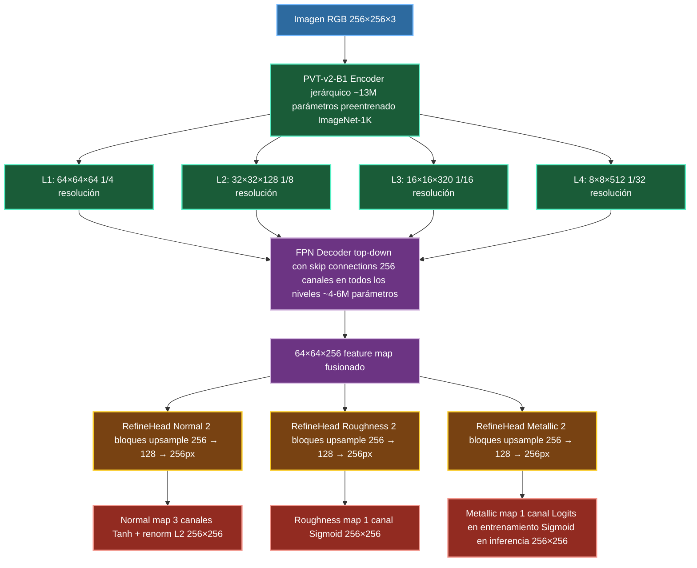

### 4.2 Encoder: PVT-v2-B1

PVT-v2-B1 (*Pyramid Vision Transformer v2*, variante B1) [3] es un encoder de visión jerárquico que divide el procesamiento en cuatro **stages** de resolución decreciente. En cada stage, aplica un mecanismo de atención local eficiente (*Linear Spatial Reduction Attention*) seguido de una red MLP, lo que le permite capturar tanto información de textura fina (stages tempranos, alta resolución) como estructura global (stages tardíos, baja resolución).

A diferencia de los transformers de visión con tokens de imagen completa (como ViT-B), los encoders jerárquicos como PVT-v2 y MiT generan **representaciones a múltiples escalas** que son directamente compatibles con decoders de tipo FPN o U-Net. Esto los hace especialmente adecuados para tareas densas donde el resultado debe tener la misma resolución que la entrada.

Con una imagen de entrada de 256×256 píxeles, los cuatro feature maps producidos por el encoder tienen los siguientes shapes:

| Stage | Resolución | Canales | Factor de reducción |
|---|---|---|---|
| L1 | 64×64 | 64 | 1/4 |
| L2 | 32×32 | 128 | 1/8 |
| L3 | 16×16 | 320 | 1/16 |
| L4 | 8×8 | 512 | 1/32 |

El encoder se inicializa con pesos preentrenados en ImageNet-1K. Durante las primeras épocas de entrenamiento, los stages iniciales del encoder se congelan para proteger el conocimiento preentrenado mientras el decoder y las cabezas de salida aprenden. La estrategia de descongelamiento se detalla en el Documento 3.

### 4.3 Decoder: FPN piramidal top-down

El decoder sigue la estructura de una **Feature Pyramid Network (FPN)** [9], que combina los feature maps del encoder en un proceso top-down: empieza desde el feature map más grueso (L4, 8×8) y va añadiendo detalle en cada nivel hasta alcanzar la resolución de L1 (64×64).

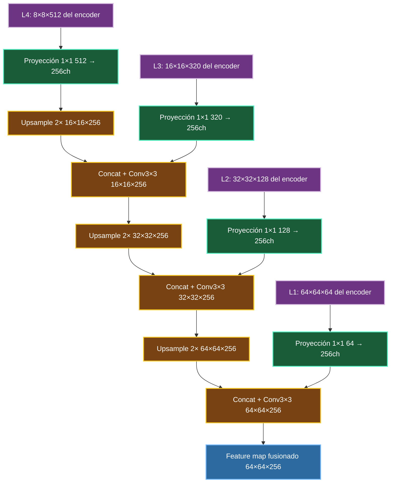

En cada nivel de fusión, la operación es:
1. Upsample bilinear 2× del stream top-down hasta la resolución del nivel siguiente.
2. Proyección 1×1 del skip connection del encoder al mismo número de canales (256).
3. Concatenación de ambos tensores (512 canales combinados).
4. Convolución 3×3 + BatchNorm + ReLU para reducir a 256 canales y fusionar la información.

El uso de concatenación en lugar de suma preserva la información complementaria de ambos streams (contexto global del top-down, detalle local del skip), y la convolución posterior aprende a combinarlos de forma óptima.

### 4.4 Cabezas de salida independientes (RefineHead)

Cada uno de los tres mapas de salida tiene su propia cabeza de refinamiento independiente. La independencia entre cabezas es una decisión deliberada: Normal, Roughness y Metallic son magnitudes de naturaleza muy diferente (campo vectorial con restricción de norma unitaria, escalar en [0,1], señal prácticamente binaria con fuerte desbalance), y compartir parámetros entre ellas introduce interferencia de gradientes que puede perjudicar a las más débiles.

Cada cabeza aplica dos bloques de upsample progresivo para pasar del feature map de 64×64 a la resolución final de 256×256:

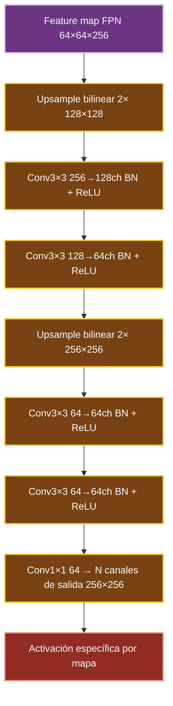

La activación final difiere según el mapa:

**Normal map (3 canales)**: la capa Conv 1×1 produce 3 valores por píxel, que se pasan por Tanh (rango [-1, 1]) y se renormalizan L2 por píxel. La renormalización es obligatoria porque los mapas de normales en espacio tangente OpenGL deben tener norma unitaria en cada píxel; sin ella, el render físico producido por el modelo sería físicamente incorrecto incluso si los valores son visualmente plausibles.

**Roughness map (1 canal)**: la capa Conv 1×1 produce 1 valor por píxel, que se pasa por Sigmoid para obtener un valor en [0, 1]. No hay renormalización adicional.

**Metallic map (1 canal)**: la capa Conv 1×1 produce logits (valores sin activación). En entrenamiento, los logits se pasan directamente a la función de pérdida `BCEWithLogitsLoss`, que aplica internamente el Sigmoid por razones de estabilidad numérica. En inferencia, se aplica Sigmoid y se recorta a [0, 1]. Este diseño es consecuencia directa del fuerte desbalance entre materiales metálicos y no metálicos en el dataset (238 vs. 3.007 texturas), lo que se detalla en el Documento 2.

### 4.5 Tamaño total del modelo

| Componente | Parámetros estimados |
|---|---|
| Encoder PVT-v2-B1 | ~13M |
| FPN Decoder | ~4-6M |
| RefineHead Normal | ~1.5-2M |
| RefineHead Roughness | ~1.5-2M |
| RefineHead Metallic | ~1.5-2M |
| **Total** | **~20-23M** |

Este tamaño es compatible con la GPU T4 de 16GB en configuración de entrenamiento con batch size 8 y precisión mixta AMP (Automatic Mixed Precision).

---

## 5. Comparación con el baseline DeepPBR

| Dimensión | DeepPBR | MatForge |
|---|---|---|
| Encoder | ResNet50 (clasificación) | PVT-v2-B1 (visión densa) |
| Preentrenamiento | ImageNet-1K | ImageNet-1K |
| Representación | Single-scale (última capa + CBAM) | Multi-scale jerárquica (4 niveles) |
| Decoder | Dual (Normal + Roughness) | FPN + 3 cabezas independientes |
| Mapa Metallic | No | Sí (tercera cabeza) |
| Función de pérdida | L1 + VGG perceptual sobre mapas + adversarial | Coseno + Charbonnier + Sobel + render Cook-Torrance + LPIPS sobre renders |
| GAN | Desde época 1 | Valorado como fine-tuning post-supervisado |
| Dataset | ~1.500 texturas pétreas | 3.245 texturas, 9 categorías, 8 grupos funcionales |
| Hardware objetivo | Kaggle P100/T4 | Kaggle T4 |

La diferencia más importante no es el backbone, sino el conjunto de decisiones coherentes: un encoder adecuado para la tarea, pérdidas ancladas a la física del renderizado, tres cabezas independientes para evitar interferencia entre tareas, y un dataset ampliado y relabelizado semánticamente.

---

## 6. Dataset: preparación y estructura

La calidad del dataset es, junto con la arquitectura, el factor que más determina la calidad final del modelo. En un problema como la predicción de mapas PBR, donde los mapas de salida son representaciones físicas de propiedades del material, un error en el dato de entrada no produce solo un modelo con menor precisión: produce un modelo que aprende relaciones físicamente incorrectas que son difíciles de detectar visualmente. Esta sección documenta el proceso completo de selección, limpieza, validación y organización del dataset de MatForge, desde el repositorio de origen hasta los archivos que el DataLoader consume durante el entrenamiento.

### 6.1 Origen: MatSynth

El dataset base es **MatSynth** [10], un repositorio público de materiales PBR de alta calidad publicado en CVPR 2024 y disponible a través de Hugging Face bajo el identificador `gvecchio/MatSynth`. Es, a fecha de este proyecto, el dataset de materiales PBR más completo disponible públicamente para investigación en aprendizaje automático.

MatSynth contiene más de 4.000 materiales a resolución hasta 4K por canal, divididos en un split de entrenamiento (3.980 materiales) y un split de test (89 materiales). Cada material incluye hasta ocho tipos de mapa PBR: Basecolor (albedo), Diffuse, Normal, Height, Roughness, Metallic, Specular y Opacity. Para MatForge se utilizan exclusivamente los mapas **Basecolor** (entrada del modelo), **Normal**, **Roughness** y **Metallic** (salidas del modelo).

Un dato técnico crítico para el diseño del pipeline de MatForge: el estándar de coordenadas adoptado por MatSynth para el mapa Normal es **OpenGL**, donde el eje Z apunta hacia fuera de la superficie (hacia la cámara). Esto determina directamente los filtros del EDA (sección 6.3) y la función de pérdida coseno (sección 9).

#### Estructura de metadatos

Cada material en MatSynth incluye metadatos estructurados que facilitan la selección y el filtrado. Los campos más relevantes para este proyecto son:

- **`category`**: identificador numérico de la categoría semántica. MatSynth define 13 categorías: ceramic=0, concrete=1, fabric=2, ground=3, leather=4, marble=5, metal=6, misc=7, plaster=8, plastic=9, stone=10, terracotta=11, wood=12. Para MatForge se seleccionaron 9 de estas categorías, excluyendo fabric, leather, plastic y misc por considerarlos fuera del dominio de materiales de construcción y arquitectura que define el alcance del proyecto.
- **`capture_method`**: método de obtención del material (photogrammetry, procedural generation, approximation).
- **`source_name`** y **`source_link`**: origen del material (AmbientCG, PolyHaven, etc.). Esta información es relevante porque permite detectar near-duplicates entre categorías: el mismo material puede haberse descargado de la misma fuente bajo dos categorías distintas.
- **`license`**: tipo de licencia (CC0, CC-BY). Todos los materiales de MatSynth son de uso libre para investigación.

#### Acceso programático y estructura de almacenamiento

El split de entrenamiento de MatSynth se distribuye en 431 archivos Parquet de entre 0.9 GB y 1.3 GB cada uno, con 8 a 15 materiales por archivo y todos los mapas embebidos en formato binario. El acceso mediante descarga secuencial de parquets permite controlar con precisión cuántos materiales de cada categoría se descargan, sin necesidad de descargar el dataset completo (que supera los 500 GB en resolución completa).

Para MatForge se implementó un descargador robusto con las siguientes características: reanudable en caso de interrupción, con sistema de progreso persistente en JSON, sin acumulación de caché de Hugging Face en disco, y con soporte para descarga del mapa Metallic exclusivamente para la categoría `metal`. Las texturas se almacenan reescaladas a resolución **1K (1024×1024)**, que es la resolución de entrenamiento y suficiente para capturar el detalle de textura relevante con un coste de almacenamiento manejable.

#### Inconsistencias semánticas en los tags de MatSynth

Un análisis visual del dataset reveló que las categorías originales de MatSynth no son semánticamente consistentes, lo que constituye la principal justificación del pipeline de relabeling descrito en la sección 6.5:

- La categoría **terracotta** contiene predominantemente ladrillos, no terracota en sentido estricto.
- La categoría **plaster** mezcla mortero limpio, paredes de papel rasgado, mosaicos y superficies donde se ve ladrillo o madera bajo el enlucido.
- La categoría **stone** incluye pavimentos con adoquines, superficies con musgo o hierba, y algunos materiales de aspecto metálico oxidado sin mapa Metallic asociado.
- La categoría **metal** incluye cotas de malla, cadenas, placas base de circuitos impresos y materiales con aspecto pétreo, además de metales convencionales.

Usar estas categorías directamente para construir un sampler balanceado introduciría un sesgo injustificado basado en etiquetas incorrectas. La solución es el relabeling semántico basado en similitud visual real (sección 6.5).

### 6.2 Selección y volumen del dataset

El límite de descarga por categoría se configuró teniendo en cuenta dos factores: la disponibilidad real en MatSynth (algunas categorías como marble y concrete tienen menos de 300 materiales en el repositorio completo) y el objetivo de diversidad inter-categoría. La distribución final descargada, antes de cualquier limpieza, fue la siguiente:

| Categoría | Descargadas | Límite configurado | Estado |
|---|---|---|---|
| stone | 800 | 800 | ✅ Completo |
| wood | 600 | 600 | ✅ Completo |
| ceramic | 582 | 600 | Agotado en MatSynth |
| terracotta | 319 | 350 | Agotado en MatSynth |
| metal | 565 | 600 | Parcialmente completado |
| concrete | 278 | 300 | Agotado en MatSynth |
| plaster | 265 | 300 | Agotado en MatSynth |
| ground | 263 | 400 | Agotado en MatSynth |
| marble | 142 | 150 | Agotado en MatSynth |
| **TOTAL** | **3.814** | — | — |

Los límites no alcanzados reflejan el techo real de MatSynth para esas categorías en su split de entrenamiento, no un error del proceso de descarga.

### 6.3 Análisis Exploratorio y Limpieza del Dataset (EDA)

Antes del entrenamiento, las 3.814 texturas descargadas se sometieron a un proceso de análisis exploratorio (EDA) semi-automático cuyo objetivo es eliminar ejemplos que introducirían señales contradictorias o físicamente incorrectas durante el entrenamiento. Un modelo que aprende sobre datos con normales invertidas, roughness constante o albedos incoherentes con el relieve geométrico no falla de forma visible durante el entrenamiento: aprende esas incorrecciones y las reproduce en producción.

El EDA se implementó como un script Python con dos modos de ejecución: modo `analizar` (extrae métricas, aplica filtros, genera informe HTML con thumbnails de las texturas sospechosas para revisión humana) y modo `aplicar_descarte` (mueve los archivos confirmados a una carpeta de descartados). Esta separación de modos garantiza que ningún archivo se elimina sin confirmación humana.

#### Preprocesamiento para el análisis

Las imágenes se redimensionan a 256×256 para la extracción de métricas estadísticas, preservando suficiente detalle para que todas las métricas sean representativas sin el coste computacional de operar a 1K.

Para los normal maps, las métricas se calculan sobre los tres canales por separado (R=X, G=Y, B=Z en espacio OpenGL) y adicionalmente sobre los vectores reconstruidos en el rango [-1, 1]:

$$v = \frac{pixel}{127.5} - 1$$

Esta transformación permite verificar directamente la unitariedad del vector normal, que es la propiedad geométrica fundamental de un normal map válido.

#### Los 8 filtros del EDA

La innovación metodológica principal del EDA de MatForge respecto a aproximaciones anteriores es la adopción de **umbrales por categoría** en lugar de umbrales globales. La justificación es física: un mármol pulido tiene roughness cercano a 0 (casi especular), que bajo un umbral global sería descartado como "roughness plano sin variación". El modelo PBR Cook-Torrance [25], que es el renderer que utiliza MatForge, trata de forma fundamentalmente distinta los materiales con roughness bajo (mármol, metal pulido) y alto (hormigón, piedra rugosa). Aplicar el mismo umbral a ambos destruiría texturas físicamente correctas.

Los ocho filtros aplicados, con su justificación técnica completa, son los siguientes:

---

**F1 — Albedo muerto con relieve geométrico fuerte**

*Criterio*: `std_rgb < 5.0` AND `std_normal > 50.0`

Este filtro detecta texturas donde el albedo es visualmente plano (un único color o casi) pero el mapa de normales indica una geometría de superficie compleja y pronunciada. Esta combinación es físicamente incoherente: una superficie con relieve geométrico visible siempre presenta variaciones de color por la propia naturaleza de los materiales naturales. La única excepción legítima son las superficies sintéticas lisas con geometría regular (baldosas pintadas de un color uniforme), pero estas tienen normales con muy poca varianza también.

La condición doble es fundamental: si se aplica únicamente `std_rgb < 5.0`, se descartan incorrectamente las superficies de gotelé (albedo homogéneo, pocas variaciones de color) y los mármoles con albedo muy uniforme pero tonalidad constante. Al exigir simultáneamente `std_normal > 50.0`, el filtro solo activa cuando hay una incoherencia real entre la información del albedo y la del normal map.

---

**F2 — Canal Z del normal map por debajo del umbral mínimo**

*Criterio*: `media_canal_B < umbral_por_categoría` (rango 150–160)

En el estándar OpenGL que utiliza MatSynth, el canal azul del normal map almacena la componente Z del vector normal, que apunta hacia la cámara (hacia afuera de la superficie). Para una superficie convexa o plana, la mayoría de los vectores normales deben apuntar hacia afuera, lo que implica que el canal Z debe ser predominantemente positivo y por tanto su representación en [0, 255] debe estar significativamente por encima de 128 (el valor neutro) [32].

Una media del canal azul inferior a 160 indica que una fracción importante de los vectores normales apunta hacia dentro de la superficie, lo que es físicamente imposible en una textura de material tileable y es síntoma de: (a) uso de la convención DirectX en lugar de OpenGL (donde el canal verde Y está invertido), o (b) corrupción del archivo durante la descarga.

---

**F3 — Desequilibrio entre los canales R y G del normal map**

*Criterio*: cociente `media_R / media_G` fuera del rango [0.70, 1.40]

En un normal map OpenGL bien calibrado, los canales rojo (X) y verde (Y) representan las componentes tangenciales del vector normal. Para una textura tileable sin una dirección de curvatura dominante, ambas componentes tienen distribución aproximadamente centrada en 0, lo que corresponde a una media de píxel de ~128 en [0, 255]. El cociente entre las medias de los canales R y G debería por tanto estar próximo a 1.0.

Desviaciones fuertes del cociente fuera del rango [0.70, 1.40] indican un sesgo sistemático en uno de los dos canales que no puede explicarse por la geometría del material: es una señal inequívoca de convención incorrecta o corrupción [32].

---

**F4 — Vectores normales no unitarios**

*Criterio*: desviación media de la norma del vector respecto a 1.0 superior a 0.30

Una de las propiedades matemáticas fundamentales de un normal map válido es que cada píxel, interpretado como vector, debe tener norma euclidiana igual a 1 [32]. Esta propiedad garantiza que el vector represente una dirección pura sin escala. Al reconstruir los vectores desde el espacio [0, 255] al espacio [-1, 1] mediante $v = (pixel / 127.5) - 1$, la norma $\|v\| = \sqrt{v_x^2 + v_y^2 + v_z^2}$ debe ser próxima a 1.0 en todos los píxeles.

Una desviación media superior a 0.30 sobre el dataset completo indica que la normal map tiene vectores con magnitudes incorrectas, lo que produce errores de iluminación cuando se utiliza en un renderer PBR: la ecuación de Cook-Torrance asume explícitamente vectores unitarios en todos sus términos angulares.

---

**F5 — Ruido de alta frecuencia extremo en el normal map**

*Criterio*: `std_normal > umbral_por_categoría` (rango 80–90)

Un normal map de una textura de material natural tiene variaciones suaves o de frecuencia media: los granos de la piedra, la veta de la madera, las irregularidades del hormigón. Una desviación estándar muy alta en el espacio de píxeles indica variaciones de alta frecuencia extrema que no corresponden a geometría física real sino a ruido de captura, artefactos de compresión, o procesado incorrecto de la textura.

El umbral varía por categoría: las texturas de metal pueden tener normales más suaves (umbral ligeramente más alto), mientras que la piedra rugosa puede tener normales con varianza moderada sin que indique ruido.

---

**F6 — Roughness completamente plano**

*Criterio*: `std_rough < umbral_categoría` AND (`media_rough < umbral_mínimo` OR `media_rough > 245`)

Un roughness completamente constante (ya sea todo negro o todo blanco) sin variación alguna en toda la textura es físicamente sospechoso: la mayoría de materiales naturales presentan alguna variación de rugosidad superficial, aunque sea mínima. Un roughness perfectamente constante suele indicar que el mapa fue generado proceduralmente con un valor fijo sin capturar la variación real del material, lo que aporta una señal de entrenamiento de baja calidad.

La condición doble sobre `media_rough` es crítica: un mármol pulido tiene roughness genuinamente bajo (media cercana a 0, std baja), que es físicamente correcto y no debe descartarse. El filtro solo activa cuando el roughness es plano **y** su valor medio está en un rango extremo que no corresponde al comportamiento esperado del material de esa categoría. Para marble, el umbral de `rough_media_min` es 5 (casi 0), mientras que para stone es 20, reflejando que la piedra rugosa nunca debería tener un roughness tan bajo de forma uniforme.

---

**F7 — Mapa Metallic completamente blanco en la categoría metal**

*Criterio* (solo para categoría `metal`): `std_metallic < 2.0` AND `media_metallic > 240`

Este filtro es específico de la categoría metal y evalúa la calidad del mapa Metallic. Un mapa Metallic completamente blanco (valor 1.0 en toda la textura) sin variación alguna indica que el material fue catalogado como metálico pero no tiene información espacial en el mapa: todo es igualmente metálico. Aunque esto puede ser físicamente correcto para un metal muy homogéneo, en la práctica estos mapas aportan muy poca señal de entrenamiento para la cabeza Metallic de MatForge y son candidatos a revisión.

Los mapas Metallic completamente negros (metallic=0) **no se filtran**: son físicamente correctos para materiales dieléctricos y enseñan al modelo que la mayoría de superficies no son metálicas, una información valiosa.

---

**F8 — Near-duplicates mediante perceptual hashing**

*Criterio*: distancia de Hamming entre pHash de dos texturas ≤ 6, aplicado a todos los pares del dataset independientemente de la categoría

La detección de near-duplicates es necesaria porque MatSynth agrega materiales de múltiples fuentes (AmbientCG, PolyHaven, etc.), y el mismo material puede haberse incluido bajo dos categorías distintas con ligeras variaciones de color o resolución. Tener near-duplicates en el dataset introduce sesgo en la evaluación: si el mismo material está en train y en validación, las métricas de validación sobreestiman el rendimiento real del modelo.

El algoritmo pHash (Perceptual Hash) [30] reduce cada imagen a un hash compacto de 64 bits capturando su estructura visual global mediante la Transformada Discreta del Coseno. La distancia de Hamming entre dos hashes de 64 bits cuenta el número de bits que difieren: 0 indica imágenes prácticamente idénticas, y valores superiores a 10 indican imágenes visualmente distintas. El umbral de 6 es consistente con los valores reportados en la literatura para datasets de texturas con variaciones de color moderadas [14]. Para near-duplicates con transformaciones geométricas severas, los métodos de perceptual hashing son menos robustos que los embeddings CNN [14], pero en nuestro caso ese escenario no es prioritario.

El filtro se aplica entre **todos los pares del dataset**, incluyendo pares entre categorías distintas, porque los near-duplicates inter-categoría son precisamente los más problemáticos para el sampler balanceado.

---

#### Resultados del EDA

De las 3.809 texturas analizadas (las 3.814 descargadas menos las placas base de circuitos impresos eliminadas manualmente antes del EDA, por ser visualmente inconfundibles y semánticamente distorsionadoras para el relabeling), el proceso de filtrado y revisión humana produjo los siguientes resultados:

| Categoría | Pre-EDA | Post-EDA | Descartadas | % descarte |
|---|---|---|---|---|
| stone | 800 | 733 | 67 | 8.4% |
| wood | 600 | 548 | 52 | 8.7% |
| ceramic | 582 | 520 | 62 | 10.7% |
| terracotta | 319 | 311 | 8 | 2.5% |
| metal | 560 | 358 | 202 | 36.1% |
| concrete | 278 | 255 | 23 | 8.3% |
| ground | 263 | 207 | 56 | 21.3% |
| marble | 142 | 141 | 1 | 0.7% |
| plaster | 265 | 172 | 93 | 35.1% |
| **TOTAL** | **3.809** | **3.245** | **564** | **14.8%** |

Las categorías con mayor porcentaje de descarte son **metal** (36.1%) y **plaster** (35.1%). En metal, la mayoría de los descartes corresponden a mapas Metallic completamente planos o normal maps con convención incorrecta. En plaster, el problema dominante es el albedo muerto con relieve incoherente (F1): texturas donde el albedo es un color uniforme pero los mapas Normal y Roughness muestran geometría pronunciada, lo que indica materiales procedurales de baja calidad.

El proceso de revisión humana analizó visualmente las texturas con score de sospecha intermedio (entre las que se descartan automáticamente con alta confianza y las que claramente son correctas). Esta revisión garantiza que no se eliminan texturas válidas por umbrales demasiado agresivos, como los mármoles pulidos con roughness muy bajo que habrían sido descartados por un umbral global.

#### Problemas conocidos residuales

Los siguientes problemas se detectaron en el dataset pero no son filtrables automáticamente sin riesgo de falsos positivos significativos. Se gestionan a través de la robustez de la función de pérdida y las augmentaciones:

- **Texturas giradas**: algunas texturas no están alineadas con los ejes de la imagen (la cámara estaba inclinada al fotografiar). No es un error de calidad; se mitiga con augmentaciones de rotación 0°/90°/180°/270° durante el entrenamiento.
- **Texturas fuera de su categoría semántica**: se tratan en el relabeling (sección 6.5).
- **Roughness con patrones inusuales pero físicamente válidos**: manchas de humedad, variaciones no uniformes. Se conservan intencionalmente por enriquecer la distribución.

#### Esquema del pipeline de limpieza

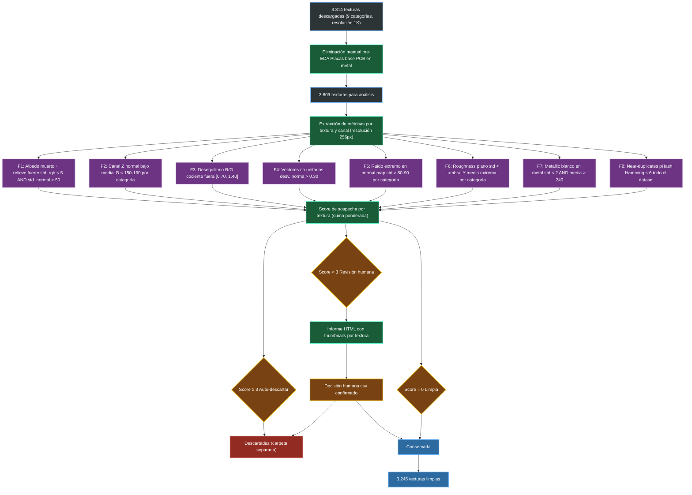

### 6.4 Estructura de almacenamiento final

Las 3.245 texturas limpias se almacenan en la siguiente estructura de carpetas, replicada tanto en local como en el dataset de Kaggle (`MatForge PBR Dataset`, privado):

```
maps/
├── rgb/          ← albedo (entrada del modelo)
│   ├── stone_0000.png
│   ├── wood_0000.png
│   └── ...
├── normal/       ← mapa Normal (salida objetivo)
├── roughness/    ← mapa Roughness (salida objetivo)
└── metallic/     ← mapa Metallic (solo categoría metal, 358 archivos)
```

Los nombres de archivo siguen el patrón `{categoría_original}_{índice:04d}.png`, lo que permite recuperar la categoría MatSynth original de cualquier textura a partir de su nombre. Esta información se usa en el relabeling para desambiguar clusters mixtos.

**Rutas en Kaggle** (usadas en todos los notebooks de entrenamiento):
```
/kaggle/input/matforge-pbr-dataset/maps/rgb/
/kaggle/input/matforge-pbr-dataset/maps/normal/
/kaggle/input/matforge-pbr-dataset/maps/roughness/
/kaggle/input/matforge-pbr-dataset/maps/metallic/
/kaggle/input/matforge-pbr-dataset/relabeling/relabeling_final.csv
/kaggle/input/matforge-pbr-dataset/relabeling/sampler_weights.json
```
### 6.5 Relabeling semántico: DINOv2 + HDBSCAN

Las nueve categorías originales de MatSynth son asignaciones nominales realizadas por los proveedores del material, no el resultado de un análisis visual sistemático. Como se documentó en la sección 6.1, existen inconsistencias significativas: texturas etiquetadas como `ceramic` con apariencia visual de piedra, texturas de `stone` que visualmente son plaster, y texturas de `plaster` que mezclan mosaico, mortero y pared rasgada en la misma categoría. Usar estas categorías directamente para construir un sampler balanceado introduciría un sesgo basado en etiquetas incorrectas que el modelo absorbería durante el entrenamiento.

La solución adoptada es un **relabeling semántico**: reasignar cada textura a un grupo funcional basado en su similitud visual real, determinada por un modelo de visión por computador que no depende de los tags originales. El pipeline completo combina tres tecnologías: extracción de representaciones visuales densas con DINOv2, reducción de dimensionalidad con PCA y UMAP, y clustering basado en densidad con HDBSCAN.

#### Por qué aprendizaje no supervisado

El relabeling es una tarea de **agrupación sin supervisión**: no disponemos de etiquetas correctas de antemano (precisamente porque el problema es que las etiquetas existentes son incorrectas). No podemos entrenar un clasificador supervisado para corregir los tags porque eso requeriría etiquetas correctas para entrenar. El aprendizaje no supervisado nos permite descubrir la estructura natural del dataset a partir únicamente de la información visual de las imágenes, sin depender de ninguna asignación previa.

#### Paso 1 — Extracción de representaciones visuales con DINOv2

El primer paso del pipeline es convertir cada imagen RGB en un vector numérico que capture su identidad visual de forma compacta y comparable. Para esto se utiliza **DINOv2** [11], un modelo de visión por computador desarrollado por Meta AI y publicado en 2024, entrenado sobre el corpus LVD-142M de forma auto-supervisada mediante una combinación de las técnicas DINO, iBOT y SwAV sobre arquitecturas Vision Transformer (ViT).

La propiedad clave de DINOv2 que lo hace idóneo para este uso es que produce **representaciones de propósito general** que no requieren fine-tuning: se usa directamente como extractor de características congelado, sin modificar ninguno de sus pesos. Sus representaciones han demostrado ser competitivas con modelos supervisados en tareas de clasificación, segmentación y estimación de profundidad, y han sido validadas específicamente para clustering y segmentación de materiales [13].

La arquitectura ViT de DINOv2 procesa la imagen dividiéndola en parches de 14×14 píxeles y produciendo dos tipos de salida en su capa final: el **token [CLS]**, un único vector que representa la imagen completa de forma global, y los **patch tokens**, uno por parche, que representan regiones locales. Para el relabeling de texturas completas se utiliza el **token [CLS]**, ya que captura la identidad visual global (tipo de material, patrón dominante, propiedades cromáticas y de textura) sin requerir ninguna agregación sobre regiones locales.

De la familia DINOv2 (ViT-S/14 small, ViT-B/14 base, ViT-L/14 large, ViT-g/14 giant) se selecciona la variante **ViT-S/14 (small)** con 21M de parámetros y embeddings de 384 dimensiones. Esta es la única variante viable dado el hardware disponible (CPU local sin GPU para esta fase): ocupa ~85 MB en disco y extrae embeddings de las 3.245 texturas en ~24 minutos en CPU. Las variantes base y large excederían el tiempo disponible y los límites de memoria.

Cada textura se redimensiona a **518×518 píxeles** antes de pasarla al modelo — resolución fija requerida por la variante `vit_small_patch14_dinov2.lvd142m` tal como está registrada en timm — y se normaliza con la media y desviación estándar de ImageNet:

$$\mu = [0.485, 0.456, 0.406], \quad \sigma = [0.229, 0.224, 0.225]$$

El resultado es una matriz de embeddings de forma (3.245, 384): cada fila es el vector de 384 dimensiones que representa una textura. El coste de almacenamiento total es 3.245 × 384 × 4 bytes ≈ 5 MB, completamente manejable en RAM.

#### Paso 2 — Reducción de dimensionalidad: PCA → UMAP

Trabajar directamente con los 384 dimensiones del embedding DINOv2 en HDBSCAN produciría resultados subóptimos. El motivo es la **maldición de la dimensionalidad**: en espacios de alta dimensión, las distancias entre todos los pares de puntos tienden a homogeneizarse, lo que hace que el concepto de "densidad local" que HDBSCAN necesita para encontrar clusters se degrade y la mayoría de los puntos queden clasificados como ruido [19]. La documentación oficial de UMAP explicita este problema y recomienda explícitamente reducir la dimensionalidad antes de aplicar HDBSCAN [15].

La reducción se realiza en dos etapas consecutivas:

**Etapa 2a — PCA lineal (384D → 50D)**

Se aplica en primer lugar un Análisis de Componentes Principales (PCA) que reduce los 384 dimensiones a 50, preservando el 82.3% de la varianza total. Esta reducción lineal cumple dos funciones: elimina las dimensiones con menor varianza (que en embeddings ViT corresponden principalmente a ruido numérico) y acelera significativamente la etapa de UMAP posterior, que es computacionalmente costosa en alta dimensión.

**Etapa 2b — UMAP no lineal (50D → 15D para clustering, 50D → 2D para visualización)**

Sobre el espacio de 50 dimensiones de PCA se aplica **UMAP** (Uniform Manifold Approximation and Projection) [15], que realiza una reducción no lineal preservando simultáneamente la estructura local (vecindades inmediatas) y la estructura global (relaciones entre grupos distantes) del manifold de datos.

La superioridad de UMAP frente a PCA como paso previo a HDBSCAN en embeddings de transformers ha sido demostrada empíricamente [17]: PCA, al ser una transformación lineal, colapsa las relaciones no lineales entre grupos semánticamente distintos que los embeddings ViT capturan. UMAP preserva esas relaciones, produciendo clusters separados y cohesionados que HDBSCAN puede detectar con alta fiabilidad. En datasets similares, el uso de UMAP reduce el tiempo de ejecución de HDBSCAN de más de 26 minutos a aproximadamente 5 segundos [16].

Se generan **dos proyecciones UMAP independientes** a partir del mismo espacio PCA de 50D:

- **Proyección de clustering (50D → 15D)**: usada como entrada de HDBSCAN. Los parámetros clave son `n_neighbors=30` (captura estructura global, no solo vecinos inmediatos), `min_dist=0.0` (permite que los puntos estén muy juntos, maximizando la separación entre clusters) y `metric='cosine'` (métrica natural para embeddings de transformers, donde la similitud angular entre vectores es más informativa que la distancia euclidiana).

- **Proyección de visualización (50D → 2D)**: usada exclusivamente para generar los paneles UMAP que permiten la validación visual del clustering. Se usa con `min_dist=0.1` para una visualización más legible. Esta proyección **no se usa para el clustering**: es independiente y tiene parámetros optimizados para la visualización humana, no para la calidad del agrupamiento.

#### Paso 3 — Clustering con HDBSCAN

Sobre el espacio UMAP de 15 dimensiones se aplica **HDBSCAN** (Hierarchical Density-Based Spatial Clustering of Applications with Noise) [35][19], un algoritmo de clustering basado en densidad que agrupa puntos en regiones donde la densidad local supera un umbral adaptativo, sin requerir especificar el número de clusters a priori.

HDBSCAN tiene dos ventajas fundamentales frente a algoritmos como KMeans para esta tarea. Primero, no asume que los grupos sean esféricos o tengan tamaño uniforme: puede encontrar clusters de forma arbitraria, lo que es apropiado para grupos de materiales que pueden tener distribuciones visuales complejas. Segundo, asigna automáticamente un label de **ruido (-1)** a los puntos que no pertenecen claramente a ningún cluster, que corresponden exactamente a las texturas genuinamente ambiguas que no deberían asignarse arbitrariamente a ningún grupo.

Los parámetros configurados son:

- **`min_cluster_size=30`**: número mínimo de texturas para que un grupo sea considerado un cluster. Con el grupo más pequeño esperado (marble, ~141 texturas), un valor de 30 da margen suficiente para detectar ese grupo sin generar clusters espurios de texturas accidentalmente similares.
- **`min_samples=5`**: controla la robustez del clustering. Un valor bajo permite que texturas en la periferia de un grupo denso sean incluidas en él, reduciendo el porcentaje de ruido sin sacrificar la pureza de los clusters centrales.
- **`metric='euclidean'`**: métrica de distancia aplicada sobre el espacio UMAP. Se usa euclídea (no coseno) porque UMAP ya ha transformado el espacio de similitud coseno a uno más euclidiano durante la proyección; aplicar coseno sobre el espacio UMAP sería una doble transformación no justificada.
- **`cluster_selection_method='eom'`** (Excess of Mass): produce clusters de tamaño variable, adecuado cuando los grupos no tienen tamaño uniforme. Esto es exactamente nuestro caso: marble tiene ~141 texturas y stone_rough tiene ~700.

#### Métricas de calidad del clustering

La evaluación del resultado de HDBSCAN requiere métricas adaptadas a clustering basado en densidad. El **Silhouette Score**, aunque es la métrica de clustering más conocida, asume que los clusters son convexos y de densidad uniforme [20], lo que lo hace inadecuado para HDBSCAN, que produce clusters de forma arbitraria. El Silhouette Score puede dar puntuaciones altas a resultados malos y bajas a resultados buenos cuando se aplica a clustering basado en densidad [21].

La métrica correcta es el **DBCV (Density-Based Clustering Validation)** [22], diseñada específicamente para algoritmos como HDBSCAN. DBCV mide la relación entre la densidad interna de cada cluster y la densidad de separación entre clusters, considerando además los puntos de ruido como parte integral de la evaluación. Su rango es [-1, 1], donde valores próximos a 1 indican clusters densos y bien separados.

Como métricas complementarias se calculan también el **porcentaje de ruido** (fracción de texturas asignadas al label -1) y el **NMI** (Normalized Mutual Information) entre los clusters de HDBSCAN y las categorías originales de MatSynth. El NMI no se usa como criterio de calidad absoluta —un NMI perfecto de 1.0 significaría que el clustering simplemente replicó los tags incorrectos— sino como herramienta diagnóstica: un NMI de ~0.4-0.6 indica que el clustering descubrió estructura real más allá de los tags originales.

#### Resultados del clustering y fusión en grupos funcionales

HDBSCAN encontró **37 clusters** con los parámetros configurados, un número mayor que los 8 grupos funcionales objetivo. Esto no es un fallo del algoritmo: DINOv2 distingue subtipos visuales dentro de categorías amplias (madera clara vs oscura, piedra rugosa vs adoquines) que son agrupaciones reales pero más granulares de lo necesario para el sampler.

Las métricas obtenidas fueron:
- **DBCV = 0.3279**: en el rango aceptable (0.3–0.5) para un dataset con alta heterogeneidad semántica.
- **Ruido = 15.1%**: en el límite superior del rango aceptable (5–15%), coherente con la diversidad real del dataset.
- **NMI = 0.3604**: indica descubrimiento de estructura visual real más allá de los tags nominales.

Los 37 clusters se fusionaron manualmente en **8 grupos funcionales** mediante análisis de la composición por categoría original de cada cluster: si un cluster tiene un 70% de texturas cuyo nombre de archivo indica `stone`, se asigna al grupo `stone_rough`. Esta fusión es el único paso manual de todo el pipeline y requirió inspección de la tabla de composición por cluster y los paneles de visualización UMAP generados automáticamente.

Los 8 grupos funcionales resultantes, con sus texturas finales y sus pesos en el sampler, son:

| Grupo funcional | Texturas | Peso sampler | Rol en el entrenamiento |
|---|---|---|---|
| `stone_rough` | 479 | 1.0 | Dominio principal |
| `wood` | 658 | 1.0 | Vacuna de dominio |
| `ceramic_ground` | 503 | 1.0 | Vacuna de dominio |
| `mixed_ambiguous` | 775 | 0.5 | Heterogéneo (23.9% del total) |
| `brick_terracotta` | 276 | 1.0 | Dominio principal |
| `marble_smooth` | 189 | 1.2 | Dominio principal (upweight por escasez) |
| `metal` | 238 | 1.3 | Vacuna de dominio (upweight por señal Metallic escasa) |
| `concrete_plaster` | 127 | 1.0 | Dominio principal (grupo más pequeño) |

El grupo `mixed_ambiguous` (23.9% del total) corresponde a las texturas que HDBSCAN asignó al label de ruido (-1): materiales genuinamente heterogéneos sin una apariencia visual dominante. No representan un error del clustering sino una realidad del dataset. Se incluyen en el entrenamiento con peso 0.5 en el sampler para que contribuyan a la generalización del modelo sin dominar el entrenamiento.

Estos grupos funcionales se usan **exclusivamente para el sampler balanceado**, no como input del modelo. MatForge no es un modelo condicionado por categoría de material: aprende a predecir los mapas PBR directamente desde la imagen RGB sin necesidad de información auxiliar sobre el tipo de material.

#### Esquema del pipeline de relabeling

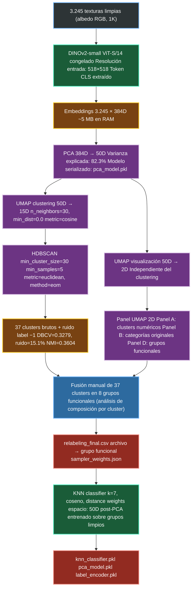

#### Clasificador KNN para inferencia en Streamlit

Además del relabeling del dataset de entrenamiento, el pipeline genera un clasificador ligero que se integra en la aplicación Streamlit para identificar automáticamente el grupo de material de cualquier textura que el usuario cargue. Esto permite mostrar al usuario el tipo de material detectado antes de que MatForge genere los mapas, añadiendo valor informativo a la herramienta.

El clasificador elegido es **KNN (K-Nearest Neighbors)** con k=7, métrica coseno y pesos por distancia (los vecinos más cercanos contribuyen más a la decisión). KNN es idóneo para esta tarea por tres razones: no requiere entrenamiento real en el sentido clásico (almacena los embeddings del dataset y clasifica por proximidad), tiene latencia de ~1-5 ms por consulta sobre 3.245 embeddings de 50 dimensiones en CPU [24], y es intrínsecamente interpretable (se puede mostrar al usuario las texturas más similares del dataset).

El clasificador opera sobre el espacio de **50 dimensiones post-PCA** (no sobre el espacio UMAP de 15D), porque la proyección UMAP no es determinista para puntos nuevos y no garantiza la misma organización espacial para texturas fuera del dataset de entrenamiento. PCA, al ser una transformación lineal determinista, sí produce representaciones consistentes para cualquier imagen nueva.

#### Esquema del pipeline de inferencia en Streamlit

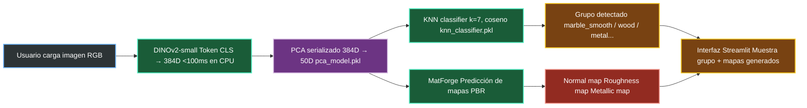

### 6.6 Pipeline completo del dataset

El esquema siguiente integra todas las etapas descritas en las secciones anteriores en una vista unificada del proceso completo de construcción del dataset de MatForge:

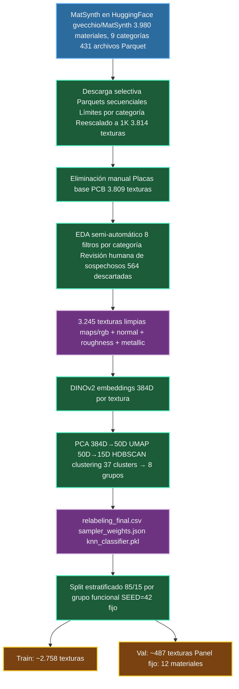

### 6.7 Split estratificado y reproducibilidad

El split train/validación se realiza de forma **estratificada por grupo funcional**: cada grupo aporta exactamente el 85% de sus texturas al conjunto de entrenamiento y el 15% a validación. Esto garantiza que incluso los grupos más pequeños (como `concrete_plaster`, con 127 texturas) tengan representación suficiente en el conjunto de validación para que sus métricas sean estadísticamente significativas.

El split se genera **una única vez** con semilla fija (SEED=42) y se persiste como archivo CSV. Todos los experimentos usan exactamente el mismo split para garantizar que las comparaciones de métricas entre configuraciones sean válidas.

Para el conjunto de validación se seleccionan adicionalmente **12 materiales de referencia fijos** (2 por cada grupo de dominio principal), que se usan para generar paneles visuales de inferencia a resolución completa 1K cada cierto número de épocas. Estos paneles permiten evaluar la calidad visual del modelo de forma complementaria a las métricas cuantitativas.

### 6.8 Sampler balanceado con garantía de representación del grupo metal

El desbalance entre grupos (desde 127 texturas en `concrete_plaster` hasta 775 en `mixed_ambiguous`) y el desbalance extremo en la señal Metallic (238 texturas con mapa Metallic real vs. 3.007 con Metallic cero) requieren una estrategia de muestreo específica.

Se implementa un **sampler con pesos por textura** (`WeightedRandomSampler` de PyTorch) usando los pesos definidos en `sampler_weights.json`. Los pesos asignados son:

- `mixed_ambiguous`: 0.5 (reducido para evitar que domine el entrenamiento con ejemplos heterogéneos)
- `marble_smooth`: 1.2 (elevado por escasez relativa dentro del dominio principal)
- `metal`: 1.3 (elevado para compensar la escasez de señal Metallic real)
- Resto de grupos: 1.0

Adicionalmente, se garantiza que **al menos 2 texturas del grupo `metal` estén presentes en cada batch** de 8 muestras. Con 238 texturas metálicas sobre 3.245 totales, un peso de 1.3 solo eleva la frecuencia de aparición del metal del 7.3% al ~9.5% por batch. En un batch de 8, eso equivale a menos de 1 textura metálica de media. Garantizar 2 texturas metálicas por batch es la única forma de asegurar que la cabeza Metallic recibe gradiente real en cada iteración de entrenamiento, evitando que colapse a predecir cero constante.

---

## 7. Augmentación de datos

La augmentación para texturas PBR tiene una peculiaridad que no existe en datasets de imágenes naturales: el mapa de **Normales** no es una imagen RGB cualquiera, sino un campo vectorial donde cada píxel almacena un vector de orientación de superficie en espacio tangente OpenGL (+Z apuntando hacia afuera). Esto implica que **cualquier transformación geométrica sobre la imagen debe ir acompañada de la transformación matemática correspondiente sobre los vectores del mapa de Normales**.

### 7.1 Transformaciones geométricas coherentes

Para un normal map N con componentes (X, Y, Z) en rango [-1, 1]:

| Transformación espacial | Transformación del Normal map |
|---|---|
| Flip horizontal | (-X, Y, Z) + flip espacial del tensor |
| Flip vertical | (X, -Y, Z) + flip espacial del tensor |
| Rotación 90° CCW | (-Y, X, Z) + rotación espacial del tensor |
| Rotación 180° | (-X, -Y, Z) + rotación espacial del tensor |
| Rotación 270° CCW | (Y, -X, Z) + rotación espacial del tensor |

Esta transformación es una consecuencia geométrica directa del sistema de coordenadas tangente OpenGL: si la imagen se voltea horizontalmente, la dirección X de las normales se invierte. Si solo se aplica la transformación espacial del tensor sin invertir los componentes correspondientes, el mapa de Normales resultante es físicamente incorrecto, aunque visualmente pueda parecer razonable.

Las rotaciones se restringen a **múltiplos de 90°** por dos motivos: las rotaciones arbitrarias requieren interpolación del mapa de Normales, lo que degrada la precisión del campo vectorial en texturas de detalle fino; además, algunos materiales con anisotropía direccional (madera con veta, telas) pueden no ser válidos bajo rotaciones arbitrarias.

Todas las transformaciones geométricas se aplican de forma idéntica a los cuatro tensores (RGB, Normal, Roughness, Metallic) con las mismas coordenadas de crop y el mismo tipo de transformación, garantizando coherencia espacial entre mapas.

### 7.2 Augmentación fotométrica: solo en el RGB de entrada

Las perturbaciones de color se aplican **únicamente al RGB de entrada**, nunca a los mapas GT. La justificación es física: el modelo recibe imágenes capturadas bajo distintas condiciones de iluminación y cámara; perturbar el color de entrada simula esa variabilidad. Los mapas GT, en cambio, son propiedades intrínsecas del material independientes de la captura.

Los rangos de jitter son deliberadamente conservadores para no introducir pares input-GT físicamente incoherentes:

- Brillo: ±8%
- Contraste: ±8%
- Saturación: ±5%
- Hue: ±2°
- Blur gaussiano ligero (p=0.10)
- Ruido gaussiano ligero (p=0.10)

### 7.3 Lo que no se usa

**Rotaciones arbitrarias**: degradan microdetalle por interpolación y no respetan la anisotropía de materiales como madera.

**CutMix / MixUp**: las mezclas lineales entre mapas PBR de materiales distintos producen combinaciones físicamente incoherentes (una textura que es 50% madera y 50% metal no existe en la realidad y el modelo aprendería correlaciones erróneas).

**Perturbaciones sobre GT**: los mapas de Normales, Roughness y Metallic no se perturban con jitter de ningún tipo, solo con las transformaciones geométricas coherentes descritas en 7.1.

---

## 8. Renderer Cook-Torrance diferenciable

### 8.1 Por qué un renderer en la función de pérdida

Las pérdidas de regresión estándar (L1, L2, coseno) evalúan el error directamente sobre los valores de los mapas predichos. Esta estrategia tiene una limitación importante: dos mapas pueden tener un error L1 similar pero producir renderizados de aspecto completamente diferente, y a la inversa, un mapa con un error L1 mayor puede producir un renderizado más correcto bajo iluminación real.

Incorporar una **pérdida de renderizado diferenciable** obliga al modelo a producir mapas que, cuando se usan para renderizar una superficie bajo iluminación física, produzcan el mismo resultado visual que renderizar con los mapas ground truth. Esta idea fue introducida por Deschaintre et al. [23] y es el componente que más diferencia MatForge de DeepPBR.

Para que el renderer sea parte de la función de pérdida, debe ser **diferenciable**: los gradientes deben fluir hacia atrás a través del proceso de renderizado hasta llegar a los parámetros del modelo. Esto descarta el uso de renderers 3D de propósito general (como nvdiffrast o PyTorch3D), que están optimizados para mallas de triángulos y no ofrecen el modelo de iluminación Cook-Torrance listo para usar. MatForge implementa el renderer como código PyTorch puro, sin dependencias externas de renderizado.

### 8.2 El modelo de reflexión Cook-Torrance

El modelo Cook-Torrance [25] describe cómo una superficie refleja la luz en función de su microfacetado. La reflectancia total en un punto de la superficie es la suma de dos componentes:

**Componente difusa (Lambertiana)**:
$$f_d = \frac{k_D \cdot \text{albedo}}{\pi}$$

La componente difusa representa la luz que penetra en el material y se dispersa en todas las direcciones de forma uniforme. El coeficiente $k_D$ controla qué fracción de la energía se difunde y depende del metallic y del Fresnel.

**Componente especular (Cook-Torrance)**:
$$f_s = \frac{D(\mathbf{n}, \mathbf{h}) \cdot G(\mathbf{n}, \mathbf{l}, \mathbf{v}) \cdot F(\mathbf{v}, \mathbf{h})}{4 \cdot (\mathbf{n} \cdot \mathbf{l}) \cdot (\mathbf{n} \cdot \mathbf{v})}$$

donde:
- $\mathbf{n}$ es el vector normal de la superficie (predicho por el modelo)
- $\mathbf{h} = \frac{\mathbf{l} + \mathbf{v}}{|\mathbf{l} + \mathbf{v}|}$ es el half-vector entre la dirección de luz $\mathbf{l}$ y la dirección de cámara $\mathbf{v}$
- $D$ es la función de distribución normal (NDF), que controla la forma del lóbulo especular
- $G$ es el término geométrico de oclusión entre microfacetas
- $F$ es el término de Fresnel, que controla cuánta luz se refleja en función del ángulo

**Radiancia total en el punto**:
$$L_{out} = \sum_{k} \left[ (f_d + f_s) \cdot L_k \cdot \max(\mathbf{n} \cdot \mathbf{l}_k, 0) \right]$$

donde la suma es sobre las $K$ luces del batch.

### 8.3 Los tres términos en detalle

#### Distribución Normal GGX (término D)

La distribución GGX/Trowbridge-Reitz [26] es el estándar moderno para modelar la distribución estadística de las microfacetas de una superficie:

$$D_{GGX} = \frac{\alpha^2}{\pi \left[ (n \cdot h)^2 (\alpha^2 - 1) + 1 \right]^2}$$

con $\alpha = \text{roughness}^2$. El doble cuadrado del roughness (llamado *perceptual roughness remapping*) es la convención de Unreal Engine 4 [27]: hace que los cambios de roughness en el rango [0,1] sean perceptualmente lineales para el artista.

Un roughness bajo concentra toda la energía especular en un lóbulo estrecho (superficie espejada); un roughness alto la distribuye ampliamente (superficie mate).

#### Geometría Smith-Schlick (término G)

El término geométrico $G$ modela la probabilidad de que las microfacetas se ocluyan entre sí, tanto desde la dirección de la luz como desde la dirección de la cámara. Se usa la aproximación Schlick-GGX de UE4 para iluminación analítica:

$$G_1(x) = \frac{x}{x(1-k) + k}, \quad k = \frac{(\text{roughness} + 1)^2}{8}$$

$$G = G_1(\mathbf{n} \cdot \mathbf{v}) \cdot G_1(\mathbf{n} \cdot \mathbf{l})$$

#### Fresnel de Schlick (término F)

El término de Fresnel modela que la reflectancia de cualquier superficie aumenta cuando la luz la roza en ángulo rasante. La aproximación de Schlick [28] es computacionalmente eficiente y suficientemente precisa:

$$F = F_0 + (1 - F_0)(1 - \mathbf{v} \cdot \mathbf{h})^5$$

Bajo el **workflow metallic/roughness de UE4** [27], el valor de $F_0$ (reflectancia a incidencia normal) se interpola entre el valor dieléctrico estándar (0.04, que representa el 4% de reflexión especular de la mayoría de materiales no conductores) y el albedo del material en función del metallic:

$$F_0 = 0.04 \cdot (1 - M) + \text{albedo} \cdot M$$

Esto implica que los metales ($M \approx 1$) tienen una reflectancia especular tintada por su color propio, mientras que los dieléctricos ($M \approx 0$) tienen una reflectancia especular neutra del 4%.

El coeficiente difuso $k_D$ se calcula como:

$$k_D = (1 - F) \cdot (1 - M)$$

Los metales no tienen componente difusa ($k_D = 0$ cuando $M = 1$), lo que es físicamente correcto: los conductores no transmiten luz al interior del material.

### 8.4 Implementación diferenciable y estabilidad numérica

El renderer se implementa como código PyTorch puro, sin dependencias de rasterización o mallas de triángulos. Para texturas tileables planas, la dirección de visión $\mathbf{v}$ es constante e igual a $(0, 0, 1)$ (cámara ortográfica perpendicular a la superficie), lo que simplifica el cálculo considerablemente.

La compatibilidad con AMP (Automatic Mixed Precision) requiere proteger cuatro puntos donde los gradientes pueden explotar o colapsar bajo aritmética float16:

| Punto crítico | Problema | Protección |
|---|---|---|
| Renormalización de normales | Si `N_pred` tiene norma casi nula, `N / ||N||` produce NaN | `clamp(min=1e-6)` en la norma antes de dividir |
| Half-vector H = normalize(L + V) | Cuando L ≈ -V, la norma de L+V colapsa a cero | `clamp(min=1e-6)` en la norma |
| Denominador NDF GGX | Con roughness ≈ 0 y NoH ≈ 1, el denominador se hace muy pequeño | `clamp(min=1e-6)` sobre $\pi \cdot \text{denom}^2$ |
| Denominador especular 4·NoL·NoV | En ángulos rasantes, NoL y NoV se acercan a cero | `clamp(min=1e-4)` sobre el producto |

### 8.5 Muestreo de luces por batch

En cada paso de entrenamiento se generan $K=3$ luces aleatorias por batch para que el modelo aprenda a producir mapas correctos bajo diversas iluminaciones, no solo bajo una luz canónica. Las direcciones de luz se muestrean en el hemisferio superior con $\cos(\theta) \in [0.25, 0.92]$ para evitar dos modos degenerados:

- **Luz rasante** ($\cos(\theta)$ cerca de 0): produce renders casi completamente negros donde la señal del render loss es nula.
- **Luz totalmente frontal** ($\cos(\theta)$ cerca de 1): satura el canal especular y domina el loss.

El rango [0.25, 0.92] garantiza renders con señal diferenciadora real en todo momento.

### 8.6 Diagrama del renderer

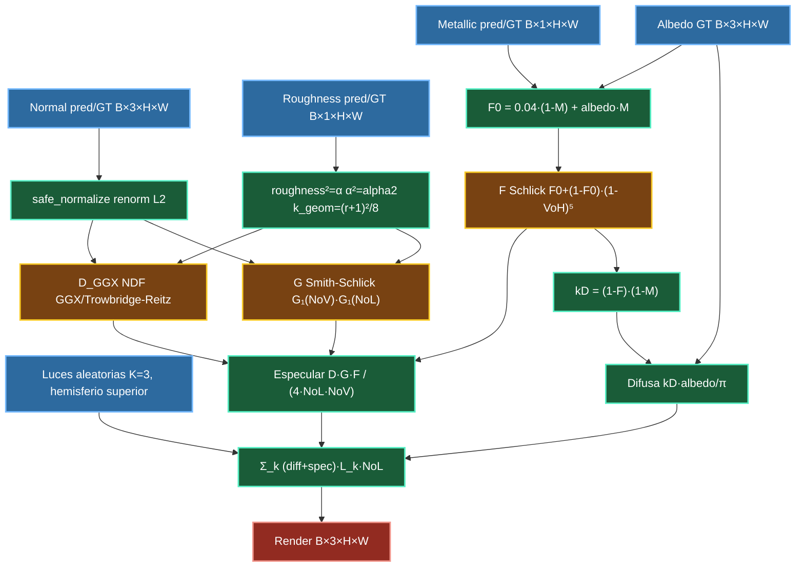

---

## 9. Función de pérdida compuesta

La función de pérdida total de MatForge combina seis componentes:

$$L_{total} = \alpha \cdot L_{normal} + \beta \cdot L_{roughness} + \zeta \cdot L_{metallic} + \gamma \cdot L_{grad} + \delta_1 \cdot L_{render,L1} + \delta_2 \cdot L_{render,LPIPS}$$

Cada componente tiene un rol distinto y justificación propia.

### 9.1 L_normal: pérdida de normales

$$L_{normal} = L_{coseno}(N_{pred}, N_{gt}) + 0.25 \cdot L_{Charbonnier}(N_{pred}, N_{gt})$$

**Pérdida coseno** ($\alpha = 1.0$):
$$L_{coseno} = 1 - \text{mean}(\hat{N}_{pred} \cdot \hat{N}_{gt})$$

donde $\hat{N}$ indica el vector renormalizado L2. Esta pérdida mide directamente el error angular entre los vectores normales predichos y los reales, que es la métrica geométricamente correcta para mapas de normales. Su valor es 0 cuando los vectores son idénticos y 2 cuando son opuestos.

**Pérdida Charbonnier** (peso 0.25):
$$L_{Charbonnier}(x, y) = \text{mean}\left(\sqrt{(x - y)^2 + \varepsilon^2}\right), \quad \varepsilon = 0.001$$

Charbonnier es una aproximación diferenciable de la norma L1: se comporta como L2 cerca de cero (gradientes suaves) y como L1 para errores grandes (gradientes constantes, más robusta ante outliers). Se usa como componente auxiliar para estabilizar el aprendizaje canal a canal, complementando la pérdida coseno que opera sobre los vectores completos.

### 9.2 L_roughness: pérdida de roughness

$$L_{roughness} = L_{Charbonnier}(R_{pred}, R_{gt}) \quad (\beta = 0.8)$$

El roughness es un escalar en [0,1]. Solo se usa Charbonnier porque la pérdida coseno no tiene sentido para escalares. El peso $\beta = 0.8$ refleja que la pérdida de normales es la más importante y el roughness es secundario.

### 9.3 L_metallic: pérdida de metallic con compensación de desbalance

$$L_{metallic} = 0.5 \cdot \text{BCEWithLogitsLoss}(M_{logits}, M_{gt}, \text{pos\_weight}=8.0) \quad (\zeta = 0.5)$$

El mapa Metallic presenta un desbalance extremo: solo 238 de las 3.245 texturas tienen materiales genuinamente metálicos. Con una pérdida de regresión estándar (como Charbonnier), los 3.007 negativos triviales (texturas no metálicas con GT=0) dominarían el gradiente y la cabeza aprendería a predecir siempre cero, lo que sería correcto en el 92.7% de los casos pero completamente inútil.

`BCEWithLogitsLoss` con `pos_weight=8.0` escala la contribución de los ejemplos positivos (metales reales) en un factor de 8 respecto a los negativos, compensando el desbalance. La cabeza emite logits sin activación, y `BCEWithLogitsLoss` aplica internamente el Sigmoid para mayor estabilidad numérica.

El valor `pos_weight=8.0` (en lugar del ratio exacto 12.6 del desbalance) es deliberadamente conservador: un peso exacto tiende a generar falsos positivos excesivos cuando la señal real es escasa.

### 9.4 L_grad: pérdida de gradiente Sobel multiescala

$$L_{grad} = \frac{1}{4} \sum_{s \in \{1, 2\}} \left[ || abla_x N_{pred,s} -  abla_x N_{gt,s}||_1 + || abla_y N_{pred,s} -  abla_y N_{gt,s}||_1 + || abla_x R_{pred,s} -  abla_x R_{gt,s}||_1 + || abla_y R_{pred,s} -  abla_y R_{gt,s}||_1 \right] \quad (\gamma = 0.15)$$

donde $s \in \{1, 2\}$ indica la escala (resolución nativa y reducción 2×) y $ abla_x$, $ abla_y$ son los gradientes calculados con el operador Sobel.

Esta pérdida penaliza diferencias en los bordes y transiciones de los mapas de Normales y Roughness, complementando la pérdida de reconstrucción global. El operador Sobel es preferible al Laplaciano para esta aplicación porque incorpora una pequeña agregación local que lo hace menos sensible al ruido cuantitativo de las texturas.

Dos escalas son el equilibrio óptimo: la primera cubre detalles finos a resolución nativa; la segunda, a resolución reducida, penaliza transiciones más gruesas. Una tercera escala añadiría coste computacional sin señal adicional relevante.

### 9.5 L_render: pérdida de renderizado físico

$$L_{render} = \delta_1 \cdot L1(\text{render}_{pred}, \text{render}_{gt}) + \delta_2 \cdot \text{LPIPS}(\text{render}_{pred}, \text{render}_{gt})$$

Ambos términos se calculan sobre imágenes obtenidas aplicando el renderer Cook-Torrance a los mapas predichos y ground truth respectivamente. Se usan K=3 luces aleatorias por batch.

**L1 sobre renders** ($\delta_1$): penaliza diferencias absolutas en la radiancia final. Es la señal más directa de coherencia física global.

**LPIPS sobre renders** ($\delta_2$): LPIPS [29] usa las activaciones de una red AlexNet preentrenada para medir similitud perceptual. Se usa con backbone `alex` por su mejor relación coste-rendimiento en el hardware disponible. Esta pérdida es especialmente sensible a diferencias de nitidez y textura que L1 no captura bien.

### 9.6 Schedule de activación progresiva del render loss

Los pesos $\delta_1$ y $\delta_2$ no son constantes a lo largo del entrenamiento. Si el render loss se activa desde la primera época, puede dominar sobre la pérdida de normales antes de que el modelo haya aprendido orientaciones angulares básicas. La activación progresiva protege las primeras épocas y garantiza que la señal supervisada directa establezca las bases antes de introducir la señal física:

| Épocas | $\delta_1$ (render L1) | $\delta_2$ (render LPIPS) | Justificación |
|---|---|---|---|
| 0–4 | 0.00 | 0.00 | Solo pérdidas supervisadas directas. El modelo aprende orientaciones básicas. |
| 5–14 | 0.10 | 0.00 | Render L1 activo con peso moderado. LPIPS todavía desactivado (muy costoso inicialmente). |
| 15–89 | 0.15 | 0.03 | Render loss completo. El modelo ya tiene estructura básica correcta. |

### 9.7 Diagrama de la función de pérdida completa

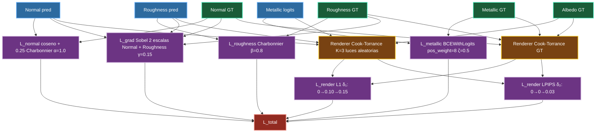

---

## 10. Métricas de evaluación

Las métricas de evaluación de MatForge cubren tres dimensiones: error angular en normales, error de reconstrucción en roughness, y calidad perceptual del renderizado.

### 10.1 Mean Angular Error (MAE angular) para normales

$$\text{MAE}_{ang} = \frac{180}{\pi} \cdot \text{mean}\left(\arccos\left(\text{clamp}\left(\hat{N}_{pred} \cdot \hat{N}_{gt}, -1+\varepsilon, 1-\varepsilon\right)\right)\right)$$

donde $\hat{N}$ indica el vector renormalizado L2. El resultado se expresa en grados, lo que hace la métrica directamente interpretable: un error de 10° significa que los vectores normales predichos apuntan en promedio 10° en la dirección equivocada. Un error < 10° es el objetivo de referencia para materiales con detalle moderado.

### 10.2 Métricas de roughness y evaluación de renders

Para roughness: MAE y RMSE directamente sobre los valores en [0,1].

Para la evaluación del render: LPIPS calculado sobre imágenes renderizadas con 5 luces fijas (más que las 3 de entrenamiento, para mayor estabilidad de la métrica en validación). Los renders se calculan usando el albedo GT para ambos modelos, de modo que la comparación evalúa exclusivamente el efecto de los mapas Normal, Roughness y Metallic.

### 10.3 Métrica compuesta S para selección de checkpoint

$$S = \text{MAE}_{normal}^{deg} + 0.6 \cdot \text{MAE}_{roughness} + 0.2 \cdot \text{LPIPS}_{render}$$

La métrica compuesta $S$ (menor es mejor) combina las tres dimensiones de evaluación en un único número que permite seleccionar automáticamente el mejor checkpoint sin depender de juicios visuales subjetivos. Los pesos reflejan la importancia relativa de cada mapa: las normales dominan, el roughness contribuye significativamente, y el LPIPS del render aporta la dimensión perceptual.

---

## 11. Estrategia de entrenamiento

### 11.1 Hiperparámetros generales

| Hiperparámetro | Valor | Justificación |
|---|---|---|
| Optimizador | AdamW | Weight decay desacoplado; estándar para fine-tuning de transformers |
| LR encoder | 1×10⁻⁴ | LR reducido para proteger el preentrenamiento de ImageNet |
| LR decoder + cabezas | 3×10⁻⁴ | LR más alto para el decoder que aprende desde cero |
| Weight decay | 1×10⁻² | Regularización estándar para AdamW en transformers |
| Batch size | 8 | Ajustado a la VRAM disponible (T4 16GB) con AMP |
| Gradient clipping | max_norm = 1.0 | Previene explosión de gradientes en fases tempranas |
| Precisión | AMP (float16 + float32) | Reduce VRAM ~50%, acelera ~30% en Tensor Cores |
| Épocas totales | 90 | Estimación validada con dry run; puede ajustarse según señal temprana |
| Resolución base | 256×256 | Múltiplo de 32, compatible con PVT-v2-B1 |
| Resolución máxima | 320×320 | Curriculum tardío para refinamiento de detalle |

El ratio 1:3 entre el LR del encoder y el del decoder+cabezas es una heurística bien establecida para el fine-tuning de encoders preentrenados: el encoder ya tiene representaciones útiles y debe adaptarse con cautela, mientras que el decoder parte sin preentrenamiento y puede aprender más rápido.

### 11.2 Congelación y descongelamiento gradual del encoder

Durante las primeras **2-3 épocas**, los stages 1 y 2 del encoder PVT-v2-B1 se congelan. El objetivo es proteger las representaciones de bajo nivel del preentrenamiento (bordes, texturas finas) mientras el decoder y las cabezas de salida aprenden a usar los feature maps del encoder.

Las etapas de congelación se diseñan así:

- **Épocas 0-2** (congelado): solo el decoder y las cabezas se actualizan. El encoder produce feature maps fijos con su conocimiento de ImageNet.
- **Época 3 en adelante** (descongelado): todo el modelo se actualiza. El encoder comienza a especializarse en materiales PBR.

La evidencia en la literatura de fine-tuning de transformers visuales apoya el uso de LR diferenciado por grupos de parámetros (encoder más bajo, decoder más alto) como alternativa o complemento al congelamiento parcial [33]. La pauta de 2-3 épocas es más conservadora que los 5 períodos usados en algunos trabajos, y refleja que con un dataset de 3.245 texturas el preentrenamiento merece protección breve pero no excesiva.

### 11.3 Exponential Moving Average (EMA)

A partir de la época en que se descongela el encoder, se activa un **Exponential Moving Average** de los pesos del modelo con decaimiento 0.999:

$$\theta_{EMA,t} = 0.999 \cdot \theta_{EMA,t-1} + 0.001 \cdot \theta_t$$

El EMA mantiene una copia suavizada de los pesos que promedia las fluctuaciones del entrenamiento estocástico. Esta copia se usa durante la validación para producir métricas más estables y en inferencia como el modelo final.

Activar el EMA cuando el encoder está congelado tiene poco efecto práctico, porque los pesos congelados no cambian y el EMA sobre el decoder recién inicializado aún no ha acumulado suficiente historia. Activarlo en la época 3, cuando todo el modelo está en movimiento, garantiza que la media exponencial opera sobre parámetros que ya han convergido parcialmente.

Con batch size 8 y ~2.758 texturas de entrenamiento, hay aproximadamente 344 iteraciones por época. Con decay 0.999, la ventana efectiva del EMA es 1/(1-0.999) ≈ 1.000 iteraciones, equivalente a 2-3 épocas completas. Esto significa que el EMA empieza a diferenciarse significativamente de los pesos instantáneos aproximadamente en la época 5-6.

### 11.4 Scheduler: warmup lineal + cosine decay

El schedule de learning rate combina dos fases:

**Fase de warmup** (épocas 0-4): el LR sube linealmente desde el 10% del valor objetivo hasta el valor completo. Esto evita que los primeros pasos de entrenamiento, con gradientes potencialmente ruidosos, den saltos demasiado grandes en los pesos.

**Fase cosine** (épocas 5-89): el LR decae siguiendo una curva coseno desde el valor máximo hasta un mínimo de 1×10⁻⁶. El decaimiento coseno es más suave que el decaimiento exponencial y evita caídas bruscas que pueden desestabilizar el entrenamiento.

El warmup y la congelación del encoder (épocas 0-2) se solapan parcialmente: durante las dos primeras épocas, el warmup aumenta el LR del decoder mientras el encoder está congelado. Esto permite que el decoder establezca una base funcional antes de que el encoder empiece a moverse.

### 11.5 Curriculum de resolución

En la **época 65**, la resolución de los crops de entrenamiento aumenta de 256×256 a 320×320 píxeles. Este curriculum tardío tiene dos objetivos:

1. **Refinamiento de detalle**: con crops más grandes, el modelo ve más contexto por muestra y puede aprender transiciones más graduales entre regiones.
2. **Mejora de la generalización**: en inferencia, el sistema usa ventana deslizante con Hann blending sobre imágenes de cualquier tamaño. Entrenar con resoluciones variadas mejora la robustez del modelo ante diferentes tamaños de parche.

El curriculum se introduce tarde (a 65 de 90 épocas) para no interferir con la fase de aprendizaje principal. En las últimas 25 épocas, el modelo ya ha convergido estructuralmente y el cambio de resolución solo añade una capa de refinamiento sin perturbar la convergencia global.

---

## 12. Plan de entrenamiento por tramos

El entrenamiento se divide en cuatro tramos con criterios de decisión explícitos al final de cada uno.

```mermaid
gantt
    title Plan de entrenamiento MatForge
    dateFormat X
    axisFormat Época %s

    section Validación inicial
    Dry run 5 épocas           :milestone, 0, 5

    section Tramo 1
    Épocas 0-19                :active, 0, 20
    Criterio de pivot Plan A-B :milestone, 20, 20

    section Tramo 2
    Épocas 20-89               :20, 90
    Curriculum 320px ep65      :milestone, 65, 65
    Análisis de convergencia   :milestone, 90, 90

    section GAN fine-tuning
    Investigación discriminador :90, 95
    Épocas GAN 90-109          :95, 110
    Evaluación final           :milestone, 110, 110
```

### 12.1 Dry run: 5 épocas de validación técnica

Antes de comprometer el presupuesto de GPU completo, se ejecutan 5 épocas con el objetivo exclusivo de validar que el pipeline técnico funciona correctamente:

- **Uso de VRAM**: confirmar que el modelo cabe en T4 16GB con batch size 8 y AMP sin OOM.
- **Tiempo por época**: establecer la estimación de tiempo total para verificar que cabe en el presupuesto de cómputo disponible.
- **Flujo de gradientes**: verificar que todas las componentes de la pérdida tienen gradientes no nulos y que el entrenamiento baja la loss desde la primera época.
- **Formato de los mapas**: confirmar que los tensores de salida tienen los shapes, tipos y rangos correctos.

Si el dry run pasa sin errores, se lanza el tramo 1 completo. Si hay errores, se corrigen antes de comprometer horas de GPU.

### 12.2 Tramo 1: épocas 0-19 — aprendizaje supervisado inicial

El primer tramo cubre las épocas con render loss desactivado (0-4) y con render L1 activado a nivel moderado (5-14). El objetivo es que el modelo establezca las estructuras básicas de los tres mapas antes de que la señal física entre en juego.

**Hitos internos**:
- Época 3: encoder se descongela, EMA se activa.
- Época 5: render L1 se activa (δ₁ = 0.10).

**Criterio de decisión al final del tramo 1 (época 19)**:

Se evalúa si MatForge supera a DeepPBR en al menos 2 de las 3 métricas principales sobre el conjunto de validación:

| Métrica | MAE Normal ↓ | Roughness MAE ↓ | Render LPIPS ↓ |
|---|---|---|---|
| ¿MatForge supera a DeepPBR? | ¿Sí/No? | ¿Sí/No? | ¿Sí/No? |

- **Si MatForge supera en ≥ 2 de 3**: continuar con el tramo 2 (Plan A).
- **Si MatForge supera en < 2 de 3**: pivotar al Plan B (Restormer dual-head).

Este criterio cuantitativo es más defendible que una evaluación visual subjetiva: permite referenciar números concretos en la memoria del proyecto.

### 12.3 Tramo 2: épocas 20-89 — entrenamiento principal

El segundo tramo completa el entrenamiento supervisado. En la época 15, el render loss alcanza su configuración completa (δ₁ = 0.15, δ₂ = 0.03). En la época 65, el curriculum de resolución eleva los crops a 320×320.

**Criterio de parada**: plateau confirmado cuando la métrica compuesta S no mejora durante 8 validaciones consecutivas. En ese momento se procede al análisis de fine-tuning adversarial.

### 12.4 GAN fine-tuning: épocas 90-109

Si el análisis visual del tramo 2 revela bordes suavizados o falta de microdetalle en los mapas de normales, se activa el fine-tuning adversarial. El discriminador PatchGAN evalúa parches de 70×70 píxeles y presiona al generador a producir bordes más nítidos.

El fine-tuning GAN se ejecuta sobre los pesos EMA del tramo 2, con LR reducido a 1×10⁻⁵ para el generador y 2×10⁻⁵ para el discriminador.

---

## 13. Plan B: Restormer dual-head

Si el criterio de pivot de la época 19 no se supera, se activa el Plan B. La arquitectura alternativa es **Restormer** [34] con stem compartido, encoder y cuello de botella comunes, y bifurcación en tres ramas independientes en el último tercio del decoder (Normal, Roughness, Metallic).

El Plan B mantiene exactamente la misma función de pérdida compuesta, el mismo dataset y el mismo sampler que el Plan A. La comparación A/B es así una comparación limpia de arquitectura, no de todo el pipeline.

Las principales diferencias respecto al Plan A:

| Dimensión | Plan A (PVT-v2-B1 + FPN) | Plan B (Restormer) |
|---|---|---|
| Preentrenamiento | Sí (ImageNet-1K) | No |
| Tipo de arquitectura | Encoder jerárquico + decoder piramidal | Transformer de restauración |
| Fortaleza principal | Contexto global + preentrenamiento | Preservación de microdetalle |
| Riesgo principal | Suavizado de bordes | Sin preentrenamiento, más dependiente de datos |
| Tiempo estimado | 6-10h en T4 | 10-16h en T4 |

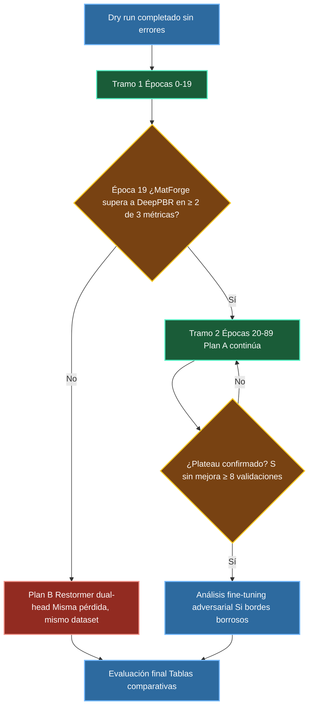

---

## 14. Inferencia: Hann blending por parches

MatForge está diseñado para procesar texturas tileables de cualquier resolución mediante una ventana deslizante con solapamiento y fusión ponderada.

El proceso de inferencia para una imagen de resolución arbitraria es:

1. **División en parches**: la imagen se divide en parches de 256×256 con stride de 128, creando solapamiento del 50% entre parches adyacentes.

2. **Predicción por parche**: cada parche se procesa independientemente por MatForgeNet, produciendo los tres mapas de salida.

3. **Fusión con ventana de Hann**: los parches se combinan usando una ventana de Hann bidimensional como máscara de pesos, que asigna mayor peso al centro de cada parche y menor peso a los bordes. Esto suaviza las costuras entre parches adyacentes.

4. **Renormalización del Normal map**: para los mapas de Normales, la fusión ponderada se realiza **antes** de la renormalización L2 final. El orden correcto es: acumular los vectores normales ponderados por Hann → dividir por la suma de pesos → renormalizar L2 por píxel sobre el mapa fusionado completo. Invertir este orden (renormalizar por parche y luego fusionar) produce un campo vectorial físicamente incorrecto en las costuras, porque el promedio ponderado de vectores unitarios no es unitario.

5. **Clip final**: Roughness y Metallic se recortan al rango [0,1] tras la fusión; Normal se renormaliza L2.

---

## 15. Protocolo de evaluación cuantitativa

La evaluación cuantitativa de MatForge sigue un protocolo de métricas múltiples sobre el split de validación fijo (SEED=42, ~483 texturas estratificadas por grupo funcional).

### 15.1 Métricas empleadas

Para los mapas de materiales se emplean las siguientes métricas, seleccionadas por su uso consolidado en la literatura de estimación de materiales PBR [35][36]:

- **MAE angular (°)** sobre el mapa de Normales: mide el ángulo medio en grados entre el vector normal predicho y el ground truth, calculado como $\text{MAE}_{ang} = \frac{180}{\pi} \cdot \text{mean}\left(\arccos(\text{clamp}(\hat{N}_{pred} \cdot \hat{N}_{gt}, -1, 1))\right)$. Es la métrica primaria para Normales porque es invariante a la escala y penaliza directamente los errores de orientación geométrica.

- **MAE y RMSE** sobre Roughness y Metallic: el MAE captura el error medio en [0,1], mientras que el RMSE es más sensible a errores grandes y complementa el diagnóstico de outliers.

- **LPIPS** (backbone AlexNet) sobre renders sintéticos: se construye un render bajo 5 luces direccionales fijas utilizando el albedo GT y los mapas predichos, siguiendo la formulación Cook-Torrance. El uso del albedo GT garantiza que las diferencias en el render reflejan exclusivamente la calidad de los mapas predichos, no del albedo [35].

- **Métrica compuesta S**: $S = \text{MAE}_{normal}^{deg} + 0.6 \cdot \text{MAE}_{roughness} + 0.2 \cdot \text{LPIPS}_{render}$, utilizada para la selección del checkpoint final durante el entrenamiento.

### 15.2 Estructura de la comparativa

La evaluación se organiza en dos tablas complementarias:

**Tabla A — Comparativa restringida (Normal + Roughness, los tres modelos)**

Permite comparar Pix2Pix, DeepPBR y MatForge sobre las salidas comunes. Para el render LPIPS de Pix2Pix y DeepPBR, el mapa Metallic se fija a cero (estos modelos no predicen Metallic), y el render se calcula sobre crops de 256×256 extraídos del centro de cada textura, que es la condición de entrada de ambos modelos.

| Modelo | Normal MAE° ↓ | Roughness MAE ↓ | Roughness RMSE ↓ | LPIPS render ↓ |
|---|---|---|---|---|
| Pix2Pix | — | — | — | — |
| DeepPBR | — | — | — | — |
| MatForge | — | — | — | — |

**Tabla B — Evaluación completa MatForge por grupo funcional**

MatForge es el único modelo que predice Metallic. Esta tabla desglosa las métricas por grupo funcional del dataset para diagnosticar fortalezas y debilidades por tipo de material.

| Grupo | Normal MAE° ↓ | Roughness MAE ↓ | Roughness RMSE ↓ | Metallic MAE ↓ | Metallic RMSE ↓ | LPIPS render ↓ |
|---|---|---|---|---|---|---|
| GLOBAL | — | — | — | — | — | — |
| metal | — | — | — | — | — | — |
| stone_rough | — | — | — | — | — | — |
| wood | — | — | — | — | — | — |
| ceramic_ground | — | — | — | — | — | — |
| brick_terracotta | — | — | — | — | — | — |
| marble_smooth | — | — | — | — | — | — |
| concrete_plaster | — | — | — | — | — | — |
| mixed_ambiguous | — | — | — | — | — | — |

### 15.3 Consideraciones metodológicas

La comparativa entre Pix2Pix, DeepPBR y MatForge no es simétrica en cuanto a resolución de entrada: Pix2Pix y DeepPBR operan a resolución fija de 256×256, mientras que MatForge opera sobre la imagen completa a 1K mediante tile-and-merge. Para la Tabla A se evalúan todos los modelos sobre crops de 256×256, igualando las condiciones de entrada. Esta decisión penaliza ligeramente a MatForge (que en producción opera sobre la imagen completa) pero garantiza que la comparativa es justa respecto a la información de entrada disponible para cada modelo.

El desbalance del grupo `metal` (7.3% del dataset, 238 texturas) implica que las métricas globales de Metallic deben interpretarse con precaución: la mayoría de las texturas tienen Metallic GT = 0, lo que hace que el MAE global esté dominado por la capacidad del modelo de predecir metallic ≈ 0 en materiales no metálicos.

---

## 16. Resumen visual del pipeline completo

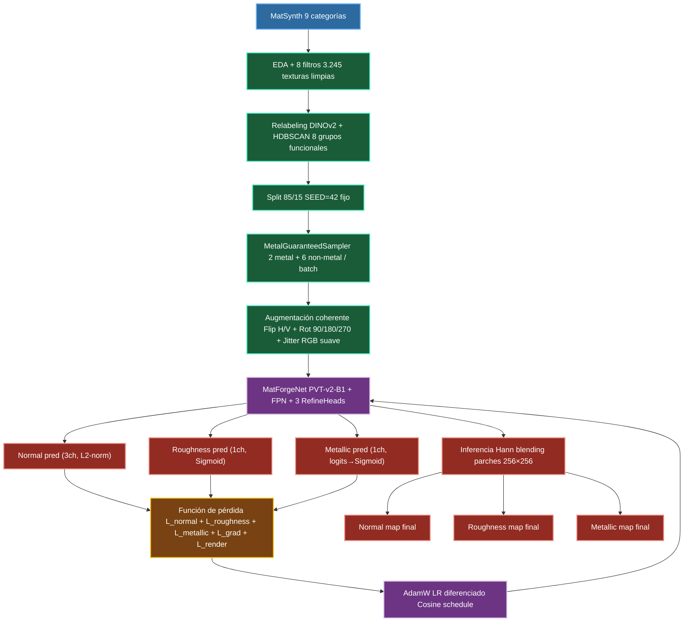

---

## Referencias

[1] V. Deschaintre, M. Aittala, F. Durand, G. Drettakis, and A. Bousseau, "Single-Image SVBRDF Capture with a Rendering-Aware Deep Network," *ACM Transactions on Graphics*, vol. 37, no. 4, 2018.

[2] E. Xie, W. Wang, Z. Yu, A. Anandkumar, J. M. Alvarez, and P. Luo, "SegFormer: Simple and Efficient Design for Semantic Segmentation with Transformers," in *Advances in Neural Information Processing Systems (NeurIPS)*, 2021.

[3] W. Wang, E. Xie, X. Li, D.-P. Fan, K. Song, D. Liang, T. Lu, P. Luo, and L. Shao, "PVT v2: Improved Baselines with Pyramid Vision Transformer," *Computational Visual Media*, vol. 8, no. 3, pp. 415–424, 2022.

[4] S. W. Zamir, A. Arora, S. Khan, M. H. Khan, F. S. Khan, and L. Shao, "Restormer: Efficient Transformer for High-Resolution Image Restoration," in *Proc. IEEE/CVF Conf. on Computer Vision and Pattern Recognition (CVPR)*, 2022.

[5] G. Vecchio and V. Deschaintre, "MatSynth: A Modern PBR Materials Dataset," in *Proc. IEEE/CVF Conf. on Computer Vision and Pattern Recognition (CVPR)*, 2024.

[6] C. Rodriguez-Pardo, H. Dominguez-Elvira, D. Pascual-Hernandez, and E. Garces, "UMat: Uncertainty-Aware Single Image High Resolution Material Capture," in *Proc. IEEE/CVF Conf. on Computer Vision and Pattern Recognition (CVPR)*, 2023.

[7] R. Zhang, P. Isola, A. A. Efros, E. Shechtman, and O. Wang, "The Unreasonable Effectiveness of Deep Features as a Perceptual Metric," in *Proc. IEEE/CVF Conf. on Computer Vision and Pattern Recognition (CVPR)*, 2018.

[8] P. Kocsis, V. Golyanik, M. Nießner, and Y. Matusik, "Intrinsic Image Diffusion for Indoor Single-view Material Estimation," in *Proc. IEEE/CVF Conf. on Computer Vision and Pattern Recognition (CVPR)*, 2024.

[9] T.-Y. Lin, P. Dollár, R. Girshick, K. He, B. Hariharan, and S. Belongie, "Feature Pyramid Networks for Object Detection," in *Proc. IEEE Conf. on Computer Vision and Pattern Recognition (CVPR)*, 2017.

[10] G. Vecchio and V. Deschaintre, "MatSynth: A Modern PBR Materials Dataset," in *Proc. IEEE/CVF Conf. on Computer Vision and Pattern Recognition (CVPR)*, 2024.

[11] M. Oquab *et al.*, "DINOv2: Learning Robust Visual Features without Supervision," *Transactions on Machine Learning Research*, 2024. [Online]. Available: https://arxiv.org/abs/2304.07193.

[12] Khronos Group, "glTF 2.0 Specification — Metallic-Roughness Material Model," Khronos Group, 2017. [Online]. Available: https://registry.khronos.org/glTF/specs/2.0/glTF-2.0.html.

[13] P. Docherty *et al.*, "Upsampling DINOv2 Features for Unsupervised Vision Tasks and Weakly Supervised Materials Segmentation," *arXiv preprint arXiv:2410.19836*, 2024. [Online]. Available: https://arxiv.org/abs/2410.19836.

[14] C. Oprea, I. Florea, C. Florea, and C. Vertan, "Comparative Evaluation of Perceptual Hashing and Deep Embedding Methods for Robust and Efficient Image Deduplication," *Electronics*, vol. 15, no. 7, art. 1493, 2026. doi: 10.3390/electronics15071493.

[15] L. McInnes, J. Healy, and J. Melville, "Using UMAP for Clustering," UMAP Documentation, v0.5.8. [Online]. Available: https://umap-learn.readthedocs.io/en/latest/clustering.html.

[16] The GDELT Project, "Visualizing An Entire Day of Global News Coverage: Technical Experiments: PCA vs UMAP for HDBSCAN & t-SNE Dimensionality Reduction," GDELT Blog, Nov. 2023. [Online]. Available: https://blog.gdeltproject.org/visualizing-an-entire-day-of-global-news-coverage-technical-experiments-pca-vs-umap-for-hdbscan-t-sne-dimensionality-reduction/.

[17] H. Hamdan *et al.*, "Considerably Improving Clustering Algorithms Using UMAP Dimensionality Reduction Technique: A Comparative Study," in *Advances in Intelligent Systems and Computing*, vol. 1230, Springer, 2021, pp. 317–325. doi: 10.1007/978-3-030-51935-3_34.

[18] L. McInnes, J. Healy, and S. Astels, "Parameter Selection for HDBSCAN*," HDBSCAN Documentation, v0.8.1. [Online]. Available: https://hdbscan.readthedocs.io/en/latest/parameter_selection.html.

[19] R. J. G. B. Campello, D. Moulavi, A. Zimek, and J. Sander, "Hierarchical Density Estimates for Data Clustering, Visualization, and Outlier Detection," *ACM Transactions on Knowledge Discovery from Data*, vol. 10, no. 1, pp. 1–51, Jul. 2015. doi: 10.1145/2733381.

[20] Towards AI, "The Limitation of Silhouette Score Which Is Often Ignored By Many," Daily Dose of Data Science, Jul. 2023. [Online]. Available: https://blog.dailydoseofds.com/p/the-limitation-of-silhouette-score.

[21] P. Jaskowiak, R. J. G. B. Campello, and I. G. Costa, "On the Evaluation of Unsupervised Outlier Detection: Measures, Datasets, and an Empirical Study," *Data Mining and Knowledge Discovery*, vol. 30, no. 4, pp. 891–927, 2016. doi: 10.1007/s10618-015-0444-8.

[22] D. Moulavi, P. A. Jaskowiak, R. J. G. B. Campello, A. Zimek, and J. Sander, "Density-Based Clustering Validation," in *Proc. 2014 SIAM International Conference on Data Mining*, 2014, pp. 839–847. doi: 10.1137/1.9781611973440.96.

[23] V. Deschaintre, M. Aittala, F. Durand, G. Drettakis, and A. Bousseau, "Single-Image SVBRDF Capture with a Rendering-Aware Deep Network," *ACM Transactions on Graphics*, vol. 37, no. 4, 2018.

[24] S. Doerrich, T. Archut, F. Di Salvo, and C. Ledig, "Integrating kNN with Foundation Models for Adaptable and Privacy-Aware Image Classification," *arXiv preprint arXiv:2402.12500*, 2024. [Online]. Available: https://arxiv.org/abs/2402.12500.

[25] R. L. Cook and K. E. Torrance, "A Reflectance Model for Computer Graphics," *ACM Transactions on Graphics*, vol. 1, no. 1, pp. 7–24, 1982.

[26] B. Walter, S. R. Marschner, H. Li, and K. E. Torrance, "Microfacet Models for Refraction through Rough Surfaces," in *Proc. Eurographics Symposium on Rendering (EGSR)*, 2007.

[27] B. Karis, "Real Shading in Unreal Engine 4," in *SIGGRAPH Course Notes: Physically Based Shading in Theory and Practice*, 2013.

[28] C. Schlick, "An Inexpensive BRDF Model for Physically-Based Rendering," *Computer Graphics Forum*, vol. 13, no. 3, pp. 233–246, 1994.

[29] R. Zhang, P. Isola, A. A. Efros, E. Shechtman, and O. Wang, "The Unreasonable Effectiveness of Deep Features as a Perceptual Metric," in *Proc. IEEE/CVF Conf. on Computer Vision and Pattern Recognition (CVPR)*, 2018.

[30] B. Hoyt, "Duplicate image detection with perceptual hashing in Python," benhoyt.com. [Online]. Available: https://benhoyt.com/writings/duplicate-image-detection/.

[31] J. Ahrendt *et al.*, "CleanPatrick: A Benchmark for Image Data Cleaning," Zenodo, 2025. doi: 10.5281/zenodo.15591625.

[32] LearnOpenGL, "Normal Mapping," learnopengl.com. [Online]. Available: https://learnopengl.com/Advanced-Lighting/Normal-Mapping.

[33] E. Xie, W. Wang, Z. Yu, A. Anandkumar, J. M. Alvarez, and P. Luo, "SegFormer: Simple and Efficient Design for Semantic Segmentation with Transformers," in *Advances in Neural Information Processing Systems (NeurIPS)*, 2021.

[34] S. W. Zamir, A. Arora, S. Khan, M. H. Khan, F. S. Khan, and L. Shao, "Restormer: Efficient Transformer for High-Resolution Image Restoration," in *Proc. IEEE/CVF Conf. on Computer Vision and Pattern Recognition (CVPR)*, 2022.

[35] C. Rodriguez-Pardo, H. Dominguez-Elvira, D. Pascual-Hernandez, and E. Garces, "UMat: Uncertainty-Aware Single Image High Resolution Material Capture," in *Proc. IEEE/CVF Conf. on Computer Vision and Pattern Recognition (CVPR)*, 2023.

[36] G. Vecchio and V. Deschaintre, "MatSynth: A Modern PBR Materials Dataset," in *Proc. IEEE/CVF Conf. on Computer Vision and Pattern Recognition (CVPR)*, 2024.

[37] R. Zhang, P. Isola, A. A. Efros, E. Shechtman, and O. Wang, "The Unreasonable Effectiveness of Deep Features as a Perceptual Metric," in *Proc. IEEE/CVF Conf. on Computer Vision and Pattern Recognition (CVPR)*, 2018, pp. 586–595. doi: 10.1109/CVPR.2018.00066.