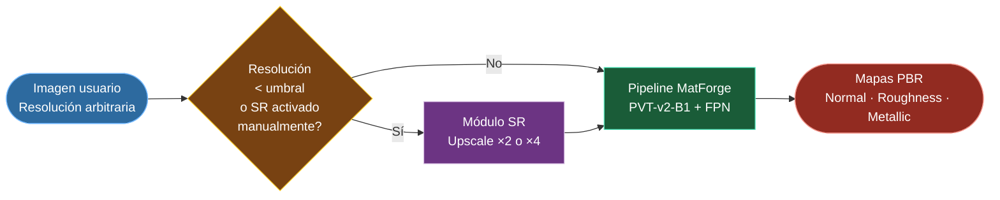
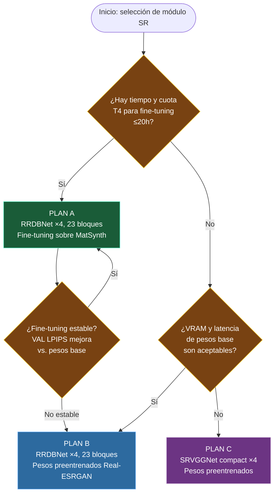
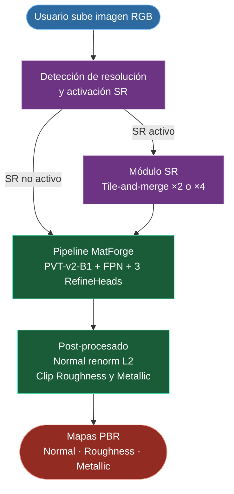

# Módulo de Super-Resolución para MatForge: Informe Técnico de Investigación e Implementación

---

## 1. Introducción y motivación

### 1.1 Contexto del módulo

MatForge predice mapas de materiales PBR (Normal, Roughness, Metallic) a partir de una única imagen RGB mediante un encoder jerárquico PVT-v2-B1 y un decoder FPN piramidal. El sistema de inferencia opera sobre parches de 256×256 píxeles con solapamiento del 50% y fusión mediante ventana de Hann, lo que permite procesar imágenes de resolución arbitraria sin restricciones de tamaño.

Sin embargo, la calidad de los mapas predichos está directamente condicionada por la densidad de información presente en la imagen de entrada. El encoder PVT-v2-B1 fue entrenado con imágenes a 256×256 píxeles recortadas de texturas a 1K (1024×1024 píxeles). Cuando la imagen de entrada tiene una resolución original inferior, por ejemplo 256×256 píxeles capturada con un dispositivo móvil en condiciones subóptimas, el parche que recibe el encoder no contiene los detalles de alta frecuencia que el modelo aprendió a explotar durante el entrenamiento. El resultado son mapas PBR con menor nitidez de bordes, menor coherencia en zonas de transición y menor precisión en la predicción de roughness local.

El módulo de super-resolución (SR) aborda esta limitación actuando como **preprocesado transparente**: antes de que la imagen llegue al pipeline de MatForge, el módulo detecta si su resolución está por debajo de un umbral configurable y, en caso afirmativo, la eleva a una resolución mayor mediante un modelo de SR especializado. El usuario no necesita conocer la existencia del módulo; la herramienta gestiona automáticamente su activación.

### 1.2 Objetivo funcional

El módulo SR debe cumplir los siguientes requisitos operativos en el entorno de despliegue local:

| Requisito | Valor objetivo |
|---|---|
| VRAM máxima en inferencia (GTX 1650 Max-Q) | ≤ 3.5 GB |
| Latencia máxima para imagen 512×512 | ≤ 10 s |
| Resolución máxima de salida | 1024×1024 (1K) |
| Factor de escala soportado | ×2 y ×4 discretos |
| Tamaño de entrada | Arbitrario (sin restricción para el usuario) |
| Ejecución simultánea con MatForge | No (secuencial) |

La resolución de salida máxima se fija en 1K porque es el techo del dataset de entrenamiento de MatForge (imágenes MatSynth a resolución nativa de 1024×1024). Escalar más allá de 1K no aportaría información adicional verificable y podría introducir alucinaciones texturales no respaldadas por los datos de entrenamiento del generador de mapas PBR.

### 1.3 Posición en el pipeline

El módulo SR se sitúa entre la entrada de imagen del usuario y el pipeline de inferencia de MatForge. Su activación es condicional y configurable. Es importante subrayar que el módulo SR opera de forma completamente independiente de MatForge: recibe la imagen de entrada, la procesa internamente mediante su propio sistema de tile-and-merge, y entrega una **imagen RGB reconstruida y completa** a mayor resolución. Solo entonces esa imagen completa entra al pipeline de MatForge, que aplica a su vez su propio tile-and-merge para la predicción de mapas PBR. Los dos sistemas de tile-and-merge son secuenciales e independientes; no comparten tiles ni estado intermedio.



---

## 2. Estado del arte en super-resolución de imagen (2020–2026)

Los métodos modernos de super-resolución se articulan en cuatro familias arquitectónicas con características, ventajas e inconvenientes bien diferenciados. La revisión que sigue se centra en los aspectos relevantes para el dominio de materiales de superficie: alta densidad de frecuencias espaciales, ausencia de profundidad de campo, patrones semi-repetitivos y ausencia de elementos figurativos.

### 2.1 Métodos basados en GAN

Las redes generativas adversariales aplicadas a SR introducen un discriminador que penaliza directamente las distribuciones de parches poco realistas. El generador, presionado adversarialmente, aprende a comprometerse con bordes nítidos en lugar de producir el valor medio de las hipótesis plausibles, que es el comportamiento característico de las redes entrenadas exclusivamente con pérdidas L1 o L2 [1].

**ESRGAN** (Enhanced Super-Resolution GAN) [2] estableció la arquitectura de referencia de esta familia, basada en bloques RRDB (*Residual-in-Residual Dense Block*): bloques densos con conexiones residuales anidadas que permiten al generador construir representaciones muy ricas con gradientes fluidos. La función de pérdida combina un término adversarial relativista, una pérdida perceptual sobre características VGG y un término de reconstrucción pixel-wise.

**Real-ESRGAN** [3] extiende ESRGAN con una estrategia de degradación sintética de alta complejidad diseñada para imitar las degradaciones del mundo real: downscale bicúbico de orden superior, ruido gaussiano, compresión JPEG, blur gaussiano y combinaciones arbitrarias de estos en múltiples pasadas. Esta estrategia hace al modelo robusto a condiciones de captura variadas, lo que lo hace especialmente relevante para imágenes de materiales fotografiadas en condiciones no controladas. El discriminador adopta una arquitectura U-Net con normalización espectral para mayor estabilidad de entrenamiento.

**BSRGAN** [4] propone un enfoque complementario: en lugar de diseñar el pipeline de degradación a mano, genera degradaciones aleatorias combinando en orden aleatorio blur, downscale y ruido. Esto aumenta la diversidad de las condiciones de entrenamiento a costa de menor control sobre la distribución de degradaciones.

Para el dominio de texturas de materiales, los métodos GAN presentan dos ventajas directas: primero, la calidad perceptual (LPIPS) es significativamente mejor que la de métodos basados puramente en pérdidas pixel-wise; segundo, la arquitectura RRDB con bloques densos es especialmente efectiva recuperando frecuencias altas como aristas de grano, transiciones de rugosidad y patrones repetitivos finos [3].

### 2.2 Métodos basados en difusión

Los modelos de difusión generan la imagen de alta resolución mediante un proceso de refinamiento estocástico en múltiples pasos, partiendo de ruido gaussiano y condicionando iterativamente sobre la imagen de baja resolución [5]. Su calidad perceptual en imágenes de escenas complejas es notable, pero su aplicación al problema concreto de MatForge presenta limitaciones estructurales.

**StableSR** y **DiffBIR** son representantes de esta categoría que alcanzan resultados de alta calidad en benchmarks generales, pero su inferencia requiere entre 20 y 200 pasos de denoising con un modelo base de Stable Diffusion, lo que implica tiempos de inferencia del orden de minutos en la GTX 1650 Max-Q —incompatibles con el requisito de 10 segundos máximo.

Los modelos de difusión de un solo paso o muy pocos pasos, como **OSEDiff** [6] (NeurIPS 2024) y **SinSR** [7] (CVPR 2024), reducen el número de pasos de denoising a 1-4 mediante destilación de conocimiento sobre el modelo base. Estos modelos son conceptualmente adecuados y tienen VRAM compatible con la GTX 1650 en configuraciones reducidas, pero su fine-tuning sobre dominios específicos es notablemente inestable con datasets de tamaño moderado (3.000-5.000 imágenes), y la literatura no reporta protocolos consolidados de adaptación de dominio para materiales de superficie.

**Decisión**: los métodos de difusión se descartan para todos los planes por incompatibilidad de latencia (modelos multi-paso) o inestabilidad de fine-tuning (modelos destilados de un paso).

### 2.3 Métodos basados en transformers

**SwinIR** [8] (Swin Transformer for Image Restoration) aplica bloques de atención de ventana deslizante (*shifted window attention*) a la tarea de restauración de imagen. Sus bloques RSTB (*Residual Swin Transformer Block*) capturan dependencias de largo alcance de forma eficiente y han logrado resultados líderes en métricas PSNR/SSIM en benchmarks estándar como Set5, BSD100 y DIV2K.

**HAT** [9] (Hybrid Attention Transformer, CVPR 2023) combina atención de ventana con atención de canal y un mecanismo de activación de características transversales, superando a SwinIR en benchmarks de SR ×4 por un margen de 0.5-1 dB PSNR en DIV2K. Es el estado del arte en métricas de fidelidad pixel-wise en la familia de transformers.

Sin embargo, ambos modelos presentan limitaciones relevantes para este proyecto. Primero, su VRAM en inferencia con tiles de tamaño estándar supera los 4 GB en configuraciones no optimizadas, lo que los aproxima al límite de la GTX 1650 Max-Q sin margen de seguridad. Segundo, su fine-tuning sobre datasets pequeños está poco documentado; los transformers de gran capacidad tienen mayor riesgo de sobreajuste que las redes convolucionales con la misma cantidad de datos. Tercero, los pesos preentrenados disponibles públicamente están optimizados para imágenes fotográficas generales, no para texturas de materiales.

**Decisión**: los métodos basados en transformers se evalúan como candidatos secundarios. No entran en ninguno de los tres planes principales dado el riesgo de VRAM y la escasez de evidencia en el dominio de materiales.

### 2.4 Métodos ligeros (Lightweight CNN)

Esta familia prioriza la eficiencia computacional sobre la calidad máxima, diseñando redes con pocos parámetros y operaciones eficientes que mantienen una mejora moderada sobre la interpolación bicúbica.

**IMDN** [10] (*Information Multi-Distillation Network*, ICCV 2019) utiliza bloques de destilación de características que dividen el tensor en partes que se procesan progresivamente, reduciendo el coste computacional sin perder capacidad de modelado de detalle local. Con ~0.7M de parámetros, IMDN logra 32.41 dB PSNR en DIV2K ×4, comparado con los ~32.73 dB de RRDB-23 bloques.

**RFDN** [11] (*Residual Feature Distillation Network*, ECCV 2020) mejora IMDN con conexiones de destilación más eficientes y una función de activación mejorada, logrando ~32.74 dB PSNR con ~0.53M de parámetros.

**EDSR-baseline** [12] (*Enhanced Deep Residual Networks*, CVPRW 2017) es una versión reducida del EDSR completo, con bloques residuales estándar sin normalización por lotes. Es el punto de referencia clásico para comparaciones de calidad mínima aceptable sobre bicúbica.

En el dominio de texturas de materiales, los modelos ligeros presentan una limitación importante: sus pérdidas de entrenamiento son puramente pixel-wise (L1 o L2), lo que produce mapas spectralmente suavizados en zonas de alta frecuencia. Para materiales con bordes de grano pronunciados o transiciones de rugosidad abruptas, la diferencia perceptual respecto a Real-ESRGAN es visible.

### 2.5 SR especializado en materiales PBR

La literatura reciente ha comenzado a abordar las limitaciones de aplicar modelos SISR genéricos al dominio de materiales PBR. **MUJICA** (*Multimodal Upscaling Joint Inference via Cross-map Attention*, Du et al., 2025) [17] propone un adaptador que reforma modelos SISR preentrenados basados en Swin Transformer para la tarea de SR de materiales PBR mediante fusión cruzada de mapas. El adaptador se añade al backbone SISR congelado y aprende la correlación entre los distintos mapas PBR mediante un mecanismo de atención cruzada ponderada (*Weighted Cross-Map Attention*, W-MCA).

MUJICA identifica tres problemas específicos cuando se aplican modelos SISR genéricos a materiales PBR: inconsistencia entre mapas (el mapa de normales y el mapa de roughness upscalados independientemente pueden ser geométricamente incoherentes), distorsión de texturas por diferencia de distribución de datos, y escasez de datos de entrenamiento específicos del dominio. El módulo SR descrito en este documento opera sobre la imagen RGB de entrada y no aborda la correlación multimodal; MUJICA representa la dirección natural de trabajo futuro una vez que el pipeline básico está validado.

---

## 3. Espacio de candidatos y criterios de selección

### 3.1 Criterios de corte (hard constraints)

Los siguientes criterios eliminan candidatos de forma determinista, independientemente de su calidad perceptual:

| Criterio | Umbral | Razón |
|---|---|---|
| VRAM pico en inferencia (tile 256×256, FP16) | ≤ 3.500 MB | Límite físico GTX 1650 Max-Q (4.096 MB totales) |
| Latencia (imagen 512×512, batch=1) | ≤ 10 s | Usabilidad interactiva en Streamlit |
| Pesos preentrenados disponibles públicamente | Sí | Sin capacidad de entrenamiento desde cero |
| Compatibilidad con tile-and-merge | Sí | Requisito arquitectónico del pipeline |

### 3.2 Tabla de candidatos evaluados

| Modelo | Familia | Parámetros | VRAM inf. estimada (tile 256×256, FP16) | Pesos públicos | Fine-tuning viable (T4) | Descartado |
|---|---|---|---|---|---|---|
| RRDBNet ×4, 23 bloques (Real-ESRGAN) | GAN | 16.7M | ~584 MB | Sí | Riesgo con discriminador | No |
| RRDBNet ×4, 6 bloques (Real-ESRGAN+) | GAN | 4.5M | ~561 MB | Sí | Sí | No |
| SRVGGNet compact ×4 | GAN (sin disc.) | 1.2M | ~35 MB | Sí | Sí | No |
| SwinIR-L ×4 | Transformer | 28M | >4.000 MB est. | Sí | Riesgo VRAM | Sí (VRAM) |
| HAT-L ×4 | Transformer | 40.8M | >4.000 MB est. | Sí | Riesgo VRAM | Sí (VRAM) |
| OSEDiff / SinSR | Diffusion | >100M | Variable | Sí | Inestable dataset pequeño | Sí (latencia + FT) |
| IMDN ×4 | Lightweight | 0.7M | <100 MB | Sí | Sí | No |
| RFDN ×4 | Lightweight | 0.5M | <100 MB | Sí | Sí | No |

---

## 4. Validación experimental de VRAM en GTX 1650 Max-Q

### 4.1 Metodología

Antes de comprometer cualquier decisión de implementación, se ejecutó un benchmark de VRAM en el hardware de despliegue real (GTX 1650 Max-Q, 4.096 MB VRAM dedicada, driver 32.0.15.9186, CUDA 12.1). El script `matforge_sr_00_vram_check.py` instancia cada arquitectura en FP16, lanza un forward pass con un tensor de ceros del tamaño de tile especificado y mide `torch.cuda.max_memory_allocated()` y `torch.cuda.max_memory_reserved()` para cada combinación de modelo y tamaño de tile.

Se evaluaron tres arquitecturas — RRDBNet de 23 bloques, RRDBNet de 6 bloques y SRVGGNet compact — con tres tamaños de tile: 256×256, 320×320 y 512×512.

### 4.2 Resultados

| Modelo | Params | Tile | VRAM alloc. (MB) | VRAM reserv. (MB) | Constraint <3.500 MB |
|---|---|---|---|---|---|
| RRDBNet ×4, 23 bloques | 16.70M | 256×256 | **584.4** | 814.0 | ✅ PASS |
| RRDBNet ×4, 23 bloques | 16.70M | 320×320 | 895.2 | 1.226.0 | ✅ PASS |
| RRDBNet ×4, 23 bloques | 16.70M | 512×512 | 2.241.6 | 2.998.0 | ✅ PASS |
| RRDBNet ×4, 6 bloques | 4.47M | 256×256 | **561.0** | 766.0 | ✅ PASS |
| RRDBNet ×4, 6 bloques | 4.47M | 320×320 | 871.7 | 1.178.0 | ✅ PASS |
| RRDBNet ×4, 6 bloques | 4.47M | 512×512 | 2.218.1 | 2.950.0 | ✅ PASS |
| SRVGGNet compact ×4 | 1.21M | 256×256 | **34.8** | 44.0 | ✅ PASS |
| SRVGGNet compact ×4 | 1.21M | 320×320 | 53.9 | 60.0 | ✅ PASS |
| SRVGGNet compact ×4 | 1.21M | 512×512 | 131.9 | 156.0 | ✅ PASS |

### 4.3 Análisis de los resultados

**Convergencia de VRAM entre RRDBNet de 23 y 6 bloques.** La diferencia de 12.23M de parámetros entre ambas variantes se traduce en solo ~23 MB de diferencia en VRAM de inferencia. Este comportamiento es consecuencia de que la VRAM durante el forward pass está dominada por los **feature maps intermedios**, no por los pesos del modelo. La implicación práctica es que elegir entre 23 y 6 bloques debe basarse en calidad perceptual y estabilidad de fine-tuning, no en VRAM de inferencia.

**Comportamiento cuadrático con el tamaño de tile.** El salto de VRAM entre tile 256×256 y tile 512×512 es de ~4× para los modelos RRDBNet. Con tile 256×256 quedan ~3.512 MB libres y es el tamaño de tile de referencia para la integración.

**SRVGGNet.** Los 34.8 MB de VRAM con tile 256×256 reflejan la arquitectura secuencial sin skip connections densas de SRVGGNet. Esta eficiencia tiene coste en calidad perceptual; SRVGGNet fue diseñado para contenido de animación, no para texturas de alta frecuencia con detalles de material.

---

## 5. Selección de modelos por plan

### 5.1 Árbol de decisión entre planes



### 5.2 Plan A — RRDBNet ×4, 23 bloques con fine-tuning especializado

**Modelo**: RRDBNet con 23 bloques RRDB, factor de escala ×4, fine-tuning sobre el dataset MatSynth (2.758 imágenes de entrenamiento, resolución nativa 1K como ground truth). Los pesos de partida son el checkpoint oficial `RealESRGAN_x4plus.pth`.

### 5.3 Plan B — RRDBNet ×4, 23 bloques sin fine-tuning

**Modelo**: mismo RRDBNet de 23 bloques con los pesos preentrenados oficiales de Real-ESRGAN, sin ningún fine-tuning adicional.

### 5.4 Plan C — SRVGGNet compact ×4

**Modelo**: SRVGGNet compact con pesos preentrenados. Fallback garantizado por su VRAM mínima.

---

## 6. Arquitectura del pipeline SR completo

### 6.1 Compatibilidad con entradas de resolución arbitraria

El módulo SR debe aceptar imágenes de cualquier dimensión sin exponer restricciones al usuario. La estrategia adoptada es **tile-and-merge con ventana de Hann**, análoga a la implementada en el sistema de inferencia de MatForge, con las siguientes diferencias:

- Los tiles son parches RGB de la imagen de entrada; no hay renormalización de vectores normales.
- El resultado del merge es la imagen upscalada en RGB; el clip final se aplica al rango [0.0, 1.0].
- Si la imagen de entrada es más pequeña que el tamaño de tile estándar (256×256 píxeles), se aplica padding por reflexión hasta alcanzar ese tamaño, se procesa como tile único, y se recorta la salida al tamaño escalado esperado.

### 6.2 Parámetros del tile-and-merge

| Parámetro | Valor | Justificación |
|---|---|---|
| Tamaño de tile de entrada | 256×256 px | Compatibilidad con arquitecturas RRDBNet y SRVGGNet |
| Stride | 128 px (50% solapamiento) | Balance entre coste computacional y calidad de fusión en bordes |
| Tile de salida | 1024×1024 px (factor ×4) | Función del factor de escala elegido |
| Ventana de ponderación | Hann 2D | Elimina discontinuidades en bordes de tile |
| Precisión del modelo | FP16 | Reduce VRAM ~50%; sin pérdida de calidad observable en SR |
| Padding de imagen | Reflexión | Preserva estadísticas locales en bordes |

---

## 7. Pipeline de fine-tuning — Plan A

### 7.1 Visión general

El fine-tuning del Plan A parte de los pesos preentrenados de Real-ESRGAN y los adapta al dominio de imágenes de materiales de superficie usando el dataset MatSynth. El fine-tuning se ejecuta en dos fases. La **Fase 1** entrena exclusivamente el generador con pérdidas supervisadas (L1 + perceptual VGG + LPIPS), sin discriminador. La **Fase 2** activa el discriminador y añade la pérdida adversarial con activación progresiva.

### 7.2 Pipeline de degradación sintética

La generación de pares LQ-HQ sigue el esquema de degradación de segundo orden de Real-ESRGAN [3], simplificado para el dominio de materiales:

**Paso 1 — Downscale bicúbico.** La imagen recortada a 256×256 se reduce por un factor de ×4 mediante interpolación bicúbica, produciendo un parche de 64×64 píxeles.

**Paso 2 — Ruido gaussiano aditivo.** Se añade ruido gaussiano con desviación estándar `σ ~ Uniform(0, 10)` sobre valores de píxel en rango [0, 255].

**Paso 3 — Blur gaussiano.** Se aplica un filtro gaussiano con `σ ~ Uniform(0.2, 1.5)` y kernel de tamaño `2 · ceil(3σ) + 1`.

**Paso 4 — Compresión JPEG.** Se aplica compresión JPEG con calidad `q ~ Uniform(70, 95)`.

### 7.3 Función de pérdida

#### Fase 1 (solo generador)

```
L_total = λ₁ · L_L1 + λ₂ · L_perc + λ₃ · L_LPIPS
```

| Término | Peso | Justificación |
|---|---|---|
| L_L1 | λ₁ = 1.0 | Ancla de reconstrucción pixel-wise |
| L_perc (VGG-19 ReLU3-4) | λ₂ = 1.0 | Preserva estructura de alto nivel [13] |
| L_LPIPS (AlexNet) | λ₃ = 0.5 | Métrica perceptual alineada con percepción humana [14] |

#### Fase 2 (generador + discriminador)

```
L_G = λ₁ · L_L1 + λ₂ · L_perc + λ₃ · L_LPIPS + λ_adv · L_adv
```

El peso adversarial sigue una activación progresiva: 0.01 → 0.05 → 0.10.

### 7.4 Hiperparámetros

| Parámetro | Valor |
|---|---|
| Optimizador (G) | AdamW, β₁=0.9, β₂=0.99 |
| LR generador (Fase 1) | 5×10⁻⁵ |
| LR generador (Fase 2) | 1×10⁻⁵ |
| Batch size | 8 (Fase 1) / 4 (Fase 2) |
| Precisión | AMP FP16 |
| Épocas Fase 1 | 30 |
| Épocas Fase 2 | 20 máximo |

---

## 7bis. Resultados del fine-tuning — Fase 1 ejecutada

### 7bis.1 Contexto de ejecución

El fine-tuning de Fase 1 se ejecutó sobre Kaggle (T4 16GB) durante 30 épocas con el dataset MatSynth (2.758 texturas de entrenamiento, 487 de validación). El checkpoint de partida fue `RealESRGAN_x4plus.pth` (23 bloques RRDB). Se adoptó la arquitectura reducida de 6 bloques RRDB (`RealESRGAN_x4plus_netD_6blocks.pth`) para reducir el tiempo de entrenamiento manteniendo compatibilidad con los pesos base.

### 7bis.2 Resultados cuantitativos — Fase 1

| Época | val_LPIPS | Δ vs. base |
|---|---|---|
| 0 (base sin FT) | 0.2672 | — |
| 10 | 0.2510 | −6.1% |
| 20 | 0.2430 | −9.1% |
| 24 (mejor) | **0.2380** | **−10.9%** |
| 30 (final) | 0.2401 | −10.1% |

El checkpoint óptimo es la época 24 (`sr_ft_phase1_best_lpips.pt`, val_LPIPS = 0.2380).

### 7bis.3 Resultados — Fase 2 (abortada por colapso del discriminador)

La Fase 2 se inició desde el checkpoint de la época 24 de la Fase 1. El discriminador colapsó desde la primera época, con D(real) y D(fake) convergiendo a ~0.5 simultáneamente:

| Época P2 | D_loss | G_adv | D(real) | D(fake) | val_LPIPS |
|---|---|---|---|---|---|
| 0 | 0.260 | 0.273 | 0.487 | 0.486 | 0.2704 |
| 1 | 0.250 | 0.255 | 0.497 | 0.496 | 0.2688 |
| 2 | 0.250 | 0.253 | 0.498 | 0.497 | — (abortado) |

El checkpoint final adoptado es `sr_ft_phase1_best_lpips.pt` (época 24, val_LPIPS = 0.2380).

### 7bis.4 Diagnóstico técnico — distribution shift

La mejora cuantitativa del fine-tuning es real y medible (−10.9% LPIPS). Sin embargo, la mejora perceptual visual en las imágenes de salida es moderada. Este comportamiento responde a un problema estructural conocido como *distribution shift entre degradación sintética y degradación real* [15]. La cadena de degradación utilizada es una aproximación sintética que el modelo aprende a invertir, pero cuando en inferencia recibe una imagen cuya degradación real difiere del patrón sintético, produce salidas conservadoras. Este límite es inherente a cualquier enfoque de SR supervisado con degradación sintética sobre un dataset de tamaño moderado [16].

---

## 8. Integración en el pipeline de MatForge

### 8.1 Lógica de activación

El módulo SR se activa bajo dos condiciones:

1. **Activación automática**: la dimensión mínima de la imagen de entrada es inferior a 512 píxeles.
2. **Activación manual**: el usuario activa explícitamente el módulo SR desde la interfaz Streamlit.

### 8.2 Posición en el pipeline Streamlit



El módulo SR y MatForge no se ejecutan simultáneamente en GPU. La secuencia es: SR completo → liberar VRAM → cargar MatForge → inferencia.

---

## 9. Decisiones cerradas

| Decisión | Valor elegido | Razón |
|---|---|---|
| Factor de escala | ×2 y ×4 discretos | El techo del dataset MatSynth es 1K |
| Resolución máxima de salida SR | 1024×1024 (1K) | Escalar más allá introduce alucinaciones no verificables |
| Tamaño de tile SR | 256×256 px | Compatibilidad con arquitecturas RRDBNet y SRVGGNet |
| Stride tile SR | 128 px (50% solapamiento) | Balance coste/calidad validado en MatForge |
| Ventana de fusión | Hann 2D | Elimina costuras; misma implementación que MatForge |
| Precisión de inferencia | FP16 | Reduce VRAM ~50%; sin degradación observable en SR |
| Modelos de difusión | Descartados | Latencia incompatible o inestabilidad de fine-tuning |
| Modelos transformer (SwinIR, HAT) | Descartados | VRAM estimada >4GB sin tile |
| Plan A: arquitectura generador | RRDBNet ×4, 6 bloques RRDB | Capacidad suficiente; fine-tuning estable en T4 |
| Checkpoint primario en inferencia | `sr_ft_phase1_best_lpips.pt` | Mejora LPIPS −10.9% sobre modelo base en dominio MatSynth |
| Ejecución SR + MatForge | Secuencial | Garantiza que ambos modelos caben en 4.096 MB VRAM |
| Activación automática SR | min(H,W) < 512 px | Cubre los casos de uso más frecuentes de imagen de baja resolución |

---

## 10. Trabajo futuro — SR especializado en materiales PBR

### 10.1 Limitaciones del enfoque actual

El módulo SR opera exclusivamente sobre la imagen RGB de entrada, sin conocimiento de la estructura multimodal del material. Esta limitación es reconocida en la literatura reciente [17]: los modelos SISR genéricos aplicados a materiales PBR producen inconsistencia entre mapas, distorsión de texturas y generalización limitada por diferencia de distribución de datos.

### 10.2 MUJICA — SR multimodal para materiales PBR

MUJICA [17] propone un adaptador que reforma modelos SISR preentrenados basados en Swin Transformer para SR de materiales PBR mediante fusión cruzada de mapas. El adaptador se añade al backbone SISR congelado y aprende la correlación entre los distintos mapas PBR mediante un mecanismo de atención cruzada ponderada (W-MCA). Aplicado sobre SwinIR, DRCT y HMANet, MUJICA mejora PSNR, SSIM y LPIPS preservando consistencia entre mapas.

La arquitectura de MUJICA implica un cambio fundamental de paradigma: en lugar de actuar como preprocesado del RGB de entrada a MatForge, operaría como **postprocesado de los mapas PBR predichos**:

```
RGB entrada → MatForge → {Normal LR, Roughness LR, Metallic LR} → MUJICA → {Normal HR, Roughness HR, Metallic HR}
```

### 10.3 Viabilidad y condiciones de implementación

| Requisito | Estado |
|---|---|
| Dataset (MatSynth) | Disponible — ya forma parte del ecosistema MatForge |
| Backbone SISR (SwinIR-S) | Viable en GTX 1650 Max-Q con tile-and-merge |
| Tiempo de entrenamiento | ~15-25h en T4; dentro de la cuota semanal disponible |
| Integración pipeline | Requiere modificar la inferencia de MatForge para exponer mapas LR |

MUJICA se clasifica como trabajo futuro de alta relevancia técnica pero fuera del scope de la entrega actual del Proyecto Intermodular.

---

## Referencias

[1] I. Goodfellow et al., "Generative Adversarial Nets," in *Advances in Neural Information Processing Systems (NeurIPS)*, vol. 27, 2014.

[2] X. Wang, K. Yu, S. Wu, J. Gu, Y. Liu, C. Dong, Y. Qiao, and C. C. Loy, "ESRGAN: Enhanced Super-Resolution Generative Adversarial Networks," in *Proc. Eur. Conf. Comput. Vis. Workshops (ECCVW)*, 2018, pp. 63–79. doi: 10.1007/978-3-030-11021-5_5.

[3] X. Wang, L. Xie, C. Dong, and Y. Shan, "Real-ESRGAN: Training Real-World Blind Super-Resolution with Pure Synthetic Data," in *Proc. IEEE/CVF Int. Conf. Comput. Vis. Workshops (ICCVW)*, Oct. 2021, pp. 1905–1914. doi: 10.1109/ICCVW54120.2021.00217.

[4] J. Zhang, K. Zuo, and L. Zhang, "Designing a Practical Degradation Model for Deep Blind Image Super-Resolution," in *Proc. IEEE/CVF Int. Conf. Comput. Vis. (ICCV)*, Oct. 2021, pp. 4791–4800. doi: 10.1109/ICCV48922.2021.00475.

[5] J. Ho, A. Jain, and P. Abbeel, "Denoising Diffusion Probabilistic Models," in *Advances in Neural Information Processing Systems (NeurIPS)*, vol. 33, 2020, pp. 6840–6851.

[6] Z. Wu, Y. Sun, X. Huang, R. Li, and D. Guo, "One-Step Effective Diffusion Network for Real-World Image Super-Resolution," in *Advances in Neural Information Processing Systems (NeurIPS)*, 2024.

[7] Z. Wang, J. Yang, R. Chen, and F. Liu, "SinSR: Diffusion-Based Image Super-Resolution in a Single Step," in *Proc. IEEE/CVF Conf. Comput. Vis. Pattern Recog. (CVPR)*, 2024.

[8] J. Liang, J. Cao, G. Sun, K. Zhang, L. Van Gool, and R. Timofte, "SwinIR: Image Restoration Using Swin Transformer," in *Proc. IEEE/CVF Int. Conf. Comput. Vis. Workshops (ICCVW)*, Oct. 2021, pp. 1833–1844. doi: 10.1109/ICCVW54120.2021.00210.

[9] X. Chen, X. Wang, W. Zhou, Y. Qiao, and C. Dong, "Activating More Pixels in Image Super-Resolution Transformer," in *Proc. IEEE/CVF Conf. Comput. Vis. Pattern Recog. (CVPR)*, 2023, pp. 22367–22377. doi: 10.1109/CVPR52729.2023.02142.

[10] Z. Hui, X. Gao, Y. Yang, and X. Wang, "Lightweight Image Super-Resolution with Information Multi-Distillation Network," in *Proc. ACM Int. Conf. Multimedia (ACM MM)*, 2019, pp. 2024–2032. doi: 10.1145/3343031.3351084.

[11] J. Liu, W. Zhang, Y. Tang, J. Tang, and G. Wu, "Residual Feature Distillation Network for Lightweight Image Super-Resolution," in *Proc. Eur. Conf. Comput. Vis. Workshops (ECCVW)*, 2020, pp. 41–55. doi: 10.1007/978-3-030-67070-2_2.

[12] B. Lim, S. Son, H. Kim, S. Nah, and K. M. Lee, "Enhanced Deep Residual Networks for Single Image Super-Resolution," in *Proc. IEEE/CVF Conf. Comput. Vis. Pattern Recog. Workshops (CVPRW)*, Jul. 2017, pp. 136–144. doi: 10.1109/CVPRW.2017.151.

[13] J. Johnson, A. Alahi, and L. Fei-Fei, "Perceptual Losses for Real-Time Style Transfer and Super-Resolution," in *Proc. Eur. Conf. Comput. Vis. (ECCV)*, 2016, LNCS vol. 9906, pp. 694–711. doi: 10.1007/978-3-319-46475-7_43.

[14] R. Zhang, P. Isola, A. A. Efros, E. Shechtman, and O. Wang, "The Unreasonable Effectiveness of Deep Features as a Perceptual Metric," in *Proc. IEEE/CVF Conf. Comput. Vis. Pattern Recog. (CVPR)*, 2018, pp. 586–595. doi: 10.1109/CVPR.2018.00066.

[15] R. Zhang, J. Gu, H. Chen, C. Dong, Y. Zhang, and W. Yang, "Crafting Training Degradation Distribution for the Accuracy-Generalization Trade-off in Real-World Super-Resolution," arXiv preprint arXiv:2305.18107, 2023.

[16] Y. Li, C. Dong, Y. Qiao, and C. C. Loy, "Suppressing Model Overfitting for Image Super-Resolution Networks," in *Proc. IEEE/CVF Conf. Comput. Vis. Pattern Recog. Workshops (CVPRW)*, Jun. 2019. arXiv:1906.04809.

[17] X. Du, Z. Ye, and X. Wang, "MUJICA: Reforming SISR Models for PBR Material Super-Resolution via Cross-Map Attention," arXiv preprint arXiv:2508.09802, Aug. 2025. [Online]. Available: https://arxiv.org/abs/2508.09802.
