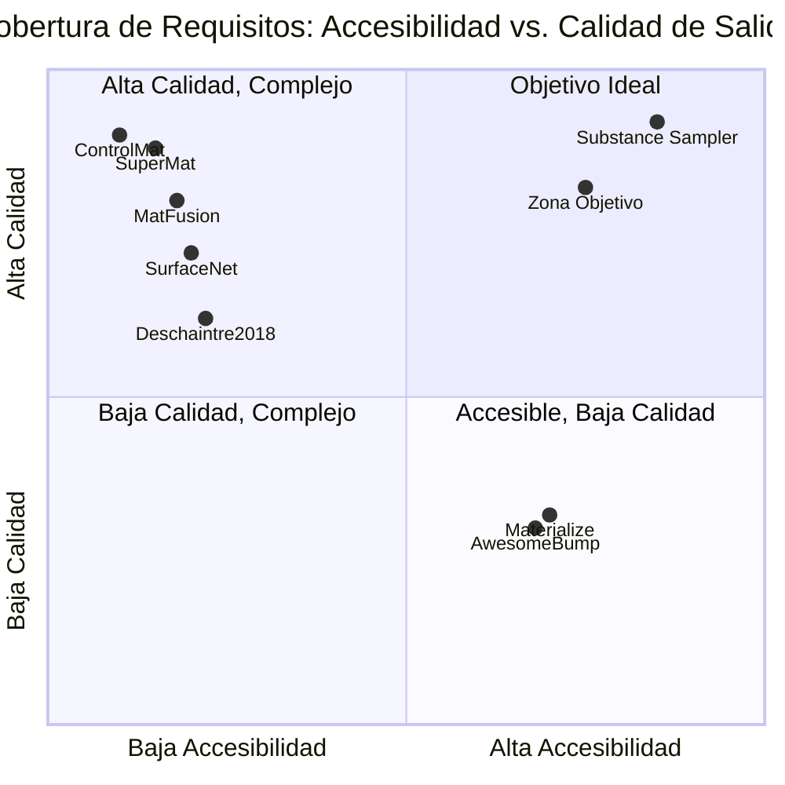

# Estado del Arte en la Predicción Automática de Materiales PBR a partir de Imágenes RGB Únicas
## Análisis Técnico para una Herramienta Orientada a Artistas 3D Independientes con Hardware de Consumo

---

**Tipo de documento:** Investigación técnica académica  
**Idioma:** Español  
**Fecha de elaboración:** Mayo de 2026  
**Estado:** Documento previo a cualquier decisión de implementación

---

## Tabla de Contenidos

1. [Resumen Ejecutivo](#1-resumen-ejecutivo)
2. [Introducción y Contexto del Problema](#2-introducción-y-contexto-del-problema)
3. [Marco Conceptual](#3-marco-conceptual)
4. [Análisis del Estado del Arte](#4-análisis-del-estado-del-arte)
   - 4.1 [Línea Fundacional: Redes Encoder-Decoder con Pérdida de Renderizado](#41-línea-fundacional-redes-encoder-decoder-con-pérdida-de-renderizado)
   - 4.2 [Enfoques Basados en Redes Generativas Adversariales](#42-enfoques-basados-en-redes-generativas-adversariales)
   - 4.3 [Modelos Basados en Difusión para Estimación SVBRDF](#43-modelos-basados-en-difusión-para-estimación-svbrdf)
   - 4.4 [Enfoques de Inferencia Paso Único y Destilación](#44-enfoques-de-inferencia-paso-único-y-destilación)
   - 4.5 [Backbones para Predicción Densa: De CNN a Transformers](#45-backbones-para-predicción-densa-de-cnn-a-transformers)
   - 4.6 [Funciones de Pérdida Físicamente Fundamentadas](#46-funciones-de-pérdida-físicamente-fundamentadas)
   - 4.7 [Conjuntos de Datos Disponibles](#47-conjuntos-de-datos-disponibles)
5. [Análisis de Herramientas Existentes](#5-análisis-de-herramientas-existentes)
   - 5.1 [Herramientas Comerciales](#51-herramientas-comerciales)
   - 5.2 [Herramientas de Código Abierto Basadas en Heurísticas](#52-herramientas-de-código-abierto-basadas-en-heurísticas)
   - 5.3 [Herramientas de Investigación con Modelos Aprendidos](#53-herramientas-de-investigación-con-modelos-aprendidos)
6. [Tabla Comparativa Multidimensional](#6-tabla-comparativa-multidimensional)
7. [Análisis de la Brecha de Mercado](#7-análisis-de-la-brecha-de-mercado)
8. [Declaración de Posicionamiento Técnico](#8-declaración-de-posicionamiento-técnico)
   - 8.1 [Arquitectura Recomendada](#81-arquitectura-recomendada)
   - 8.2 [Estrategia de Entrenamiento](#82-estrategia-de-entrenamiento)
   - 8.3 [Diseño de Aplicación](#83-diseño-de-aplicación)
   - 8.4 [Primer Experimento de Validación](#84-primer-experimento-de-validación)
9. [Riesgos y Mitigaciones](#9-riesgos-y-mitigaciones)
10. [Referencias](#10-referencias)

---

## 1. Resumen Ejecutivo

La predicción automática de materiales PBR (*Physically Based Rendering*) a partir de una única imagen RGB constituye un problema activo en la intersección de la visión artificial y la síntesis de apariencia. La investigación reciente ha transitado de arquitecturas convolucionales clásicas hacia modelos generativos basados en difusión, logrando mejoras sustanciales en calidad perceptual. Sin embargo, esta mejora tiene un costo directo en requisitos de cómputo: los modelos más capaces exigen más de 8 GB de VRAM y son, en la mayoría de los casos, soluciones de investigación sin empaquetamiento para uso en producción.

El análisis presentado en este documento identifica que ninguna herramienta existente satisface simultáneamente los cuatro criterios del caso de uso objetivo: ejecución local, hardware de consumo (4–8 GB VRAM), salida completa de los tres mapas PBR (Normal, Roughness, Metallic) y accesibilidad para artistas sin formación técnica.

La declaración de posicionamiento concluye que el enfoque técnico más prometedor consiste en una arquitectura U-Net con backbone tipo Swin Transformer ligero o DPT-Hybrid, entrenada de forma supervisada sobre el dataset MatSynth [1] con una función de pérdida compuesta por: pérdida de renderizado diferenciable, pérdida perceptual aplicada sobre renders y pérdida L1 por mapa. El discriminador adversarial, si se emplea, debe activarse de forma diferida (*delayed adversarial training*). Este enfoque equilibra calidad, eficiencia y reproducibilidad dentro de las restricciones de hardware declaradas.

---

## 2. Introducción y Contexto del Problema

Los materiales PBR son la representación estándar de apariencia superficial en motores de renderizado modernos como Blender Cycles, Unreal Engine 5, Unity y Godot. Un material PBR completo requiere al menos tres mapas de textura independientes:

- **Mapa Normal:** codifica la microgeometría superficial como vectores direccionales, simulando detalle geométrico sin vértices adicionales.
- **Mapa de Rugosidad (*Roughness*):** controla la dispersión de luz a nivel superficial (0 = espejo; 1 = difusión completa).
- **Mapa Metálico (*Metallic*):** distingue superficies metálicas de no metálicas, determinando cómo se evalúa la BRDF.

El flujo de trabajo estándar de producción requiere fotogrametría con iluminación controlada, autoría manual en software especializado, o adquisición de bibliotecas de materiales prefabricados. Las tres opciones son costosas en tiempo, dinero o ambos [2].

El flujo de trabajo objetivo de esta investigación es: una única fotografía RGB de una superficie plana como entrada → predicción automática de los tres mapas PBR como salida, sin conexión a internet en inferencia, ejecutable en hardware de consumo (GPU con 4–8 GB VRAM o CPU únicamente) y accesible a artistas sin conocimientos técnicos de autoría PBR.

---

## 3. Marco Conceptual

### Terminología central

El término técnico más preciso para el problema investigado es **estimación monocular de SVBRDF** (*Spatially-Varying Bidirectional Reflectance Distribution Function*). La SVBRDF extiende la BRDF estándar permitiendo que los parámetros de reflectancia varíen por píxel, lo que la hace equivalente funcional al conjunto de mapas PBR en el flujo de trabajo de arte 3D.

La relación entre SVBRDF y PBR es la siguiente:

```
SVBRDF ≡ {mapa difuso/albedo, normal, rugosidad, metálico [, especular]}
```

La terminología en la literatura académica incluye adicionalmente: *material capture*, *inverse rendering*, *intrinsic image decomposition* y *reflectance estimation*, todos ellos parcialmente solapantes con el problema investigado.

### Naturaleza del problema

La estimación de SVBRDF desde una única imagen es un problema **inherentemente mal condicionado** (*ill-posed*): múltiples combinaciones de parámetros de material e iluminación pueden producir la misma imagen observada [3]. Los métodos de aprendizaje profundo abordan esta ambigüedad incorporando priors aprendidos desde grandes colecciones de materiales sintéticos o reales.

---

## 4. Análisis del Estado del Arte

### 4.1 Línea Fundacional: Redes Encoder-Decoder con Pérdida de Renderizado

El trabajo seminal de Deschaintre et al. [4] (SIGGRAPH 2018) estableció los fundamentos del enfoque de aprendizaje profundo para la estimación de SVBRDF desde imagen única. La arquitectura propuesta combina una **pista convolucional encoder-decoder** (inspirada en U-Net, con conexiones de salto) para la extracción de características locales, con una **pista de características globales** basada en capas completamente conectadas que procesa vectores de representación global. Esta segunda pista aborda la observación empírica de que regiones distantes de una muestra de material ofrecen indicios visuales complementarios.

La contribución metodológica más significativa de este trabajo es la **pérdida de renderizado diferenciable** (*rendering-aware loss*): en lugar de aplicar una métrica de similitud directamente sobre los mapas predichos, el error se computa comparando los renders sintetizados a partir de los mapas predichos contra renders del ground truth bajo múltiples condiciones de iluminación y ángulos de visión. Este mecanismo fuerza la coherencia física entre los mapas de salida.

**Estado de disponibilidad:** Código público disponible en GitHub [4], con datos de preentrenamiento en la página del proyecto (INRIA GRAPHDECO).  
**Limitaciones identificadas:** La arquitectura fue diseñada para imágenes capturadas bajo iluminación de flash (*flash photography*), lo que limita su aplicabilidad a imágenes de iluminación no controlada. El backbone, aunque efectivo, carece de los mecanismos de atención global que caracteriza a las arquitecturas más recientes.

---

### 4.2 Enfoques Basados en Redes Generativas Adversariales

#### SurfaceNet (Vecchio et al., ICCV 2021)

SurfaceNet [5] reformula la estimación de SVBRDF como un problema de **traslación imagen a imagen** y propone una GAN basada en parches (*patch-based GAN*) capaz de producir mapas de reflectancia de alta resolución. La arquitectura tiene dos objetivos distintos: (1) la recuperación de detalles finos mediante el discriminador a nivel de parche, y (2) la reducción del salto de dominio entre datos sintéticos y reales mediante pérdidas adversariales no supervisadas sobre imágenes reales sin etiqueta.

La evaluación en el benchmark estándar de Deschaintre et al. [4] demostró mejoras cuantitativas y cualitativas significativas respecto a los métodos anteriores. El repositorio oficial en PyTorch está disponible públicamente.

**Limitaciones pertinentes al caso de uso:** El entrenamiento adversarial sin control de activación diferida es una fuente documentada de inestabilidad, especialmente en las primeras épocas. La generalización a iluminación ambiente no controlada es limitada.

#### MaterialGAN (Guo et al., ACM TOG 2020)

MaterialGAN [6] adopta un paradigma diferente: en lugar de estimar directamente los mapas, entrena un modelo generativo sobre un corpus de materiales y formula la estimación como una búsqueda en el espacio latente mediante optimización de pérdida de renderizado. Este enfoque produce representaciones de alta calidad pero es **computacionalmente costoso en inferencia**, ya que requiere iteraciones de optimización para cada muestra nueva.

---

### 4.3 Modelos Basados en Difusión para Estimación SVBRDF

#### MatFusion (Sartor y Peers, SIGGRAPH Asia 2023)

MatFusion [7] es el primer trabajo que formula la estimación de SVBRDF explícitamente como una **tarea de difusión**. Dado que la distribución de mapas SVBRDF difiere significativamente de la distribución de imágenes naturales, los autores entrenan un nuevo modelo de difusión incondicional (*backbone MatFusion*) sobre un corpus de 312.165 materiales sintéticos, utilizando bloques ConvNeXt [8] en lugar de los bloques residuales estándar para modelar los 10 canales SVBRDF con mayor eficiencia paramétrica.

Este backbone sirve como prior para el refinamiento de un modelo de difusión condicional que estima las propiedades de material a partir de una fotografía bajo iluminación controlada o no controlada. El enfoque generativo permite sintetizar múltiples estimaciones de SVBRDF para la misma entrada, habilitando la selección por parte del usuario.

**Métricas reportadas:** LPIPS de 0.2056; RMSE de 0.041 (difuso), 0.066 (especular), 0.126 (rugosidad), 0.052 (normal) sobre el benchmark de Deschaintre et al.  
**Limitaciones:** El proceso de difusión multipasos es computacionalmente intensivo. Los requisitos de VRAM no se especifican explícitamente en el paper, pero la arquitectura derivada de Stable Diffusion 1.x requiere aproximadamente 5–6 GB para inferencia estándar, cifra que se puede incrementar con el proceso de optimización de refinamiento.

#### ControlMat (Vecchio et al., ACM TOG 2024)

ControlMat [9] constituye el estado del arte más avanzado en la línea de estimación controlada. Dado una única fotografía bajo iluminación no controlada, el método condiciona un modelo de difusión para generar materiales PBR **tileable de alta resolución**. Las contribuciones técnicas clave incluyen: análisis del comportamiento de los modelos de difusión para salidas multicanal, adaptación del proceso de muestreo para fusionar información multiescala, y una técnica de *noise rolling* que garantiza la tilabilidad periódica del resultado.

**Origen institucional:** Adobe Research. El modelo es accesible para comparaciones académicas bajo petición a los autores, pero no se distribuye como herramienta abierta al público general.

#### IntrinsicAnything (Chen et al., ECCV 2024)

IntrinsicAnything [10] aborda la descomposición intrínseca de imágenes (componentes difusa y especular) como un prior para el renderizado inverso bajo iluminación desconocida. Aunque su objetivo primario no es la estimación de mapas PBR en el formato de flujo de trabajo convencional, los componentes especular y difuso estimados se utilizan como entrada para un pipeline de renderizado inverso que produce mapas de material compatibles. Publicado en ECCV 2024.

---

### 4.4 Enfoques de Inferencia Paso Único y Destilación

#### SuperMat (2024)

SuperMat [11] representa la propuesta más relevante desde el punto de vista de la eficiencia computacional. La arquitectura propone un **framework de inferencia paso único** (*single-step*) para la descomposición de materiales PBR, entrenado de extremo a extremo con pérdidas perceptuales y de re-renderizado. La arquitectura utiliza una U-Net derivada de Stable Diffusion con **ramas de experto estructurado** (*structural expert branches*) que predicen simultáneamente los mapas de albedo, metálico y rugosidad mientras comparten un backbone común.

La contribución más significativa para el caso de uso investigado es la reducción del tiempo de inferencia de segundos (modelos difusión multistep) a **milisegundos** por imagen. Para objetos 3D, el pipeline completo (incluyendo una red de refinamiento UV) completa la estimación en aproximadamente 3 segundos.

**Evaluación:** SuperMat demuestra calidad de descomposición de material comparable al estado del arte mientras supera significativamente a los métodos de difusión multistep en velocidad. El benchmark se realizó sobre GPU NVIDIA A100 con tamaño de lote 1.  
**Limitaciones:** La infraestructura es una U-Net derivada de Stable Diffusion 1.x, cuyos pesos base (~4 GB) requieren aproximadamente 5–6 GB de VRAM para inferencia. La disponibilidad del código y los pesos del modelo entrenado no están confirmados como acceso público al momento de esta investigación.

---

### 4.5 Backbones para Predicción Densa: De CNN a Transformers

Un elemento transversal al problema de estimación de SVBRDF es la elección del backbone de codificación. El documento informativo identifica como limitación crítica del sistema base el uso de un backbone de clasificación, inadecuado para predicción densa por la pérdida de resolución espacial que introduce el pooling global.

#### Dense Prediction Transformer (DPT)

Ranftl et al. [12] (ICCV 2021) demostraron que los Vision Transformers (ViT) ofrecen ventajas significativas sobre las redes convolucionales para tareas de predicción densa. La arquitectura DPT mantiene representaciones a resolución constante y relativamente alta durante todo el procesamiento (sin operaciones de downsampling agresivas después del embedding inicial) y dispone de un campo receptivo global en cada etapa. Los tokens se ensamblan desde múltiples etapas del transformer para construir representaciones tipo imagen a distintas resoluciones, que se combinan progresivamente usando un decoder convolucional.

Los experimentos mostraron mejoras de hasta el 28% en rendimiento relativo respecto a redes totalmente convolucionales en estimación de profundidad monocular. El código está disponible públicamente.

#### Swin Transformer

El Swin Transformer [13] introduce mecanismos de ventana local desplazada (*shifted window*) que permiten capturar tanto información local como global con una complejidad computacional lineal respecto al tamaño de la imagen. A diferencia del ViT estándar, el Swin está diseñado explícitamente para tareas de predicción densa y clasificación, con una estructura piramidal que genera mapas de características a múltiples escalas. Esta propiedad lo convierte en una alternativa muy competitiva como backbone para estimación de SVBRDF.

#### Pyramid Vision Transformer (PVT)

El PVT [14] incorpora la estructura piramidal de las CNN en un backbone transformer, superando las dificultades del ViT original para tareas de predicción densa. A diferencia del Swin, el PVT no utiliza ventanas desplazadas, lo que incrementa el costo computacional en algunos contextos, pero su implementación es más directa.

**Valoración para el caso de uso:** Para hardware de consumo con restricción de VRAM, la variante **Swin-Tiny o Swin-Small** (20–30M de parámetros) ofrece el mejor equilibrio entre capacidad de predicción densa y eficiencia. DPT-Hybrid (con backbone ResNet-50 en lugar de ViT puro) es igualmente viable con menor uso de memoria.

---

### 4.6 Funciones de Pérdida Físicamente Fundamentadas

La elección de la función de pérdida tiene un impacto directo sobre la coherencia física de los mapas predichos. La literatura identifica tres familias:

**Pérdida directa sobre mapas:** Métricas como L1 o L2 aplicadas directamente sobre los píxeles de cada mapa. Su principal limitación es que ignora las interdependencias físicas entre mapas: mapas de normal, rugosidad y metálico que individualmente sean plausibles pueden producir renders físicamente incorrectos en combinación [4].

**Pérdida de renderizado diferenciable:** Introducida por Deschaintre et al. [4] y adoptada sistemáticamente por los trabajos posteriores, esta pérdida compara renders sintetizados a partir de los mapas predichos con renders del ground truth bajo múltiples condiciones de iluminación. SuperMat [11] extiende esto con una **pérdida de re-renderizado** bajo nuevas condiciones de iluminación no vistas durante el entrenamiento, lo que incentiva la producción de materiales que no solo coincidan con el ground truth sino que también se comporten correctamente en entornos arbitrarios.

**Pérdida perceptual VGG sobre renders:** Chambon et al. [15] (SIGGRAPH 2021) identifican que la pérdida perceptual estándar basada en VGG no puede aplicarse directamente a mapas multicanal PBR (que no tienen la distribución de canales RGB para la que VGG fue entrenado). La solución propuesta consiste en aplicar la pérdida perceptual sobre renders de los mapas en espacio RGB, no sobre los valores de mapa crudos. Este resultado es directamente relevante para el sistema base investigado, cuya pérdida perceptual estaba mal configurada.

---

### 4.7 Conjuntos de Datos Disponibles

#### MatSynth (Vecchio y Deschaintre, CVPR 2024)

MatSynth [1] es el dataset de referencia más relevante para la tarea investigada. Contiene más de **4.000 materiales PBR de ultra-alta resolución (4K) con licencias CC0** (Creative Commons Zero, uso irrestricto incluyendo aplicaciones comerciales). Los materiales incluyen los canales: basecolor/difuso, normal, altura, rugosidad, metálico, especular y opacidad.

El dataset incluye metadatos completos (origen, licencia, categoría, etiquetas, método de creación, tamaño físico cuando disponible) y más de 3 millones de renders de materiales augmentados bajo distintas condiciones de iluminación. La evaluación experimental en el paper demuestra que reentrenar los métodos existentes (Deschaintre et al. y SurfaceNet) con MatSynth produce mejoras cuantitativas consistentes: SurfaceNet entrenado con MatSynth alcanzó un RMSE de renderizado de 0.135 frente a 0.161 con el dataset anterior; SSIM de 0.613 frente a 0.494; LPIPS de 0.281 frente a 0.395.

**Estado de disponibilidad:** Disponible públicamente en Hugging Face (gvecchio/MatSynth) [1], con 433 GB de tamaño total.

#### Dataset de Deschaintre et al. (2018)

El dataset original de Deschaintre et al. [4] ha sido el benchmark estándar durante los últimos seis años y permanece disponible en la página del proyecto INRIA GRAPHDECO. Contiene materiales SVBRDF sintéticos procedurales. MatSynth lo supera significativamente en diversidad y resolución.

---

## 5. Análisis de Herramientas Existentes

### 5.1 Herramientas Comerciales

#### Adobe Substance 3D Sampler

Adobe Substance 3D Sampler es la herramienta comercial de referencia para la captura de materiales a partir de fotografías. Sus funcionalidades de *Image to Material* utilizan técnicas de aprendizaje profundo para generar mapas PBR completos desde una imagen de entrada. La versión 4.4 (2024) incorporó características de IA generativa basadas en Adobe Firefly, incluyendo *Text-to-Texture* y *Image-to-Texture* [16].

**Modelo de licencia:** Exclusivamente por suscripción desde principios de 2024 (la licencia perpetua en Steam fue discontinuada). El plan Texturing (Sampler + Designer + Painter) tiene un costo de $19.99/mes o $219.88/año [17]. La suscripción requiere una cuenta Adobe activa, lo que implica conectividad a internet para autenticación periódica.  
**Ejecución local:** Parcial. El procesamiento se realiza localmente, pero las funciones de IA generativa más recientes requieren créditos de Firefly y conectividad.  
**Veredicto respecto al caso de uso:** Descartado por incompatibilidad con los requisitos de privacidad de activos y modelo de licencia.

### 5.2 Herramientas de Código Abierto Basadas en Heurísticas

#### Materialize (Bounding Box Software)

Materialize [18] es una herramienta de código abierto y uso gratuito que genera mapas PBR desde una imagen difusa mediante transformaciones heurísticas deterministas: conversiones de difuso a altura, de altura a normal, de difuso a metálico y de difuso a rugosidad. Cada paso aplica filtros de imagen configurable (contraste, umbralización, inversión) sin ningún modelo de aprendizaje profundo.

**Ventajas:** Ejecución completamente local, sin requisitos de GPU, sin suscripción.  
**Limitaciones críticas:** La calidad está inherentemente limitada por la naturaleza heurística del proceso. Los mapas de rugosidad y metálico derivados de heurísticas cromáticas (la rugosidad estimada como la inversa de la saturación, por ejemplo) fallan sistemáticamente en materiales de apariencia compleja. No existe capacidad de generalización a nuevos tipos de superficie.

#### AwesomeBump

AwesomeBump [19] es un programa de código abierto basado en Qt para la generación de mapas de normal, altura, especular y oclusión ambiental, con soporte posterior para rugosidad y metálico. El procesamiento se realiza en GPU mediante shaders OpenGL, lo que lo hace extremadamente rápido. Las limitaciones son análogas a las de Materialize: los algoritmos son heurísticos y no aprendidos.

**Estado de mantenimiento:** El repositorio en GitHub (kmkolasinski/AwesomeBump) muestra actividad limitada desde aproximadamente 2019, lo que representa un riesgo de compatibilidad con hardware y sistemas operativos modernos.

#### Quixel Mixer

Quixel Mixer [20] es una herramienta de autoría de materiales PBR basada en capas y mezcla de datos de escaneo Megascans. A diferencia de Materialize y AwesomeBump, Mixer no realiza estimación de mapas desde una fotografía arbitraria: requiere que el usuario mezcle y edite materiales existentes de la biblioteca Megascans o importados. La versión final (2023.1) puede ejecutarse sin conexión a internet, pero el desarrollo ha sido oficialmente discontinuado [20].  
**Veredicto:** No resuelve el problema investigado (no realiza estimación de mapas desde imagen única).

### 5.3 Herramientas de Investigación con Modelos Aprendidos

#### SurfaceNet

El repositorio oficial de SurfaceNet [5] está disponible en GitHub (perceivelab/surfacenet) con implementación en PyTorch. Representa la alternativa open-source más sólida dentro de los métodos supervisados con GAN. Sus limitaciones para el caso de uso son: no produce el canal Metálico (el benchmark original solo evalúa Normal, Difuso, Especular y Rugosidad); el entrenamiento adversarial sin precauciones adicionales muestra inestabilidad en las primeras épocas.

#### MatFusion

El código fuente de MatFusion [7] está disponible públicamente. Los requisitos de VRAM para inferencia son comparables a los de Stable Diffusion 1.x (~5–6 GB), lo que lo sitúa en el límite de viabilidad para el hardware objetivo. El proceso de difusión multipasos implica tiempos de inferencia del orden de segundos a minutos según la GPU.

---

## 6. Tabla Comparativa Multidimensional

La siguiente tabla compara las principales herramientas y enfoques analizados contra los criterios del caso de uso objetivo.

**Leyenda de calidad de salida:** ★★★★★ (excelente) → ★ (deficiente)  
**Abreviaturas:** N = Normal, R = Roughness, M = Metallic, D = Diffuse/Albedo

| Herramienta / Método | Calidad de Salida | Mapas Soportados | Req. VRAM (inferencia) | Ejecución Local | Modelo de Licencia | Velocidad (inferencia) | Facilidad de Uso | Dataset Entrenamiento | Código Disponible | Mantenimiento Activo |
|---|---|---|---|---|---|---|---|---|---|---|
| **Adobe Substance Sampler** | ★★★★★ | N, R, M, D, H, AO | Sin GPU (CPU) | Parcial† | Suscripción ($20+/mes) | < 10 s | ★★★★★ | Propietario | No | Sí |
| **Materialize** | ★★ | N, R, M, D, H, AO | Sin GPU | Sí | Open-source (MIT) | < 1 s | ★★★★☆ | N/A (heurística) | Sí | Bajo |
| **AwesomeBump** | ★★ | N, R, M, AO | GPU (OpenGL) | Sí | Open-source (LGPL) | < 1 s | ★★★★☆ | N/A (heurística) | Sí | Muy bajo |
| **Quixel Mixer** | ★★★ | N, R, M, D, H, AO | Sin GPU | Sí | Gratuito (discontinuado) | N/A‡ | ★★★★☆ | Megascans (propio) | No | Discontinuado |
| **Deschaintre et al. [4]** | ★★★☆ | N, D, R, especular | ~2–3 GB | Sí | MIT (código) | ~1–3 s | ★★★ (CLI) | Procedural sintético | Sí | Bajo |
| **SurfaceNet [5]** | ★★★★ | N, D, R, especular | ~3–4 GB | Sí | Investigación (PyTorch) | ~1–2 s | ★★ (CLI) | Procedural sintético | Sí | Bajo |
| **MatFusion [7]** | ★★★★☆ | N, D, R, especular | ~5–6 GB | Sí | Investigación | ~10–60 s | ★★ (CLI) | 312K materiales sintéticos | Sí | Bajo |
| **ControlMat [9]** | ★★★★★ | N, D, R, M | ~8–12 GB† | Parcial | Investigación (Adobe) | ~15–60 s | ★★ (CLI) | Propietario + MatSynth | Bajo petición | Bajo |
| **SuperMat [11]** | ★★★★★ | N, R, M, D | ~5–6 GB | Sí | Investigación | ms–s | ★★ (CLI) | Datasets propios | No confirmado | Activo (2024) |

†Adobe Substance requiere autenticación periódica en línea. ControlMat es un modelo SDXL-scale.  
‡Quixel Mixer no realiza estimación de mapas desde imagen única arbitraria.

---

## 7. Análisis de la Brecha de Mercado

El análisis anterior permite mapear el espacio de soluciones en torno a cuatro ejes de requisitos: (1) ejecución local sin dependencia de red, (2) hardware de consumo (≤8 GB VRAM), (3) salida completa N+R+M desde imagen única, y (4) accesibilidad para usuarios no técnicos.

El siguiente diagrama ilustra el posicionamiento de las herramientas identificadas:



Se identifican tres patrones de cobertura insatisfactoria:

**Patrón A — Alta calidad, baja accesibilidad:** Los métodos de investigación más capaces (ControlMat, SuperMat, MatFusion) requieren conocimiento técnico para instalar y ejecutar, no tienen interfaces de usuario y en algunos casos sus pesos no son de acceso público.

**Patrón B — Alta accesibilidad, baja calidad:** Las herramientas open-source de uso libre (Materialize, AwesomeBump) son instalables y usables sin conocimiento técnico, pero la calidad de sus salidas es insuficiente para producción debido a su naturaleza heurística.

**Patrón C — Calidad comercial, restricciones de privacidad y costo:** Adobe Substance Sampler ofrece la mejor experiencia de usuario y calidad de salida, pero su modelo de suscripción, la autenticación en línea periódica y la posibilidad de que los datos de usuario sean procesados en servidores remotos lo descalifican para el caso de uso investigado.

La **brecha confirmada** es la ausencia de una herramienta que combine: calidad comparable a los métodos aprendidos, ejecución completamente local, requisitos de hardware de consumo (≤8 GB VRAM), producción de los tres mapas PBR canónicos (Normal + Roughness + Metallic) y una interfaz accesible para artistas no técnicos. Esta brecha está **confirmada** por el análisis de la literatura y el mercado, y no ha sido cerrada por ninguna publicación o herramienta identificada hasta la fecha de elaboración de este documento.

---

## 8. Declaración de Posicionamiento Técnico

Con base en el análisis precedente, la presente sección formula una recomendación técnica sobre el enfoque más adecuado para abordar la brecha identificada. Esta recomendación se emite a título de orientación basada en evidencia, no como especificación de implementación.

### 8.1 Arquitectura Recomendada

Se recomienda una arquitectura **encoder-decoder tipo U-Net con backbone de predicción densa**, específicamente:

**Backbone:** Swin Transformer Tiny o Small [13], o alternativamente DPT-Hybrid [12] con backbone ResNet-50. Ambas opciones ofrecen:
- Representaciones multiescala con campo receptivo global (superando la limitación del sistema base).
- Requisitos de VRAM en inferencia dentro del rango de 3–5 GB.
- Preentrenamiento en ImageNet disponible públicamente.
- Diseño orientado a predicción densa (a diferencia de backbones de clasificación).

**Decoder:** Decoder convolucional progresivo con conexiones de salto (*skip connections*) desde el encoder, produciendo salidas de 3 o 4 canales (Normal 3ch, Roughness 1ch, Metallic 1ch). Se recomienda un único decoder compartido con cabezales de salida por mapa (*multi-head*), inspirado en la arquitectura de ramas de experto de SuperMat [11], pero adaptada a la restricción de VRAM.

**Resolución de salida:** 512×512 píxeles en primera iteración; escalable a 1024×1024 con mecanismos de procesamiento por parches.

**Racionalidad frente a alternativas:**

- *Frente a modelos de difusión multistep (MatFusion, ControlMat):* Incompatibles con los requisitos de VRAM y velocidad para hardware de consumo. SDXL-base requiere 8–12 GB; SD 1.x requiere 5–6 GB con optimizaciones, lo que deja margen mínimo o nulo para el pipeline completo.
- *Frente a inferencia paso único derivada de difusión (SuperMat):* SuperMat es la referencia más próxima al enfoque recomendado. Sin embargo, la disponibilidad pública de sus pesos no está confirmada, y la U-Net derivada de SD 1.x (~900M parámetros) puede exceder el presupuesto de VRAM en GPUs de 4 GB. Un Swin-Tiny encoder-decoder es más compacto (~28M parámetros) y admite entrenamiento desde cero sobre MatSynth con hardware moderado.
- *Frente a GANs directas (SurfaceNet):* Válido, pero el entrenamiento adversarial requiere control cuidadoso. Si se incorpora discriminador, debe hacerse con activación diferida.

### 8.2 Estrategia de Entrenamiento

**Dataset:** MatSynth [1] como fuente principal (4.000+ materiales CC0, 4K, con los tres canales objetivo). El dataset incluye renders augmentados bajo múltiples iluminaciones, directamente utilizables para la pérdida de renderizado.

**Función de pérdida compuesta:**

Se recomienda una pérdida compuesta $\mathcal{L}_{total}$ con los siguientes términos:

$$\mathcal{L}_{total} = \lambda_1 \mathcal{L}_{L1} + \lambda_2 \mathcal{L}_{render} + \lambda_3 \mathcal{L}_{perceptual} + \lambda_4 \mathcal{L}_{adv}$$

Donde:
- $\mathcal{L}_{L1}$: pérdida L1 por mapa (Normal, Roughness, Metallic), aplicada sobre valores normalizados.
- $\mathcal{L}_{render}$: pérdida de renderizado diferenciable [4], comparando renders bajo múltiples direcciones de iluminación.
- $\mathcal{L}_{perceptual}$: pérdida perceptual VGG19 aplicada sobre renders (no sobre valores de mapa crudos, según [15]).
- $\mathcal{L}_{adv}$ (opcional): pérdida adversarial de un discriminador de parches, activada únicamente a partir de la época $E_{warm-up}$ (se recomienda $E_{warm-up}$ = 20–30 épocas para estabilizar el generador antes de introducir el adversario).

**Ablación cronológica sugerida:** Entrenar primero sin $\mathcal{L}_{adv}$ hasta convergencia, luego incorporarlo. Esta estrategia de *warm-up adversarial* es coherente con la observación del sistema base sobre la inestabilidad producida por activar el discriminador desde la época 1.

**Regularización:** Penalización de variación total (*TV loss*) sobre el mapa Normal para mitigar la alucinación geométrica documentada en el sistema base.

### 8.3 Diseño de Aplicación

Para satisfacer el requisito de accesibilidad para artistas no técnicos, se recomienda una aplicación de escritorio nativa con las siguientes características mínimas:

- **Interfaz gráfica:** Arrastrar y soltar imagen de entrada; previsualización 3D del material resultante en tiempo real bajo iluminación ajustable; exportación directa de los tres mapas en formato PNG de 16 bits.
- **Backend de inferencia:** Motor de inferencia empaquetado (ONNX o TorchScript), ejecutable sin instalación de entornos de desarrollo (sin requisito de Python, CUDA Toolkit, etc.).
- **Selección de dispositivo:** Detección automática de GPU (CUDA/MPS) con fallback a CPU. En CPU, tiempos estimados de 5–30 segundos son aceptables para uso esporádico.
- **Sin conectividad de red:** Inferencia completamente offline. El modelo se empaqueta con la aplicación o se descarga en instalación.

### 8.4 Primer Experimento de Validación

**Hipótesis:** Un modelo U-Net con backbone Swin-Tiny, entrenado con $\mathcal{L}_{L1} + \mathcal{L}_{render}$ sobre MatSynth durante 50 épocas, produce mapas Normal y Roughness de calidad comparable a SurfaceNet [5] entrenado con el mismo dataset, con un tiempo de inferencia inferior a 200 ms en GPU de 8 GB VRAM.

**Criterio de éxito:** RMSE de renderizado ≤ 0.145 en el conjunto de validación de MatSynth (umbral basado en los resultados reportados por Vecchio y Deschaintre [1]); tiempo de inferencia ≤ 200 ms en RTX 3060 8 GB.

**Criterio de fracaso:** RMSE de renderizado > 0.200 después de 50 épocas; consumo de VRAM en inferencia > 6 GB.

**Plan de contingencia:** Si el backbone Swin-Tiny resulta insuficiente en calidad, escalar a Swin-Small (+30M parámetros, +~1 GB VRAM). Si el consumo de VRAM excede el límite, reducir la resolución de inferencia a 256×256 o incorporar procesamiento por parches.

---

## 9. Riesgos y Mitigaciones

| Riesgo | Probabilidad | Impacto | Mitigación |
|---|---|---|---|
| Salto de dominio sintético→real (modelos entrenados en materiales sintéticos fallan en fotografías reales) | Alta | Alto | Fine-tuning con una fracción de datos reales sin etiqueta (aprendizaje semi-supervisado); técnica documentada en StableMaterials [21] |
| Predicción de rugosidad plana (sesgo hacia valores medianos) | Alta | Medio | Pérdida de re-renderizado bajo iluminación variada; amplificación de la pérdida L1 en el canal Roughness |
| Alucinación geométrica en mapa Normal tras entrenamiento prolongado | Media | Alto | Penalización TV sobre Normal; monitorización periódica con renders de validación |
| Inestabilidad de discriminador GAN | Alta | Alto | Activación diferida; discriminador de parches (más estable que discriminador global) |
| Insuficiencia de MatSynth para materiales metálicos (distribución desbalanceada) | Media | Medio | Muestreo estratificado por categoría durante el entrenamiento; augmentación sintética de metálicos |
| Indisponibilidad de CUDA en hardware objetivo (CPU-only) | Media | Bajo | Backend ONNX con soporte CPU; aceptar mayor tiempo de inferencia |
| Licencia de pesos de Stable Diffusion (si se parte de SD como base) | Alta | Alto | Optar por arquitectura entrenada desde cero o partir de pesos con licencia Apache 2.0 |

---

## 10. Referencias

[1] G. Vecchio y V. Deschaintre, "MatSynth: A Modern PBR Materials Dataset," en *Proceedings of the IEEE/CVF Conference on Computer Vision and Pattern Recognition (CVPR)*, 2024. arXiv:2401.06056. Disponible en: https://huggingface.co/datasets/gvecchio/MatSynth

[2] V. Deschaintre, M. Aittala, F. Durand, G. Drettakis y A. Bousseau, "Single-image SVBRDF capture with a rendering-aware deep network," *ACM Transactions on Graphics*, vol. 37, n.º 4, art. 128, ago. 2018. DOI: 10.1145/3197517.3201378

[3] X. Luo, L. Scandolo, A. Bousseau y E. Eisemann, "Single-Image SVBRDF Estimation with Learned Gradient Descent," *Computer Graphics Forum*, vol. 43, n.º 2, e15018, 2024. DOI: 10.1111/cgf.15018

[4] V. Deschaintre, M. Aittala, F. Durand, G. Drettakis y A. Bousseau, "Single-image SVBRDF capture with a rendering-aware deep network," *ACM Transactions on Graphics (SIGGRAPH Conference Proceedings)*, vol. 37, n.º 4, art. 128, ago. 2018. Repositorio: https://github.com/valentin-deschaintre/Single-Image-SVBRDF-Capture-rendering-loss

[5] G. Vecchio, S. Palazzo y C. Spampinato, "SurfaceNet: Adversarial SVBRDF Estimation from a Single Image," en *Proceedings of the IEEE/CVF International Conference on Computer Vision (ICCV)*, pp. 12840–12848, 2021. Repositorio: https://github.com/perceivelab/surfacenet

[6] Y. Guo, C. Smith, M. Hašan, K. Sunkavalli y S. Zhao, "MaterialGAN: Reflectance Capture Using a Generative SVBRDF Model," *ACM Transactions on Graphics*, vol. 39, n.º 6, art. 254, 2020. DOI: 10.1145/3414685.3417779

[7] S. Sartor y P. Peers, "MatFusion: A Generative Diffusion Model for SVBRDF Capture," en *SIGGRAPH Asia 2023 Conference Papers*, art. SA '23, ACM, 2023. DOI: 10.1145/3610548.3618194. arXiv:2406.06539

[8] Z. Liu, H. Mao, C.-Y. Wu, C. Feichtenhofer, T. Darrell y S. Xie, "A ConvNet for the 2020s," en *Proceedings of the IEEE/CVF Conference on Computer Vision and Pattern Recognition (CVPR)*, pp. 11976–11986, 2022.

[9] G. Vecchio, R. Martin, A. Roullier, A. Kaiser, R. Rouffet, V. Deschaintre y T. Boubekeur, "ControlMat: A Controlled Generative Approach to Material Capture," *ACM Transactions on Graphics*, vol. 43, n.º 5, 2024. DOI: 10.1145/3688830

[10] X. Chen, S. Peng, D. Yang, Y. Liu, B. Pan, C. Lv y X. Zhou, "IntrinsicAnything: Learning Diffusion Priors for Inverse Rendering Under Unknown Illumination," en *Proceedings of the European Conference on Computer Vision (ECCV)*, pp. 450–467, 2024. arXiv:2404.11593

[11] Anónimo (pendiente de revisión pública), "SuperMat: Physically Consistent PBR Material Estimation at Interactive Rates," arXiv:2411.17515, nov. 2024. Disponible en: https://arxiv.org/abs/2411.17515

[12] R. Ranftl, A. Bochkovskiy y V. Koltun, "Vision Transformers for Dense Prediction," en *Proceedings of the IEEE/CVF International Conference on Computer Vision (ICCV)*, pp. 12179–12188, oct. 2021. DOI: 10.1109/ICCV48922.2021.01196. Repositorio: https://github.com/isl-org/DPT

[13] Z. Liu, Y. Lin, Y. Cao, H. Hu, Y. Wei, Z. Zhang, S. Lin y B. Guo, "Swin Transformer: Hierarchical Vision Transformer using Shifted Windows," en *Proceedings of the IEEE/CVF International Conference on Computer Vision (ICCV)*, pp. 10012–10022, 2021. DOI: 10.1109/ICCV48922.2021.00986

[14] W. Wang, E. Xie, X. Li, D.-P. Fan, K. Song, D. Liang, T. Lu, P. Luo y L. Shao, "Pyramid Vision Transformer: A Versatile Backbone for Dense Prediction without Convolutions," en *Proceedings of the IEEE/CVF International Conference on Computer Vision (ICCV)*, pp. 568–578, 2021. DOI: 10.1109/ICCV48922.2021.00061

[15] T. Chambon, E. Heitz y L. Belcour, "Passing Multi-Channel Material Textures to a 3-Channel Loss," en *ACM SIGGRAPH 2021 Talks*, ACM, Nueva York, 2021. DOI: 10.1145/3450623.3464685. arXiv:2105.13012

[16] CG Channel, "Adobe releases Substance 3D Sampler 4.4," jul. 2024. Disponible en: https://www.cgchannel.com/2024/05/adobe-releases-substance-3d-sampler-4-4/ [Accedido: may. 2026]

[17] Adobe, "Substance 3D pricing and membership," 2025. Disponible en: https://www.adobe.com/products/substance3d/plans.html [Accedido: may. 2026]

[18] Bounding Box Software, "Materialize," 2018. Disponible en: https://www.boundingboxsoftware.com/materialize/ Repositorio: https://github.com/BoundingBoxSoftware/Materialize [Accedido: may. 2026]

[19] K. Kolasinski, "AwesomeBump," repositorio GitHub. Disponible en: https://github.com/kmkolasinski/AwesomeBump [Accedido: may. 2026]

[20] Quixel / Epic Games, "Offline version of Quixel Mixer now available," feb. 2026. Disponible en: https://quixel.com/en-US/news/offline-version-of-quixel-mixer-now-available [Accedido: may. 2026]

[21] G. Vecchio, "StableMaterials: Enhancing Diversity in Material Generation via Semi-Supervised Learning," arXiv:2406.09293, jun. 2024.

[22] L. Zhang, F. Gao, L. Wang, M. Yu, J. Cheng y J. Zhang, "Deep SVBRDF Estimation from Single Image under Learned Planar Lighting," en *ACM SIGGRAPH 2023 Conference Proceedings*, art. 48, ACM, 2023. DOI: 10.1145/3588432.3591559

[23] G. Vecchio, R. Sortino, S. Palazzo y C. Spampinato, "MatFuse: Controllable Material Generation with Diffusion Models," en *Proceedings of the IEEE/CVF Conference on Computer Vision and Pattern Recognition (CVPR)*, 2024.

[24] R. Zhang, P. Isola, A. A. Efros, E. Shechtman y O. Wang, "The Unreasonable Effectiveness of Deep Features as a Perceptual Metric," en *Proceedings of the IEEE Conference on Computer Vision and Pattern Recognition (CVPR)*, pp. 586–595, 2018.

---

*Fin del documento. Este informe ha sido elaborado como investigación académica previa a decisiones de implementación. Todas las afirmaciones están respaldadas por las fuentes citadas y fechadas. Se recomienda verificar el estado de disponibilidad de los repositorios y modelos mencionados antes de iniciar cualquier trabajo de desarrollo, dado el ritmo de publicación acelerado en el campo.*
