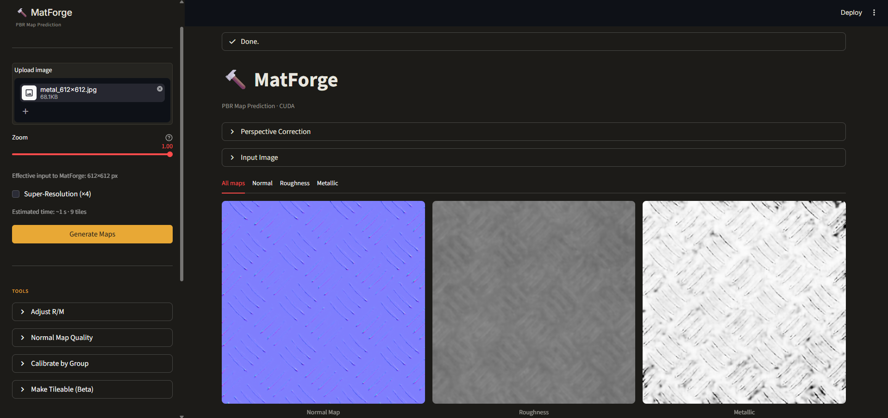
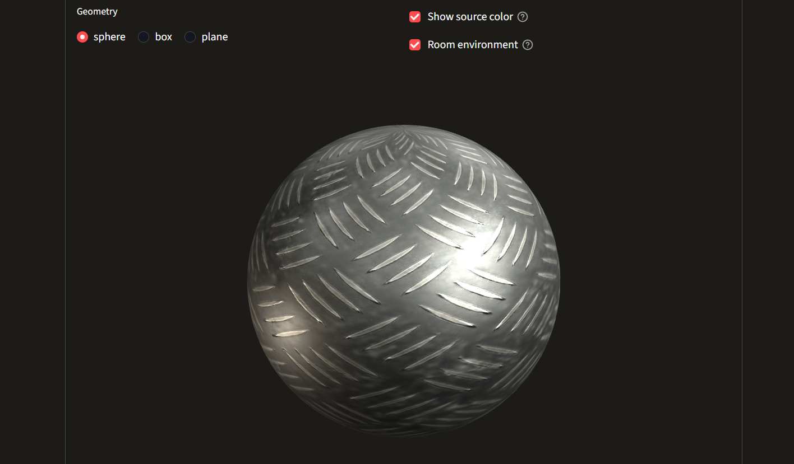
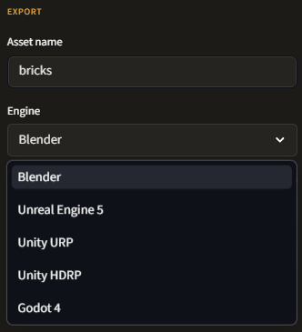

# MatForge — Predicción de Mapas PBR a partir de una Sola Imagen

MatForge es una aplicación Streamlit local que predice mapas de renderizado físicamente correcto (PBR) — Normal, Roughness y Metallic — a partir de una única imagen RGB. Funciona completamente en local, no requiere conexión a internet tras la instalación, y está diseñada para artistas 3D y artistas técnicos que necesitan generar mapas de material PBR a partir de referencias fotográficas.



---

## Funcionalidades

- **Predicción de mapas PBR** — mapas Normal, Roughness y Metallic a partir de una única imagen RGB.
- **Clasificador de material** — detección automática del grupo de material (ladrillo, madera, metal, piedra, tela y más) mediante DINOv2 + KNN, con posibilidad de ajuste manual.
- **Super-Resolución opcional** — escalado ×4 con Real-ESRGAN antes de la inferencia para imágenes de baja resolución.
- **Corrección de perspectiva** — warp interactivo de cuatro puntos con previsualización en tiempo real antes de la inferencia.
- **Ajuste de Roughness / Metallic** — sliders de ganancia y offset por canal.
- **Calibración por grupo** — aplica curvas de corrección específicas según el grupo de material detectado.
- **Evaluación de calidad del normal map** — puntuación heurística (coherencia, continuidad, bloques) con mapa de calor diagnóstico.
- **Make Tileable** — mezcla en dominio de frecuencias para obtener texturas sin costuras.
- **Material Blender (RNM)** — mezcla de dos conjuntos de materiales PBR mediante Reoriented Normal Mapping.
- **Variaciones procedurales** — tres técnicas basadas en ruido (Zonal Mix, Worn Edges, Scale Shift) con control de semilla.
- **Visor 3D** — visor Three.js en tiempo real con selector de geometría, toggle de entorno e integración de color.
- **Exportación multi-motor** — Blender, Unreal Engine 5, Unity URP, Unity HDRP y Godot 4, con metadatos XMP embebidos en todos los PNG.
- **Procesado en lote (Batch ZIP)** — procesa un ZIP completo de imágenes a través del pipeline completo y descarga un único archivo organizado.



---

## Requisitos del sistema

| Componente | Mínimo |
|---|---|
| Sistema operativo | Windows 10 / 11 (64 bits) |
| Python | 3.11 |
| GPU | NVIDIA con 4 GB VRAM (compatible con CUDA) |
| CUDA | 11.8 |
| Driver NVIDIA | ≥ 452.39 |
| RAM | 8 GB |
| Espacio en disco | ~4 GB (modelos + entorno) |

> **Modo CPU**: MatForge funciona en CPU si no se detecta una GPU compatible con CUDA. Los tiempos de procesado serán significativamente mayores. La aplicación muestra el dispositivo activo (CUDA / CPU) en la barra de título al arrancar.

> **Nota sobre rendimiento**: los tiempos de procesado se midieron en una NVIDIA GTX 1650 Max-Q (4 GB VRAM), CUDA 11.8, Python 3.11, Windows 11. Las estimaciones que muestra la interfaz están calibradas para este hardware y pueden diferir en otras configuraciones.

---

## Instalación

### 1. Clonar el repositorio

```bash
git clone https://github.com/migueljeronimogutierrez/MatForge-App.git
cd MatForge-App
```

### 2. Descargar los pesos de los modelos

Los pesos se distribuyen como assets del release debido a su tamaño (gestionados con Git LFS). Descárgalos desde el [último release](https://github.com/migueljeronimogutierrez/MatForge-App/releases/latest) y colócalos en las siguientes rutas:

```
checkpoints/
├── matforge/
│   └── best_gan.pt
└── sr/
    ├── sr_ft_phase1_best_lpips.pt
    └── RealESRGAN_x4plus.pth
```

### 3. Ejecutar el instalador

```bash
install.bat
```

Este script crea un entorno virtual, instala PyTorch con CUDA 11.8 e instala el resto de dependencias desde `requirements.txt`.

### 4. Arrancar la aplicación

```bash
launch_matforge.bat
```

La aplicación se abrirá automáticamente en el navegador predeterminado en `http://localhost:8501`.

---

## Instalación manual

Si se prefiere configurar el entorno manualmente:

```bash
# Crear entorno virtual
py -3.11 -m venv .venv
.venv\Scripts\activate

# Instalar PyTorch con CUDA 11.8
pip install torch torchvision --index-url https://download.pytorch.org/whl/cu118

# Instalar el resto de dependencias
pip install -r requirements.txt
```

Para arrancar:

```bash
.venv\Scripts\activate
streamlit run app.py
```

---

## Uso

Sube una imagen RGB mediante el uploader del sidebar. Ajusta el zoom y la Super-Resolución opcional y pulsa **Generate Maps**. Usa las pestañas del área principal para inspeccionar los mapas Normal, Roughness y Metallic. Exporta al motor de destino desde la sección Export.

La carpeta `sample_inputs/` incluye imágenes de muestra para pruebas inmediatas. Estas imágenes no se utilizaron durante el entrenamiento de los modelos.

Para instrucciones de uso detalladas, consulta el [Manual de Usuario](docs/MANUAL_DE_USUARIO.md). Y para el entendimiento de la estructura técnica y, los detalles de implementación, consulta el [Manual Técnico](docs/MANUAL_TECNICO.md).



---

## Estructura del proyecto

```
MatForge-App/
├── app.py                  # Aplicación Streamlit principal
├── requirements.txt
├── LICENSE
├── PI/                     # Documentación de la investigación (en Español)
├── install.bat             # Instalación del entorno (una sola vez)
├── launch_matforge.bat     # Lanzador de la aplicación
├── launch_matforge.ps1     # Lanzador alternativo en PowerShell
├── checkpoints/            # Pesos de los modelos (descargar por separado)
│   ├── matforge/
│   └── sr/
├── artifacts/              # Artefactos del clasificador KNN
├── sample_inputs/          # Imágenes de muestra CC0 para pruebas
├── src/                    # Módulos de código fuente
│   ├── models.py           # Arquitectura MatForgeNet
│   ├── inference.py        # Pipeline de inferencia tile-and-merge
│   ├── classifier.py       # Clasificador de material DINOv2 + KNN
│   ├── postprocess.py      # Ajustes, mezcla y variaciones
│   ├── quality.py          # Evaluación de calidad del normal map
│   ├── export.py           # Exportación multi-motor con metadatos XMP
│   ├── sr.py               # Módulo de super-resolución Real-ESRGAN
│   └── utils.py            # Utilidades compartidas
└── docs/
    ├── USER_MANUAL.md
    ├── MANUAL_DE_USUARIO.md
    ├── TECHNICAL_MANUAL.md
    ├── MANUAL_TECNICO.md
    └── assets/             # Capturas usadas en la documentación
```

---

## Modelos

### MatForge

Arquitectura encoder-decoder personalizada, entrenada desde cero para la predicción densa de mapas PBR:

- **Encoder**: PVT-v2-B1 (transformer de visión jerárquico), preentrenado en ImageNet-1K mediante timm.
- **Decoder**: FPN personalizado con skip connections en cuatro escalas.
- **Cabezas de salida**: Normal (3 canales, Tanh + renormalización L2), Roughness (1 canal, Sigmoid), Metallic (1 canal, Sigmoid).
- **Entrenamiento**: 90 épocas supervisadas sobre el dataset MatSynth, seguidas de fine-tuning GAN con un discriminador PatchGAN multiescala.
- **Rendimiento del checkpoint final**: MAE Normal 10,37°, LPIPS 0,0976.

### Módulo de Super-Resolución

Real-ESRGAN (RRDBNet, 23 bloques residuales) con fine-tuning sobre MatSynth para escalado específico de dominio. Se aplica de forma opcional antes de la inferencia de MatForge para mejorar los resultados en imágenes de baja resolución. La inferencia usa tile-and-merge con ventana de Hann (tiles de 256×256, stride 128).

### Clasificador de material

DINOv2-small (ViT-S/14, entrada 518×518) con reducción de dimensionalidad PCA-50 y un clasificador KNN entrenado sobre las etiquetas de grupo de material de MatSynth. Se usa para seleccionar curvas de calibración específicas por grupo y para contextualizar los avisos de calidad.

---

## Licencias y atribuciones

MatForge se distribuye bajo la **Licencia Apache 2.0**. Consulta el archivo [LICENSE](LICENSE) para más detalles.

Componentes de terceros y sus licencias:

| Componente | Licencia | Referencia |
|---|---|---|
| PVT-v2-B1 (via timm) | Apache 2.0 | [huggingface/pytorch-image-models](https://github.com/huggingface/pytorch-image-models) |
| DINOv2-small | Apache 2.0 | [facebookresearch/dinov2](https://github.com/facebookresearch/dinov2) |
| Real-ESRGAN | BSD-3-Clause | [xinntao/Real-ESRGAN](https://github.com/xinntao/Real-ESRGAN) |
| Dataset MatSynth | CC0 / CC-BY 4.0 | [gvecchio/MatSynth](https://huggingface.co/datasets/gvecchio/MatSynth) |
| Three.js | MIT | [threejs.org](https://threejs.org) |

> **Nota sobre los pesos de PVT-v2-B1**: los pesos preentrenados utilizados por este modelo fueron entrenados en ImageNet-1K, que lleva una restricción de uso no comercial. El uso de esta aplicación con fines comerciales puede requerir revisión legal.

### Reglamento de IA de la UE (2024/1689)

MatForge está clasificado como sistema de riesgo mínimo según el artículo 2(6) (exención de investigación científica). Todos los outputs generados incluyen metadatos XMP de procedencia que los identifican como generados por IA. La interfaz muestra un aviso de transparencia conforme a los requisitos del artículo 50, vigentes desde agosto de 2026.

### Imágenes de muestra

Las imágenes de la carpeta `sample_inputs/` provienen de:

- [Poly Haven](https://polyhaven.com) — CC0
- [Pixnio](https://pixnio.com) — CC0
- [PxHere](https://pxhere.com) — CC0

Estas imágenes no se utilizaron durante el entrenamiento de los modelos.

---

## Contexto académico

Desarrollado como proyecto final del Postgrado en Inteligencia Artificial y Big Data en [EUSA — Cámara de Comercio de Sevilla](https://www.eusa.es).
