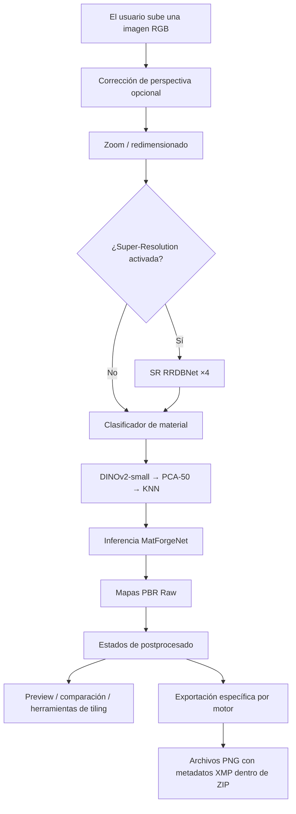
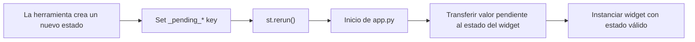
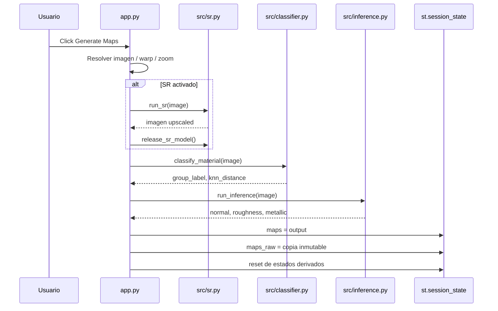
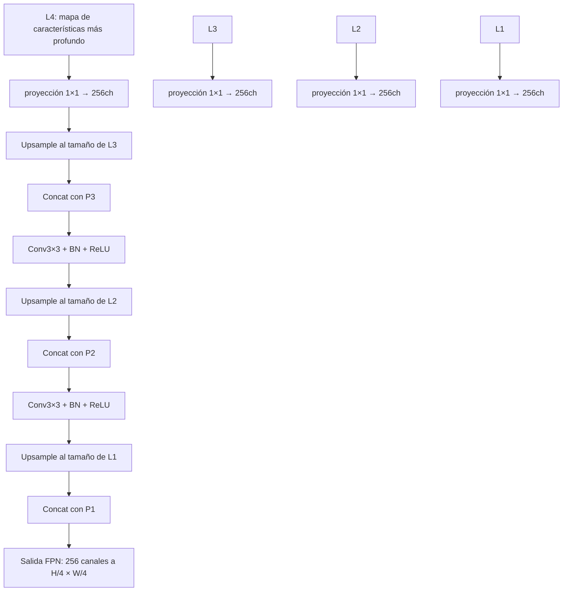
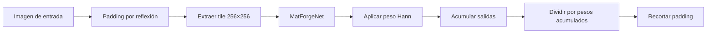
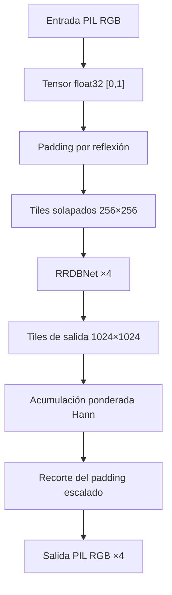
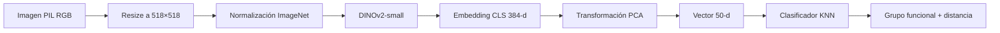
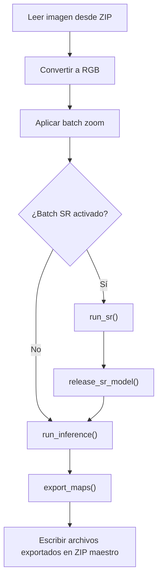

# Manual Técnico de MatForge

**Versión**: 1.0  
**Aplicación**: MatForge App  
**Audiencia**: desarrolladores, mantenedores, revisores técnicos  
**Última actualización**: mayo de 2026

---

## 1. Propósito y alcance

Este manual describe la arquitectura técnica interna de **MatForge App**, una aplicación local en Streamlit que predice mapas de material PBR a partir de una única imagen RGB. Está dirigido a desarrolladores que necesiten comprender, mantener, ampliar, depurar o auditar el código del proyecto.

MatForge genera tres mapas de renderizado físicamente basado:

- **Normal** — mapa de normales tangente OpenGL, almacenado internamente como vectores unitarios en `[-1, 1]`.
- **Roughness** — mapa escalar en `[0, 1]`.
- **Metallic** — mapa escalar en `[0, 1]`.

La aplicación combina un modelo PyTorch personalizado, super-resolución opcional basada en Real-ESRGAN, un clasificador de material basado en DINOv2, varias herramientas de postprocesado, un visor Three.js, lógica de exportación multi-motor e incrustación de metadatos de procedencia XMP.

Este documento se centra en detalles de implementación: responsabilidades de los módulos, contratos de datos, estado en tiempo de ejecución, carga de modelos, flujo de inferencia, puntos de extensión y restricciones técnicas.

No duplica deliberadamente:

- los flujos de uso para usuario final, documentados en `docs/USER_MANUAL.md`;
- las instrucciones de instalación, documentadas en `README.md`;
- el contexto investigador y la metodología de entrenamiento, documentados en los archivos académicos bajo `PI/`.

Utiliza este manual cuando necesites responder preguntas como:

- ¿Dónde está implementada cada parte del pipeline?
- ¿Qué forma y rango espera cada función?
- ¿Cómo se gestionan las transiciones de estado en Streamlit?
- ¿Cómo funciona la inferencia tile-and-merge?
- ¿Cómo se controla la memoria GPU?
- ¿Cómo debe añadirse un nuevo motor de exportación o una nueva herramienta de postprocesado?
- ¿Dónde se incrustan los metadatos XMP en los PNG generados?

---

## 2. Visión general del sistema

MatForge App es una aplicación local Streamlit de proceso único. No requiere un servidor backend adicional más allá de Streamlit, y todo el pipeline de inferencia se ejecuta en la máquina del usuario.

En tiempo de ejecución, la aplicación sigue este pipeline general:



El pipeline principal es secuencial. El modelo opcional de super-resolución y MatForgeNet no están pensados para residir simultáneamente en memoria GPU en el hardware objetivo. Cuando se usa SR, se ejecuta primero y después su modelo cacheado se libera explícitamente antes de la inferencia de MatForgeNet.

Las fases principales en tiempo de ejecución son:

1. **Preparación de entrada**
   La imagen subida se convierte a RGB, opcionalmente se corrige su perspectiva y después se redimensiona según el factor de zoom.

2. **Super-Resolution opcional**
   `src/sr.py` aplica RRDBNet ×4 sobre la imagen redimensionada usando inferencia tile-and-merge.

3. **Clasificación de material**
   `src/classifier.py` clasifica el material de entrada en uno de ocho grupos funcionales mediante DINOv2-small, PCA y KNN.

4. **Inferencia de mapas PBR**
   `src/inference.py` ejecuta MatForgeNet sobre tiles solapados de 256×256 y los fusiona con una ventana Hann.

5. **Postprocesado con estado**
   `src/postprocess.py` proporciona transformaciones no destructivas, como ajuste de roughness/metallic, calibración, mejora de tileabilidad, mezcla de materiales y variaciones procedurales.

6. **Previsualización e inspección**
   `src/ui_components.py` renderiza la cuadrícula de mapas, el visor Three.js, el slider de comparación y el aviso de salida generada por IA.

7. **Exportación**
   `src/export.py` empaqueta el estado de mapas seleccionado para Blender, Unreal Engine 5, Unity URP, Unity HDRP o Godot 4, incrustando metadatos de procedencia XMP en cada PNG exportado.

La aplicación está diseñada con una separación estricta entre orquestación y lógica de negocio. `app.py` gestiona el layout de Streamlit y las transiciones de estado. La lógica pesada o reutilizable vive en `src/`.

---

## 3. Estructura del repositorio

La estructura esperada del repositorio es:

```text
MatForge_App/
├── app.py
├── requirements.txt
├── LICENSE
├── install.bat
├── launch_matforge.bat
├── launch_matforge.ps1
├── PI/
├── checkpoints/
│   ├── matforge/
│   │   └── best_gan.pt
│   └── sr/
│       ├── sr_ft_phase1_best_lpips.pt
│       └── RealESRGAN_x4plus.pth
├── artifacts/
│   ├── knn_classifier.pkl
│   ├── pca_model.pkl
│   └── label_encoder.pkl
├── assets/
│   └── three/
│       ├── three.module.js
│       └── OrbitControls.js
├── sample_inputs/
├── scripts/
│   └── matforge_app_00_inference_check.py
├── src/
│   ├── __init__.py
│   ├── models.py
│   ├── inference.py
│   ├── sr.py
│   ├── classifier.py
│   ├── postprocess.py
│   ├── export.py
│   ├── quality.py
│   ├── ui_components.py
│   └── utils.py
└── docs/
    ├── USER_MANUAL.md
    ├── MANUAL_DE_USUARIO.md
    ├── TECHNICAL_MANUAL.md
    ├── MANUAL_TECNICO.md
    └── assets/
```

### 3.1 Archivos raíz

| Archivo               | Rol                                                                                                                |
| --------------------- | ------------------------------------------------------------------------------------------------------------------ |
| `app.py`              | Punto de entrada Streamlit. Gestiona layout de UI, interacciones de usuario, estado de sesión y llamadas a `src/`. |
| `requirements.txt`    | Dependencias Python, excluyendo PyTorch, que se instala por separado según el README.                              |
| `install.bat`         | Script de configuración del entorno en Windows.                                                                    |
| `launch_matforge.bat` | Lanzador principal en Windows.                                                                                     |
| `launch_matforge.ps1` | Lanzador alternativo en PowerShell.                                                                                |
| `LICENSE`             | Licencia del proyecto.                                                                                             |

`app.py` debe mantenerse como orquestador. No debe contener definiciones de modelos, lógica de inferencia de bajo nivel, lógica de empaquetado de exportación ni algoritmos de procesamiento de imagen.

### 3.2 `checkpoints/`

Los pesos de los modelos se esperan en rutas fijas:

```text
checkpoints/
├── matforge/
│   └── best_gan.pt
└── sr/
    ├── sr_ft_phase1_best_lpips.pt
    └── RealESRGAN_x4plus.pth
```

`best_gan.pt` es cargado por `src/inference.py`.
`sr_ft_phase1_best_lpips.pt` es el checkpoint primario de SR.
`RealESRGAN_x4plus.pth` es el checkpoint fallback de SR.

La aplicación asume que estos archivos están presentes antes de la inferencia. Están separados intencionadamente del árbol de código Python.

*Los checkpoints se distribuyen mediante GitHub Releases, no se versionan directamente en el repositorio. Descárgalos desde la [página de Releases](https://github.com/migueljeronimogutierrez/MatForge-App/releases) y colócalos en las rutas indicadas antes de ejecutar la aplicación. Consulta `README.md` para las instrucciones completas de descarga e instalación.*

### 3.3 `artifacts/`

El clasificador depende de tres artefactos serializados de scikit-learn:

```text
artifacts/
├── knn_classifier.pkl
├── pca_model.pkl
└── label_encoder.pkl
```

Estos archivos son cargados por `src/classifier.py` y deben mantenerse compatibles con la versión de scikit-learn fijada en `requirements.txt`.

### 3.4 `assets/`

`assets/three/` contiene archivos locales de Three.js pensados como recursos estáticos compatibles con funcionamiento sin conexión. La implementación actual del visor todavía carga Three.js mediante un import map desde CDN en `src/ui_components.py`, por lo que los assets locales deben considerarse una ruta disponible, pero no la ruta activa del visor.

### 3.5 `scripts/`

`scripts/matforge_app_00_inference_check.py` es un script de diagnóstico independiente. Verifica el pipeline local de inferencia antes o durante la validación de una release.

Comprueba:

1. detección de dispositivo;
2. baseline de VRAM;
3. carga de MatForgeNet;
4. creación de imagen sintética;
5. inferencia tiled;
6. forma y rango de las salidas;
7. liberación de memoria GPU;
8. carga de artefactos KNN;
9. presencia de checkpoint SR.

Este script debe ejecutarse desde la raíz del proyecto con el entorno virtual activado.

### 3.6 `src/`

`src/` contiene toda la lógica reutilizable de la aplicación.

| Módulo             | Responsabilidad                                                                                       |
| ------------------ | ----------------------------------------------------------------------------------------------------- |
| `models.py`        | Arquitectura MatForgeNet: encoder PVT-v2-B1, decoder FPN y cabezas Normal/Roughness/Metallic.         |
| `inference.py`     | Carga de MatForgeNet e inferencia tile-and-merge.                                                     |
| `sr.py`            | Carga, inferencia y liberación de super-resolución RRDBNet ×4.                                        |
| `classifier.py`    | Clasificación de material DINOv2-small + PCA + KNN.                                                   |
| `postprocess.py`   | Herramientas puras de postprocesado con NumPy/OpenCV/SciPy.                                           |
| `export.py`        | Empaquetado de exportación específico por motor e inyección de metadatos XMP.                         |
| `quality.py`       | Diagnóstico heurístico de calidad del mapa de normales.                                               |
| `ui_components.py` | Sistema de diseño centralizado, CSS, widgets HTML, visor Three.js y helpers de UI.                    |
| `utils.py`         | Utilidades compartidas de imagen, tensores, zoom, warp de perspectiva, sesión y estimación de tiempo. |
| `__init__.py`      | Marcador de paquete vacío.                                                                            |

El archivo vacío `src/__init__.py` existe únicamente para marcar `src` como paquete Python. No define APIs públicas.

---

## 4. Arquitectura en tiempo de ejecución

### 4.1 Modelo de ejecución de Streamlit

MatForge usa el modelo de ejecución reactiva de Streamlit. Cualquier interacción con un widget puede relanzar `app.py` de arriba abajo. Por ese motivo, la información persistente en tiempo de ejecución se almacena en `st.session_state`.

La aplicación inicializa todas las claves de estado esperadas al arrancar mediante `init_session_state()` en `app.py`. Los valores existentes se preservan entre reruns; las claves ausentes reciben valores seguros por defecto.

La regla arquitectónica principal es:

> El estado de Streamlit vive en `app.py`; la lógica computacional vive en `src/`.

Por ello, los módulos fuente son más fáciles de probar y razonar, ya que la mayoría son lógica pura o casi pura:

* `postprocess.py`, `quality.py` y `export.py` no dependen de Streamlit.
* `models.py` solo define módulos PyTorch.
* `inference.py`, `sr.py` y `classifier.py` usan `@st.cache_resource` para carga pesada de modelos o artefactos.
* `ui_components.py` centraliza helpers de renderizado HTML/CSS.

### 4.2 Claves principales de `session_state`

Las siguientes claves son centrales en el diseño runtime:

| Clave                   | Significado                                                                                         |
| ----------------------- | --------------------------------------------------------------------------------------------------- |
| `input_image`           | Imagen actual del pipeline. Si se usó SR, se sobrescribe con la salida SR.                          |
| `original_image`        | Imagen original subida antes de SR. Se usa para metadatos, estimaciones de sidebar y visualización. |
| `zoom`                  | Factor de zoom aplicado antes de la inferencia.                                                     |
| `use_sr`                | Indica si SR está activado en la UI.                                                                |
| `sr_was_used`           | Indica si SR estuvo activo durante la última generación.                                            |
| `group_label`           | Grupo de material predicho por el clasificador.                                                     |
| `knn_distance`          | Distancia al vecino KNN más cercano; menor implica mayor confianza.                                 |
| `maps`                  | Conjunto mutable de mapas activo usado para visualización inmediata.                                |
| `maps_raw`              | Salida bruta de inferencia. Fuente de verdad para herramientas no destructivas.                     |
| `maps_adjusted`         | Salida del ajuste gain-offset de roughness/metallic.                                                |
| `maps_calibrated`       | Salida de la calibración por grupo.                                                                 |
| `maps_tileable`         | Salida del postprocesado de tileabilidad.                                                           |
| `maps_blended`          | Salida de la mezcla RNM de materiales; puede contener `color` opcional.                             |
| `maps_variations`       | Variación procedural seleccionada.                                                                  |
| `viewer_state`          | Estado seleccionado para el preview Three.js.                                                       |
| `export_state`          | Estado seleccionado para exportación.                                                               |
| `tile_preview_state`    | Estado seleccionado para preview de tiling.                                                         |
| `tile_preview_map`      | Canal seleccionado para preview de tiling.                                                          |
| `warp_points`           | Cuatro puntos de corrección de perspectiva en coordenadas de la imagen fuente.                      |
| `warped_image`          | Imagen corregida por perspectiva, como preview o salida.                                            |
| `warp_confirmed`        | Indica si el recorte corregido debe usarse como entrada del pipeline.                               |
| `_batch_result_bytes`   | Bytes ZIP cacheados del último batch.                                                               |
| `_batch_result_summary` | Resumen del batch con aciertos y fallos.                                                            |

Los estados derivados de mapas están intencionadamente separados. Los mapas Raw no se sobrescriben. Esto hace que las herramientas sean no destructivas y permite que el visor, la comparación, el preview de tiling y la exportación seleccionen estados distintos de forma independiente.

### 4.3 Patrón de redirección de estado pendiente

Algunos widgets de Streamlit no pueden cambiar su valor de forma segura después de haber sido instanciados en el mismo rerun. Para resolverlo, `app.py` usa claves temporales pendientes:

```text
_pending_viewer_state
_pending_export_state
_pending_tile_state
```

Al inicio del script, antes de instanciar los widgets, los valores pendientes se transfieren a sus claves de destino:

```text
_pending_viewer_state → viewer_state
_pending_export_state → export_state
_pending_tile_state   → tile_preview_state
```

Este patrón se usa después de operaciones como mezcla de materiales o aplicación de una variación procedural, cuando la UI debe cambiar automáticamente los selectores de visor/exportación/tiling al nuevo estado generado.



### 4.4 Pipeline de generación en `app.py`

El botón Generate Maps activa el pipeline principal.

Los pasos son:

1. Resolver la imagen de entrada actual.
2. Si la corrección de perspectiva está confirmada, usar `warped_image`.
3. Limitar el zoom para evitar dimensiones efectivas inferiores a 256 px.
4. Aplicar zoom mediante `utils.apply_zoom()`.
5. Si SR está activado:

   * ejecutar `sr.run_sr()`;
   * liberar el modelo SR;
   * llamar a garbage collection y limpiar la caché CUDA;
   * reemplazar `input_image` por la salida SR.
6. Clasificar el material con `classifier.classify_material()`.
7. Ejecutar inferencia MatForgeNet con `inference.run_inference()`.
8. Guardar `maps` y `maps_raw`.
9. Reiniciar todos los estados derivados.
10. Reiniciar viewer/export state a `Raw`.



### 4.5 Invalidación de estado

Cuando el usuario sube una nueva imagen, aplica o reinicia una corrección de perspectiva, o activa acciones que vuelven obsoletos los resultados previos, `app.py` llama a `utils.invalidate_session_keys()`.

Esta función simplemente establece claves seleccionadas de `st.session_state` a `None`. Evita la reutilización accidental de mapas, salidas del clasificador o estados derivados de una imagen anterior.

Claves típicamente invalidadas:

```text
maps
maps_raw
maps_calibrated
maps_tileable
maps_adjusted
maps_blended
maps_variations
group_label
knn_distance
warp_points
warped_image
```

### 4.6 Regla de fuente de verdad runtime

La regla de estado más importante es:

> `maps_raw` es la fuente de verdad de la salida del modelo.

El objeto mutable `maps` se usa para visualización inmediata y puede ser actualizado por herramientas. Sin embargo, las herramientas que necesiten operar desde la salida sin modificar del modelo deben leer desde `maps_raw`.

Ejemplos:

* Adjust R/M lee desde `maps_raw`.
* Calibrate by Group lee desde `maps_raw`.
* Procedural Variations lee desde `maps_raw`.
* Make Tileable resuelve su fuente como `maps_calibrated → maps_adjusted → maps_raw`.

Este diseño evita la acumulación destructiva de transformaciones y permite comparar o exportar distintos estados.

### 4.7 Dependencias runtime principales

El proyecto fija las siguientes dependencias principales en `requirements.txt`:

```text
streamlit>=1.50
timm==1.0.25
opencv-python==4.10.0.84
Pillow==10.4.0
numpy==1.26.4
scipy==1.13.1
scikit-learn==1.5.2
opensimplex==0.4.5
pyfastnoiselite==0.0.4
streamlit-image-coordinates==0.4.0
```

PyTorch y torchvision no se fijan intencionadamente en `requirements.txt`; se instalan por separado usando el índice específico de CUDA documentado en el README. Esto evita instalar accidentalmente una wheel CPU-only de PyTorch.

---

## 5. Modelo principal: MatForgeNet

El modelo principal de predicción PBR está implementado en `src/models.py`.

MatForgeNet es una red encoder-decoder personalizada en PyTorch compuesta por:

1. un encoder jerárquico **PVT-v2-B1**;
2. un **FPNDecoder** personalizado;
3. tres ramas de salida **RefineHead** independientes:

   * Normal;
   * Roughness;
   * Metallic.

El modelo se carga desde `src/inference.py` usando:

```text
checkpoints/matforge/best_gan.pt
```

### 5.1 Estructura de clases del modelo

Las definiciones del modelo son:

```text
MatForgeNet
├── encoder: timm.create_model("pvt_v2_b1", pretrained=False, features_only=True)
├── fpn: FPNDecoder
├── head_normal: RefineHead(256, 3)
├── head_roughness: RefineHead(256, 1)
└── head_metallic: RefineHead(256, 1)
```

El encoder se instancia con `pretrained=False` en runtime porque el checkpoint entrenado ya contiene los pesos necesarios. El modelo runtime debe coincidir exactamente con el `state_dict` del checkpoint.

No modifiques `FPNDecoder`, `RefineHead`, el orden de capas, la configuración de bias ni las cabezas de salida salvo que el checkpoint también se regenere o migre explícitamente.

### 5.2 Encoder

El encoder se crea mediante `timm`:

```python
timm.create_model("pvt_v2_b1", pretrained=False, features_only=True)
```

Devuelve cuatro mapas de características ordenados de menor a mayor profundidad:

```text
L1: características superficiales de alta resolución
L2
L3
L4: características profundas de baja resolución
```

Para un tile de entrada de 256×256, la estructura esperada de feature maps es:

```text
L1: 64×64×64
L2: 32×32×128
L3: 16×16×320
L4: 8×8×512
```

El decoder asume estos canales:

```python
in_channels = (64, 128, 320, 512)
```

### 5.3 FPNDecoder

`FPNDecoder` proyecta todos los mapas de características del encoder a 256 canales mediante convoluciones 1×1 y después los fusiona en una pirámide top-down.

El patrón de fusión es:



La salida del decoder para un tile de 256×256 es un mapa de características de 64×64 con 256 canales.

### 5.4 RefineHead

Cada `RefineHead` aumenta la resolución de la salida del FPN hasta recuperar la resolución original del tile.

La estructura es:

```text
Input: 64×64×256
↓ bilinear upsample ×2
block1: Conv → BN → ReLU → Conv → BN → ReLU
↓ bilinear upsample ×2
block2: Conv → BN → ReLU → Conv → BN → ReLU
↓
Conv1×1 output layer
Output: 256×256×C
```

Canales de salida:

| Cabeza    | Canales | Activación runtime                                                            |
| --------- | ------: | ----------------------------------------------------------------------------- |
| Normal    |       3 | `tanh` + normalización L2                                                     |
| Roughness |       1 | `sigmoid`                                                                     |
| Metallic  |       1 | logits crudos en la salida del modelo; `sigmoid` se aplica durante inferencia |

### 5.5 Contratos de salida

El `forward` público del modelo devuelve un diccionario:

```python
{
    "normal": normal,
    "roughness": roughness,
    "metallic": raw_metallic,
}
```

Contratos internos de tensores:

| Clave       | Forma          | Rango antes del postprocesado final de inferencia |
| ----------- | -------------- | ------------------------------------------------- |
| `normal`    | `(B, 3, H, W)` | `[-1, 1]`, normalizado L2 por píxel               |
| `roughness` | `(B, 1, H, W)` | `[0, 1]`                                          |
| `metallic`  | `(B, 1, H, W)` | logits                                            |

`src/inference.py` aplica `torch.sigmoid()` a los logits metallic fusionados después del blending de tiles.

### 5.6 Regla de compatibilidad de checkpoint

`src/models.py` indica que las clases del modelo proceden de la especificación de arquitectura verificada y no deben modificarse sin revalidar contra el checkpoint.

Esto es importante porque incluso cambios pequeños pueden romper `model.load_state_dict(state_dict)`, por ejemplo:

* cambiar la configuración de bias en convoluciones;
* mover capas de upsample dentro de `nn.Sequential`;
* renombrar módulos;
* cambiar el número de canales de salida;
* sustituir PVT-v2-B1 por otro encoder;
* cambiar el ancho de canales del FPN.

Cuando se modifique la arquitectura, actualiza ambos archivos:

```text
src/models.py
scripts/matforge_app_00_inference_check.py
```

y vuelve a ejecutar el script de diagnóstico.

---

## 6. Pipeline de inferencia

El pipeline principal de inferencia está implementado en `src/inference.py`.

Su punto de entrada público es:

```python
run_inference(image: Image.Image) -> dict
```

Acepta una imagen PIL RGB de cualquier tamaño y devuelve arrays NumPy:

```python
{
    "normal": np.ndarray,     # (H, W, 3), float32, [-1, 1]
    "roughness": np.ndarray,  # (H, W, 1), float32, [0, 1]
    "metallic": np.ndarray,   # (H, W, 1), float32, [0, 1]
}
```

### 6.1 Constantes

El módulo de inferencia define:

```python
CHECKPOINT_PATH = Path("checkpoints/matforge/best_gan.pt")
TILE = 256
STRIDE = 128
IMAGENET_MEAN = [0.485, 0.456, 0.406]
IMAGENET_STD  = [0.229, 0.224, 0.225]
DEVICE = "cuda" if torch.cuda.is_available() else "cpu"
DTYPE = torch.float32
```

`float32` es obligatorio en producción. `float16` fue descartado porque provoca overflow en la atención PVT con imágenes reales.

### 6.2 Carga del modelo

La carga del modelo está cacheada:

```python
@st.cache_resource
def load_model() -> MatForgeNet:
    ...
```

La función:

1. carga `checkpoints/matforge/best_gan.pt`;
2. extrae `ckpt["model"]`;
3. instancia `MatForgeNet`;
4. carga el `state_dict`;
5. pone el modelo en modo evaluación;
6. lo mueve a `DEVICE` y `DTYPE`.

El modelo cacheado permanece disponible durante la sesión Streamlit. A diferencia del modelo SR, MatForgeNet no se libera después de cada inferencia.

### 6.3 Preprocesado de entrada

`run_inference()` convierte la imagen a RGB, la escala a `[0, 1]`, aplica normalización ImageNet y la convierte a tensor PyTorch:

```text
PIL RGB
→ NumPy float32 [0, 1], shape (H, W, 3)
→ normalización ImageNet
→ torch.Tensor, shape (1, 3, H, W)
→ DEVICE / float32
```

La normalización ImageNet es:

```python
img_np = (img_np - mean) / std
```

### 6.4 Estrategia tile-and-merge

MatForgeNet fue entrenado y se ejecuta sobre tiles de 256×256. Las imágenes mayores se procesan mediante tiles solapados.

Parámetros de tiling:

```text
Tile size: 256×256
Stride:    128 px
Overlap:   50%
Window:    Hann 2D
```

El pipeline usa padding por reflexión antes del tiling.

La estrategia de padding es deliberadamente más robusta que una simple alineación al stride:

```python
half = TILE // 2
pad_h = half + (STRIDE - (H + half) % STRIDE) % STRIDE
pad_w = half + (STRIDE - (W + half) % STRIDE) % STRIDE
img_p = F.pad(img_t, (half, pad_w, half, pad_h), mode="reflect")
```

Esto garantiza que los píxeles de borde no queden situados en el extremo de peso cero de la ventana Hann.

### 6.5 Blending con ventana Hann

La ventana Hann se crea como:

```python
w1d = sin(pi * k / (n - 1)) ** 2
hann = outer(w1d, w1d)
```

Para cada tile:

1. MatForgeNet predice Normal, Roughness y Metallic.
2. Las salidas del tile se multiplican por la ventana Hann.
3. Las salidas ponderadas se acumulan en tensores de tamaño completo.
4. Los pesos Hann se acumulan por separado.

Conceptualmente:



### 6.6 Reglas de fusión para Normal, Roughness y Metallic

Las tres salidas se fusionan de forma distinta:

| Mapa      | Comportamiento de fusión                                         |
| --------- | ---------------------------------------------------------------- |
| Normal    | acumular vectores ponderados → dividir por pesos → normalizar L2 |
| Roughness | acumular valores escalares ponderados → dividir por pesos        |
| Metallic  | acumular logits ponderados → dividir por pesos → `sigmoid`       |

El postprocesado final en `run_inference()` es:

```python
normal_t    = F.normalize(acc_n / denom, dim=1, eps=1e-6)
roughness_t = acc_r / denom
metallic_t  = torch.sigmoid(acc_m / denom)
```

El orden importa. Los vectores normales deben renormalizarse **después** del blending de imagen completa, no solo por tile. Los logits metallic deben fusionarse antes de aplicar `sigmoid`.

### 6.7 Recorte y formato de salida

Después de la fusión, la función elimina el padding:

```python
normal_t    = normal_t[:, :, half:half + H, half:half + W]
roughness_t = roughness_t[:, :, half:half + H, half:half + W]
metallic_t  = metallic_t[:, :, half:half + H, half:half + W]
```

Después, los tensores se convierten de nuevo a arrays NumPy en formato channel-last:

```text
normal:    (H, W, 3)
roughness: (H, W, 1)
metallic:  (H, W, 1)
```

Todos los arrays devueltos son `float32`.

### 6.8 Tamaño mínimo efectivo

La utilidad de bajo nivel `utils.apply_zoom()` permite dimensiones de salida de hasta 64 px. Sin embargo, la ruta de generación en `app.py` limita el zoom efectivo para garantizar que la imagen que entra en MatForge tenga al menos 256 px en su lado menor.

Esto protege el pipeline tile-and-merge frente a entradas menores que un tile.

---

## 7. Módulo de Super-Resolution

El pipeline opcional de super-resolución está implementado en `src/sr.py`.

Sus puntos de entrada públicos son:

```python
run_sr(image: Image.Image) -> Image.Image
release_sr_model() -> None
```

`run_sr()` recibe una imagen PIL RGB y devuelve una imagen PIL RGB a 4× la resolución original.

### 7.1 Arquitectura del modelo

El modelo SR es una red RRDBNet ×4 basada en Real-ESRGAN.

La arquitectura implementada incluye:

```text
RRDBNet
├── conv_first
├── body: 23 RRDB blocks
├── conv_body
├── conv_up1
├── conv_up2
├── conv_hr
└── conv_last
```

Cada RRDB contiene tres bloques residuales densos, y cada bloque residual denso usa cinco capas convolucionales con escalado residual.

La ruta de upscaling usa dos etapas de nearest-neighbor ×2, produciendo un factor global ×4.

### 7.2 Prioridad de checkpoints

El loader SR comprueba los siguientes archivos en orden:

```text
1. checkpoints/sr/sr_ft_phase1_best_lpips.pt
2. checkpoints/sr/RealESRGAN_x4plus.pth
```

El primero es el checkpoint específico del proyecto, ajustado mediante fine-tuning.
El segundo es el checkpoint fallback de Real-ESRGAN.

Si no existe ninguno, `load_sr_model()` lanza `FileNotFoundError`.

El loader admite checkpoints almacenados como:

* `params_ema`;
* `params`;
* `state_dict` directo.

### 7.3 Política de dispositivo y dtype

`src/sr.py` define:

```python
DEVICE = "cuda" if torch.cuda.is_available() else "cpu"
DTYPE = torch.float32
```

El comentario del código indica explícitamente que `float16` produce NaN en GTX 1650 Max-Q con ambos checkpoints SR. Por tanto, la inferencia SR debe usar `float32`, de forma coherente con el pipeline principal de MatForge.

### 7.4 Tile-and-merge de SR

SR usa el mismo enfoque conceptual tile-and-merge que la inferencia de MatForge:

```text
Tile size: 256×256 píxeles de entrada
Stride:    128 px
Overlap:   50%
Window:    Hann 2D, escalada a 1024×1024
Padding:   medio tile en todos los lados, modo reflexión
Scale:     ×4
```

Los pasos son:

1. Convertir imagen PIL RGB a tensor `(1, 3, H, W)` en `[0, 1]`.
2. Aplicar padding por reflexión.
3. Procesar tiles solapados de 256×256.
4. Escalar cada tile a 1024×1024.
5. Fusionar tiles de salida con una ventana Hann escalada.
6. Normalizar por los pesos acumulados.
7. Recortar el padding escalado.
8. Convertir de nuevo a PIL RGB.



### 7.5 Política de liberación de SR

El modelo SR se cachea con:

```python
@st.cache_resource(max_entries=1)
def load_sr_model() -> RRDBNet:
    ...
```

Sin embargo, después de que termine la inferencia SR, `app.py` llama a:

```python
release_sr_model()
gc.collect()
torch.cuda.empty_cache()
```

`release_sr_model()` limpia el modelo SR cacheado y vacía la caché CUDA cuando CUDA está activo.

Esto es necesario porque la GPU objetivo tiene solo 4 GB de VRAM. El ciclo de vida previsto es:

```text
cargar modelo SR
→ ejecutar SR
→ limpiar modelo SR cacheado
→ garbage collection
→ vaciar caché CUDA
→ ejecutar MatForgeNet
```

MatForgeNet y SR son, por tanto, cargas GPU secuenciales, no modelos residentes simultáneos.

### 7.6 Restricciones de SR

Restricciones importantes:

* SR siempre escala ×4.
* SR puede llevar imágenes más allá del rango 1K en el que fue entrenado MatForge.
* `app.py` avisa al usuario cuando la salida SR supera 1024 px en alguna dimensión.
* SR mejora el detalle de entradas de baja resolución, pero puede producir mapas posteriores planos o incoherentes si se usa sobre imágenes que ya son grandes.
* El módulo SR no es un modelo de super-resolución multimapa consciente de PBR; solo opera sobre la imagen RGB de entrada.

---

## 8. Clasificador de material

El clasificador de material está implementado en `src/classifier.py`.

Su punto de entrada público es:

```python
classify_material(image: Image.Image) -> tuple[str, float]
```

Recibe una imagen PIL RGB a cualquier resolución y devuelve:

```python
(group_name, knn_distance)
```

donde:

* `group_name` es uno de los ocho grupos funcionales de material;
* `knn_distance` es la distancia coseno al ejemplo de entrenamiento más cercano en el espacio PCA;
* una distancia menor implica mayor confianza.

### 8.1 Pipeline del clasificador

El pipeline del clasificador es:



### 8.2 Modelo runtime

El modelo DINOv2 se carga mediante `timm`:

```python
MODEL_NAME = "vit_small_patch14_dinov2.lvd142m"
IMG_SIZE = 518
EMBED_DIM = 384
```

El modelo se crea con:

```python
timm.create_model(
    MODEL_NAME,
    pretrained=True,
    num_classes=0,
)
```

`num_classes=0` elimina la cabeza de clasificación y devuelve directamente el embedding.

El modelo se cachea con `@st.cache_resource`.

### 8.3 Artefactos serializados

El clasificador también carga tres artefactos serializados:

```text
artifacts/
├── pca_model.pkl
├── knn_classifier.pkl
└── label_encoder.pkl
```

Se cargan en `_load_artifacts()` mediante `joblib.load()` y se cachean con `@st.cache_resource`.

La versión fijada de scikit-learn en `requirements.txt` es importante para la compatibilidad de los artefactos:

```text
scikit-learn==1.5.2
```

### 8.4 Preprocesado

La imagen de entrada se redimensiona a 518×518:

```python
img_resized = image.resize((IMG_SIZE, IMG_SIZE), Image.LANCZOS)
```

Después se convierte a float32 `[0, 1]`, se normaliza con media/desviación ImageNet y se convierte a tensor:

```python
mean = [0.485, 0.456, 0.406]
std  = [0.229, 0.224, 0.225]
```

La forma del tensor es:

```text
(1, 3, 518, 518)
```

### 8.5 Grupos de salida

Los posibles grupos del clasificador son:

```text
brick_terracotta
ceramic_ground
concrete_plaster
marble_smooth
metal
mixed_ambiguous
stone_rough
wood
```

Estos grupos son grupos funcionales de material derivados durante el relabeling del dataset. No se usan como entrada directa de MatForgeNet. MatForgeNet predice mapas únicamente a partir del RGB.

La etiqueta de grupo se usa en la aplicación para:

* mostrar contexto del material detectado;
* calibración de Roughness/Metallic por grupo;
* contextualizar avisos de calidad en la UI.

### 8.6 Distancia de confianza

`knn_distance` se obtiene de la distancia al vecino más cercano:

```python
dist = knn.kneighbors(emb_pca, n_neighbors=1)[0][0, 0]
```

Es una distancia coseno en el espacio PCA reducido a 50 dimensiones.

La aplicación la convierte aproximadamente en una confianza de calibración mediante:

```python
alpha = max(0.0, min(1.0, 1.0 - knn_distance * 3.0))
```

Esto significa:

* distancia KNN baja → calibración más fuerte;
* distancia KNN alta → calibración más débil;
* override manual de grupo → confianza de calibración completa.

### 8.7 Limitaciones del clasificador

El clasificador debe tratarse como una herramienta ligera de contexto, no como un mecanismo de seguridad rígido ni como una condición obligatoria del modelo.

Limitaciones importantes:

* Predice un único grupo funcional.
* Puede fallar en materiales mixtos, estilizados, recortados o atípicos.
* La distancia KNN es una proxy útil de confianza, pero no una probabilidad calibrada.
* MatForgeNet no depende de la salida del clasificador para ejecutar inferencia.
* La calibración debe seguir permitiendo override manual por parte del usuario.

---

## 9. Herramientas de postprocesado

La lógica de postprocesado está implementada en `src/postprocess.py`.

Este módulo es intencionadamente lógica pura:

* sin dependencia de Streamlit;
* sin dependencia de GPU;
* sin estado de sesión;
* sin carga de modelos;
* arrays NumPy como entrada y arrays NumPy como salida.

Todas las funciones operan sobre arrays `float32` y son llamadas desde `app.py`, que se encarga de seleccionar el estado de mapas correcto y guardar el resultado en `st.session_state`.

### 9.1 Convenciones de mapas

Las funciones de postprocesado usan las mismas convenciones internas que el pipeline de inferencia:

| Mapa      | Forma                  | Rango     | Notas                                                |
| --------- | ---------------------- | --------- | ---------------------------------------------------- |
| Normal    | `(H, W, 3)`            | `[-1, 1]` | Vectores tangentes OpenGL, esperados como unitarios. |
| Roughness | `(H, W)` o `(H, W, 1)` | `[0, 1]`  | Mapa escalar.                                        |
| Metallic  | `(H, W)` o `(H, W, 1)` | `[0, 1]`  | Mapa escalar.                                        |
| Mask      | `(H, W)` o `(H, W, 1)` | `[0, 1]`  | Usado para blending.                                 |

Los mapas Normal no se almacenan en formato empaquetado de visualización dentro del pipeline. Son vectores desempaquetados en `[-1, 1]`.

### 9.2 Ajuste gain-offset de Roughness / Metallic

Función:

```python
adjust_gain_offset(
    tensor: np.ndarray,
    gain: float = 1.0,
    offset: float = 0.0,
) -> np.ndarray
```

Esta función aplica:

```text
output = clip(gain * input + offset, 0, 1)
```

Está pensada únicamente para mapas Roughness o Metallic.

Rangos válidos de parámetros:

```text
gain   ∈ [0.5, 2.0]
offset ∈ [-0.5, 0.5]
```

La función incluye una comprobación de seguridad para evitar pasar accidentalmente mapas Normal: si la entrada contiene valores inferiores a `-0.01`, lanza `ValueError`.

Uso típico desde `app.py`:

```text
source: maps_raw
output: maps_adjusted
```

La herramienta no modifica `maps_raw`.

### 9.3 Calibración por grupo

Función:

```python
calibrate_by_group(
    roughness: np.ndarray,
    metallic: np.ndarray,
    group: str,
    knn_distance: float,
) -> tuple[np.ndarray, np.ndarray]
```

Esta función desplaza Roughness y Metallic hacia rangos plausibles para el grupo de material detectado.

Los rangos de calibración son:

| Grupo              | Rango Roughness | Rango Metallic |
| ------------------ | --------------- | -------------- |
| `stone_rough`      | 0.55–0.95       | 0.0–0.0        |
| `concrete_plaster` | 0.55–0.95       | 0.0–0.0        |
| `brick_terracotta` | 0.55–0.95       | 0.0–0.0        |
| `mixed_ambiguous`  | 0.55–0.95       | 0.0–0.0        |
| `wood`             | 0.45–0.80       | 0.0–0.0        |
| `ceramic_ground`   | 0.05–0.30       | 0.0–0.0        |
| `marble_smooth`    | 0.05–0.30       | 0.0–0.0        |
| `metal`            | 0.05–0.75       | 0.85–1.0       |

El coeficiente de confianza se deriva de la distancia KNN:

```python
alpha = max(0.0, min(1.0, 1.0 - knn_distance * 3.0))
```

La fórmula de calibración es:

```text
calibrated = alpha * clipped_to_group_range + (1 - alpha) * original
```

Esto hace que la calibración sea suave y no destructiva. Si la confianza del clasificador es baja, la predicción original se preserva en gran medida.

Si se pasa un grupo desconocido, la función devuelve copias de los mapas originales.

### 9.4 Mejora de tileabilidad

La función principal de tileabilidad usada por la aplicación es:

```python
make_tileable_frequency(
    normal: np.ndarray,
    roughness: np.ndarray,
    metallic: np.ndarray,
    sr_active: bool = False,
    sigma: float = 64.0,
    border_px: int = 8,
) -> dict
```

Devuelve:

```python
{
    "normal": normal_out,
    "roughness": roughness_out,
    "metallic": metallic_out,
}
```

La función tiene dos mecanismos.

#### 9.4.1 Normalización de baja frecuencia

Los mapas Roughness y Metallic se corrigen eliminando gradientes espaciales lentos:

```text
low_freq = gaussian_filter(map, sigma)
result = map - low_freq + global_mean
result = clip(result, 0, 1)
```

Esto ayuda a reducir drift de baja frecuencia visible introducido por la inferencia basada en tiles.

No garantiza seamlessness perfecto en casos de:

* grandes patrones no repetitivos;
* iluminación direccional integrada en la imagen;
* distorsión de perspectiva fuerte;
* fotografías altamente estructuradas y no tileables.

#### 9.4.2 Blending opcional de costuras SR

Cuando `sr_active=True`, la función además mezcla bordes opuestos mediante `_blend_border_seam()`.

Para mapas Normal, el blending de costura se realiza en espacio empaquetado `[0, 1]` y después se desempaqueta de nuevo a `[-1, 1]`, seguido de normalización L2.

Esto es importante porque el blending lineal puede romper la longitud unitaria de los vectores normales.

### 9.5 Función simple de tileabilidad

También existe `make_tileable_simple()`. Usa un enfoque clásico de offset del 50% y cross-fade.

Función:

```python
make_tileable_simple(
    image: np.ndarray,
    is_normal_map: bool = False,
) -> np.ndarray
```

Esta función no es la ruta principal de tileabilidad en la UI actual, pero permanece disponible como utilidad más simple.

Si `is_normal_map=True`, la función:

1. desempaqueta normales de `[0, 1]` a `[-1, 1]`;
2. mezcla vectores;
3. los renormaliza;
4. los reempaqueta a `[0, 1]`.

### 9.6 Reoriented Normal Mapping

La mezcla de normales usa Reoriented Normal Mapping.

Función:

```python
blend_normals_rnm(
    n_base: np.ndarray,
    n_detail: np.ndarray,
    mask: np.ndarray | None = None,
) -> np.ndarray
```

Esto evita los artefactos de la interpolación lineal simple entre vectores normales.

El núcleo RNM calcula una mezcla reorientada y renormaliza el resultado:

```text
t = n_base + [0, 0, 1]
u = n_detail * [-1, -1, 1]
r = t * dot(t, u) / t.z - u
r = normalize(r)
```

Si se proporciona una máscara, la función interpola linealmente entre `n_base` y el resultado RNM, y vuelve a renormalizar.

### 9.7 Mezcla de materiales

Función:

```python
blend_materials(
    r_a: np.ndarray,
    m_a: np.ndarray,
    n_a: np.ndarray,
    r_b: np.ndarray,
    m_b: np.ndarray,
    n_b: np.ndarray,
    mask: np.ndarray,
) -> tuple[np.ndarray, np.ndarray, np.ndarray]
```

Comportamiento:

| Mapa      | Método de mezcla     |
| --------- | -------------------- |
| Roughness | Interpolación lineal |
| Metallic  | Interpolación lineal |
| Normal    | Mezcla RNM           |

`app.py` guarda el resultado como:

```text
maps_blended
```

Si se proporciona un mapa de color B en la UI, `app.py` también calcula y guarda una entrada opcional `color`, pero la mezcla de color se gestiona en `app.py`, no en `postprocess.py`.

### 9.8 Variaciones procedurales

Función:

```python
generate_variations(
    roughness: np.ndarray,
    metallic: np.ndarray,
    normal: np.ndarray | None = None,
    n_variants: int = 4,
    seed: int = 42,
) -> list[dict[str, np.ndarray]]
```

El módulo alterna entre las siguientes técnicas:

| Técnica     | ¿Requiere Normal? | Efecto                                                                                       |
| ----------- | ----------------- | -------------------------------------------------------------------------------------------- |
| Zonal Mix   | No                | Usa ruido FBM para variar espacialmente la roughness.                                        |
| Worn Edges  | Sí                | Usa gradientes del mapa Normal y ruido para oscurecer roughness en zonas similares a bordes. |
| Scale Shift | No                | Reescala y reposiciona aleatoriamente mapas usando comportamiento de wrapping/reflection.    |

Si no se proporciona mapa Normal, solo se usan Zonal Mix y Scale Shift.

El backend de ruido se selecciona de forma diferida:

1. primero se intenta `pyfastnoiselite`;
2. si no está disponible o es incompatible, se usa `opensimplex`;
3. si no hay backend disponible, la función devuelve copias de los mapas de entrada.

Este comportamiento fallback evita que la generación de variaciones procedurales rompa toda la aplicación.

### 9.9 Política de estados de postprocesado

`app.py` guarda las salidas de postprocesado en claves de estado separadas:

| Herramienta           | Estado de salida  |
| --------------------- | ----------------- |
| Adjust R/M            | `maps_adjusted`   |
| Calibrate by Group    | `maps_calibrated` |
| Make Tileable         | `maps_tileable`   |
| Material Blender      | `maps_blended`    |
| Procedural Variations | `maps_variations` |

Esto permite seleccionar estados de forma independiente en:

* 3D Preview;
* Comparison;
* Tiling Preview;
* Export.

---

## 10. Evaluación de calidad del mapa Normal

Los diagnósticos del mapa de normales están implementados en `src/quality.py`.

El punto de entrada público es:

```python
evaluate_normal_quality(normal_map: np.ndarray) -> dict
```

Contrato de entrada:

```text
normal_map: (H, W, 3), float32, valores en [-1, 1]
```

Salida esperada:

```python
{
    "coherence_score": float,
    "continuity_score": float,
    "blockiness_score": float,
    "overall_score": float,
    "heatmap": np.ndarray,  # (H, W, 4), uint8 RGBA
    "warnings": list[str],
}
```

Este módulo es CPU-only y usa NumPy y SciPy.

### 10.1 Limitación importante

El evaluador de calidad es una **herramienta de diagnóstico heurístico**, no una métrica formal de benchmark.

Es útil para detectar artefactos probables como:

* vectores normales no unitarios;
* discontinuidades abruptas del campo normal;
* patrones de bloques tipo patch;
* regiones localmente sospechosamente homogéneas.

No debe presentarse como puntuación científica de validación del modelo.

### 10.2 Coherence score

Función:

```python
_compute_coherence(normal_map)
```

Esta métrica comprueba si cada vector normal por píxel tiene longitud aproximadamente unitaria.

Un píxel se considera coherente cuando:

```text
0.95 <= ||n|| <= 1.05
```

La puntuación es la fracción de píxeles coherentes.

El mapa de error asociado es:

```text
abs(||n|| - 1) / 0.5
```

recortado a `[0, 1]`.

### 10.3 Continuity score

Función:

```python
_compute_continuity(normal_map)
```

Esta métrica calcula gradientes Sobel para cada canal del mapa Normal y los combina en un mapa de magnitud de gradiente.

La puntuación es:

```text
score = 1 - min(mean_gradient / 0.5, 1)
```

Gradientes altos pueden indicar costuras o discontinuidades, pero también pueden ser legítimos en materiales con bordes duros como ladrillos, piedra, arañazos o juntas. Por ese motivo, el umbral de warning es intencionadamente conservador.

### 10.4 Blockiness score

Función:

```python
_compute_blockiness(normal_map)
```

Esta métrica calcula entropía local sobre una ventana de 16×16 mediante `scipy.ndimage.generic_filter()`.

La puntuación se basa en la desviación estándar del mapa de entropía:

```text
score = 1 - min(std(entropy_map) / 0.5, 1)
```

El mapa de blockiness es un mapa de entropía normalizado e invertido:

```text
baja entropía local → región sospechosa más brillante
```

Esta operación es intensiva en CPU y se vuelve lenta en mapas grandes.

### 10.5 Puntuación global y warnings

La puntuación global es una media ponderada:

```text
overall = 0.40 * coherence + 0.35 * continuity + 0.25 * blockiness
```

Umbrales de warning:

| Métrica    | Umbral de warning |
| ---------- | ----------------- |
| Coherence  | `< 0.95`          |
| Continuity | `< 0.50`          |
| Blockiness | `< 0.70`          |

`app.py` contextualiza algunos warnings según el grupo de material. Para grupos de bordes duros, los warnings de continuidad o blockiness pueden mostrarse como mensajes informativos en lugar de advertencias.

### 10.6 Heatmap

El heatmap combina los tres mapas diagnósticos en una superposición RGBA:

| Canal | Significado                 |
| ----- | --------------------------- |
| R     | Error de continuidad        |
| G     | Sospecha de blockiness      |
| B     | Error de coherencia         |
| A     | Canal máximo de error × 0.6 |

El heatmap devuelto es un array uint8 con forma:

```text
(H, W, 4)
```

---

## 11. Sistema de exportación y metadatos XMP

La lógica de exportación está implementada en `src/export.py`.

Este módulo es lógica pura:

* sin Streamlit;
* sin GPU;
* sin estado de sesión;
* solo NumPy, Pillow, `zipfile`, `io` y utilidades XML.

El punto de entrada público de exportación es:

```python
export_maps(
    normal: np.ndarray,
    roughness: np.ndarray,
    metallic: np.ndarray,
    asset_name: str = "material",
    engines: list[str] | None = None,
    color: np.ndarray | None = None,
) -> bytes
```

Devuelve bytes ZIP con archivos PNG específicos para cada motor.

### 11.1 Motores válidos

Las claves de motor soportadas son:

```text
blender
ue5
unity_urp
unity_hdrp
godot
```

Si `engines=None`, se exportan todos los motores válidos.

Si se pasa una clave de motor desconocida, `export_maps()` lanza `ValueError`.

### 11.2 Contratos de entrada

| Argumento   | Forma                  | Rango     | Significado                  |
| ----------- | ---------------------- | --------- | ---------------------------- |
| `normal`    | `(H, W, 3)`            | `[-1, 1]` | Mapa normal tangente OpenGL. |
| `roughness` | `(H, W)` o `(H, W, 1)` | `[0, 1]`  | Mapa Roughness.              |
| `metallic`  | `(H, W)` o `(H, W, 1)` | `[0, 1]`  | Mapa Metallic.               |
| `color`     | `(H, W, 3)`            | `[0, 1]`  | Mapa color/albedo opcional.  |

Todos los mapas se convierten a PNG de 8 bits.

### 11.3 Empaquetado del mapa Normal

Los mapas normales OpenGL se empaquetan como:

```text
[-1, 1] → [0, 255]
```

usando:

```text
packed = round(clip((normal + 1) * 0.5, 0, 1) * 255)
```

Para Unreal Engine 5, las normales se exportan en convención DirectX. Esto se hace invirtiendo el canal verde antes del empaquetado:

```python
dx_normal = normal.copy()
dx_normal[..., 1] *= -1.0
```

El mapa Normal fuente no se modifica.

### 11.4 Formatos de salida por motor

#### Blender

Archivos:

```text
{asset}_normal.png
{asset}_roughness.png
{asset}_metallic.png
{asset}_color.png        # solo si se proporciona color
```

Convenciones:

* Normal: OpenGL;
* Roughness: escala de grises;
* Metallic: escala de grises.

#### Unreal Engine 5

Archivos:

```text
T_{asset}_N.png
T_{asset}_ORM.png
T_{asset}_D.png          # solo si se proporciona color
```

Convenciones:

* Normal: DirectX, canal verde invertido;
* textura ORM empaquetada:

  * R = Ambient Occlusion, valor por defecto `255`;
  * G = Roughness;
  * B = Metallic.

#### Unity URP

Archivos:

```text
{asset}_Normal.png
{asset}_MetallicSmoothness.png
{asset}_Albedo.png       # solo si se proporciona color
```

Convenciones:

* Normal: OpenGL;
* MetallicSmoothness RGBA:

  * R = Metallic;
  * G = 0;
  * B = 0;
  * A = Smoothness = `1 - Roughness`.

#### Unity HDRP

Archivos:

```text
{asset}_Normal.png
{asset}_MaskMap.png
{asset}_Albedo.png       # solo si se proporciona color
```

Convenciones:

* Normal: OpenGL;
* Mask Map RGBA:

  * R = Metallic;
  * G = Ambient Occlusion, valor por defecto `128`;
  * B = Detail Mask, valor por defecto `128`;
  * A = Smoothness = `1 - Roughness`.

#### Godot 4 / glTF

Archivos:

```text
{asset}_normal.png
{asset}_orm.png
{asset}_albedo.png       # solo si se proporciona color
```

Convenciones:

* Normal: OpenGL;
* textura ORM empaquetada:

  * R = Ambient Occlusion, valor por defecto `255`;
  * G = Roughness;
  * B = Metallic.

### 11.5 Manejo del mapa de color

MatForge no predice albedo. Cuando se proporciona un mapa de color, `export_maps()` simplemente empaqueta el array RGB suministrado y lo incluye en el ZIP exportado.

En la aplicación principal, el color suele proceder de `input_image`, redimensionado o transformado según el estado del pipeline cuando corresponda.

Para materiales mezclados, `maps_blended` puede contener una entrada opcional `color` calculada en `app.py`.

### 11.6 Inyección de metadatos XMP

Cada PNG exportado pasa por:

```python
add_xmp_metadata(png_bytes)
```

Esta función incrusta un paquete XMP dentro del PNG usando el método `PngInfo.add_itxt()` de Pillow con la palabra clave estándar:

```text
XML:com.adobe.xmp
```

La ruta real de implementación es:

```text
export_maps()
→ add_xmp_metadata()
→ _inject_xmp_metadata()
→ _build_xmp_packet()
```

### 11.7 Campos XMP

El paquete XMP contiene una descripción RDF mínima con los siguientes campos:

| Campo              | Valor                                                                         |
| ------------------ | ----------------------------------------------------------------------------- |
| `dc:creator`       | `MatForge AI System`                                                          |
| `dc:rights`        | `AI-generated content. No copyright protection under EU law (CJEU C-310/17).` |
| `xmp:CreatorTool`  | `MatForge v1.0 — PVT-v2-B1 + FPN`                                             |
| `xmpRights:Marked` | `False`                                                                       |

Estos campos proporcionan información de procedencia e identifican MatForge como el sistema de IA usado para generar los mapas exportados.

### 11.8 Nota legal y de transparencia

El sistema de metadatos XMP debe describirse con precisión.

La implementación proporciona **metadatos de procedencia XMP** y apoya la transparencia de salidas generadas por IA. No implementa un perfil completo IPTC 2025.1.

La aplicación también muestra un aviso de contenido generado por IA en la UI mediante `render_ai_output_notice()` en `src/ui_components.py`.

En documentación legal, debe evitarse afirmar cumplimiento legal absoluto basándose únicamente en esta función. El código incrusta metadatos prácticos de procedencia en los PNG de salida, pero el cumplimiento legal más amplio depende del contexto de despliegue, jurisdicción del usuario, flujo de distribución y documentación adicional asociada al sistema.

### 11.9 Docstrings de motor

`src/export.py` también expone:

```python
get_engine_docstring(engine: str) -> str
```

Devuelve una descripción legible de los archivos y layout de canales generados para cada motor. Es útil para textos de ayuda en UI, depuración o generación futura de documentación.

---

## 12. Componentes de UI y sistema de diseño

Los helpers de UI están implementados en `src/ui_components.py`.

Este módulo centraliza:

* constantes de color;
* supuestos tipográficos;
* inyección CSS;
* helpers visuales reutilizables;
* HTML del visor Three.js;
* HTML del slider de comparación;
* aviso de salida generada por IA;
* utilidades image-to-base64;
* helpers de visualización de mapas.

### 12.1 Constantes de diseño

El sistema de diseño define una paleta oscura cálida:

```python
BG_PRIMARY = "#1C1B18"
BG_SECONDARY = "#252420"
BG_TERTIARY = "#2E2D29"
BORDER = "#3A3830"
ACCENT_1 = "#E8A835"
ACCENT_2 = "#C4863A"
TEXT_PRIMARY = "#E8E6DF"
TEXT_SECONDARY = "#9A9890"
SUCCESS = "#4A6741"
WARNING = "#7A5A28"
ERROR = "#7A3030"
INFO = "#2A4A6A"
```

Estas constantes son importadas por `app.py` para mantener coherencia en el branding del sidebar y son usadas internamente por los componentes HTML/CSS.

### 12.2 Inyección CSS

Función:

```python
inject_css() -> None
```

Inyecta:

* enlace a Google Fonts para Inter;
* colores globales de fondo;
* estilos de encabezados;
* estilos de botones;
* color de acento de sliders;
* estilos de expanders;
* estilos de captions;
* estilos de selectbox y text input;
* estilos del file uploader.

`app.py` llama a esta función una vez después de `st.set_page_config()`.

### 12.3 Helpers de visualización de mapas

Función:

```python
render_map_grid(
    normal: np.ndarray,
    roughness: np.ndarray,
    metallic: np.ndarray,
) -> None
```

Renderiza cuatro tabs:

```text
All maps
Normal
Roughness
Metallic
```

Los mapas Normal se convierten de `[-1, 1]` a `[0, 1]` para visualización.

El módulo también proporciona:

```python
normal_map_to_display(normal)
image_to_base64(arr)
```

Ambas funciones se usan en el visor y en los componentes de comparación.

### 12.4 Visor Three.js

Función:

```python
build_threejs_viewer(
    normal_b64: str,
    roughness_b64: str,
    metallic_b64: str,
    geometry: str = "sphere",
    height: int = 600,
    color_b64: str | None = None,
    show_env: bool = False,
) -> str
```

Devuelve una cadena HTML incrustada por `app.py` mediante:

```python
streamlit.components.v1.html(...)
```

Geometrías soportadas:

```text
sphere
box
plane
```

El visor usa `THREE.MeshStandardMaterial` con:

* `normalMap`;
* `roughnessMap`;
* `metalnessMap`;
* mapa albedo/color opcional;
* `RoomEnvironment` opcional.

Regla importante de espacio de color:

* color/albedo usa `THREE.SRGBColorSpace`;
* normal, roughness y metallic usan `THREE.NoColorSpace`.

Esto evita aplicar corrección gamma a datos que no son de color.

Actualmente el visor carga Three.js mediante import maps desde CDN:

```text
https://cdn.jsdelivr.net/npm/three@0.160.0/...
```

Aunque existen assets locales de Three.js bajo `assets/three/`, el HTML generado actualmente por `build_threejs_viewer()` usa URLs CDN. Si se requiere funcionamiento estrictamente offline del visor, esta función debe modificarse para referenciar assets estáticos locales.

### 12.5 Slider de comparación

Función:

```python
render_comparison_slider(
    before_b64: str,
    after_b64: str,
    height: int = 400,
) -> None
```

Crea un slider HTML before/after usando dos imágenes PNG en base64 y un input range transparente.

Lo usa el expander Comparison en `app.py`.

### 12.6 Aviso de salida generada por IA

Función:

```python
render_ai_output_notice() -> None
```

Renderiza un aviso en la UI informando al usuario de que los mapas PBR generados han sido producidos por un sistema de IA.

Esto es independiente de la inyección de metadatos XMP:

| Mecanismo     | Ubicación              | Propósito                                               |
| ------------- | ---------------------- | ------------------------------------------------------- |
| Aviso UI      | `src/ui_components.py` | Transparencia visible para la persona dentro de la app. |
| Metadatos XMP | `src/export.py`        | Procedencia incrustada en los archivos PNG exportados.  |

Ambos mecanismos apoyan la transparencia, pero actúan en fases distintas.

---

## 13. Procesamiento Batch ZIP

El procesamiento batch está implementado dentro de `app.py`, no como módulo separado en `src/`.

La herramienta Batch ZIP procesa varias imágenes desde un único ZIP y exporta un ZIP organizado con carpetas de salida por imagen.

### 13.1 Entradas aceptadas

El archivo subido debe ser un ZIP. Dentro del ZIP, la aplicación escanea archivos con extensiones:

```text
.jpg
.jpeg
.png
.webp
```

Los archivos no imagen se ignoran.

Las entradas de imagen no legibles se registran y notifican.

### 13.2 Análisis pre-flight

Antes de procesar, `app.py` abre el ZIP y recopila:

```text
_valid_entries = [(name, width, height), ...]
_oversized_1k = [...]
_unreadable = [...]
```

La fase pre-flight muestra:

* número de imágenes válidas;
* warnings para resoluciones efectivas superiores a 1024 px;
* warning si SR está activado para más de 3 imágenes;
* warning si se detectan más de 10 imágenes;
* estimación total de tiempo con y sin SR.

Los mismos ajustes de zoom y SR se aplican uniformemente a todas las imágenes del batch.

### 13.3 Pipeline batch

Para cada imagen válida:



A diferencia de la generación individual, la ruta batch no ejecuta:

* corrección de perspectiva;
* visualización del clasificador de material;
* herramientas interactivas de postprocesado;
* evaluación de calidad;
* 3D preview;
* comparación;
* variaciones procedurales.

Está diseñada para generación y exportación automatizada de mapas.

### 13.4 Manejo de errores

Cada imagen se procesa dentro de su propio bloque `try/except`.

Si una imagen falla:

* el error se guarda en `_failed`;
* el procesamiento continúa con la siguiente imagen;
* el batch no se aborta.

Al final, `app.py` guarda:

```text
_batch_result_bytes
_batch_result_summary
```

en `st.session_state`, de modo que el resultado persiste entre reruns de Streamlit.

### 13.5 Estructura del ZIP de salida

El ZIP final tiene una carpeta por imagen procesada:

```text
matforge_batch_{engine}.zip
├── image_name_1/
│   ├── exported engine files
├── image_name_2/
│   ├── exported engine files
└── ...
```

Cada exportación por imagen se genera mediante `export_maps()` y después se fusiona dentro del ZIP maestro bajo la carpeta derivada del nombre base de la imagen.

### 13.6 Restricciones del batch

Restricciones importantes:

* El procesamiento batch puede ser lento porque ejecuta inferencia MatForge completa por imagen.
* SR añade un overhead fijo importante por imagen.
* La ruta batch no expone correcciones manuales por imagen.
* Todas las imágenes comparten el mismo motor, zoom y ajustes SR.
* Las imágenes que fallan se omiten y se reportan, no se reintentan.

---

## 14. Diagnóstico y verificación

El principal script de diagnóstico local es:

```text
scripts/matforge_app_00_inference_check.py
```

Es un script independiente destinado a verificar el núcleo del pipeline local de inferencia antes de una release, despliegue o refactorización importante.

Debe ejecutarse desde la raíz del proyecto con el entorno virtual activado:

```bash
python scripts/matforge_app_00_inference_check.py
```

### 14.1 Propósito

El script de diagnóstico valida que el entorno local pueda:

* detectar el dispositivo disponible;
* cargar MatForgeNet;
* ejecutar inferencia tile-and-merge;
* verificar forma y rango de salidas;
* liberar memoria GPU;
* cargar artefactos del clasificador KNN;
* localizar al menos un checkpoint SR.

No valida la interfaz completa de Streamlit, widgets de UI, botones de exportación, visor Three.js ni flujo Batch ZIP. Es un diagnóstico del backend de inferencia.

### 14.2 Pasos de diagnóstico

El script ejecuta nueve pasos:

| Paso | Comprobación        | Propósito                                                                          |
| ---: | ------------------- | ---------------------------------------------------------------------------------- |
|    1 | Device detection    | Confirma disponibilidad CUDA o CPU y dtype seleccionado.                           |
|    2 | VRAM baseline       | Registra la VRAM asignada antes de cargar modelos.                                 |
|    3 | Load MatForgeNet    | Carga `checkpoints/matforge/best_gan.pt` en la arquitectura runtime.               |
|    4 | Synthetic image     | Construye un tensor de prueba aleatorio normalizado de 512×512.                    |
|    5 | Tiled inference     | Ejecuta el modelo mediante inferencia tile-and-merge.                              |
|    6 | Output verification | Comprueba formas, rangos y vectores normales unitarios.                            |
|    7 | Free GPU memory     | Mueve el modelo a CPU, lo elimina, ejecuta garbage collection y limpia caché CUDA. |
|    8 | KNN pipeline        | Carga PCA, KNN y label encoder, y ejecuta una predicción dummy.                    |
|    9 | SR checkpoint       | Confirma que existe al menos un checkpoint SR.                                     |

Al final, el script imprime una tabla resumen con `PASS` o `FAIL` por paso.

### 14.3 Contratos de salida esperados

Para la imagen sintética de 512×512, las salidas esperadas del modelo son:

```text
normal:    (1, 3, 512, 512), valores en [-1, 1], norma media ≈ 1.0
roughness: (1, 1, 512, 512), valores en [0, 1]
metallic:  (1, 1, 512, 512), valores en [0, 1]
```

Si alguna comprobación falla, `step6_verify_outputs()` lanza un error de aserción.

### 14.4 Diferencia importante respecto a inferencia de producción

El script de diagnóstico incluye su propia copia de las clases del modelo y una ruta simplificada de prueba tile-and-merge.

La implementación de inferencia de producción vive en:

```text
src/models.py
src/inference.py
```

Cuando cambia la arquitectura del modelo, tanto el script de diagnóstico como `src/models.py` deben mantenerse alineados. De lo contrario, el script podría pasar mientras producción falla, o producción podría funcionar mientras el script queda obsoleto.

### 14.5 Cuándo ejecutar el diagnóstico

Ejecuta el diagnóstico después de:

* clonar el repositorio y descargar checkpoints;
* instalar dependencias;
* cambiar versiones de PyTorch, CUDA o drivers GPU;
* modificar `src/models.py`;
* reemplazar `best_gan.pt`;
* modificar la lógica tile-and-merge;
* reemplazar artefactos del clasificador;
* cambiar la estructura de carpetas de checkpoints;
* preparar una release.

---

## 15. Ampliación de MatForge

Esta sección describe patrones seguros de extensión para las tareas de desarrollo más probables.

La regla general es:

> Añade lógica reutilizable en `src/`; mantén `app.py` como orquestador Streamlit.

### 15.1 Añadir un nuevo motor de exportación

La mayoría de extensiones de exportación deben implementarse en `src/export.py`.

Para añadir un nuevo motor:

1. Añade la clave del motor a `_VALID_ENGINES`.

```python
_VALID_ENGINES = {"blender", "ue5", "unity_urp", "unity_hdrp", "godot", "new_engine"}
```

2. Añade una entrada legible a `_ENGINE_DOCSTRINGS`.

```python
_ENGINE_DOCSTRINGS["new_engine"] = "..."
```

3. Implementa cualquier helper de empaquetado necesario.

Ejemplos de helpers existentes:

```python
_pack_normal_opengl()
_pack_normal_directx()
_build_orm_ue5()
_build_metallic_smoothness_urp()
_build_mask_map_hdrp()
_pack_color()
```

4. Añade una rama dentro de `export_maps()`.

```python
elif engine == "new_engine":
    zf.writestr(
        f"{asset_name}_...",
        add_xmp_metadata(...)
    )
```

5. Asegúrate de que cada PNG exportado pase por `add_xmp_metadata()`.

6. Añade la etiqueta UI y el mapping de clave en `app.py`.

Patrón actual de mapping UI:

```python
_ENGINE_KEY = {
    "Blender": "blender",
    "Unreal Engine 5": "ue5",
    "Unity URP": "unity_urp",
    "Unity HDRP": "unity_hdrp",
    "Godot 4": "godot",
}
```

7. Añade también el nuevo motor al mapping del Batch ZIP.

8. Prueba exportación individual y exportación batch.

### 15.2 Checklist de extensión de exportación

Antes de aceptar un nuevo motor, verifica:

* convención correcta de Normal: OpenGL o DirectX;
* convención correcta de roughness/smoothness;
* empaquetado correcto de canales;
* valores AO/detail por defecto si son necesarios;
* nombres de archivo coherentes con el motor objetivo;
* todos los PNG incluyen metadatos XMP;
* el ZIP de salida se abre correctamente;
* la exportación batch incluye el nuevo formato;
* `get_engine_docstring()` funciona para la nueva clave.

### 15.3 Añadir una nueva herramienta de postprocesado

Los algoritmos de postprocesado deben implementarse en `src/postprocess.py` siempre que sea posible.

Diseño recomendado:

```python
def new_tool(
    normal: np.ndarray,
    roughness: np.ndarray,
    metallic: np.ndarray,
    ...params...
) -> dict[str, np.ndarray]:
    ...
    return {
        "normal": normal_out,
        "roughness": roughness_out,
        "metallic": metallic_out,
    }
```

Reglas:

* No leas desde `st.session_state` dentro de `postprocess.py`.
* No renderices UI dentro de `postprocess.py`.
* No mutes arrays de entrada in-place salvo que esté claramente documentado.
* Preserva dtype cuando sea posible.
* Preserva rangos de mapas:

  * Normal: `[-1, 1]`;
  * Roughness: `[0, 1]`;
  * Metallic: `[0, 1]`.
* Renormaliza mapas Normal después de cualquier operación de blending o filtrado.

Después integra la herramienta en `app.py`:

1. Añade un expander o controles UI.
2. Resuelve el estado fuente.
3. Llama a la función pura.
4. Guarda la salida en una nueva clave de estado `maps_*`.
5. Añade el estado a los selectores de viewer, comparación, tiling preview y exportación si corresponde.
6. Usa el patrón `_pending_*` si la UI debe cambiar inmediatamente al nuevo estado.

### 15.4 Añadir un nuevo estado de mapas

Un nuevo estado de mapas debe seguir el patrón de nombres existente:

```text
maps_newstate
```

Añádelo a `init_session_state()` con valor por defecto `None`.

Después añádelo a los diccionarios de selectores relevantes:

```python
_viewer_states
_export_states
comp_states
_tile_states
```

Un estado de mapas válido normalmente debe contener:

```python
{
    "normal": np.ndarray,
    "roughness": np.ndarray,
    "metallic": np.ndarray,
}
```

Opcionalmente puede contener:

```python
{
    "color": np.ndarray,
}
```

Añade claves opcionales solo si todos los consumidores gestionan su ausencia.

### 15.5 Sustituir MatForgeNet

Sustituir el modelo principal es un cambio de alto riesgo porque `src/inference.py`, la estructura de checkpoint y el postprocesado de salida asumen el contrato actual del modelo.

Un modelo de reemplazo debe cumplir este contrato de salida:

```python
{
    "normal": torch.Tensor,     # (B, 3, H, W), [-1, 1]
    "roughness": torch.Tensor,  # (B, 1, H, W), [0, 1] o logits si se documenta
    "metallic": torch.Tensor,   # (B, 1, H, W), logits o [0, 1] si se actualiza inferencia
}
```

Si el modelo de reemplazo emite probabilidades en lugar de logits para Metallic, actualiza esta línea en `src/inference.py`:

```python
metallic_t = torch.sigmoid(acc_m / denom)
```

De lo contrario, la aplicación aplicará `sigmoid()` dos veces de forma incorrecta.

Antes de sustituir el modelo:

1. Actualiza `src/models.py`.
2. Actualiza la lógica de carga de checkpoint si es necesario.
3. Actualiza `scripts/matforge_app_00_inference_check.py`.
4. Verifica expectativas de tamaño de tile.
5. Verifica normalización de entrada.
6. Verifica rangos de salida.
7. Ejecuta el script de diagnóstico.
8. Ejecuta al menos una imagen real en Streamlit.
9. Comprueba visualmente las salidas exportadas en al menos un motor objetivo.

### 15.6 Sustituir el checkpoint SR

El módulo SR espera una arquitectura RRDBNet ×4 con 23 bloques RRDB.

Para sustituir el checkpoint primario, coloca el nuevo archivo en:

```text
checkpoints/sr/sr_ft_phase1_best_lpips.pt
```

El loader acepta checkpoints almacenados como:

```text
params_ema
params
direct state dict
```

Si el nuevo checkpoint usa una variante distinta de RRDBNet, actualiza:

```python
model = RRDBNet(num_block=23)
```

en `src/sr.py`.

Después de reemplazar los pesos SR, prueba:

* SR sobre imagen pequeña;
* SR sobre imagen grande;
* SR seguida de inferencia MatForge;
* comportamiento de `release_sr_model()`;
* ausencia de NaN;
* tamaño de salida exactamente ×4.

### 15.7 Sustituir artefactos del clasificador

Para sustituir el clasificador, actualiza los tres artefactos conjuntamente:

```text
artifacts/pca_model.pkl
artifacts/knn_classifier.pkl
artifacts/label_encoder.pkl
```

Deben permanecer mutuamente compatibles.

Si cambia el modelo de embeddings, actualiza:

```python
MODEL_NAME
IMG_SIZE
EMBED_DIM
```

en `src/classifier.py`.

Si cambian las etiquetas de grupo, actualiza:

* rangos de calibración en `src/postprocess.py`;
* lista de override de grupos en `app.py`;
* lista de grupos hard-edge en el manejo de warnings de Normal Map Quality;
* documentación;
* cualquier texto UI que asuma los ocho grupos originales.

### 15.8 Mover el visor Three.js a funcionamiento offline

El repositorio contiene assets locales de Three.js bajo:

```text
assets/three/
```

Sin embargo, la función actual `build_threejs_viewer()` usa import maps desde CDN.

Para funcionamiento estrictamente offline, actualiza el import map en `src/ui_components.py` para que referencie archivos estáticos locales expuestos por Streamlit.

Pruebas tras la modificación:

* el visor carga sin Internet;
* importa correctamente OrbitControls;
* importa correctamente RoomEnvironment;
* renderiza todas las opciones de geometría;
* las texturas normal/roughness/metallic preservan espacios de color correctos.

---

## 16. Restricciones técnicas conocidas

Esta sección enumera restricciones intencionadas o actualmente aceptadas.

### 16.1 `float32` es obligatorio en producción

Tanto el pipeline principal de inferencia MatForge como el pipeline SR usan:

```python
DTYPE = torch.float32
```

`float16` provocó NaN u overflow en el hardware objetivo GTX 1650 Max-Q:

* overflow en la atención PVT-v2-B1 con imágenes reales;
* salidas NaN en RRDBNet SR con ambos checkpoints SR.

No reactives AMP ni `float16` en producción sin volver a probar con imágenes reales y hardware objetivo.

### 16.2 El tamaño efectivo de inferencia debe ser al menos 256 px

MatForgeNet se ejecuta sobre tiles de 256×256.

Aunque las utilidades de bajo nivel permiten dimensiones menores, `app.py` limita el zoom durante generación para que el lado menor que entra en inferencia tenga al menos 256 px.

Entradas por debajo de este tamaño efectivo pueden fallar o requerir un comportamiento de padding que no forma parte del flujo previsto para usuario final.

### 16.3 Techo de resolución de entrenamiento

MatForge fue entrenado sobre texturas de material hasta escala 1K.

La aplicación avisa cuando ajustes de SR o zoom producen resoluciones efectivas superiores a 1024 px. Los resultados por encima de ese rango pueden volverse planos, incoherentes o menos detallados de lo esperado.

Es una limitación del modelo, no de la exportación.

### 16.4 SR es solo RGB, no consciente de PBR

El módulo SR opera únicamente sobre la imagen RGB de entrada antes de la inferencia MatForge.

No super-resuelve conjuntamente Normal, Roughness y Metallic, ni fuerza consistencia entre mapas.

Por tanto, SR debe tratarse como una fase de mejora de entrada, no como un módulo de reconstrucción físicamente consciente del material.

### 16.5 SR y MatForgeNet son cargas secuenciales

En GPUs de 4 GB de VRAM, SR y MatForgeNet no deben permanecer residentes simultáneamente.

El orden correcto es:

```text
ejecutar SR
→ liberar SR
→ limpiar caché
→ ejecutar MatForgeNet
```

No caches ambos modelos de forma permanente salvo que el objetivo sea una GPU con suficiente VRAM y se haya medido su comportamiento de memoria.

### 16.6 La evaluación de calidad es intensiva en CPU

`quality.py` usa entropía local con una ventana de 16×16 mediante `scipy.ndimage.generic_filter()`.

Esto puede ser lento en mapas grandes. Debe seguir siendo una acción diagnóstica opcional, no parte de la ruta de generación por defecto.

### 16.7 Las variaciones procedurales son intensivas en CPU

Las variaciones procedurales usan NumPy, OpenCV y generación vectorizada de ruido.

Mapas grandes y múltiples variantes pueden ser lentos, especialmente cuando el backend de ruido cae a `opensimplex`.

### 16.8 Make Tileable no es un solucionador universal de costuras

`make_tileable_frequency()` mejora la continuidad de baja frecuencia, pero no puede garantizar tileabilidad perfecta.

Funciona mejor cuando el material fuente ya está cerca de ser tileable. Es menos eficaz con:

* sombras fuertes;
* distorsión de perspectiva;
* objetos no repetitivos;
* grietas o manchas grandes y únicas;
* iluminación direccional integrada en la foto.

### 16.9 La distancia del clasificador no es una probabilidad

`knn_distance` es una distancia coseno al vecino más cercano en espacio PCA. Es útil como proxy de confianza, pero no debe mostrarse ni documentarse como una probabilidad calibrada.

### 16.10 Los metadatos XMP son apoyo de procedencia, no automatización legal completa

El sistema de exportación incrusta metadatos de procedencia XMP en cada PNG.

Esto apoya la transparencia, pero la aplicación no debe afirmar que esto por sí solo garantiza cumplimiento legal pleno en cualquier jurisdicción o flujo de trabajo.

### 16.11 El visor depende actualmente de imports CDN

El HTML generado del visor Three.js usa import maps desde CDN.

Si la aplicación debe operar completamente offline, actualiza `src/ui_components.py` para cargar assets locales de Three.js y prueba el visor por separado.

### 16.12 `src/__init__.py` está intencionadamente vacío

El archivo existe solo para marcar `src/` como paquete. No debe usarse para efectos secundarios, imports globales ni inicialización de la aplicación.

---

## 17. Referencia rápida para desarrolladores

### 17.1 Rutas clave

```text
app.py
src/models.py
src/inference.py
src/sr.py
src/classifier.py
src/postprocess.py
src/export.py
src/quality.py
src/ui_components.py
src/utils.py
scripts/matforge_app_00_inference_check.py
requirements.txt
```

### 17.2 Rutas de modelos y artefactos

```text
checkpoints/matforge/best_gan.pt
checkpoints/sr/sr_ft_phase1_best_lpips.pt
checkpoints/sr/RealESRGAN_x4plus.pth
artifacts/knn_classifier.pkl
artifacts/pca_model.pkl
artifacts/label_encoder.pkl
```

### 17.3 Constantes runtime principales

| Constante                       |           Valor | Ubicación                       |
| ------------------------------- | --------------: | ------------------------------- |
| `TILE`                          |             256 | `src/inference.py`, `src/sr.py` |
| `STRIDE`                        |             128 | `src/inference.py`, `src/sr.py` |
| `DTYPE`                         | `torch.float32` | `src/inference.py`, `src/sr.py` |
| Tamaño de entrada DINOv2        |             518 | `src/classifier.py`             |
| Dimensión embedding DINOv2      |             384 | `src/classifier.py`             |
| Dimensión salida PCA            |              50 | artefactos del clasificador     |
| Tamaño mínimo efectivo MatForge |          256 px | forzado en `app.py`             |
| Escala SR                       |              ×4 | `src/sr.py`                     |
| Checkpoint principal            |   `best_gan.pt` | `src/inference.py`              |

### 17.4 Contratos de funciones públicas

#### Inferencia principal

```python
from src.inference import run_inference

maps = run_inference(image)
```

Entrada:

```text
PIL.Image RGB
```

Salida:

```python
{
    "normal": np.ndarray,     # (H, W, 3), float32, [-1, 1]
    "roughness": np.ndarray,  # (H, W, 1), float32, [0, 1]
    "metallic": np.ndarray,   # (H, W, 1), float32, [0, 1]
}
```

#### Super-resolution

```python
from src.sr import run_sr, release_sr_model

upscaled = run_sr(image)
release_sr_model()
```

Entrada:

```text
PIL.Image RGB
```

Salida:

```text
PIL.Image RGB a resolución 4×
```

#### Clasificador

```python
from src.classifier import classify_material

group, distance = classify_material(image)
```

Salida:

```text
group: str
distance: float
```

#### Exportación

```python
from src.export import export_maps

zip_bytes = export_maps(
    normal=maps["normal"],
    roughness=maps["roughness"],
    metallic=maps["metallic"],
    asset_name="material",
    engines=["blender"],
    color=color_array,
)
```

Salida:

```text
bytes de un archivo ZIP
```

#### Evaluación de calidad

```python
from src.quality import evaluate_normal_quality

result = evaluate_normal_quality(maps["normal"])
```

Salida:

```python
{
    "coherence_score": float,
    "continuity_score": float,
    "blockiness_score": float,
    "overall_score": float,
    "heatmap": np.ndarray,
    "warnings": list[str],
}
```

### 17.5 Estados válidos de mapas

```text
Raw
Adjusted
Calibrated
Blended
Tileable
Variation
```

Claves de estado:

```text
maps_raw
maps_adjusted
maps_calibrated
maps_blended
maps_tileable
maps_variations
```

### 17.6 Motores de exportación válidos

```text
blender
ue5
unity_urp
unity_hdrp
godot
```

### 17.7 Grupos de material válidos

```text
brick_terracotta
ceramic_ground
concrete_plaster
marble_smooth
metal
mixed_ambiguous
stone_rough
wood
```

### 17.8 Puntos de fallo comunes

| Síntoma                                      | Causa probable                             | Comprobar                                   |
| -------------------------------------------- | ------------------------------------------ | ------------------------------------------- |
| `FileNotFoundError` para checkpoint MatForge | Falta `best_gan.pt`                        | `checkpoints/matforge/`                     |
| SR no carga                                  | Faltan ambos checkpoints SR                | `checkpoints/sr/`                           |
| KNN classifier falla                         | Artefactos ausentes o incompatibles        | `artifacts/` y versión de scikit-learn      |
| Salida NaN                                   | `float16` / AMP reactivado accidentalmente | `DTYPE` en `src/inference.py` y `src/sr.py` |
| Normal incorrecta en UE5                     | Canal verde no invertido                   | `_pack_normal_directx()`                    |
| PNG exportado sin metadatos de procedencia   | Se ha evitado `add_xmp_metadata()`         | Rama correspondiente en `src/export.py`     |
| El visor no carga offline                    | Dependencia CDN                            | `build_threejs_viewer()`                    |
| Batch ZIP falla parcialmente                 | Excepción por imagen                       | Revisar `_batch_result_summary["errors"]`   |
| Evaluación de calidad muy lenta              | Mapa grande + filtro de entropía           | Métrica blockiness en `src/quality.py`      |
| Calibración demasiado fuerte o débil         | Distancia KNN / override                   | `calibrate_by_group()` y override UI        |

### 17.9 Smoke test mínimo desde Python

```python
from PIL import Image
from src.inference import run_inference
from src.classifier import classify_material
from src.export import export_maps

image = Image.open("sample_inputs/example.png").convert("RGB")

group, distance = classify_material(image)
print(group, distance)

maps = run_inference(image)
print(maps["normal"].shape, maps["roughness"].shape, maps["metallic"].shape)

zip_bytes = export_maps(
    normal=maps["normal"],
    roughness=maps["roughness"],
    metallic=maps["metallic"],
    asset_name="example",
    engines=["blender"],
)

with open("example_blender.zip", "wb") as f:
    f.write(zip_bytes)
```

Esto no prueba la UI Streamlit, pero verifica la integración entre clasificador, inferencia y exportación.
