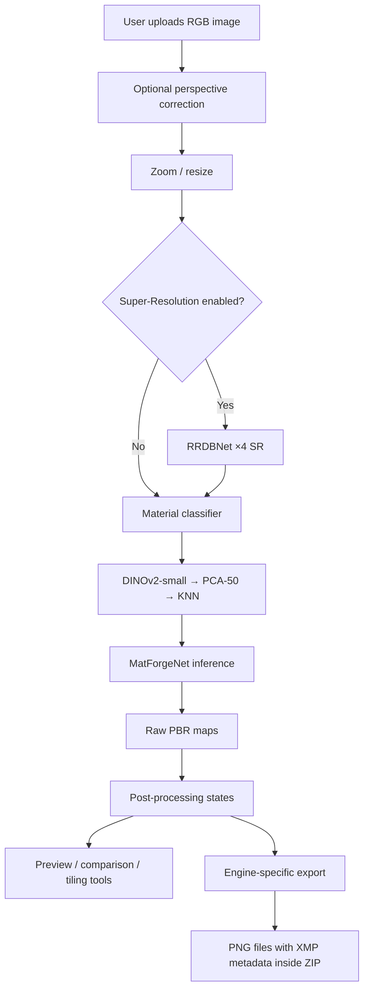
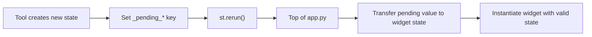
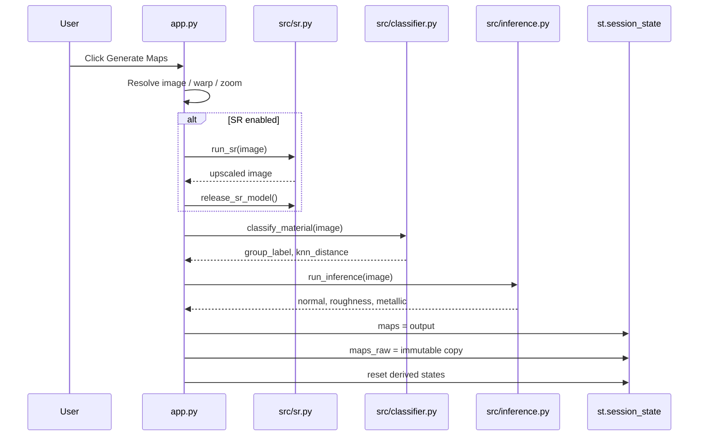
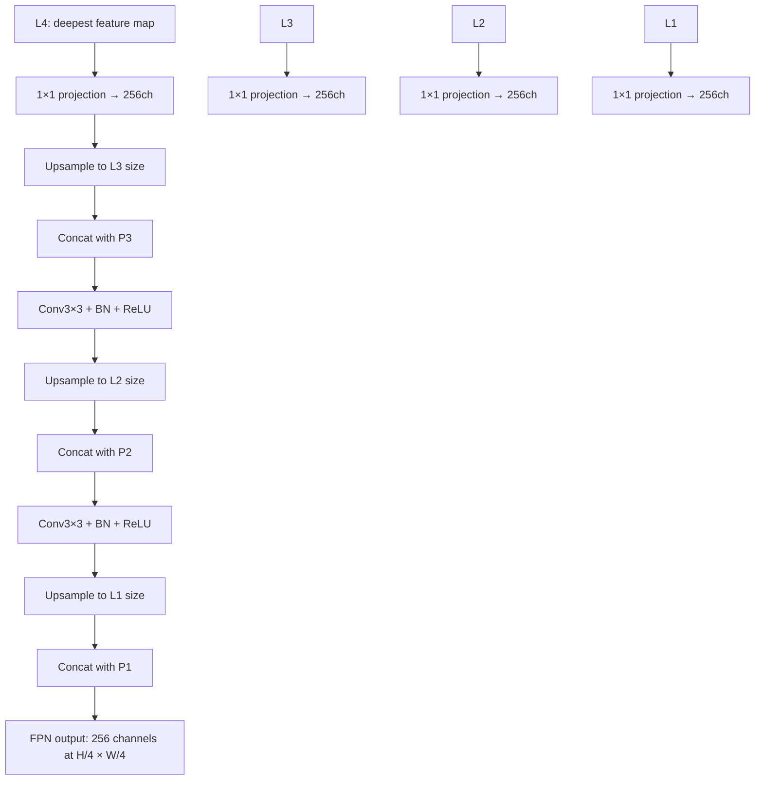
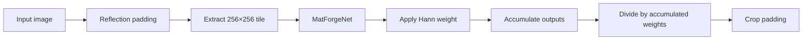
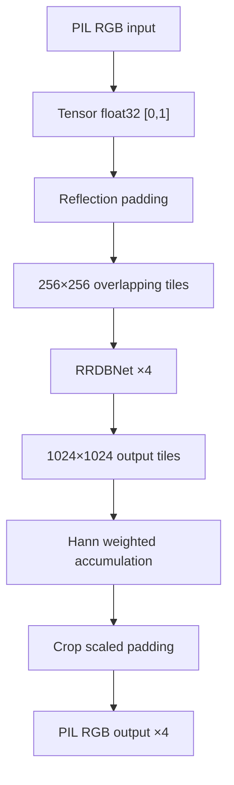
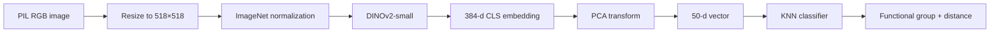
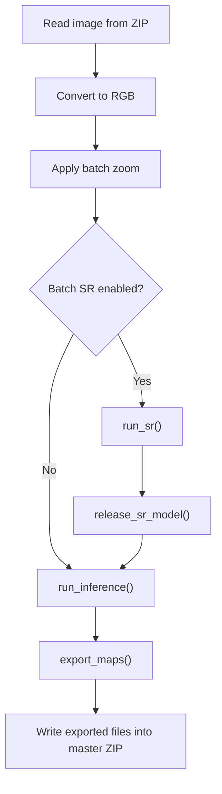

# MatForge Technical Manual

**Version**: 1.0  
**Application**: MatForge App  
**Audience**: developers, maintainers, technical reviewers  
**Last updated**: May 2026

---

## 1. Purpose and Scope

This manual describes the internal technical architecture of **MatForge App**, a local Streamlit application that predicts PBR material maps from a single RGB image. It is intended for developers who need to understand, maintain, extend, debug, or audit the codebase.

MatForge generates three physically based rendering maps:

- **Normal** — tangent-space OpenGL normal map, stored internally as unit-length vectors in `[-1, 1]`.
- **Roughness** — scalar map in `[0, 1]`.
- **Metallic** — scalar map in `[0, 1]`.

The application combines a custom PyTorch model, optional Real-ESRGAN super-resolution, a DINOv2-based material classifier, several post-processing tools, a Three.js preview viewer, multi-engine export logic, and XMP provenance metadata injection.

This document focuses on implementation details: module responsibilities, data contracts, runtime state, model loading, inference flow, extension points, and technical constraints.

It deliberately does **not** duplicate:

- end-user workflows, which are documented in `docs/USER_MANUAL.md`;
- installation instructions, which are documented in `README.md`;
- research background and training methodology, which are documented in the academic project files under [MatForge Research](https://github.com/gutierrezmigueljeronimo/MatForge-Research/tree/main).

Use this manual when you need to answer questions such as:

- Where is each part of the pipeline implemented?
- What shape and range does each function expect?
- How are Streamlit state transitions managed?
- How does tile-and-merge inference work?
- How is GPU memory controlled?
- How should a new export engine or post-processing tool be added?
- Where is XMP metadata injected into generated PNG files?

---

## 2. System Overview

MatForge App is a local, single-process Streamlit application. It does not require a backend server beyond Streamlit itself, and the full inference pipeline runs on the user’s machine.

At runtime, the application follows this high-level pipeline:



The core pipeline is sequential. The optional super-resolution model and MatForgeNet are not intended to reside in GPU memory at the same time on the target hardware. When SR is used, it runs first, then its cached model is explicitly released before MatForgeNet inference.

The main runtime stages are:

1. **Input preparation**
   The uploaded image is converted to RGB, optionally corrected for perspective, then resized by the zoom factor.

2. **Optional Super-Resolution**
   `src/sr.py` applies RRDBNet ×4 to the zoomed image using tile-and-merge inference.

3. **Material classification**
   `src/classifier.py` classifies the input material into one of eight functional groups using DINOv2-small, PCA, and KNN.

4. **PBR map inference**
   `src/inference.py` runs MatForgeNet over overlapping 256×256 tiles and merges them with a Hann window.

5. **Stateful post-processing**
   `src/postprocess.py` provides non-destructive transformations such as roughness/metallic adjustment, calibration, tileability improvement, material blending, and procedural variations.

6. **Preview and inspection**
   `src/ui_components.py` renders the map grid, Three.js viewer, comparison slider, and AI output notice.

7. **Export**
   `src/export.py` packages the selected map state for Blender, Unreal Engine 5, Unity URP, Unity HDRP, or Godot 4, embedding XMP provenance metadata into every exported PNG.

The application is designed around a strict separation between orchestration and business logic. `app.py` owns Streamlit layout and state transitions. Heavy or reusable logic lives in `src/`.

---

## 3. Repository Structure

The expected repository layout is:

```text
MatForge_App/
├── app.py
├── requirements.txt
├── LICENSE
├── install.bat
├── launch_matforge.bat
├── launch_matforge.ps1
├── checkpoints/
│   ├── matforge/
│   │   └── best_gan.pt
│   └── sr/
│       ├── sr_ft_phase1_best_lpips.pt
│       └── RealESRGAN_x4plus.pth
├── artifacts/
│   ├── knn_classifier.pkl
│   ├── pca_model.pkl
│   └── label_encoder.pkl
├── assets/
│   └── three/
│       ├── three.module.js
│       └── OrbitControls.js
├── sample_inputs/
├── scripts/
│   └── matforge_app_00_inference_check.py
├── src/
│   ├── __init__.py
│   ├── models.py
│   ├── inference.py
│   ├── sr.py
│   ├── classifier.py
│   ├── postprocess.py
│   ├── export.py
│   ├── quality.py
│   ├── ui_components.py
│   └── utils.py
└── docs/
    ├── USER_MANUAL.md
    ├── MANUAL_DE_USUARIO.md
    ├── TECHNICAL_MANUAL.md
    ├── MANUAL_TECNICO.md
    └── assets/
```

### 3.1 Root files

| File                  | Role                                                                                           |
| --------------------- | ---------------------------------------------------------------------------------------------- |
| `app.py`              | Streamlit entry point. Owns UI layout, user interactions, session state and calls into `src/`. |
| `requirements.txt`    | Python dependencies excluding PyTorch, which is installed separately according to the README.  |
| `install.bat`         | Windows environment setup script.                                                              |
| `launch_matforge.bat` | Main Windows launcher.                                                                         |
| `launch_matforge.ps1` | PowerShell launcher alternative.                                                               |
| `LICENSE`             | Project license.                                                                               |

`app.py` should remain an orchestrator. It should not contain model definitions, low-level inference logic, export packing logic, or image-processing algorithms.

### 3.2 `checkpoints/`

Model weights are expected at fixed paths:

```text
checkpoints/
├── matforge/
│   └── best_gan.pt
└── sr/
    ├── sr_ft_phase1_best_lpips.pt
    └── RealESRGAN_x4plus.pth
```

`best_gan.pt` is loaded by `src/inference.py`.
`sr_ft_phase1_best_lpips.pt` is the primary SR checkpoint.
`RealESRGAN_x4plus.pth` is the fallback SR checkpoint.

The application assumes these files are present before inference. They are intentionally separated from the Python source tree.

*Checkpoints are distributed via GitHub Releases, not committed to the repository directly. Download them from the [Releases page](https://github.com/migueljeronimogutierrez/MatForge-App/releases) and place them at the paths listed above before running the application. See `README.md` for the complete download and installation instructions.*

### 3.3 `artifacts/`

The classifier depends on three serialized scikit-learn artifacts:

```text
artifacts/
├── knn_classifier.pkl
├── pca_model.pkl
└── label_encoder.pkl
```

These are loaded by `src/classifier.py` and must remain compatible with the pinned scikit-learn version in `requirements.txt`.

### 3.4 `assets/`

`assets/three/` contains local Three.js files intended as offline-capable static assets. The current viewer implementation still loads Three.js through a CDN import map in `src/ui_components.py`, so local static serving should be treated as an available asset path rather than the active viewer path.

### 3.5 `scripts/`

`scripts/matforge_app_00_inference_check.py` is a standalone diagnostic script. It verifies the local inference pipeline before or during release validation.

It checks:

1. device detection;
2. VRAM baseline;
3. MatForgeNet loading;
4. synthetic image creation;
5. tiled inference;
6. output shape and range;
7. GPU memory release;
8. KNN artifact loading;
9. SR checkpoint presence.

This script should be run from the project root with the virtual environment activated.

### 3.6 `src/`

`src/` contains all reusable application logic.

| Module             | Responsibility                                                                             |
| ------------------ | ------------------------------------------------------------------------------------------ |
| `models.py`        | MatForgeNet architecture: PVT-v2-B1 encoder, FPN decoder, Normal/Roughness/Metallic heads. |
| `inference.py`     | MatForgeNet loading and tile-and-merge inference.                                          |
| `sr.py`            | RRDBNet ×4 super-resolution loading, inference and release.                                |
| `classifier.py`    | DINOv2-small + PCA + KNN material classification.                                          |
| `postprocess.py`   | Pure NumPy/OpenCV/SciPy post-processing tools.                                             |
| `export.py`        | Engine-specific export packing and XMP metadata injection.                                 |
| `quality.py`       | Heuristic normal-map quality diagnostics.                                                  |
| `ui_components.py` | Centralized design system, CSS, HTML widgets, Three.js viewer and UI helpers.              |
| `utils.py`         | Shared image, tensor, zoom, perspective warp, session and time-estimation utilities.       |
| `__init__.py`      | Empty package marker.                                                                      |

The empty `src/__init__.py` exists only to mark `src` as a Python package. It does not define public APIs.

---

## 4. Runtime Architecture

### 4.1 Streamlit execution model

MatForge uses Streamlit’s reactive execution model. Every widget interaction may rerun `app.py` from top to bottom. For that reason, persistent runtime information is stored in `st.session_state`.

The application initializes all expected state keys at startup through `init_session_state()` in `app.py`. Existing values are preserved across reruns; missing keys receive safe defaults.

The main architectural rule is:

> Streamlit state lives in `app.py`; computational logic lives in `src/`.

The source modules are therefore easier to test and reason about because most of them are pure or nearly pure logic:

* `postprocess.py`, `quality.py` and `export.py` have no Streamlit dependency.
* `models.py` defines only PyTorch modules.
* `inference.py`, `sr.py` and `classifier.py` use `@st.cache_resource` for heavyweight model or artifact loading.
* `ui_components.py` centralizes HTML/CSS rendering helpers.

### 4.2 Main session state keys

The following keys are central to the runtime design:

| Key                     | Meaning                                                                              |
| ----------------------- | ------------------------------------------------------------------------------------ |
| `input_image`           | Current pipeline image. If SR was used, this is overwritten with the SR output.      |
| `original_image`        | Original uploaded image before SR. Used for metadata, sidebar estimates and display. |
| `zoom`                  | Zoom factor applied before inference.                                                |
| `use_sr`                | Whether SR is enabled in the UI.                                                     |
| `sr_was_used`           | Whether SR was active during the last generation.                                    |
| `group_label`           | Material group predicted by the classifier.                                          |
| `knn_distance`          | Distance to nearest KNN neighbor; lower means higher confidence.                     |
| `maps`                  | Currently active mutable map set used for immediate display.                         |
| `maps_raw`              | Raw inference output. Source of truth for non-destructive tools.                     |
| `maps_adjusted`         | Output of roughness/metallic gain-offset adjustment.                                 |
| `maps_calibrated`       | Output of group-based calibration.                                                   |
| `maps_tileable`         | Output of tileability post-processing.                                               |
| `maps_blended`          | Output of RNM material blending; may contain optional `color`.                       |
| `maps_variations`       | Selected procedural variation.                                                       |
| `viewer_state`          | Selected state for the Three.js preview.                                             |
| `export_state`          | Selected state for export.                                                           |
| `tile_preview_state`    | Selected state for tiling preview.                                                   |
| `tile_preview_map`      | Selected map channel for tiling preview.                                             |
| `warp_points`           | Four perspective-correction points in source image coordinates.                      |
| `warped_image`          | Perspective-corrected image preview/output.                                          |
| `warp_confirmed`        | Whether the corrected crop should be used as pipeline input.                         |
| `_batch_result_bytes`   | Cached ZIP bytes from the last batch run.                                            |
| `_batch_result_summary` | Batch result summary with successes and failures.                                    |

Derived map states are intentionally separate. Raw maps are not overwritten. This makes the tools non-destructive and allows the viewer, comparison tool, tiling preview and export system to select different states independently.

### 4.3 Pending state redirect pattern

Some Streamlit widgets cannot safely have their value changed after they have been instantiated in the same rerun. To handle this, `app.py` uses temporary pending keys:

```text
_pending_viewer_state
_pending_export_state
_pending_tile_state
```

At the top of the script, before the widgets are instantiated, pending values are transferred into their target keys:

```text
_pending_viewer_state → viewer_state
_pending_export_state → export_state
_pending_tile_state   → tile_preview_state
```

This pattern is used after operations such as material blending or applying a procedural variation, where the UI should automatically switch the viewer/export/tiling selectors to the newly generated state.



### 4.4 Generation pipeline in `app.py`

The Generate Maps button triggers the main pipeline.

The steps are:

1. Resolve the current input image.
2. If perspective correction is confirmed, use `warped_image`.
3. Clamp zoom to avoid effective dimensions below 256 px.
4. Apply zoom with `utils.apply_zoom()`.
5. If SR is enabled:

   * run `sr.run_sr()`;
   * release the SR model;
   * call garbage collection and clear CUDA cache;
   * replace `input_image` with the SR output.
6. Classify the material with `classifier.classify_material()`.
7. Run MatForgeNet inference with `inference.run_inference()`.
8. Store `maps` and `maps_raw`.
9. Reset all derived map states.
10. Reset viewer/export state to `Raw`.



### 4.5 State invalidation

When the user uploads a new image, applies or resets perspective correction, or triggers actions that make previous outputs stale, `app.py` calls `utils.invalidate_session_keys()`.

This function simply sets selected `st.session_state` keys to `None`. It avoids accidental reuse of maps, classifier outputs or derived states from a previous image.

Typical invalidated keys include:

```text
maps
maps_raw
maps_calibrated
maps_tileable
maps_adjusted
maps_blended
maps_variations
group_label
knn_distance
warp_points
warped_image
```

### 4.6 Runtime source-of-truth rule

The most important state rule is:

> `maps_raw` is the source of truth for model output.

The mutable `maps` object is used for immediate display and may be updated by tools. However, tools that need to operate from the unmodified model output should read from `maps_raw`.

Examples:

* Adjust R/M reads from `maps_raw`.
* Calibrate by Group reads from `maps_raw`.
* Procedural Variations read from `maps_raw`.
* Make Tileable resolves its source as `maps_calibrated → maps_adjusted → maps_raw`.

This design avoids destructive accumulation of transformations and makes it possible to compare or export different states.

### 4.7 Main runtime dependencies

The project pins the following core dependencies in `requirements.txt`:

```text
streamlit>=1.50
timm==1.0.25
opencv-python==4.10.0.84
Pillow==10.4.0
numpy==1.26.4
scipy==1.13.1
scikit-learn==1.5.2
opensimplex==0.4.5
pyfastnoiselite==0.0.4
streamlit-image-coordinates==0.4.0
```

PyTorch and torchvision are intentionally not pinned in `requirements.txt`; they are installed separately using the CUDA-specific index URL documented in the README. This avoids accidentally installing a CPU-only PyTorch wheel.

---

## 5. Core Model: MatForgeNet

The main PBR prediction model is implemented in `src/models.py`.

MatForgeNet is a custom PyTorch encoder-decoder network composed of:

1. a **PVT-v2-B1** hierarchical encoder;
2. a custom **FPNDecoder**;
3. three independent **RefineHead** output branches:
   - Normal;
   - Roughness;
   - Metallic.

The model is loaded by `src/inference.py` from:

```text
checkpoints/matforge/best_gan.pt
````

### 5.1 Model class layout

The model definitions are:

```text
MatForgeNet
├── encoder: timm.create_model("pvt_v2_b1", pretrained=False, features_only=True)
├── fpn: FPNDecoder
├── head_normal: RefineHead(256, 3)
├── head_roughness: RefineHead(256, 1)
└── head_metallic: RefineHead(256, 1)
```

The encoder is instantiated with `pretrained=False` at runtime because the trained checkpoint already contains the required weights. The runtime model must match the checkpoint state dict exactly.

Do not modify `FPNDecoder`, `RefineHead`, layer ordering, bias settings, or output heads unless the checkpoint is also regenerated or explicitly migrated.

### 5.2 Encoder

The encoder is created through `timm`:

```python
timm.create_model("pvt_v2_b1", pretrained=False, features_only=True)
```

It returns four feature maps ordered from shallow to deep:

```text
L1: high-resolution shallow features
L2
L3
L4: low-resolution deep features
```

For a 256×256 input tile, the expected feature-map structure is:

```text
L1: 64×64×64
L2: 32×32×128
L3: 16×16×320
L4: 8×8×512
```

The decoder assumes these channel counts:

```python
in_channels = (64, 128, 320, 512)
```

### 5.3 FPNDecoder

`FPNDecoder` projects all encoder feature maps to 256 channels using 1×1 convolutions, then fuses them in a top-down pyramid.

The fusion pattern is:



The decoder output for a 256×256 tile is a 64×64 feature map with 256 channels.

### 5.4 RefineHead

Each `RefineHead` upsamples the FPN output back to the original tile resolution.

The structure is:

```text
Input: 64×64×256
↓ bilinear upsample ×2
block1: Conv → BN → ReLU → Conv → BN → ReLU
↓ bilinear upsample ×2
block2: Conv → BN → ReLU → Conv → BN → ReLU
↓
Conv1×1 output layer
Output: 256×256×C
```

Output channels:

| Head      | Channels | Runtime activation                                                |
| --------- | -------: | ----------------------------------------------------------------- |
| Normal    |        3 | `tanh` + L2 normalization                                         |
| Roughness |        1 | `sigmoid`                                                         |
| Metallic  |        1 | raw logits in model output; `sigmoid` is applied during inference |

### 5.5 Output contracts

The public model forward pass returns a dictionary:

```python
{
    "normal": normal,
    "roughness": roughness,
    "metallic": raw_metallic,
}
```

Internal tensor contracts:

| Key         | Shape          | Range before final inference post-processing |
| ----------- | -------------- | -------------------------------------------- |
| `normal`    | `(B, 3, H, W)` | `[-1, 1]`, L2-normalized per pixel           |
| `roughness` | `(B, 1, H, W)` | `[0, 1]`                                     |
| `metallic`  | `(B, 1, H, W)` | logits                                       |

`src/inference.py` applies `torch.sigmoid()` to the merged metallic logits after tile blending.

### 5.6 Checkpoint compatibility rule

`src/models.py` states that the model classes are taken from the verified architecture specification and should not be modified without re-validating against the checkpoint.

This is important because even small changes may break `model.load_state_dict(state_dict)`, for example:

* changing convolution bias settings;
* moving upsample layers into `nn.Sequential`;
* renaming modules;
* changing output-channel counts;
* replacing PVT-v2-B1 with another encoder;
* changing FPN channel width.

When modifying the architecture, update both:

```text
src/models.py
scripts/matforge_app_00_inference_check.py
```

and rerun the diagnostic script.

---

## 6. Inference Pipeline

The main inference pipeline is implemented in `src/inference.py`.

Its public entry point is:

```python
run_inference(image: Image.Image) -> dict
```

It accepts a PIL RGB image of any size and returns NumPy arrays:

```python
{
    "normal": np.ndarray,     # (H, W, 3), float32, [-1, 1]
    "roughness": np.ndarray,  # (H, W, 1), float32, [0, 1]
    "metallic": np.ndarray,   # (H, W, 1), float32, [0, 1]
}
```

### 6.1 Constants

The inference module defines:

```python
CHECKPOINT_PATH = Path("checkpoints/matforge/best_gan.pt")
TILE = 256
STRIDE = 128
IMAGENET_MEAN = [0.485, 0.456, 0.406]
IMAGENET_STD  = [0.229, 0.224, 0.225]
DEVICE = "cuda" if torch.cuda.is_available() else "cpu"
DTYPE = torch.float32
```

`float32` is required in production. `float16` was rejected because it causes PVT attention overflow on real images.

### 6.2 Model loading

Model loading is cached:

```python
@st.cache_resource
def load_model() -> MatForgeNet:
    ...
```

The function:

1. loads `checkpoints/matforge/best_gan.pt`;
2. extracts `ckpt["model"]`;
3. instantiates `MatForgeNet`;
4. loads the state dict;
5. switches the model to evaluation mode;
6. moves it to `DEVICE` and `DTYPE`.

The cached model remains available during the Streamlit session. Unlike the SR model, MatForgeNet is not released after each inference.

### 6.3 Input preprocessing

`run_inference()` converts the image to RGB, scales it to `[0, 1]`, applies ImageNet normalization, and converts it to a PyTorch tensor:

```text
PIL RGB
→ NumPy float32 [0, 1], shape (H, W, 3)
→ ImageNet normalization
→ torch.Tensor, shape (1, 3, H, W)
→ DEVICE / float32
```

The ImageNet normalization is:

```python
img_np = (img_np - mean) / std
```

### 6.4 Tile-and-merge strategy

MatForgeNet is trained and executed on 256×256 tiles. Larger images are processed through overlapping tiles.

The tiling parameters are:

```text
Tile size: 256×256
Stride:    128 px
Overlap:   50%
Window:    Hann 2D
```

The pipeline uses reflection padding before tiling.

The padding strategy is deliberately stronger than simple stride alignment:

```python
half = TILE // 2
pad_h = half + (STRIDE - (H + half) % STRIDE) % STRIDE
pad_w = half + (STRIDE - (W + half) % STRIDE) % STRIDE
img_p = F.pad(img_t, (half, pad_w, half, pad_h), mode="reflect")
```

This ensures that border pixels are not located on the zero-weight edge of the Hann window.

### 6.5 Hann window blending

The Hann window is created as:

```python
w1d = sin(pi * k / (n - 1)) ** 2
hann = outer(w1d, w1d)
```

For each tile:

1. MatForgeNet predicts Normal, Roughness and Metallic.
2. The tile outputs are multiplied by the Hann window.
3. Weighted outputs are accumulated into full-size tensors.
4. The Hann weights are accumulated separately.

Conceptually:



### 6.6 Normal, Roughness and Metallic merge rules

The three outputs are merged differently:

| Map       | Merge behavior                                                 |
| --------- | -------------------------------------------------------------- |
| Normal    | accumulate weighted vectors → divide by weights → L2 normalize |
| Roughness | accumulate weighted scalar values → divide by weights          |
| Metallic  | accumulate weighted logits → divide by weights → `sigmoid`     |

The final post-processing in `run_inference()` is:

```python
normal_t    = F.normalize(acc_n / denom, dim=1, eps=1e-6)
roughness_t = acc_r / denom
metallic_t  = torch.sigmoid(acc_m / denom)
```

This order matters. Normal vectors must be renormalized **after** full-image blending, not only per tile. Metallic logits must be blended before applying `sigmoid`.

### 6.7 Cropping and return format

After merge, the function removes the padding:

```python
normal_t    = normal_t[:, :, half:half + H, half:half + W]
roughness_t = roughness_t[:, :, half:half + H, half:half + W]
metallic_t  = metallic_t[:, :, half:half + H, half:half + W]
```

Then tensors are converted back to NumPy arrays in channel-last format:

```text
normal:    (H, W, 3)
roughness: (H, W, 1)
metallic:  (H, W, 1)
```

All returned arrays are `float32`.

### 6.8 Effective minimum size

The low-level utility `utils.apply_zoom()` allows output dimensions down to 64 px. However, the generation path in `app.py` clamps the effective zoom to ensure that the image entering MatForge inference is at least 256 px on its smallest side.

This protects the tile-and-merge pipeline from inputs smaller than one tile.

---

## 7. Super-Resolution Module

The optional super-resolution pipeline is implemented in `src/sr.py`.

Its public entry points are:

```python
run_sr(image: Image.Image) -> Image.Image
release_sr_model() -> None
```

`run_sr()` receives a PIL RGB image and returns a PIL RGB image at 4× the original resolution.

### 7.1 Model architecture

The SR model is an RRDBNet ×4 network based on Real-ESRGAN.

The implemented architecture includes:

```text
RRDBNet
├── conv_first
├── body: 23 RRDB blocks
├── conv_body
├── conv_up1
├── conv_up2
├── conv_hr
└── conv_last
```

Each RRDB contains three residual dense blocks, and each residual dense block uses five convolutional layers with residual scaling.

The upscaling path uses two nearest-neighbor ×2 upsampling stages, producing an overall ×4 scale factor.

### 7.2 Checkpoint priority

The SR loader checks the following files in order:

```text
1. checkpoints/sr/sr_ft_phase1_best_lpips.pt
2. checkpoints/sr/RealESRGAN_x4plus.pth
```

The first is the project-specific fine-tuned checkpoint.
The second is the fallback Real-ESRGAN checkpoint.

If neither exists, `load_sr_model()` raises `FileNotFoundError`.

The loader supports checkpoints stored as:

* `params_ema`;
* `params`;
* direct state dict.

### 7.3 Device and dtype policy

`src/sr.py` defines:

```python
DEVICE = "cuda" if torch.cuda.is_available() else "cpu"
DTYPE = torch.float32
```

The comment in the code explicitly states that `float16` produces NaN on GTX 1650 Max-Q with both SR checkpoints. Therefore SR inference must use `float32`, consistent with the main MatForge inference pipeline.

### 7.4 SR tile-and-merge

SR uses the same conceptual tile-and-merge approach as MatForge inference:

```text
Tile size: 256×256 input pixels
Stride:    128 px
Overlap:   50%
Window:    Hann 2D, upscaled to 1024×1024
Padding:   half tile on all sides, reflection mode
Scale:     ×4
```

The steps are:

1. Convert PIL RGB image to tensor `(1, 3, H, W)` in `[0, 1]`.
2. Apply reflection padding.
3. Process overlapping 256×256 tiles.
4. Upscale each tile to 1024×1024.
5. Blend output tiles with an upscaled Hann window.
6. Normalize by accumulated weights.
7. Crop the scaled padding.
8. Convert back to PIL RGB.



### 7.5 SR release policy

The SR model is cached with:

```python
@st.cache_resource(max_entries=1)
def load_sr_model() -> RRDBNet:
    ...
```

However, after SR inference finishes, `app.py` calls:

```python
release_sr_model()
gc.collect()
torch.cuda.empty_cache()
```

`release_sr_model()` clears the cached SR model and empties CUDA cache when CUDA is active.

This is required because the target deployment GPU has only 4 GB VRAM. The intended lifecycle is:

```text
load SR model
→ run SR
→ clear cached SR model
→ garbage collection
→ empty CUDA cache
→ run MatForgeNet
```

MatForgeNet and SR are therefore sequential GPU workloads, not concurrent resident models.

### 7.6 SR constraints

Important constraints:

* SR always upscales by ×4.
* SR can push images beyond the 1K range on which MatForge was trained.
* `app.py` warns the user when SR output exceeds 1024 px in either dimension.
* SR improves low-resolution input detail but may create flat or incoherent downstream maps when used on images that are already large.
* The SR module is not a PBR-aware multi-map super-resolution model; it only operates on the RGB input image.

---

## 8. Material Classifier

The material classifier is implemented in `src/classifier.py`.

Its public entry point is:

```python
classify_material(image: Image.Image) -> tuple[str, float]
```

It receives a PIL RGB image at any resolution and returns:

```python
(group_name, knn_distance)
```

where:

* `group_name` is one of the eight functional material groups;
* `knn_distance` is the cosine distance to the closest training sample in PCA space;
* lower distance means higher confidence.

### 8.1 Classifier pipeline

The classifier pipeline is:



### 8.2 Runtime model

The DINOv2 model is loaded through `timm`:

```python
MODEL_NAME = "vit_small_patch14_dinov2.lvd142m"
IMG_SIZE = 518
EMBED_DIM = 384
```

The model is created with:

```python
timm.create_model(
    MODEL_NAME,
    pretrained=True,
    num_classes=0,
)
```

`num_classes=0` removes the classification head and returns the embedding directly.

The model is cached with `@st.cache_resource`.

### 8.3 Serialized artifacts

The classifier also loads three serialized artifacts:

```text
artifacts/
├── pca_model.pkl
├── knn_classifier.pkl
└── label_encoder.pkl
```

They are loaded by `_load_artifacts()` using `joblib.load()` and cached with `@st.cache_resource`.

The pinned scikit-learn version in `requirements.txt` is important for artifact compatibility:

```text
scikit-learn==1.5.2
```

### 8.4 Preprocessing

The input image is resized to 518×518:

```python
img_resized = image.resize((IMG_SIZE, IMG_SIZE), Image.LANCZOS)
```

Then converted to float32 `[0, 1]`, normalized with ImageNet mean/std, and converted to a tensor:

```python
mean = [0.485, 0.456, 0.406]
std  = [0.229, 0.224, 0.225]
```

The tensor shape is:

```text
(1, 3, 518, 518)
```

### 8.5 Output groups

The possible classifier groups are:

```text
brick_terracotta
ceramic_ground
concrete_plaster
marble_smooth
metal
mixed_ambiguous
stone_rough
wood
```

These groups are functional material groups derived during dataset relabeling. They are not used as direct input to MatForgeNet. MatForgeNet predicts maps from RGB alone.

The group label is used by the application for:

* displaying detected material context;
* group-based Roughness/Metallic calibration;
* contextualizing quality warnings in the UI.

### 8.6 Confidence distance

`knn_distance` is obtained from the nearest neighbor distance:

```python
dist = knn.kneighbors(emb_pca, n_neighbors=1)[0][0, 0]
```

It is a cosine distance in the reduced 50-dimensional PCA space.

The application converts it into a calibration confidence approximately as:

```python
alpha = max(0.0, min(1.0, 1.0 - knn_distance * 3.0))
```

This means:

* low KNN distance → stronger calibration;
* high KNN distance → weaker calibration;
* manual group override → full calibration confidence.

### 8.7 Classifier limitations

The classifier should be treated as a lightweight contextual tool, not as a hard safety mechanism or a mandatory model condition.

Important limitations:

* It predicts only one functional group.
* It can be wrong on mixed, stylized, cropped, or atypical materials.
* The KNN distance is a useful confidence proxy but not a calibrated probability.
* MatForgeNet does not depend on the classifier output to run inference.
* Calibration should remain overrideable by the user.

---

## 9. Post-processing Tools

Post-processing logic is implemented in `src/postprocess.py`.

This module is intentionally pure logic:

- no Streamlit dependency;
- no GPU dependency;
- no session state;
- no model loading;
- NumPy arrays in, NumPy arrays out.

All functions operate on `float32` arrays and are called from `app.py`, which is responsible for selecting the correct map state and storing the result in `st.session_state`.

### 9.1 Map conventions

The post-processing functions use the same internal conventions as the inference pipeline:

| Map | Shape | Range | Notes |
|---|---|---|---|
| Normal | `(H, W, 3)` | `[-1, 1]` | OpenGL tangent-space vectors, expected to be unit-length. |
| Roughness | `(H, W)` or `(H, W, 1)` | `[0, 1]` | Scalar map. |
| Metallic | `(H, W)` or `(H, W, 1)` | `[0, 1]` | Scalar map. |
| Mask | `(H, W)` or `(H, W, 1)` | `[0, 1]` | Used for blending. |

Normal maps are not stored in packed display format inside the pipeline. They are unpacked vectors in `[-1, 1]`.

### 9.2 Roughness / Metallic gain-offset adjustment

Function:

```python
adjust_gain_offset(
    tensor: np.ndarray,
    gain: float = 1.0,
    offset: float = 0.0,
) -> np.ndarray
````

This function applies:

```text id="1h1rtv"
output = clip(gain * input + offset, 0, 1)
```

It is intended only for Roughness or Metallic maps.

Valid parameter ranges:

```text id="owkahs"
gain   ∈ [0.5, 2.0]
offset ∈ [-0.5, 0.5]
```

The function includes a safety check against accidentally passing normal maps: if the input contains values below `-0.01`, it raises `ValueError`.

Typical usage from `app.py`:

```text id="3gsdi1"
source: maps_raw
output: maps_adjusted
```

The tool does not modify `maps_raw`.

### 9.3 Group-based calibration

Function:

```python
calibrate_by_group(
    roughness: np.ndarray,
    metallic: np.ndarray,
    group: str,
    knn_distance: float,
) -> tuple[np.ndarray, np.ndarray]
```

This function pulls Roughness and Metallic values toward plausible ranges for the detected material group.

The calibration ranges are:

| Group              | Roughness range | Metallic range |
| ------------------ | --------------- | -------------- |
| `stone_rough`      | 0.55–0.95       | 0.0–0.0        |
| `concrete_plaster` | 0.55–0.95       | 0.0–0.0        |
| `brick_terracotta` | 0.55–0.95       | 0.0–0.0        |
| `mixed_ambiguous`  | 0.55–0.95       | 0.0–0.0        |
| `wood`             | 0.45–0.80       | 0.0–0.0        |
| `ceramic_ground`   | 0.05–0.30       | 0.0–0.0        |
| `marble_smooth`    | 0.05–0.30       | 0.0–0.0        |
| `metal`            | 0.05–0.75       | 0.85–1.0       |

The confidence coefficient is derived from the KNN distance:

```python
alpha = max(0.0, min(1.0, 1.0 - knn_distance * 3.0))
```

The calibration formula is:

```text id="dzm0m6"
calibrated = alpha * clipped_to_group_range + (1 - alpha) * original
```

This makes calibration soft rather than destructive. If the classifier confidence is low, the original prediction is mostly preserved.

If an unknown group is passed, the function returns copies of the original maps.

### 9.4 Tileability improvement

The main tileability function used by the app is:

```python
make_tileable_frequency(
    normal: np.ndarray,
    roughness: np.ndarray,
    metallic: np.ndarray,
    sr_active: bool = False,
    sigma: float = 64.0,
    border_px: int = 8,
) -> dict
```

It returns:

```python
{
    "normal": normal_out,
    "roughness": roughness_out,
    "metallic": metallic_out,
}
```

The function has two mechanisms.

#### 9.4.1 Low-frequency normalization

Roughness and Metallic maps are corrected by removing slow spatial gradients:

```text id="tal7go"
low_freq = gaussian_filter(map, sigma)
result = map - low_freq + global_mean
result = clip(result, 0, 1)
```

This helps reduce visible low-frequency drift introduced by tile-based inference.

It does not guarantee perfect seamlessness for:

* large non-repeating patterns;
* baked directional lighting;
* strong perspective distortion;
* highly structured non-tileable photographs.

#### 9.4.2 Optional SR seam blending

When `sr_active=True`, the function additionally blends opposite borders using `_blend_border_seam()`.

For Normal maps, seam blending is performed in packed `[0, 1]` space and then unpacked back to `[-1, 1]`, followed by L2 renormalization.

This is important because linear blending can break normal-vector unit length.

### 9.5 Simple tileability function

`make_tileable_simple()` also exists. It uses a classic 50% offset and cross-fade approach.

Function:

```python
make_tileable_simple(
    image: np.ndarray,
    is_normal_map: bool = False,
) -> np.ndarray
```

This function is not the main tileability path in the current UI, but it remains available as a simpler utility.

If `is_normal_map=True`, the function:

1. unpacks normals from `[0, 1]` to `[-1, 1]`;
2. blends vectors;
3. renormalizes them;
4. repacks to `[0, 1]`.

### 9.6 Reoriented Normal Mapping

Normal blending uses Reoriented Normal Mapping.

Function:

```python
blend_normals_rnm(
    n_base: np.ndarray,
    n_detail: np.ndarray,
    mask: np.ndarray | None = None,
) -> np.ndarray
```

This avoids the artifacts of simple linear interpolation between normal vectors.

The RNM core computes a reoriented blend and renormalizes the result:

```text id="hha0c0"
t = n_base + [0, 0, 1]
u = n_detail * [-1, -1, 1]
r = t * dot(t, u) / t.z - u
r = normalize(r)
```

If a mask is provided, the function linearly interpolates between `n_base` and the RNM result, then renormalizes again.

### 9.7 Material blending

Function:

```python
blend_materials(
    r_a: np.ndarray,
    m_a: np.ndarray,
    n_a: np.ndarray,
    r_b: np.ndarray,
    m_b: np.ndarray,
    n_b: np.ndarray,
    mask: np.ndarray,
) -> tuple[np.ndarray, np.ndarray, np.ndarray]
```

Behavior:

| Map       | Blend method         |
| --------- | -------------------- |
| Roughness | Linear interpolation |
| Metallic  | Linear interpolation |
| Normal    | RNM blend            |

`app.py` stores the result as:

```text id="a759xq"
maps_blended
```

If a color map B is provided in the UI, `app.py` also computes and stores an optional blended `color` entry, but color blending itself is handled in `app.py`, not in `postprocess.py`.

### 9.8 Procedural variations

Function:

```python
generate_variations(
    roughness: np.ndarray,
    metallic: np.ndarray,
    normal: np.ndarray | None = None,
    n_variants: int = 4,
    seed: int = 42,
) -> list[dict[str, np.ndarray]]
```

The module cycles through the following techniques:

| Technique   | Requires Normal? | Effect                                                                         |
| ----------- | ---------------- | ------------------------------------------------------------------------------ |
| Zonal Mix   | No               | Uses FBM noise to spatially vary roughness.                                    |
| Worn Edges  | Yes              | Uses normal-map gradients and noise to darken roughness along edge-like areas. |
| Scale Shift | No               | Randomly rescales and repositions maps using wrapping/reflection behavior.     |

If no normal map is provided, only Zonal Mix and Scale Shift are used.

The noise backend is selected lazily:

1. `pyfastnoiselite` is tried first;
2. if unavailable or incompatible, `opensimplex` is used;
3. if no backend is available, the function returns copies of the input maps.

This fallback behavior prevents procedural variation generation from breaking the whole app.

### 9.9 Post-processing state policy

`app.py` stores post-processing outputs in separate state keys:

| Tool                  | Output state      |
| --------------------- | ----------------- |
| Adjust R/M            | `maps_adjusted`   |
| Calibrate by Group    | `maps_calibrated` |
| Make Tileable         | `maps_tileable`   |
| Material Blender      | `maps_blended`    |
| Procedural Variations | `maps_variations` |

This enables independent selection of states in:

* 3D Preview;
* Comparison;
* Tiling Preview;
* Export.

---

## 10. Normal Map Quality Evaluation

Normal-map diagnostics are implemented in `src/quality.py`.

The public entry point is:

```python
evaluate_normal_quality(normal_map: np.ndarray) -> dict
```

Input contract:

```text id="r2k97c"
normal_map: (H, W, 3), float32, values in [-1, 1]
```

Expected output:

```python
{
    "coherence_score": float,
    "continuity_score": float,
    "blockiness_score": float,
    "overall_score": float,
    "heatmap": np.ndarray,  # (H, W, 4), uint8 RGBA
    "warnings": list[str],
}
```

This module is CPU-only and uses NumPy and SciPy.

### 10.1 Important limitation

The quality evaluator is a **heuristic diagnostic tool**, not a formal benchmark metric.

It is useful for detecting likely artifacts such as:

* non-unit normal vectors;
* abrupt field discontinuities;
* patch-like block patterns;
* suspiciously homogeneous local regions.

It should not be presented as a scientific validation score for the model.

### 10.2 Coherence score

Function:

```python
_compute_coherence(normal_map)
```

This metric checks whether each per-pixel normal vector is approximately unit length.

A pixel is considered coherent when:

```text id="bsmpa5"
0.95 <= ||n|| <= 1.05
```

The score is the fraction of coherent pixels.

The associated error map is:

```text id="a1ga75"
abs(||n|| - 1) / 0.5
```

clipped to `[0, 1]`.

### 10.3 Continuity score

Function:

```python
_compute_continuity(normal_map)
```

This metric computes Sobel gradients for each normal channel and combines them into a gradient-magnitude map.

The score is:

```text id="xugdp4"
score = 1 - min(mean_gradient / 0.5, 1)
```

High gradients can indicate seams or discontinuities, but they may also be legitimate in hard-edge materials such as bricks, stone, scratches or joints. For that reason, the warning threshold is intentionally conservative.

### 10.4 Blockiness score

Function:

```python
_compute_blockiness(normal_map)
```

This metric computes local entropy over a 16×16 footprint using `scipy.ndimage.generic_filter()`.

The score is based on the standard deviation of the entropy map:

```text id="ocqq3u"
score = 1 - min(std(entropy_map) / 0.5, 1)
```

The output blockiness map is an inverted normalized entropy map:

```text id="o9p0er"
low local entropy → brighter suspicious region
```

This operation is CPU-intensive and becomes slow on large maps.

### 10.5 Overall score and warnings

The overall score is a weighted average:

```text id="mthrr5"
overall = 0.40 * coherence + 0.35 * continuity + 0.25 * blockiness
```

Warning thresholds:

| Metric     | Warning threshold |
| ---------- | ----------------- |
| Coherence  | `< 0.95`          |
| Continuity | `< 0.50`          |
| Blockiness | `< 0.70`          |

`app.py` contextualizes some warnings according to material group. For hard-edge groups, continuity or blockiness warnings may be shown as informational messages instead of warnings.

### 10.6 Heatmap

The heatmap combines the three diagnostic maps into an RGBA overlay:

| Channel | Meaning                     |
| ------- | --------------------------- |
| R       | Continuity error            |
| G       | Blockiness suspicion        |
| B       | Coherence error             |
| A       | Maximum error channel × 0.6 |

The returned heatmap is a uint8 array with shape:

```text id="dktx81"
(H, W, 4)
```

---

## 11. Export System and XMP Metadata

Export logic is implemented in `src/export.py`.

This module is pure logic:

* no Streamlit;
* no GPU;
* no session state;
* only NumPy, Pillow, `zipfile`, `io`, and XML utilities.

The public export entry point is:

```python
export_maps(
    normal: np.ndarray,
    roughness: np.ndarray,
    metallic: np.ndarray,
    asset_name: str = "material",
    engines: list[str] | None = None,
    color: np.ndarray | None = None,
) -> bytes
```

It returns ZIP bytes containing engine-specific PNG files.

### 11.1 Valid engines

Supported engine keys are:

```text id="mr25yk"
blender
ue5
unity_urp
unity_hdrp
godot
```

If `engines=None`, all valid engines are exported.

If an unknown engine key is passed, `export_maps()` raises `ValueError`.

### 11.2 Input contracts

| Argument    | Shape                   | Range     | Meaning                           |
| ----------- | ----------------------- | --------- | --------------------------------- |
| `normal`    | `(H, W, 3)`             | `[-1, 1]` | OpenGL tangent-space normal map.  |
| `roughness` | `(H, W)` or `(H, W, 1)` | `[0, 1]`  | Roughness map.                    |
| `metallic`  | `(H, W)` or `(H, W, 1)` | `[0, 1]`  | Metallic map.                     |
| `color`     | `(H, W, 3)`             | `[0, 1]`  | Optional source color/albedo map. |

All maps are converted to 8-bit PNGs.

### 11.3 Normal map packing

OpenGL normal maps are packed as:

```text id="9kk6ex"
[-1, 1] → [0, 255]
```

using:

```text id="6lrlap"
packed = round(clip((normal + 1) * 0.5, 0, 1) * 255)
```

For Unreal Engine 5, normals are exported in DirectX convention. This is done by flipping the green channel before packing:

```python
dx_normal = normal.copy()
dx_normal[..., 1] *= -1.0
```

The source normal map is not mutated.

### 11.4 Engine-specific output formats

#### Blender

Files:

```text id="z39151"
{asset}_normal.png
{asset}_roughness.png
{asset}_metallic.png
{asset}_color.png        # only if color is provided
```

Conventions:

* Normal: OpenGL;
* Roughness: grayscale;
* Metallic: grayscale.

#### Unreal Engine 5

Files:

```text id="53gcbx"
T_{asset}_N.png
T_{asset}_ORM.png
T_{asset}_D.png          # only if color is provided
```

Conventions:

* Normal: DirectX, green channel flipped;
* ORM packed texture:

  * R = Ambient Occlusion, default `255`;
  * G = Roughness;
  * B = Metallic.

#### Unity URP

Files:

```text id="xwrx1n"
{asset}_Normal.png
{asset}_MetallicSmoothness.png
{asset}_Albedo.png       # only if color is provided
```

Conventions:

* Normal: OpenGL;
* MetallicSmoothness RGBA:

  * R = Metallic;
  * G = 0;
  * B = 0;
  * A = Smoothness = `1 - Roughness`.

#### Unity HDRP

Files:

```text id="q403gi"
{asset}_Normal.png
{asset}_MaskMap.png
{asset}_Albedo.png       # only if color is provided
```

Conventions:

* Normal: OpenGL;
* Mask Map RGBA:

  * R = Metallic;
  * G = Ambient Occlusion, default `128`;
  * B = Detail Mask, default `128`;
  * A = Smoothness = `1 - Roughness`.

#### Godot 4 / glTF

Files:

```text id="zs1sio"
{asset}_normal.png
{asset}_orm.png
{asset}_albedo.png       # only if color is provided
```

Conventions:

* Normal: OpenGL;
* ORM packed texture:

  * R = Ambient Occlusion, default `255`;
  * G = Roughness;
  * B = Metallic.

### 11.5 Color map handling

MatForge does not predict albedo. When a color map is provided, `export_maps()` simply packs the supplied RGB array and includes it in the exported ZIP.

In the main app, color usually comes from the current `input_image`, resized or transformed according to the pipeline state where applicable.

For blended materials, `maps_blended` may contain an optional `color` entry computed in `app.py`.

### 11.6 XMP metadata injection

Every exported PNG is passed through:

```python
add_xmp_metadata(png_bytes)
```

This function embeds an XMP packet into the PNG using Pillow’s `PngInfo.add_itxt()` method with the standard keyword:

```text id="rbmvcj"
XML:com.adobe.xmp
```

The actual implementation path is:

```text id="jz19f3"
export_maps()
→ add_xmp_metadata()
→ _inject_xmp_metadata()
→ _build_xmp_packet()
```

### 11.7 XMP fields

The XMP packet contains a minimal RDF description with the following fields:

| Field              | Value                                                                         |
| ------------------ | ----------------------------------------------------------------------------- |
| `dc:creator`       | `MatForge AI System`                                                          |
| `dc:rights`        | `AI-generated content. No copyright protection under EU law (CJEU C-310/17).` |
| `xmp:CreatorTool`  | `MatForge v1.0 — PVT-v2-B1 + FPN`                                             |
| `xmpRights:Marked` | `False`                                                                       |

These fields provide provenance information and identify MatForge as the AI system used to generate the exported maps.

### 11.8 Legal and transparency note

The XMP metadata system should be described precisely.

The implementation provides **XMP provenance metadata** and supports transparency for AI-generated outputs. It does not implement a full IPTC 2025.1 metadata profile.

The application also displays an AI-generated content notice in the UI through `render_ai_output_notice()` in `src/ui_components.py`.

For legal documentation, avoid claiming absolute legal compliance solely from this function. The code embeds practical provenance metadata into PNG outputs, but broader legal compliance depends on the applicable deployment context, user jurisdiction, distribution workflow, and any additional documentation provided with the system.

### 11.9 Engine docstrings

`src/export.py` also exposes:

```python
get_engine_docstring(engine: str) -> str
```

This returns a human-readable description of the files and channel layout for each engine. It is useful for UI help text, debugging, or future documentation generation.

---

## 12. UI Components and Design System

UI helpers are implemented in `src/ui_components.py`.

This module centralizes:

* color constants;
* typography assumptions;
* CSS injection;
* reusable visual helpers;
* Three.js viewer HTML;
* comparison slider HTML;
* AI output notice;
* image-to-base64 utilities;
* map display helpers.

### 12.1 Design constants

The design system defines a warm dark palette:

```python
BG_PRIMARY = "#1C1B18"
BG_SECONDARY = "#252420"
BG_TERTIARY = "#2E2D29"
BORDER = "#3A3830"
ACCENT_1 = "#E8A835"
ACCENT_2 = "#C4863A"
TEXT_PRIMARY = "#E8E6DF"
TEXT_SECONDARY = "#9A9890"
SUCCESS = "#4A6741"
WARNING = "#7A5A28"
ERROR = "#7A3030"
INFO = "#2A4A6A"
```

These constants are imported by `app.py` for consistent sidebar branding and used internally for HTML/CSS components.

### 12.2 CSS injection

Function:

```python
inject_css() -> None
```

This injects:

* Google Fonts link for Inter;
* global background colors;
* heading styles;
* button styles;
* slider accent color;
* expander styles;
* caption styling;
* selectbox and text input styles;
* file uploader styling.

`app.py` calls this once after `st.set_page_config()`.

### 12.3 Map display helpers

Function:

```python
render_map_grid(
    normal: np.ndarray,
    roughness: np.ndarray,
    metallic: np.ndarray,
) -> None
```

This renders four tabs:

```text id="nao65q"
All maps
Normal
Roughness
Metallic
```

Normal maps are converted from `[-1, 1]` to `[0, 1]` for display.

The module also provides:

```python
normal_map_to_display(normal)
image_to_base64(arr)
```

Both are used by viewer and comparison components.

### 12.4 Three.js viewer

Function:

```python
build_threejs_viewer(
    normal_b64: str,
    roughness_b64: str,
    metallic_b64: str,
    geometry: str = "sphere",
    height: int = 600,
    color_b64: str | None = None,
    show_env: bool = False,
) -> str
```

It returns an HTML string embedded by `app.py` through:

```python
streamlit.components.v1.html(...)
```

Supported geometries:

```text id="b8hw86"
sphere
box
plane
```

The viewer uses `THREE.MeshStandardMaterial` with:

* `normalMap`;
* `roughnessMap`;
* `metalnessMap`;
* optional albedo/color map;
* optional `RoomEnvironment`.

Important color-space rule:

* color/albedo uses `THREE.SRGBColorSpace`;
* normal, roughness and metallic use `THREE.NoColorSpace`.

This avoids applying gamma correction to non-color data.

The viewer currently loads Three.js through CDN import maps:

```text id="m02wmv"
https://cdn.jsdelivr.net/npm/three@0.160.0/...
```

Even though local Three.js assets exist under `assets/three/`, the current HTML generated by `build_threejs_viewer()` uses CDN URLs. If strict offline operation is required for the viewer, this function should be modified to reference local static assets.

### 12.5 Comparison slider

Function:

```python
render_comparison_slider(
    before_b64: str,
    after_b64: str,
    height: int = 400,
) -> None
```

This creates an HTML before/after slider using two base64 PNG images and a transparent range input.

It is used by the Comparison expander in `app.py`.

### 12.6 AI output notice

Function:

```python
render_ai_output_notice() -> None
```

This renders a UI notice informing the user that the generated PBR maps are produced by an AI system.

This is separate from XMP metadata injection:

| Mechanism    | Location               | Purpose                                    |
| ------------ | ---------------------- | ------------------------------------------ |
| UI notice    | `src/ui_components.py` | Human-visible transparency inside the app. |
| XMP metadata | `src/export.py`        | Embedded provenance in exported PNG files. |

Both mechanisms support transparency, but they operate at different stages.

---

## 13. Batch ZIP Processing

Batch processing is implemented inside `app.py`, not as a separate `src/` module.

The Batch ZIP tool processes multiple images from one ZIP file and exports a single organized ZIP containing per-image output folders.

### 13.1 Accepted inputs

The uploaded file must be a ZIP archive. Inside the ZIP, the app scans files with extensions:

```text id="nhwjj3"
.jpg
.jpeg
.png
.webp
```

Non-image files are ignored.

Unreadable image entries are tracked and reported.

### 13.2 Pre-flight analysis

Before processing, `app.py` opens the ZIP and collects:

```text id="j6wmct"
_valid_entries = [(name, width, height), ...]
_oversized_1k = [...]
_unreadable = [...]
```

The pre-flight stage displays:

* number of valid images;
* warnings for effective resolutions above 1024 px;
* warning if SR is enabled for more than 3 images;
* warning if more than 10 images are found;
* estimated total time with and without SR.

The same zoom and SR settings are applied uniformly to every image in the batch.

### 13.3 Batch pipeline

For each valid image:



Unlike single-image generation, the batch path does not run:

* perspective correction;
* material classifier display;
* interactive post-processing tools;
* quality evaluation;
* 3D preview;
* comparison;
* procedural variations.

It is designed for automated map generation and export.

### 13.4 Error handling

Each image is processed inside its own `try/except` block.

If one image fails:

* the error is stored in `_failed`;
* processing continues with the next image;
* the batch does not abort.

At the end, `app.py` stores:

```text id="lf68yx"
_batch_result_bytes
_batch_result_summary
```

in `st.session_state`, so the result persists across Streamlit reruns.

### 13.5 Output ZIP structure

The final ZIP has one folder per processed image:

```text id="d3d3i7"
matforge_batch_{engine}.zip
├── image_name_1/
│   ├── exported engine files
├── image_name_2/
│   ├── exported engine files
└── ...
```

Each per-image export is generated by `export_maps()` and then merged into the master ZIP under the image stem folder.

### 13.6 Batch constraints

Important constraints:

* Batch processing can be slow because it runs full MatForge inference per image.
* SR adds a large fixed overhead per image.
* The batch path does not expose per-image manual corrections.
* All images share the same engine, zoom and SR settings.
* Images that fail are skipped and reported rather than retried.

---

## 14. Diagnostics and Verification

The main local diagnostic script is:

```text id="vtk7g6"
scripts/matforge_app_00_inference_check.py
````

It is a standalone script intended to verify the core local inference pipeline before release, deployment, or major refactoring.

Run it from the project root with the virtual environment activated:

```bash id="tdthbq"
python scripts/matforge_app_00_inference_check.py
```

### 14.1 Purpose

The diagnostic script validates that the local environment can:

* detect the available device;
* load MatForgeNet;
* run tile-and-merge inference;
* verify output shape and value ranges;
* release GPU memory;
* load KNN classifier artifacts;
* locate at least one SR checkpoint.

It does not validate the full Streamlit interface, UI widgets, export buttons, Three.js viewer, or batch ZIP flow. It is a backend pipeline diagnostic.

### 14.2 Diagnostic steps

The script runs nine steps:

| Step | Check               | Purpose                                                                            |
| ---: | ------------------- | ---------------------------------------------------------------------------------- |
|    1 | Device detection    | Confirms CUDA or CPU availability and selected dtype.                              |
|    2 | VRAM baseline       | Logs allocated VRAM before model loading.                                          |
|    3 | Load MatForgeNet    | Loads `checkpoints/matforge/best_gan.pt` into the runtime architecture.            |
|    4 | Synthetic image     | Builds a normalized random 512×512 test tensor.                                    |
|    5 | Tiled inference     | Runs the model through tile-and-merge inference.                                   |
|    6 | Output verification | Checks shapes, ranges and unit-length normal vectors.                              |
|    7 | Free GPU memory     | Moves the model to CPU, deletes it, runs garbage collection and clears CUDA cache. |
|    8 | KNN pipeline        | Loads PCA, KNN and label encoder artifacts and runs a dummy prediction.            |
|    9 | SR checkpoint       | Confirms that at least one SR checkpoint exists.                                   |

At the end, the script prints a summary table with `PASS` or `FAIL` per step.

### 14.3 Expected output contracts

For the synthetic 512×512 image, the expected model outputs are:

```text id="by55i8"
normal:    (1, 3, 512, 512), values in [-1, 1], mean unit norm ≈ 1.0
roughness: (1, 1, 512, 512), values in [0, 1]
metallic:  (1, 1, 512, 512), values in [0, 1]
```

If any output check fails, `step6_verify_outputs()` raises an assertion error.

### 14.4 Important difference from production inference

The diagnostic script includes its own copy of the model classes and a simplified tile-and-merge test path.

The production inference implementation lives in:

```text id="rixnc7"
src/models.py
src/inference.py
```

When the model architecture changes, both the diagnostic script and `src/models.py` must be kept aligned. Otherwise, the script may pass while production fails, or production may work while the script becomes outdated.

### 14.5 When to run the diagnostic

Run the diagnostic after:

* cloning the repository and downloading checkpoints;
* installing dependencies;
* changing PyTorch, CUDA or GPU driver versions;
* modifying `src/models.py`;
* replacing `best_gan.pt`;
* modifying tile-and-merge logic;
* replacing classifier artifacts;
* changing checkpoint folder structure;
* preparing a release.

---

## 15. Extending MatForge

This section describes safe extension patterns for the most likely developer tasks.

The general rule is:

> Add reusable logic in `src/`; keep `app.py` as the Streamlit orchestrator.

### 15.1 Adding a new export engine

Most export extensions should be implemented in `src/export.py`.

To add a new engine:

1. Add the engine key to `_VALID_ENGINES`.

```python
_VALID_ENGINES = {"blender", "ue5", "unity_urp", "unity_hdrp", "godot", "new_engine"}
```

2. Add a human-readable entry to `_ENGINE_DOCSTRINGS`.

```python
_ENGINE_DOCSTRINGS["new_engine"] = "..."
```

3. Implement any required packing helper.

Examples of existing helpers:

```python
_pack_normal_opengl()
_pack_normal_directx()
_build_orm_ue5()
_build_metallic_smoothness_urp()
_build_mask_map_hdrp()
_pack_color()
```

4. Add a branch inside `export_maps()`.

```python
elif engine == "new_engine":
    zf.writestr(
        f"{asset_name}_...",
        add_xmp_metadata(...)
    )
```

5. Ensure every exported PNG passes through `add_xmp_metadata()`.

6. Add the UI label and key mapping in `app.py`.

Current UI mapping pattern:

```python
_ENGINE_KEY = {
    "Blender": "blender",
    "Unreal Engine 5": "ue5",
    "Unity URP": "unity_urp",
    "Unity HDRP": "unity_hdrp",
    "Godot 4": "godot",
}
```

7. Add the new engine to the batch ZIP engine mapping as well.

8. Test both single export and batch export.

### 15.2 Export extension checklist

Before accepting a new engine, verify:

* correct normal convention: OpenGL or DirectX;
* correct roughness/smoothness convention;
* correct channel packing;
* correct default AO/detail values if required;
* file names match the target engine’s conventions;
* all PNG outputs include XMP metadata;
* output ZIP opens correctly;
* batch export includes the new format;
* `get_engine_docstring()` works for the new key.

### 15.3 Adding a new post-processing tool

Post-processing algorithms should be implemented in `src/postprocess.py` when possible.

Recommended design:

```python
def new_tool(
    normal: np.ndarray,
    roughness: np.ndarray,
    metallic: np.ndarray,
    ...params...
) -> dict[str, np.ndarray]:
    ...
    return {
        "normal": normal_out,
        "roughness": roughness_out,
        "metallic": metallic_out,
    }
```

Rules:

* Do not read from `st.session_state` inside `postprocess.py`.
* Do not render UI inside `postprocess.py`.
* Do not mutate input arrays in place unless clearly documented.
* Preserve dtype where possible.
* Preserve map ranges:

  * Normal: `[-1, 1]`;
  * Roughness: `[0, 1]`;
  * Metallic: `[0, 1]`.
* Renormalize normal maps after any blending or filtering operation.

Then integrate the tool in `app.py`:

1. Add an expander or UI controls.
2. Resolve the source state.
3. Call the pure function.
4. Store output in a new `maps_*` state key.
5. Add the state to viewer, comparison, tiling preview and export selectors if appropriate.
6. Use the `_pending_*` redirect pattern if the UI should switch to the new state immediately.

### 15.4 Adding a new map state

A new map state should follow the existing naming pattern:

```text id="8g1bj9"
maps_newstate
```

Add it to `init_session_state()` with default `None`.

Then add it to any relevant state selector dictionaries:

```python
_viewer_states
_export_states
comp_states
_tile_states
```

A valid map state should normally contain:

```python
{
    "normal": np.ndarray,
    "roughness": np.ndarray,
    "metallic": np.ndarray,
}
```

It may optionally contain:

```python
{
    "color": np.ndarray,
}
```

Only add optional keys if all consumers handle their absence.

### 15.5 Replacing MatForgeNet

Replacing the main model is a high-risk change because `src/inference.py`, checkpoint structure and output post-processing assume the current model contract.

A replacement model must satisfy this output contract:

```python
{
    "normal": torch.Tensor,     # (B, 3, H, W), [-1, 1]
    "roughness": torch.Tensor,  # (B, 1, H, W), [0, 1] or logits if documented
    "metallic": torch.Tensor,   # (B, 1, H, W), logits or [0, 1] if inference updated
}
```

If the replacement model outputs probabilities rather than logits for Metallic, update this line in `src/inference.py`:

```python
metallic_t = torch.sigmoid(acc_m / denom)
```

Otherwise, the app will incorrectly apply `sigmoid()` twice.

Before replacing the model:

1. Update `src/models.py`.
2. Update checkpoint loading logic if needed.
3. Update `scripts/matforge_app_00_inference_check.py`.
4. Verify tile size expectations.
5. Verify input normalization.
6. Verify output ranges.
7. Run the diagnostic script.
8. Run at least one real image through Streamlit.
9. Check export outputs visually in at least one target engine.

### 15.6 Replacing the SR checkpoint

The SR module expects an RRDBNet ×4 architecture with 23 RRDB blocks.

To replace the primary checkpoint, place the new file at:

```text id="n4xieg"
checkpoints/sr/sr_ft_phase1_best_lpips.pt
```

The loader accepts checkpoints stored as:

```text id="z1oe0q"
params_ema
params
direct state dict
```

If the new checkpoint uses a different RRDBNet variant, update:

```python
model = RRDBNet(num_block=23)
```

in `src/sr.py`.

After replacing SR weights, test:

* small image SR;
* large image SR;
* SR followed by MatForge inference;
* `release_sr_model()` behavior;
* absence of NaN values;
* output size exactly ×4.

### 15.7 Replacing classifier artifacts

To replace the classifier, update all three artifacts together:

```text id="a9jhfz"
artifacts/pca_model.pkl
artifacts/knn_classifier.pkl
artifacts/label_encoder.pkl
```

They must remain mutually compatible.

If the embedding model changes, update:

```python
MODEL_NAME
IMG_SIZE
EMBED_DIM
```

in `src/classifier.py`.

If the group labels change, update:

* calibration ranges in `src/postprocess.py`;
* group override list in `app.py`;
* hard-edge group list in Normal Map Quality warning handling;
* documentation;
* any UI text that assumes the original eight groups.

### 15.8 Moving the Three.js viewer offline

The repository contains local Three.js assets under:

```text id="h16b6q"
assets/three/
```

However, the current `build_threejs_viewer()` function uses CDN import maps.

For strict offline operation, update the import map in `src/ui_components.py` so that it references local static files exposed by Streamlit.

Test after modification:

* viewer loads without internet;
* OrbitControls import works;
* RoomEnvironment import works;
* all geometry options render;
* normal/roughness/metallic textures preserve correct color spaces.

---

## 16. Known Technical Constraints

This section lists constraints that are intentional or currently accepted.

### 16.1 `float32` is required in production

Both the main MatForge inference pipeline and the SR pipeline use:

```python
DTYPE = torch.float32
```

`float16` caused NaN or overflow issues on the target GTX 1650 Max-Q hardware:

* PVT-v2-B1 attention overflow on real images;
* RRDBNet SR NaN outputs with both SR checkpoints.

Do not re-enable AMP or `float16` in production without re-testing on real input images and the target hardware.

### 16.2 Effective inference size must be at least 256 px

MatForgeNet runs on 256×256 tiles.

Although lower-level utilities allow smaller dimensions, `app.py` clamps zoom during generation so the smallest side entering inference is at least 256 px.

Inputs below this effective size may fail or require padding behavior that is not part of the intended user workflow.

### 16.3 Training-resolution ceiling

MatForge was trained on material textures up to 1K scale.

The app warns when SR or zoom settings produce effective resolutions above 1024 px. Results above that range may become flat, incoherent, or less detailed than expected.

This is a model limitation, not an export limitation.

### 16.4 SR is RGB-only, not PBR-aware

The SR module operates only on the RGB input image before MatForge inference.

It does not jointly super-resolve Normal, Roughness and Metallic maps, and it does not enforce cross-map consistency.

Therefore, SR should be treated as an input enhancement stage, not as a physically aware material reconstruction module.

### 16.5 SR and MatForgeNet are sequential workloads

On 4 GB VRAM GPUs, SR and MatForgeNet should not remain resident simultaneously.

The correct order is:

```text id="3w6c0t"
run SR
→ release SR
→ clear cache
→ run MatForgeNet
```

Do not cache both models permanently unless targeting a GPU with enough VRAM and after measuring memory behavior.

### 16.6 Quality evaluation is CPU-intensive

`quality.py` uses local entropy with a 16×16 footprint through `scipy.ndimage.generic_filter()`.

This can be slow on large maps. It should remain an optional diagnostic action, not part of the default generation path.

### 16.7 Procedural variations are CPU-intensive

Procedural variations use NumPy, OpenCV and vectorized noise generation.

Large maps and multiple variants can be slow, especially when the noise backend falls back to `opensimplex`.

### 16.8 Make Tileable is not a universal seam solver

`make_tileable_frequency()` improves low-frequency continuity but cannot guarantee perfect tileability.

It works best when the source material is already close to tileable. It is less effective for:

* strong shadows;
* perspective distortion;
* non-repeating objects;
* large unique cracks or stains;
* directional lighting baked into the photo.

### 16.9 Classifier distance is not a probability

`knn_distance` is a nearest-neighbor cosine distance in PCA space. It is useful as a confidence proxy but should not be displayed or documented as a calibrated probability.

### 16.10 XMP metadata is provenance support, not full legal automation

The export system embeds XMP provenance metadata into every PNG.

This supports transparency, but the application should not claim that this alone guarantees full legal compliance in every jurisdiction or workflow.

### 16.11 Viewer currently depends on CDN imports

The generated Three.js viewer HTML uses CDN import maps.

If the app must operate fully offline, update `src/ui_components.py` to load local Three.js assets and test the viewer separately.

### 16.12 `src/__init__.py` is intentionally empty

The file exists only to mark `src/` as a package. It should not be used for side effects, global imports, or application initialization.

---

## 17. Developer Quick Reference

### 17.1 Key paths

```text id="ak6jh4"
app.py
src/models.py
src/inference.py
src/sr.py
src/classifier.py
src/postprocess.py
src/export.py
src/quality.py
src/ui_components.py
src/utils.py
scripts/matforge_app_00_inference_check.py
requirements.txt
```

### 17.2 Model and artifact paths

```text id="8ef2ui"
checkpoints/matforge/best_gan.pt
checkpoints/sr/sr_ft_phase1_best_lpips.pt
checkpoints/sr/RealESRGAN_x4plus.pth
artifacts/knn_classifier.pkl
artifacts/pca_model.pkl
artifacts/label_encoder.pkl
```

### 17.3 Core runtime constants

| Constant                        |           Value | Location                        |
| ------------------------------- | --------------: | ------------------------------- |
| `TILE`                          |             256 | `src/inference.py`, `src/sr.py` |
| `STRIDE`                        |             128 | `src/inference.py`, `src/sr.py` |
| `DTYPE`                         | `torch.float32` | `src/inference.py`, `src/sr.py` |
| DINOv2 input size               |             518 | `src/classifier.py`             |
| DINOv2 embedding dim            |             384 | `src/classifier.py`             |
| PCA output dim                  |              50 | classifier artifacts            |
| Minimum effective MatForge size |          256 px | enforced in `app.py`            |
| SR scale                        |              ×4 | `src/sr.py`                     |
| Main checkpoint                 |   `best_gan.pt` | `src/inference.py`              |

### 17.4 Public function contracts

#### Main inference

```python
from src.inference import run_inference

maps = run_inference(image)
```

Input:

```text id="7afeou"
PIL.Image RGB
```

Output:

```python
{
    "normal": np.ndarray,     # (H, W, 3), float32, [-1, 1]
    "roughness": np.ndarray,  # (H, W, 1), float32, [0, 1]
    "metallic": np.ndarray,   # (H, W, 1), float32, [0, 1]
}
```

#### Super-resolution

```python
from src.sr import run_sr, release_sr_model

upscaled = run_sr(image)
release_sr_model()
```

Input:

```text id="g7pzix"
PIL.Image RGB
```

Output:

```text id="ar57vv"
PIL.Image RGB at 4× resolution
```

#### Classifier

```python
from src.classifier import classify_material

group, distance = classify_material(image)
```

Output:

```text id="td4wli"
group: str
distance: float
```

#### Export

```python
from src.export import export_maps

zip_bytes = export_maps(
    normal=maps["normal"],
    roughness=maps["roughness"],
    metallic=maps["metallic"],
    asset_name="material",
    engines=["blender"],
    color=color_array,
)
```

Output:

```text id="agmmkd"
bytes of a ZIP archive
```

#### Quality evaluation

```python
from src.quality import evaluate_normal_quality

result = evaluate_normal_quality(maps["normal"])
```

Output:

```python
{
    "coherence_score": float,
    "continuity_score": float,
    "blockiness_score": float,
    "overall_score": float,
    "heatmap": np.ndarray,
    "warnings": list[str],
}
```

### 17.5 Valid map states

```text id="nli3zg"
Raw
Adjusted
Calibrated
Blended
Tileable
Variation
```

State keys:

```text id="mrqcg4"
maps_raw
maps_adjusted
maps_calibrated
maps_blended
maps_tileable
maps_variations
```

### 17.6 Valid export engines

```text id="ddzxu1"
blender
ue5
unity_urp
unity_hdrp
godot
```

### 17.7 Valid material groups

```text id="kk6noi"
brick_terracotta
ceramic_ground
concrete_plaster
marble_smooth
metal
mixed_ambiguous
stone_rough
wood
```

### 17.8 Common failure points

| Symptom                                     | Likely cause                          | Check                                         |
| ------------------------------------------- | ------------------------------------- | --------------------------------------------- |
| `FileNotFoundError` for MatForge checkpoint | Missing `best_gan.pt`                 | `checkpoints/matforge/`                       |
| SR fails to load                            | Missing both SR checkpoints           | `checkpoints/sr/`                             |
| KNN classifier fails                        | Missing or incompatible artifacts     | `artifacts/` and scikit-learn version         |
| NaN output                                  | Accidental `float16` / AMP re-enabled | `DTYPE` in `src/inference.py` and `src/sr.py` |
| Wrong UE5 normal appearance                 | Green channel not flipped             | `_pack_normal_directx()`                      |
| Exported PNG has no provenance metadata     | Bypassed `add_xmp_metadata()`         | `src/export.py` branch                        |
| Viewer does not load offline                | CDN dependency                        | `build_threejs_viewer()`                      |
| Batch ZIP partially fails                   | Per-image exception                   | Check `_batch_result_summary["errors"]`       |
| Quality evaluation very slow                | Large map + entropy filter            | `src/quality.py` blockiness metric            |
| Calibration too strong or weak              | KNN distance / override behavior      | `calibrate_by_group()` and UI override        |

### 17.9 Minimal smoke test from Python

```python
from PIL import Image
from src.inference import run_inference
from src.classifier import classify_material
from src.export import export_maps

image = Image.open("sample_inputs/example.png").convert("RGB")

group, distance = classify_material(image)
print(group, distance)

maps = run_inference(image)
print(maps["normal"].shape, maps["roughness"].shape, maps["metallic"].shape)

zip_bytes = export_maps(
    normal=maps["normal"],
    roughness=maps["roughness"],
    metallic=maps["metallic"],
    asset_name="example",
    engines=["blender"],
)

with open("example_blender.zip", "wb") as f:
    f.write(zip_bytes)
```

This does not exercise the Streamlit UI, but it verifies classifier, inference and export integration.
